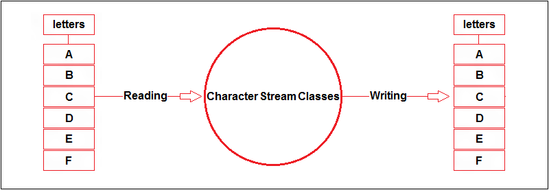
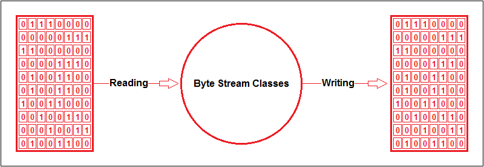
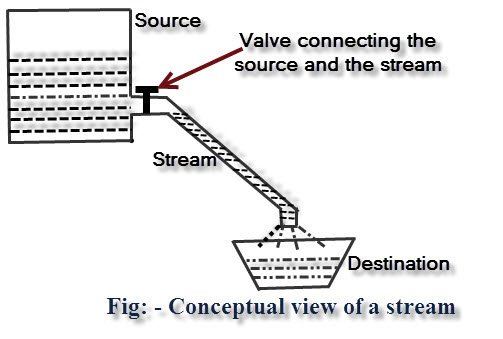

# Akış Sınıfları

_File_ sınıfını tanıttıktan sonra akış sınıflarına geçebiliriz artık.

Akış sınıflarını ikiye ayırabiliriz: byte akışları ve karakter akışları. Karakter akışları, dosyanın içeriğinin metin olarak anlamlı olduğu akışlara denir. Metin dosyaları buna örnek olarak verilebilir. Diğer akışlara ise byte akışları denir. Byte akışlarının içeriğini okuduğumuzda metin olarak bir anlam ifade etmezler. Görüntü dosyaları (.jpg, .png vs), PDF dosyaları byte akışlarına örnek olarak verilebilir.

Akış sınıflarının metotlarının çoğu _IOException_ fırlatır. Bu hata, okuma veya yazma işlemi sırasında bir hata oluştuğunu belirtir.

Java’nın akış sınıfları 4 soyut sınıf (**_abstract class_**) üzerine kurulmuştur:

|                 | Byte akışları | Karakter akışları |
| --------------- | ------------- | ----------------- |
| **Okumak için** | InputStream   | Reader            |
| **Yazmak için** | OutputStream  | Writer            |


## InputStream

Byte akışlarından gelen verileri okumak için yazılmış soyut bir sınıftır. Okuma işlemleri için gerekli bazı metotları tanımlamıştır. Bu metotlardan bazılarını inceleyelim:

| **void** close()                 | Akışı kapatır. **Bütün akış kaynakları işlem tamamlandıktan sonra kapatılmalıdır!** |
| -------------------------------- | ------------------------------------------------------------ |
| **int** read()                   | Akışta bulunan sıradaki byte değerini okur. Eğer dosyanın sonuna gelindiyse -1 döndürür. |
| **int** read(**byte**[] buffer)  | Parametre olarak verilen dizinin boyutu kadar byte değerini okur ve dizinin içine atar. |
| **byte**[] readAllBytes()        | Dosyanın sonuna kadar bütün byte değerlerini okur ve bir dizi halinde döndürür. |
| **byte**[] readNBytes(**int** n) | Parametre olarak verilen sayı kadar byte değeri okur ve bir dizi halinde döndürür. |
| **long** skip(**int** n)         | Parametre olarak verilen sayı kadar byte değerini okumadan atlar. |
| **int** avaliable()              | Okunabilecek byte'ların(8 bitin) sayısını ifade eder. Alt sınıflarda kullanılmak zorundadır. |
| **void** mark(**int** readlimit) | Veriler içerisinde istenilen yere işaret koyar. |
| **void** reset()                 | mark() ile işaretlenmiş konuma geri döndürür. |
| **boolean**  markSupported()     | mark() ve reset() metotlarının çalışıp çalışmadığını test eder. Çalışıyorsa **true** değilse **false** değerini döndürür. |

Bakınız! Tabloda tanımlanan metotlar byte değerinde okuma işlemi yapar.

InputStream soyut bir sınıftır. Soyut sınıf ne anlama gelir? Soyut sınıfın içerisinde gövdesiz metotlar bulunabilir ve bu metotlar türetilen alt sınıflarda kullanılmak (**@Override** edilmek) zorundadır.

## OutputStream

Byte akışlarına veri yazmak için kullanılan soyut bir sınıftır. Yazma işlemleri için gerekli bazı metotları tanımlamıştır. Bu metotlardan bazılarını inceleyelim:

| **void** close()                  | Akışı kapatır. Bütün akış kaynakları işlem tamamlandıktan sonra kapatılmalıdır! |
| --------------------------------- | ------------------------------------------------------------ |
| **void** flush()                  | Eğer fiziksel olarak akışa yazılmamış byte değerleri varsa, bunların yazılması için bir sinyal gönderir. |
| **void** write(**int** c)         | Akışa bir byte değeri yazar. Bu değeri parametre olarak alır. |
| **void** write(**byte**[] buffer) | Parametre olarak aldığı byte dizisinin içindeki bütün byte değerlerini sırasıyla akışa yazar. |
| **void** write(**byte**[] b, **int** off, **int** len) | Belirlenen parametrelere göre yazma yapan metottur **byte**[] b: yazılacak olan veri dizisi, **int** off: yazılacak veri dizisinin kaçıncı elemanından başlanması gerektiğini belirten parametre, **int** len: veri dizisinden kaç elemanın yazılacağını belirten parametredir. |


Bakınız! Tabloda tanımlanan metotlar byte değerinde yazma işlemi yapar. 

**_InputStream_** ve **_OutputStream_** sınıfları soyut sınıflardır. Yani bu sınıfları tek başına kullanamayız. Ancak alt sınıfları oluşturulursa bir anlam ifade ederler. Şimdi bu sınıfların en çok kullanılan alt sınıflarını inceleyelim.

## FileInputStream

Dosyaların içeriğini okumak için bu sınıfı kullanırız. Sınıfın bir örneğini alırken parametre olarak okuyacağımız dosyanın yolunu **_String_** veya **_File_** olarak veririz. Eğer okumak istediğimiz dosya mevcut değilse **_FileNotFoundException_** fırlatılır.

Şimdi bir dosyadan veri okumayla ilgili örnek yapalım:

```java
File inputFile = new File("ornek_dosya.txt");

try
{
	FileInputStream fis = new FileInputStream(inputFile);
	
    int c;
    while ((c = fis.read()) != -1)
	{
		System.out.println(c);
	}
	
    fis.close();
}
	
catch (IOException ex)
{
	System.out.println("Dosyayı okurken hata meydana geldi!");
}
```

Yukarıdaki örnekte, bilgisayarımızdaki **_ornek_dosya.txt_** dosyasını açıyor ve içeriğindeki **byte** değerlerini konsola yazdırıyoruz. Bu kodda dikkat etmemiz gereken bazı noktaları şöyle sıralayabiliriz:

- **_FileInputStream_** oluştururken parametre olarak okuyacağımız dosyayı verdik.
- Okuma işlemini bir döngünün içinde yaptık; çünkü **_read()_** metodu yalnızca 1 byte okur.
- Dosyanın sonuna geldiğimizde hata almamamız için -1 kontrolü yaptık. Çünkü **_read()_** metodu dosyanın sonuna gelindiğinde -1 döndürür.
- İşlemimizi tamamladıktan sonra **_close()_** metodunu kullanarak akışı kapattık. **Akışlarla uğraşırken akışı kapatmayı unutmamalıyız!**
- Akış sınıflarındaki metotların çoğu **_IOException_** fırlatabilir. Bu yüzden yukarıdaki kodları **_try-catch_** bloğu içinde yazdık.

## FileOutputStream

Dosyaların içeriğine yazmak için bu sınıfı kullanırız. Sınıfın bir örneğini alırken parametre olarak okuyacağımız dosyanın yolunu **_String_** veya **_File_** olarak veririz. Ayrıca ikinci parametre olarak **boolean** türünde **_append_** isminde bir argüman veririz. Bu argüman dosyaya ekleme yapılıp yapılmayacağını tespit etmek için kullanılır. Eğer **true** verirsek ve yazmak istediğimiz dosya mevcutsa; dosyanın içeriği korunur ve sonuna ekleme yapılır. Eğer **false** verirsek ve yazmak istediğimiz dosya mevcutsa; dosyanın mevcut içeriği silinir ve üzerine yazılır. Eğer biz bu parametreyi vermezsek varsayılan değer olarak **false** kullanılır.

```java
File outputFile = new File("ornek_dosya.txt");
String text = "Bu metin dosyanın içeriğine yazılacak.";
byte[] textBytes = text.getBytes(StandardCharsets.UTF_8);

try
{
	FileOutputStream fos = new FileOutputStream(outputFile);
	fos.write(textBytes);
	fos.close();
}
catch (IOException ex)
{
	System.out.println("Dosyaya yazarken hata meydana geldi!");
}
```

Yukarıdaki örnekte şunları yaptık:

- Dosyanın içeriğine yazmak için bir metin belirledik.
- Bu metni UTF-8’e göre byte dizisine dönüştürdük.
- **_FileOutputStream_** kullanarak bu byte dizisini dosyaya yazdık ve daha sonra akışı kapattık.



Akış sınıflarından karakter akışları resimde görüldüğü gibidir. İsminden de anlaşıldığı üzere karakter düzeyinde okuma ve yazma işlemi gerçekleşmektedir.



Diğer bir akış sınıfı olarak da Byte akışları da resimde görüldüğü gibidir. Byte düzeyinde yani makine dilimiz olan 0 ve 1'lerden oluşan okuma ve yazma işlemi gerçekleştirilmektedir.



Burada unutulmaması gereken iki önemli nokta vardır.

- Akış dediğimiz olay çalışılan süre boyunca devam etmekte olduğu için akışın bir başlangıcı ve sonu olmalıdır. Buna örnek olarak bilgisayarı kullanmayı düşünebiliriz. İşimiz bittikten sonra bilgisayarı kapatmamız gerekir çünkü boşuna çalışmasın. Bir diğer örnek olarak musluktan akan suyu da verebiliriz.

- Hatanın olmadığı bir dünya düşünemeyiz. Aynı şekilde programlarda da uygulamalarda da bu geçerlidir. O yüzden dosya işlemlerinde IOException hatası bulunmaktadır.

Konuyla ilgili birkaç soru sorabiliriz. Akış sınıfları neden byte ve karakter akışları olarak ikiye ayrılır?
Akış sınıfları ile ilgili önemli noktalar nelerdir?
Akış sınıflarında hangi metotlar kullanılır?
## Kaynak:
- [1.fotoğraf](https://hajsoftutorial.com/java/wp-content/uploads/2015/10/Untitled41.png)

- [2.fotoğraf](https://hajsoftutorial.com/java/wp-content/uploads/2015/10/Untitled3.png)

- [3.fotoğraf](https://blog.eduonix.com/wp-content/uploads/2014/08/111.jpg)

