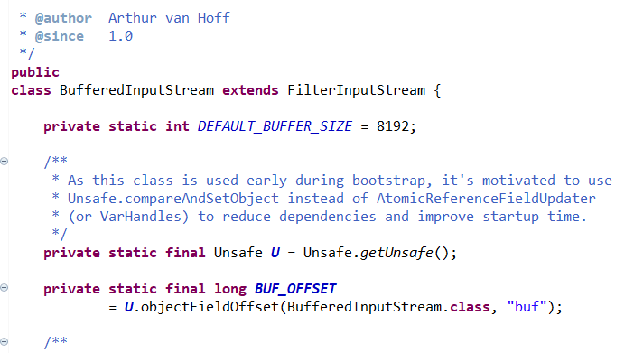
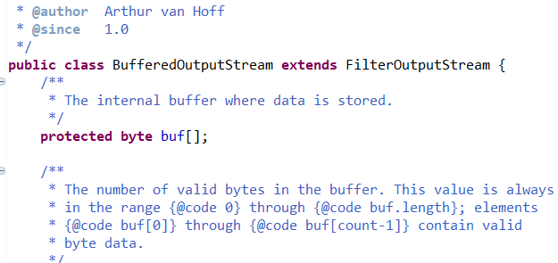

# Dosya kopyalamak

Ctrl+c ve Ctrl+v işlemlerini dosya üzerinde yapabiliriz. Bu işlemleri de FileInputStream ve FileOutputStream ile yapabiliriz. 

Şimdi **_FileInputStream_** ve **_FileOutputStream_** sınıflarını kullanarak bir dosya kopyalayalım:

```java
File sourceFile = new File("kopyalanacak_dosya.txt");
File destinationFile = new File("yeni_dosya.txt");

try
{
	FileInputStream source = new FileInputStream(sourceFile);
	FileOutputStream destination = new FileOutputStream(destinationFile, false);

    int c;
	while ((c = source.read()) != -1)
	{
		destination.write(c);
	}	

    destination.close();
	source.close();
}
catch (IOException ex)
{
	System.out.println("Dosyayı kopyalarken hata meydana geldi!");
}
```
Yukarıdaki kodu açıklamak istersek;

- Kopyalama işlemi iki taraflı olduğu için bir tarafında kaynağımız yani kopyalanacak dosyamız, diğer tarafında ise kopyalamak istediğimiz hedef dosyamız bulunmaktadır. Kaynak ve hedef dosyalarımızı tanımladık. 
- Tanımladıktan sonra kaynak dosyasının içeriğini okumamız gerekiyor. Yani bu da demektir ki **FileInputStream** kullanılacaktır.
- Hedef dosyasına yazdırma işlemi yapacağımız için **FileOutputStream** kullanıyoruz.
- Daha sonrasında kaynağımızın içi boş değilse **while** döngüsünün içine girilir ve hedef dosyamıza yazdırma işlemi gerçekleştirilir.
- Döngü sonlandığında dosyalarımız kapatılır. Kopyalama işlemi gerçekleştirilmiş olur. 
- Burada **try** **catch** mekanizması yine gözümüze çarpmaktadır. İşlemlerde hata olursa dosya kopyalama işlemi gerçekleştirilemez.

## BufferedInputStream

Yukarıda gördüğümüz **_FileInputStream_** sınıfı dosyadan okuma yapmak için kullanılıyordu. Okuma yapmak için kullandığımız **_read()_** metodu her seferinde disk üzerindeki dosyaya gidiyor ve fiziksel olarak dosyanın içinde bulunan 1 byte değerini okuyordu.

Sabit diske erişim RAM’e erişime göre daha yavaştır. Sıklıkla sabit disk üzerinde işlem yapmak programımızın hızını nispeten yavaşlatır. Peki bunun önüne nasıl geçebiliriz? Şöyle bir çözüm düşünülebilir: dosya üzerinde her seferinde tek bir byte değeri okumaktansa birden fazla byte değerini okuyabilir ve bu değerleri bir dizi halinde RAM’de tutabiliriz. Böylece sık sık sabit diske erişmek yerine RAM’e erişir ve işlemlerimizi daha hızlı yapabiliriz.

**_BufferedInputStream_** sınıfı bize bu işlevselliği sağlar. Parametre olarak bir **_InputStream_** nesnesi ve bir dizi boyutu alır. Siz o InputStream nesnesi üzerindeki **_read()_** metodunu çağırdığınızda, tek bir byte değeri okumak yerine verdiğiniz dizi boyutu kadar okuma yapar ve bunu hafızada tutar. Dizinin tamamını okuduğunuzda tekrar dosyaya başvurur ve dizi boyutu kadar yeni bir okuma yapar. Yani, gerçek akış kaynağına erişimi olabildiğince azaltarak RAM üzerinden okuma işlemi yapar.

Gelin Java'da BufferedInputStream sınıfına bir göz atalım. 

Gördüğünüz gibi bu sınıf **FilterInputStream** sınıfından kalıtım almıştır. **FilterInputStream** sınıfı da **InputStream** soyut sınıfından kalıtım almıştır. Peki bu ne anlama gelmektedir? BufferedInputStream hiyerarşinin en altındadır. FilterInputStream ve InputStream sınıfının özelliklerini kullanabilir. Burada ana sınıfın **InputStream** sınıfı olduğunu unutmamakta fayda vardır.

InputStream > FilterInputStream > BufferedInputStream



Şimdi **_BufferedInputStream_** sınıfının işlevini anlayabilmek için iki örnek yapalım:

```java
File inputFile = new File("ornek_dosya.docx");

try
{
	long start = System.currentTimeMillis();
	FileInputStream fis = new FileInputStream(inputFile);

    int c;
	while ((c = fis.read()) != -1)
	{
		System.out.println(c);
	}

    fis.close();
	long end = System.currentTimeMillis();
	
    System.out.println("İşlem " + (end - start) + " milisaniye sürdü.");
}
catch (IOException ex)
{
	System.out.println("Dosyayı okurken hata meydana geldi!");
}
```

Yukarıdaki örnekte **_BufferedInputStream_** kullanmadan, **_FileInputStream_** ile dosyadan okuma yapıyoruz. Okuma işleminin başlangıcında ve sonunda tarihe bakıyor ve işlemin kaç milisaniye sürdüğünü tespit ediyoruz. Bu kodu 37 KB boyutundaki bir .docx dosyası üzerinde çalıştırdığım zaman 177 milisaniye sürdü. Tabi bu değerin işlemci hızı vs. gibi ortam faktörlerine göre değişebileceğini unutmayın. Şimdi aynı örneği **_BufferedInputStream_** kullanarak tekrar yapalım:

```java
File inputFile = new File("ornek_dosya.docx");

try
{
	long start = System.currentTimeMillis();
	FileInputStream fis = new FileInputStream(inputFile);
	BufferedInputStream bis = new BufferedInputStream(fis);

    int c;
	while ((c = bis.read()) != -1)
	{
		System.out.println(c);
	}

    fis.close();
	long end = System.currentTimeMillis();
	
    System.out.println("İşlem " + (end - start) + " milisaniye sürdü.");
}
catch (IOException ex)
{
	System.out.println("Dosyayı okurken hata meydana geldi!");
}
```

Yukarıdaki kodu aynı dosya üzerinde çalıştırdığım zaman 120 milisaniye sürdü. Arada **57** milisaniyelik fark olduğuna dikkatinizi çekerim. Bu fark **_BufferedInputStream_** sınıfının verileri hafızaya atmasından kaynaklanmaktadır.

**_BufferedInputStream_** nesnesi oluştururken parametre olarak bir dizi boyutu verebilirsiniz. Eğer vermezseniz varsayılan olarak bu değer 8192 olur. Yani **_BufferedInputStream_** nesnesi akışlar üzerinde varsayılan olarak **8 KB** büyüklüğünde okumalar yapar.

## BufferedOutputStream

Akışlara veri yazmak için kullanılır. **_BufferedInputStream_** sınıfına benzer şekilde çalışır. Amacı fiziksel akışa erişimi olabildiğince azaltmaktır. Bunun için hafızada bir dizi oluşturur ve değerleri bu diziye yazar. Dizi tamamen dolduğunda dizinin içindeki verileri gerçek akışa yazar. **_BufferedOutputStream_** kullanırken dikkat etmeniz gereken nokta şudur: yazılacak verilerin sonuna gelindiğinde veriler gerçek akışa yazılmamış olabilir. Bu yüzden, yazma işleminin tamamlanması için flush() metodunu kullanmalısınız.

Gelin Java'da BufferedOutputStream sınıfına da bir göz atalım. 

Gördüğünüz gibi bu sınıf **FilterOutputStream** sınıfından kalıtım almıştır. **FilterOutputStream** sınıfı da **OutputStream** soyut sınıfından kalıtım almıştır. Peki bu ne anlama gelmektedir? BufferedOutputStream hiyerarşinin en altındadır. FilterOutputStream ve OutputStream sınıfının özelliklerini kullanabilir. Burada ana sınıfın **OutputStream** sınıfı olduğunu unutmamakta fayda vardır.

OutputStream > FilterOutputStream > BufferedOutputStream

 

Şimdi de örnek java kodunu inceleyelim:

```java 
package example;

import java.io.BufferedOutputStream;
import java.io.FileOutputStream;

public class BufferedOutputStreamOrnek {

	public static void main(String[] args) throws Exception{

		//Yazılacak dosyanın yolunu verdik.
		FileOutputStream yazi = new FileOutputStream("C:\\Users\\Public\\Documents\\test.txt");
		
		//Dosyaya kolayca ve hızlı bir biçimde ulaşmak için BufferedOutputStream'i kullandık.
		BufferedOutputStream yazi1 = new BufferedOutputStream(yazi);
		
		//Yazılacak metni girdik.
		String s = "Hızlı bir dosyaya yazma işlemidir.";
		
		//Byte değerinde yazma işlemi yaptığı için byte[] dizisine dönüştürdük.
		byte b[] = s.getBytes();
	
		//Dosyaya yazıyı yazdırdık.
		yazi1.write(b);
		
		//flush() metodunu kullanmasaydık yazma işlemi tamamlanamazdı. flush() metodunu kullanmak zorundayız.
		yazi1.flush();
		
		//Dosyalarımızı dışarıdan içeri doğru sırayla kapattık. Unutmayın dosyaları kapatmalıyız!
		yazi1.close();
		yazi.close();
		
		//Console ekranına işlemin başarılı olduğunu yazdırdık.
		System.out.println("Başarılıdır.");
		
		//Bu arada throws Exception ile hata fırlattık. Diğer yöntem de try catch mekanizmasıydı.
		
	}

}
```
***Bakınız!*** Bu kod parçasında dosyanın içeriği silinip yeniden yazılıyor. Yani dosyanın var olan içeriğine eklenme yapılmıyor.

## ByteArrayInputStream

Bir byte dizisini tıpkı bir akış gibi okumanızı sağlar. Bu sınıfın sağladığı faydayı bir örnekle anlatalım. Örneğin, dosyalar üzerinde okuma yapmak için bir kod yazdınız. Fakat daha sonra programınız gelişti ve internet üzerinden veri okur hale geldiniz. Bu veriler size byte dizisi halinde geliyor ve siz bu akışı okumak için yeni bir kod yazmak zorundasınız. Bu sınıfı kullanarak yeni bir kod yazmaktansa, byte dizisini bir akış olarak değerlendirebilir ve aynı kodu kullanabilirsiniz.

Bu sınıfın iki tane kurucusu vardır. Bu kurucuları inceleyelim:

| Kurucular                                                    | Kurucu metotların açıklanması                                |
| :----------------------------------------------------------- | ------------------------------------------------------------ |
| ByteArrayInputStream(**byte**[] a)                           | bir byte dizisini parametre olarak alır.                     |
| ByteArrayInputStream(**byte** [] a, **int** off, **int** len) | bir byte dizisini ve iki tam sayı değerini parametre alır. off değeri okunacak ilk byte, len ise okunacak byte sayısını ifade eder. |

Sınıfa ait metotların bazılarına bakalım:

| Metotlar                                           | Metotların Açıklaması                                        |
| -------------------------------------------------- | ------------------------------------------------------------ |
| **int** read()                                     | InputStream'den bir sonraki veri byte'ını okur. Eğer dosyanın sonuna gelindiyse -1 değerini döndürür. |
| **int** read(**byte** r, **int** off, **int** len) | Toplam byte sayısını okur ve bu değeri döndürür. Dosyanın sonuna gelirse -1 değerini döndürür. |
| **int** available()                                | Okunabilen byte sayısını verir.                              |
| **void** mark(**int** read)                        | İşaretli konumdaki okunabilen maksimum byte sayısını verir.  |
| **long** skip(**long** n)                          | Parametre ile verilen n kadar byte sayısını atlar. Atlanan byte sayısını döndürür. |

## ByteArrayOutputStream

Hedef olarak bir byte dizisi kullanan akış sınıfıdır. Bu sınıfı kullanarak akış üzerinde yazdığınız veriler nihai olarak size bir byte dizisi olarak sunulur.

Sınıfın iki tane kurucusu vardır. Gelin bu kurucuları beraber inceleyelim:

| Kurucular                        |                Kurucu Metotların Açıklanması                 |
| -------------------------------- | :----------------------------------------------------------: |
| ByteArrayOutputStream()          | Ara belleği 32 byte olan bir ByteArrayOutputStream oluşturur. |
| ByteArrayOutputStream(**int** a) | Verilen boyutta ara belleğe sahip bir ByteArrayOutputStream oluşturur. |

Sınıfı daha iyi tanıyabilmek için bazı metotlarına bakalım:

| Metotlar                                               | Metotların Açıklanması                                     |
| :----------------------------------------------------- | :--------------------------------------------------------- |
| **void** reset()                                       | Akıştaki çıkışın byte dizisini sıfıra eşitler.            |
| **byte**[] toByteArray()                               | Akıştaki çıkışın değerini yeni bir byte dizisine çevirir. |
| **String** toString()                                  | Ara belleğin içeriğini string değere çevirir.              |
| **void** write(**int** w)                              | Belirtilen diziyi çıkışa yazar.                           |
| **void** write(**byte**[] b, **int** off, **int** len) | Belirli konumdan akışa kadar olan byte sayısını yazar.     |
| **void** writeTo(**OutputStream** outSt)               | Akışın içeriğini başka bir akışa yazar.                    |

Şimdi ByteArrayInputStream ve ByteArrayOutputStream ile bir örnek yapalım.

```java 
package example;

import java.io.ByteArrayInputStream;
import java.io.ByteArrayOutputStream;
import java.io.IOException;

public class ByteStreamOrnek {

	public static void main(String[] args) throws IOException {
		
	      //7 byte ara belleğe sahip bir ByteArrayOutputStream nesnesi oluşturduk.
	      ByteArrayOutputStream yazi = new ByteArrayOutputStream(7);

	      //Yazmak istediğimiz değer String tipinde olduğu için getBytes() ile byte değerine çevirdik.
	      while( yazi.size() != 7 ) {
	   
	         yazi.write("merhaba".getBytes());  
	      }
	      //Yazının değerini toByteArray() ile yeni bir byte[] dizisine çevirdik.
	      byte[] dizi = yazi.toByteArray();
	      
	      System.out.println("Yazının içeriği:");
	      
	      //Byte dizisi çıktısı istemediğimiz için karakter olarak değerleri yazdırdık.
	      for(int i = 0; i < dizi.length; i++) {
	      
	         System.out.print((char)dizi[i]); 
	      }

	      System.out.println();
	         
	      int c;
	      
	      //Yazdığımız akıştaki değeri okuyabilmek için ByteArrayInputStream nesnesi tanımladık.
	      ByteArrayInputStream oku = new ByteArrayInputStream(dizi);
	     
	      //Yazdığımız değeri okuma işlemini burada gerçekleştirdik.  
	      for(int j = 0 ; j < 1; j++ ) {
	    	  
	         while(( c = oku.read())!= -1) {
	        	 
	            System.out.println((char)c);
	         }
	         //Akışta olan byte[] dizisini sıfıra eşitledik.
	         oku.reset(); 
	      }
	   }

}
```
