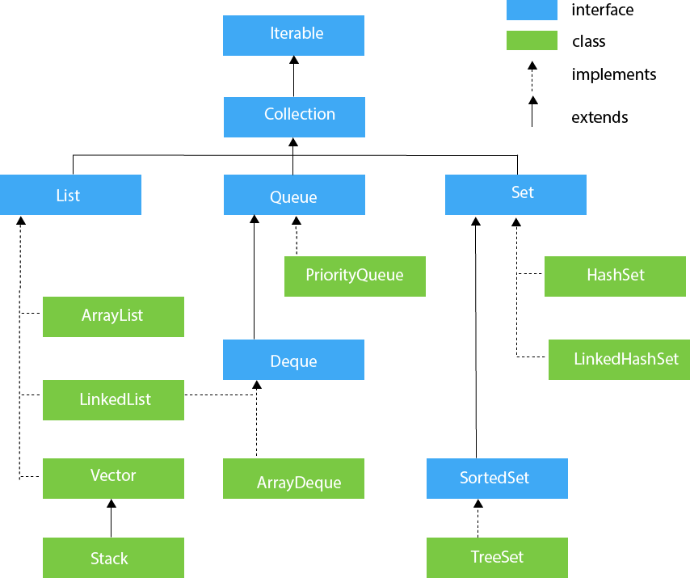
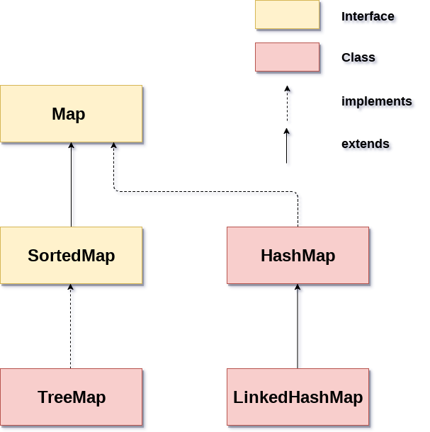

#  Java Koleksiyon Çatısı (Java Collection Framework) – (JCF)

Yazılım gerçekleştirirken mutlaka liste tipinde verilerle uğraşmak gerekecektir. Bu liste tipindeki verilere dinamik olarak eleman ekleme, eleman almak gibi işlemler gerekecektir. Hatta, limiti dolduğunda otomatik olarak listenin büyümesini de en esnek şekilde isteyeceğiz. Tüm bu özellikler ve hazır veri yapıları bizim daha hızlı kod geliştirmemize büyük katkı sağlayacaktır. Bu hazır algoritmalar, veri yapıları ve sınıflar ile yaptığımız işe daha çok odaklanacağız. JCF sınıfları da JDK içinde tanımlanmış hazır gelen yapılardır.

JCF sınıfları Java 1.2 ile birlikte hayatımıza girmiştir.

Önceki konularda dizi kavramından bahsetmiştik. Diziler de liste halindeki verileri yazılım dünyasında modellemek için kullanılabilir. Fakat, dizilerin iki önemli eksikliği vardır.

\-    Dizinin büyüklüğü çalışma zamanında değiştirilemez. (immutable)

\-    Dizi elemanları aynı veri tipinden olmak zorundadır.

**Yazılım = Veri + Algoritma** şeklinde özetlenebilir. Yazılımlar verileri belli başlı algoritmalar ile işleyip kullanan ve çeşitli çıktılar üreten sistemlerdir. Algoritmaları da Java gibi programlama dilleriyle gerçekleştiririz.

Java Collection Framework aşağıdaki temel bileşenlerden oluşur.

\-    Arayüzler (interfaces): Java Collection çatısı temelde iki tane interface’den türemiştir. En temel arayüzler “Map” ve “Collection” interface’leridir. “Map” interface’den türeyen alt sınıflar anahtar-değer biçimindeki verileri depolarlar. Bu duruma örnek olarak öğrenci numarasına göre dönemlik ders notlarının tutulmasını verebiliriz. “Collection” interface’den türemiş alt sınıflar ise düz liste halinde tutulan verileri depolarlar. Dizilere benzerdirler. Fakat, dizilere göre daha esnek işlevleri vardır. Buna örnek olarak kredi kartının aylık hesap hareketleri verilebilir.

\-    “Map” ve “Collection” interface’lerden türeyen alt sınıflar: Bu iki temel interface’den türemiş içinde belli başlı algoritmalar çalışan sınıflardır. Bu sınıflardan direkt olarak nesne üretip kullanabiliriz. Veri yapıları dersindeki bir çok veri yapısı burada hazır olarak kodlanmıştır. Biz programcılar bu hazır sınıfları kullanarak yazılım geliştirme hızımızı arttırabiliriz. Yaptığımız iş akışına daha çok odaklanabiliriz.

\-    Algoritmalar: Verinin hangi mantığa göre ekleneceği, listedeki elemanlara hangi sırayla erişilebileceği, veri içinde arama yapılması gibi bir çok işleme ihtiyaç duyarız. Java Collection Framework içindeki sınıflar bu saydığımız işlemleri belli algoritmalara göre yaparlar. Her sınıfın kendine özgü bir algoritması vardır.

Java Collection Framework Soyağacı (Kalıtım Şeması)

 

 

 

