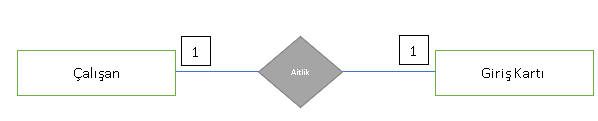
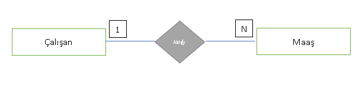
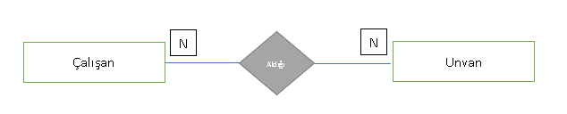
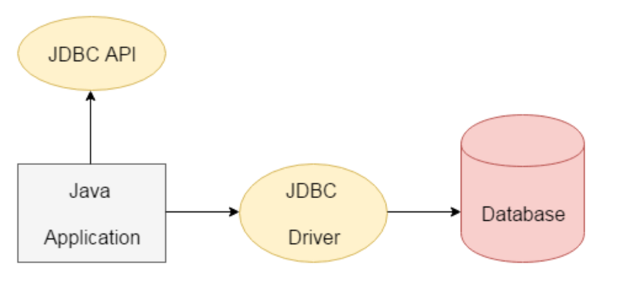

# Veri Tabanı Yönetim Sistemleri

Kurumsal uygulamaların hemen hemen hepsi veri tabanları ile çalışırlar. Dolayısıyla Veri tabanı Yönetim Sistemleriyle de çalışmış olurlar. Kurumsal projelerde üretilen veya işlenen veriler kalıcı olarak veri tabanlarına kaydedilirler. Örneğin, alışveriş yaptığınız bir e-ticaret sitesinde geçmiş siparişleriniz, kişisel bilgileriniz, adres bilgileriniz birçok veri tabanlarında depolanırlar. Böylece, kalıcı verileri düzgün ve tutarlı bir şekilde tek bir noktada yönetebilir şekilde depolayabiliriz.


Veri her türden sayısal veya sözel birimlerden oluşabilir. Örneğin göz renginiz, boyunuz, kilonuz da veriyi ifade eder. Yahut öğrenci olduğunuzu düşünün okuduğunuz bölümle ilgili alanlar, dersler, notlarınız ve kimliğiniz bir veri parçasıdır.


Veri tabanı, en basit tabirle bilgiyi depolayan yazılım çözümüdür. Aslında, veri tabanları veriyi kalıcı diskte saklasa da bunu özel bir formatta sorgulanabilir ve tutarlı olacak şekilde saklar. Bir veri tabanı oluşturulduktan sonra içinde alakalı tabloları bir arada tutar. Veri tabanı bu tabloların evrensel kümesi gibidir, hepsini kapsar. Aynı zamanda veri üzerinde performanslı, verimli ve esnek işlemler yapabilmeyi sağlayarak yönetilebilir bir yapı sağlar.

**Veri tabanı genel özellikleri:**

\- Birbiriyle ilişkili olan verileri düzenli bir yapı formatında tutar. Bu düzenli yapılar veriler topluluğunu oluşturur.

\- Birçok kullanıcı veri tabanına erişip işlem yapabilir.

\- Veri bütünlüğü ve tutarlılığı sağlanır. 

\- Veri tekrarının önüne geçer.

\-Verilerin tek bir merkezi noktadan yönetilmesini sağlar.


Veri tabanları üzerinde çalışan ve yönetilebilme olanağı veren yazılımsal çözümlere de Veri tabanı Yönetim Sistemleri denir.

## Veri Tabanı Yönetim Sistemleri

Veri tabanları üzerinde yönetim sağlayan sistemlerdir. Veri tabanı Yönetim Sistemi yeni veri tabanı oluşturmak, güncellemek, kullanmak, veri tabanı üzerinde kullanıcılar tanımlamak, kullanıcıların yetkilerini belirlemek gibi yönetsel olanaklar sağlamaktadır. Aşağıdaki imkanları sağlar.

**Veri Tekilliği ve Veri Bütünlüğü:** Veriler merkezi bir noktada tutularak, yazılımların sürekli mükerrer ve tutarsız veriler üretmesini önler. Veriler tek noktada toplanır, güncellenir veya tek noktadan sorgulanabilir.

**Veri Güvenliği:** Veri tabanları üzerinde kullanıcılar tanımlanabilir. Veritabanlarına erişim için kullanıcı adı ve şifre koruması sağlanabilir. Tanımlanan kullanıcılar belli yetkiler çerçevesinde işlemler yapabilir. Yetkisi yoksa veri tabanını göremez veya üzerinde işlem yapamayabilir.

**Eş Zamanlılık:** Veri tabanı Yönetim Sistemleri veriler üzerinde eş zamanlı erişim yapılabilmesini sağlarlar. Böylece, saniyeler içinde binlerce kullanıcı erişim sağlayabilir.


Birden fazla veri tabanı yönetim sistemi çözümü vardır. Ticari lisanslarının yanında, özgür yazılım lisansına sahip Veri tabanı Yönetim Sistemleri vardır. Örneğin, PostgreSQL, MariaDB özgür yazılım lisansına sahip olanlarıdır. MSSQL, Oracle, DB2 gibi çözümler ise ticari lisansa sahiptirler. 

### Veri Tabanı ile Geliştirilen Uygulamaların Mimarisi
Veri tabanı kullanan yazılımlar genellikle 3 katmanlı mimari şeklinde bir yaklaşımlar veriyle etkileşime geçerler. Katmanlara ayırmamızın sebebi birbiriyle ilişkili olan işlemlerin o katmanda yapılmasıdır. Böylece, sağlam bir izolasyon sağlanmış olacaktır. Bakımı kolay performanslı, az hata çıkaran yazılımlar gerçekleştirmek mümkün olacaktır. Bu üç katman aşağıdaki gibidir.

\- Veri Katmanı (Data Layer)

\- İş Katmanı (Business Process Layer)

\- Sunum Katmanı (Presentation Layer)

**Veri Katmanı**

Veri tabanına verilerin eklenmesi, güncellenmesi veya sorgulanabilmesi gibi veritabanıyla direkt etkileşim halinde olan katmandır. Veriye erişim katmanı olarak bilinir.

**İş Katmanı**

Veri tabanından alınan veya değiştirilen verilerle çalışan iş akışlarının algoritmaların olduğu katmandır. Örneğin, bankada bir EFT veya Havale işleminin nasıl gerçekleşeceği bir algoritma çerçevesinde işletilir. İş bu iş akışlarının bütününün yazılımsal olarak gerçekleştirildiği katmandır. İşlenen, üretilen veya kullanılan veri bu katmandan bir alt katman olan “Veri Katmanına” iletilir. Genellikle “Transaction” yönetimi bu katmanda yapılır. Mülakatta gelebilir J 

**Sunum Katmanı**

İş katmanından gelen veriler ön yüzde gösterilir veya önyüzden yapılan bir işlem işlenmek amacıyla iş katmanına iletilir. Kullanıcı ile etkileşimin sağlandığı katmandır. Bir mobil ara yüzü, bir web sayfası veya bir Veri tabanı Yönetim Sistem istemci yazılımı olabilir.

**İlişkisel Veri tabanı Yönetim Sistemi**

İlişkisel veri tabanı yönetim sistemlerinde veriler satır ve sütun şeklinde bir formatta tablolar halinde saklanır. Oluşturulan tablodaki sütunlar bir nesnenin niteliklerini ifade eder. O nesneyle ilişkili özellikler sütunlar halinde bir tabloda bir araya getirilir. İşte bu veri formatı nedeniyle “İlişkisel Veri tabanı Yönetim Sistemleri” denilmektedir. Tablolar arasında ilişki kurulabildiği için bu ismi almamıştır.

Aksine birbiriyle ilişkili niteliklerin bir tabloda toplanmasıyla oluşan veri formatından dolayı ismini almıştır. Örneğin: Ders isminde bir varlığımız olduğunu düşünürsek Ders nesnesini tanımlayan alakalı özellikleri bir araya getirmeye çalışırız. Dersin ismi, kaç saatten oluştuğu, hangi dönem olduğu gibi birçok özellik bir araya gelip “Ders” tablosunu oluşturur.

İlişkisel veri tabanlarında tablolar arasında da ilişki kurulabilir. Örneğin: Öğrencinin kimlik bilgileri bir tabloda yer alırken, öğrenciye ait adres bilgileri başka tabloda yer alabilir. Doğru olanı da tasarımsal açıdan böyledir zaten. Öğrenci ve Adres tabloları arasında bir ilişki kurabiliriz. 

**İlişki tipleri:**

\-Bire bir (1-1)

\-Bire çok (1-N)

\- Birçoğa bir (N-1)

\-Birçoğa Birçok (N-N)

#### ACID (Atomicity, Consistency, Isolation, Durability

İlişkisel veri tabanı yönetim sistemleri mimarisinde iş süreci (transaction) ve veri bütünlüğünü sağlamak için uyulması gereken kurallara ACID denilmektedir. İş süreci (transaction) kavramı bir işleminin ya bütünüyle yapılmasını ya da yapılan işlemlerin bütünüyle geri alınıp veri tutarlılığın sağlanmasını garanti altına demektir. Örneğin, hesabınızda 100 TL’yi arkadaşınızın hesabına havale yoluyla göndermek istiyorsun diyelim. 

Bu iş süreci (transaction) iki işlem parçasından oluşur. 100 TL senin hesabından azaltılıp sana ait bakiye bilgileri güncellenir, ardından 100 TL arkadaşın hesabına +100 olarak işlenir ve güncellenir. İşte bu işlem bütünlüğü garanti altına alınmalıdır. Alınamaz ise tutarsız verilerle karşılaşılır. Böylece veri bütünlüğü bozulur. Eğer sizden 100 TL çektikten sonra bir hata oluşursa ve arkadaşınızın hesabına bu ücret yatırılamaz ise tutarsız bir durum oluşacağı aşikardır. Yine mülakatlarda size soru olarak gelebilecek bir bilgidir. ACID’i açıklayabilmek ve mantığını anlamak gerekir.

**Atomicity (Bölünmezlik):** Bir iş sürecinde (transaction) yapılacak işlemler sıralı bir şekilde birden fazla olabilir. Veri tabanında yapılacak olan bu işlemler kümesi bir bütün olarak ele alınır. Yapılan işlemlerinden herhangi bir tanesi tamamlanamaz ise diğer tüm işlemlerde geçersiz sayılmalıdır. Eğer böyle hatalı bir durum varsa o ana kadar yapılan tüm işlemler geri alınır. Fakat, işlemlerin hepsi başarılı ise o iş süreci sonlandırılır.

**Consistency (Tutarlılık):** Veri tabanında yapılan işlemlerde hep aynı girdiler ile hep aynı çıktıları almalıyız. İşte bu tutarlılığı gösterir. 

**Isolation (İzolasyon):** Bir transaction’ın tüm işlemleri tamamlanana kadar diğer transactionlar tarafından yapılan değişiklikler ilgili transaction tarafından görülmez. Her transaction birbirinden bağımsız çalışır. İşlem sırasında birbirlerine müdahale etmezler. Veya dışarıdan bir müdahaleyi kabul etmezler. Bu izolasyonu ifade eder.

**Durability (Sağlamlık)** Bir transaction içinde hata oluşursa geri dönme yeteneğine sahip olmalıdır. Hata oluşursa bir önceki ilk noktaya dönülebilmelidir. Eğer transaction başarılı bir şekilde biterse bu durum loglanmalıdır ve başarılı olduğuna dair mesaj verilmelidir.

İlişkisel veri tabanı yönetim sistemlerinde veriyi sorgulamak için özel bir programlama dili kullanılır. Dünyada neredeyse standart halini almış bu dil SQL’dir. (Structural Query Language) (Yapısal Sorgulama Dili)

SQL içinde işlevlerine göre farklı komutlar yer almaktadır. Bu komutlar mantıksal bir şekilde aşağıdaki gibi sınıflandırılmıştır.


##### 1- DDL (Data Definition Language – Veri Tanımlama Dili) 

Veri tabanı veya tablolarda yapısal değişiklikler yapabilmek için var olan SQL komutlarıdır. Bu komutlar ile yeni bir veri tabanı oluşturmak, yeni bir tablo oluşturmak veya var olan tablodan sütun eklemek-silmek veya tüm bunları silebilmek gibi işlemler yapılabilir.

 CREATE, ALTER, DROP, TRUNCATE, COMMENT, RENAME gibi komutlar bu işlemleri yapabilir.


##### 2-   DML (Data Manipulation Language – Veri İşleme Dili)

Tablolardaki veriler üzerinde kayıt ekleme, silme, değiştirme ve sorgulama yapabilmeyi sağlayan SQL komutlarıdır.

SELECT, INSERT, UPDATE, DELETE


##### 3-   DCL (Data Control Language – Veri Kontrol Dili)

Veri tabanı veya tablolar üzerinde yetkilendirmeler yapabileceğimiz SQL komutlarıdır.

 GRANT, REVOKE, ALTER DEFAULT PRIVILEGES


##### 4-   TCL (Transaction Control Language – İşlem Kontrol Dili) 

Tabloların içindeki verileri değiştirmek için kullandığımız DELETE, UPDATE, INSERT gibi DML komutlarımız vardı. Bu komutlarla bir transaction içinde ardışıl şekilde değişiklikler yapabiliriz. İşte bu değişiklikleri yönetebilmek için kullanılan SQL komutlarıdır. Bir transaction başarılı ise DML komutlarının meydana getirdiği değişiklikler COMMIT komutuyla kalıcı olarak tablolara yansıtılır. Özetle veri kalıcı olarak değişir. Eğer, bir sorun varsa ROLLBACK komutu ile o ana kadar oluşan tüm değişimler geri alınır.

 

COMMIT, ROLLBACK, SAVEPOINT


##### Veri Tabanı Yönetim Sistemi Mimarisi

Modern veri tabanı yönetim sistemleri istemci-sunucu (Client-Server) mimarisine sahiptir. Bu nedenle MySQL kurulumu yaptığımızda aslında sunucu şeklinde isteklere cevap verebilen bir yazılım çözümünü ayağa kaldırmış oluruz. Kullanıcılar veya yazdığımız programlar veri tabanlarıyla ve onların içindeki tablolarla etkileşim kurmak istediğinde veri tabanı sunucu yazılımına istekler ulaşır. Sunucu yazılımı bu istekleri ilgili veri tabanında işletir ve sonuçları istemciye geri döner.


**Veri Modeli**

Veri tabanları verilerin tablolar halinde saklandığı alanlardı. Bu veriler kalıcı diskte (Hard-Disk) belli bir format biçiminde saklanır. Veri tabanı aşağıdaki 3 yapıdan oluşur.

**Entity (Varlık):** Gerçek hayat nesnesini veya kavramını ifade eder. Örneğin, öğrenci, çalışan personel, adres, maaş gibi kavramlar veya nesneler varlıkları ifade eder. Varlıklar genelde veritabanı dünyasında tablolar şeklinde ifade edilir.

**Nitelik (Attribute): **Yukarıda bahsettiğimiz gerçek hayat varlığı veya kavramının niteliklerini ifade eder. Örneğin, öğrenciyi tanımlayan nitelikler numarası, bölümü, ismi, soy ismi gibi nitelikleridir. İşte bu nitelikler tablodaki sütunları ifade ederler. Her nitelik bir sütunu ifade edebilir.

**İlişki (Relationship): **İki varlık arasındaki mantıksal bağlantıyı ifade eder. Örneğin Öğrenci ile Ders varlıkları arasında doğası gereği bir ilişki söz konusudur. Yahut, Personel ile Maaş arasında da benzer bir ilişki vardır. Varlıklar arasındaki ilişki veri tabanı dünyasında tablolar arasındaki ilişkiyi ifade eder.


**İlişkisel Veri Modeli**

Varlıkların veri tabanı tarafında tabloları ifade ettiğinden bahsetmiştik. Ayrıca, bu varlıkların birçok niteliği bulunmaktaydı. Bu nitelikler tablolardaki sütunları ifade etmektedir. Bu birbiriyle ilişki niteliklerin bir araya gelmesiyle ilişki veri modeli ortaya çıkmaktadır.


Yukarıdaki örnekte “OGRENCI” isminde bir tablo oluşturulmuştur. “Ogrenci_No”, “Sinif” ve “Bolum” isminde nitelikler bir araya gelerek bu tablo yapısını meydana getirmiştir. Tablodaki her bir satır ise bir öğrenci kaydını ifade etmektedir. Yani bir gerçek hayat varlığının verileriyle birlikte tabloda yer almasını ifade eder.

**Birincil Anahtar (Primary Key) ve Yabancı Anahtar (Foreign Key)**

**Birincil Anahtar: **Primary Key alanı tablodaki her bir satırın tekil olmasını sağlar. Her bir satıra eşsiz bir değer verir. Böylece, kayıtlara ait tekil bir sütun oluşur. Primary Key tablo üzerinde bir sütuna uygulanır. Bu özel sütundaki bir değer bir daha kesinlikle tekrar edemez. 

Tekrar aynı değerden üretilmeye çalışılırsa hata verir. Örneğin kişinin TC numarası tekil bir alandır ve Primary Key olabilir. Eğer varlığın böyle karakteristik bir tekil niteliği yoksa, Primary Key sütununun otomatik artan olması sağlanarak tekil yapılabilir. Bir tablonun birden fazla Primary Key sütunu olabilir. Bu birden fazla Primary Key sütunu bir araya gelip tekil bir değer oluşturabilir.

**Yabancı Anahtar:** Foreign Key olarak isimlendirilirler. Bu anahtar sütunlar ile başka tablolarla ilişki kurulabilir. İlişki kuracağı tablodaki Primary Key sütunundaki değeri referans olarak kendi tablosunda bir sütunda tutar ve bu ikisi arasında bir ilişki kurar. Böylece tablolar birbiriyle ilişkilendirilmiş olur.


**İlişki Türleri**

**Bire Bir İlişki**

1-1’e ilişki biçimi bir tablodaki kayıt ile ilişki kurulan diğer tabloda sadece bir kayıt ile eşleşir. Örnek olarak Çalışan tablosunda bir personelin sadece bir tane giriş kartı olabilir. Aynı şekilde Giriş Kartı tablosunda bir giriş kartına ait kayıt sadece bir kişiye ait olabilir. Çalışan ile Giriş Kartı arasında bire bir ilişki vardır.



**Bire Çok İlişki **

Bir tablodaki kayıt diğer tablodaki bir veya birden fazla kayıt ile eşleşebilir. Örneğin, çalışan personel ile maaş varlıkları arasında bire çok ilişki biçimi vardır. Çünkü, bir çalışanın birden fazla maaş kaydı olabilir. Fakat, bir maaş kaydı sadece bir çalışana aittir.



**Çoktan Çoğa İlişki**

Bir tablodaki bir kayıt diğer tablodaki bir veya birden çok kayıt ile eşleşebilir. Aynı şekilde diğer tablodaki tek bir kayıt ilişkili olduğu tabloda bir veya birden çok kayıtla eşleşebilir. Örneğin Çalışan tablosundaki bir personelin birden çok unvanı olabilir. Aynı şekilde Unvan tablosundaki bir görev tanımı birden fazla çalışanda olabilir. Yani bir çalışan hem Yazılım Mühendisi unvanına hem de Takım Lideri unvanına sahip olabilir. Aynı şekilde Yazılım Mühendisi unvanı birden fazla çalışana ait olabilir. Bu ilişki biçiminde mutlaka ara bir tablo oluşur. Bu ara tabloda her iki tablodan ilişkiyi tutan sütunlar yer alır.



**Normalizasyon**

Veritabanı dünyasında bir varlığı temsil bir tablo oluşturduğumuzda onunla ilişkili nitelikleri de aynı tabloda sütun olarak açıyorduk. Fakat, o varlıkla ilgili tüm nitelikleri veya alanları aynı tabloya doldurup tek bir tabloda yüksek sayıda sütunlardan oluşan geniş bir tablo yapısı kurmak çok sağlıklı değildir. Bunun büyük zararı her kayıt eklendikçe gereksiz veri tekrarları yaşanmasına sebep olacaktır. Örneğin Çalışan verilerini bir tabloda sütunlarla temsil ettik diyelim. İsim, soy isim, doğum tarihi vb sütunlar açtık. Ardından, çalışana ait adres verilerini tutmak gerektiğinde gidip bu nitelikleri Çalışan tablosunda birer sütun olarak açarsak veri tekrarına sebep oluruz. Çünkü, çalışanın birden fazla adresi olabilir. Her yeni adres kaydı eklendiğinde bütünüyle yeni bir satır eklenir. Bu durumda çalışanın isim, soy isim ve doğum tarihi gibi verileri sürekli tekrar eder. Böylece, veri tabanının veri tutma kapasitesini doğru kullanmamış oluruz. 

İşte bu sebeple bir tablodaki çok fazla sütun ve satırdan oluşan tabloyu tekrarlardan arındırmak için alt kümelerden oluşan yeni tablolar oluşturup bu varlıklar arası ilişki kurabiliriz. Bu alt kümelere, yani alt tablolara ayırma işlemine normalizasyon denir.


**Normalizasyon amaçları:**

\- Veri tekrarını önlemek

\- Performans ve veri tutma kapasitesini verimli kullanmak

\- Veri tutarlılığını arttırmak

**Çalışan Veri Tabanı Örneği**

Örneklerimizi gerçekleştirmek için MySQL’in sağladığı örnek bir veri tabanı şeması üzerinden gideceğiz. Bu veri tabanında çalışan verileri, çalışan maaşları, çalışanların unvanları, departman verileri gibi tablolar yer alacaktır. Bu tablolar arasında Bire-Çok (1-N), Çoğa-Çok (N-N) gibi ilişki biçimleri vardır. N-N ilişkilerde mutlaka ara bir tablo oluşur.

Ayrıca, Primary Key ve Foreign Key ile ilişkiler kurulmuştur. Örnek şemayı aşağıda veriyoruz.


“employees” tablosu çalışan verilerini depolar. “titles” tablosu çalışana ait unvanları depolar. Bir çalışanın birden fazla unvanı olabilir. “salaries” tablosu çalışana ait maaşları depolar. Yine bir çalışanın her yıl için bir maaş tutarı vardır. Bu durumda çalışan ile maaş kayıtları arasında bire çok ilişki vardır. “departments” tablosu şirkette bulunan departmanları depolar. Çalışan geçmişte birden fazla departmanda çalışmış olabilir veya halen aynı departmanda çalışmaya devam ediyor olabilir. Bu durumda “departments” tablosu ile “employees” arasında çoğa-çok bir ilişki vardır. O nedenle “dept_emp” tablosu bu çoğa çok ilişkideki kayıtları tutar. Aynı şekilde bir çalışan departman yönetici konumunda olabilir. Hatta, geçmişte birden çok departmanda yöneticilik de yapmış olabilir. Bu nedenle yine “departments” tablosu ile “employees” tablosu arasında çoğa-çok bir ilişki vardır. Bu çoğa çok ilişki sonucunda bir ara tablo ihtiyacı doğar. “dept_manager” tablosunda çalışanların hangi departmanlarda veya departmanda görev aldıklarının kayıtları vardır.


**Temel SQL**

SQL programlama dilinin ilişkisel veri tabanı yönetim sistemlerinde veya ilişkisel formattaki veri tabanlarında veri sorgulama dili olduğundan bahsetmiştik. Şimdi bu sorgulama diliyle yapılabilecekleri yukarıdaki veri tabanını örnek alarak inceleyelim.

DDL SQL Komutları (Data Definition Language)

DDL komutları veri tabanı ve tablolar üzerinde yapısal değişiklikler yapmayı sağlar.

Veri tabanı oluşturmak
```sql
CREATE DATABASE mycompany_db;
```
CREATE DATABASE SQL komutu ile yeni bir veri tabanı yaratabilirsiniz.

Veri tabanını seçmek
```sql
USE mycompany_db;
```
USE komutu ile çalışmak istediğiniz veri tabanını seçebiliyorsunuz. Biliyorsunuz ki veri tabanı yönetim sistemleri birden fazla veri tabanı içerebilirler. Hangi SQL komutlarının hangi veri tabanında çalıştırılacağı USE komutu ile belirtilir.

Tablo oluşturmak

Veri tabanını oluşturduktan sonra veri tabanı içinde birden fazla tablo oluşturabiliriz.

```sql
CREATE TABLE employees (
    emp_no      INT             NOT NULL,
    birth_date  DATE            NOT NULL,
    first_name  VARCHAR(14)     NOT NULL,
    last_name   VARCHAR(16)     NOT NULL,
    gender      ENUM ('M','F')  NOT NULL,    
    hire_date   DATE            NOT NULL,
    PRIMARY KEY (emp_no) );
```
Yukarıda CREATE TABLE komutu ile yeni bir tablo oluşturuyoruz. Bu komuttan hemen sonra tablo isminin ne olacağını yazıyoruz. Biz “employees” isminde bir tablo oluşturduk. Tabloyu oluştururken bu ilişkisel veri formatında hangi sütunlar yer alacak onları belirtiyoruz. Bu sütunlar hatırlayacaksanız ki varlığın nitelikleriydi.

Bu niteliklere sütun isimleri ve veri tipinin ne olacağını veriyoruz. Bu konuda veri tipleri detaylı işlenmeyecektir. İlgili veri tipleri veri tabanı yönetim sistemlerinin resmi dokümanlarında bulabilirsiniz. Sütunların isimlerini ve veri tiplerini girdikten sonra artık tabloda hangi sütunun Primary Key olacağını belirtmek gerekiyor.

Bunun için “PRIMARY KEY” komutu kullanılır. Bu komuttan hemen sonra () parantezler içinde tekil anahtar olarak kullanmak istediğiniz sütunun ismini yazarsınız.  Bu örnekte “emp_no” sütunu “employees” tablosunun. PRIMARY KEY’i olacaktır.


Foreign Key ile İlişkili tablolar yaratmak

Foreign Key (Yabancı Anahtar) hatırlayacağınız üzere bir tablo ile diğeri arasında ilişki kurmayı sağlıyordu.

```sql
CREATE TABLE salaries (
    emp_no      INT             NOT NULL,
    salary      INT             NOT NULL,
    from_date   DATE            NOT NULL,
    to_date     DATE            NOT NULL,
    FOREIGN KEY (emp_no) REFERENCES employees (emp_no) ON DELETE CASCADE,
    PRIMARY KEY (emp_no, from_date)
);
```
Yukarıda “salaries” isminde bir tablo oluşturuyoruz. Yukarıda tablo oluşturmak için bahsettiğimiz her şey burada da geçerlidir. Fakat, bu SQL komutunda bir fark bulunmaktadır. “salaries” tablosu ile “employees” tablosu arasında bire-çok ilişki bulunmaktadır. FOREIGN KEY komutu ile iki tablo arasında bir ilişki kuruyoruz. 

Bu komuttan hemen sonra () parantezler arasında “salaries” tablosunda hangi sütunun FOREIGN KEY verisini tutacağını belirtiyoruz. Böylece, “employees” tablosunda hangi çalışan ise onun tekil verisi bu sütunda tutulacaktır. Ardından REFERENCES komutu ile hangi tablo ile ilişki kurmak istiyorsak onun ismini yazıyoruz. 

Bu örnekte “employees” tablosu ile ilişki kuracağımız için onun ismini yazdık. İlişki kurulacak tabloyu belirledikten sonra () içine bu tablonun hangi sütununu kullanacağımızı belirtiyoruz. Genellikle ilişki kurulan tablonun PRIMARY KEY sütunu burada belirtilir. Bizim örneğimizde “employees” tablosu olduğu için onun “emp_no” isimli PRIMARY KEY sütunuyla ilişki kuruyoruz.


Yukarıda “salaries” tablosuna ait kayıtlar görülmektedir. Tablodaki “emp_no” sütunundaki veriler ilişki kurduğumuz “employees” tablosunun PRIMARY KEY alanından gelmektedir. Böylece, her çalışana ait ne kadar maaş kaydı var bulmak çok kolay oluyor.

**Veri tabanı silmek**
```sql
DROP DATABASE mycompany_db;
```
DROP DATABASE komutundan sonra silinmesini istediğimiz veri tabanı ismini veririz. Böylece veri tabanı silinmiş olur.

Tablo silmek

```sql
DROP TABLE salaries;
```

**DROP TABLE** komutundan sonra tümüyle silinmesini istediğimiz tablonun ismini yazıyoruz. Tablo yapısal olarak içindeki verilerle birlikte silinir.

Tablo verilerini tümüyle silmek

```sql
TRUNCATE TABLE salaries;
```
TRUNCATE TABLE komutu ile tabloyu yapısal olarak koruyarak sadece içindeki verilerin silinmesini sağlayabiliriz.

Tabloyu yapısal olarak değiştirmek

Tablolar üzerinde bazen yeni sütun eklemek çıkarmak veya değiştirmek gerekir. Bu yapısal anlamda tabloyu değiştirmek demektir.

Tabloya yeni bir sütun eklemek
```sql
ALTER TABLE salaries
ADD COLUMN yeni_sutun VARCHAR(10); 
```
“salaries” tablosuna “yeni_sutun” isminde bir alan eklemek istediğimizi düşünelim. Bu durumda ALTER TABLE komutundan sonra değişiklik yapılacak tablonun ismi verilir. ADD COLUMN komutundan sonra yeni sütunun ismi verilir. Yeni sütunu tanımlarken veri tipinin ne olacağı da mutlaka belirtilmelidir. Bu örnekte maksimum 10 karakter uzunluğunda yazı tabanlı bir veri tutacağımızı söylüyoruz.


Tablodan bir sütunu silmek

```sql
ALTER TABLE salaries
DROP COLUMN yeni_sutun;
```
DROP COLUMN komutu ile silmek istediğimiz sütunu tablodan çıkarabiliriz.

Tablonun bir sütununu değiştirmek

```sql
ALTER TABLE salaries
MODIFY yeni_sutun INT(10);
```
Tabloda bir sütunun veri tipini veya ismini değiştirmek isteyebiliriz. Sütun üzerinde değişiklik yapabilmek için MODIFY komutu kullanılabilir.


**DML SQL Komutları (Data Manipulation Language)**

DML komutları ile tablolardaki veriler üzerinde sorgulama, değiştirme ve silme işlemleri uygulayabiliriz.

Tablodan veri çekmek
```sql
select * from employees;
```
SELECT komutu ile tablodan veri çekeceğimizi belirtiyoruz. FROM kelimesi ile hangi tablodan bu verinin alınacağını belirtiyoruz. * işareti tabloda ne kadar sütun varsa hepsini sorgu ve getir demektir.

```sql
select * from employees where emp_no = 10004;
```
yukarıdaki örnekte ise koşullu bir sorgulama işlemi yapıyoruz. WHERE komutundan sonra sorgunun koşulunu oluşturuyoruz. WHERE’den sonra birden fazla sorgulama koşulu verebilirsiniz. Bu örnekte “emp_no” sütununda verisi “10004” olan kayıtları getirmişiz.

```sql
select * from salaries where emp_no = 10001 and salary >= 80000;
```
Yukarıdaki örneğimizde WHERE ifadesinden sonra birden fazla koşulu bir arada kullanmışız. İki koşulu birbirine AND ifadesi ile bağlamışız. AND ifadesi ve bağlacı anlamındadır. Java’daki && operandı gibi işlevi vardır. Örneğin burada 10001 nolu kaydın 80000’den büyük olan maaş bilgilerini “salaries” tablosundan getiriyoruz.

Çoklu tabloları bir araya getirerek sorgulamak

Veri tabanı tablolarını bir araya getirip sorgulama yapabiliriz.

```sql
select emp.*, s.salary from employees emp 
inner join salaries s on s.emp_no = emp.emp_no
where emp.emp_no = 10004;
```
Bu örneğimizde INNER JOIN birleştirme işlemini göreceğiz. INNER JOIN bir araya getirilen tablolardaki kayıtları bire bir eşleştirerek getirir. Eğer bire bir eşleşmiyorsa o kayıt sorgu sonucunda gelmez. INNER JOIN ifadesinden sonra bir arada kullanmak istediğimiz tablo ismini vermektir. Ardından bu tabloların hangi sütunları üzerinden bağlantı kurulması gerektiği belirtilmelidir. Bunun için ON ifadesinden sonra “salaries” tablosundaki “emp_no” sütunu ile “employees” tablosundaki “emp_no” sütununu kıyaslıyoruz. Her iki sütunda birbirine eşit olan kayıtları JOIN’lenmiş biçimde adeta tek bir tabloymuş gibi sorgu sonucunda bir araya getiriyoruz.


```sql
select emp.*, dm.* from employees emp 
left join dept_manager dm on dm.emp_no = emp.emp_no;
```
Yukarıdaki komutta ise yine bir araya getirme örneği inceliyoruz. Fakat, LEFT JOIN ile tabloları birleştirmek INNER JOIN’e göre farklıdır. INNER JOIN’de bire bir eşleşen kayıtları bir araya getirip tek bir tablo gibi sunmaktadır. LEFT JOIN’de ise sol tarafta kalan “employees” tablosunda kayıt olmasına rağmen eğer ki sağdaki “dept_manager” tablosunda eşleşen bir kayıt yoksa da sorgu sonucunda “employees”’e ait kayıt getirilir. “dept_manager” tablosunda eşleşmeyen kısımlar ise NULL olarak getirilir.


```sql
select emp.*, dm.* from dept_manager dm 
right join employees emp on dm.emp_no = emp.emp_no;
```
RIGHT JOIN ise LEFT JOIN ile aynı sadece yönü tersidir. Yukarıdaki ile aynı sonucu verir. RIGHT ve LEFT JOIN sorgular mülakatlarda gelebilir. İyi kavramakta fayda vardır.

Mesela LEFT JOIN’in anlamlı bir şekilde kullanıldığı bir örnek verelim. Diyelim ki, şu anda aktif olarak yönetici olan çalışan kişileri bulmak istediğimizde LEFT JOIN işimize yarayacaktır. “employees” tablosunu, “dept_manager” tablosunu ve “departments” tablosunu bir araya getirip 3 tabloyu tek bir tablo olarak LEFT JOIN ile bir araya getirdik. Daha sonra “dept_manager” tablosundaki “to_date” sütunu bugünden büyük olan çalışanlar halen aktif olarak yöneticilik yapıyor demektir. 

```sql
-- şuan aktif olarak yönetici olan personel
select emp.*, dm.*, dp.* from employees emp 
left join dept_manager dm on dm.emp_no = emp.emp_no
left join departments dp on dp.dept_no = dm.dept_no
where dm.to_date >= NOW();
```
Tekrarlı verileri yalnızca bir kayıt olacak şekilde sorgulamak.

```sql
select distinct title from titles
```
DISTINCT anahtar kelimesi ile belirtilen sütunda tekrarlı geçen her ifade bir kayıt şeklinde gösterilir.


Metin içinde belirtilen ifade ile sorgulama yapabilmek

```sql
select * from titles where title like '%Senior%';
```

LIKE komutu ile metin tabanlı sütunlarda aramak istenilen ifade koşul olarak verilebiliyor. Yukarıdaki örnekte “titles” tablosundaki “title” isimli sütunundaki verilerde “Senior” kelimesi geçen kayıtları arıyoruz. % işareti aradığımız ifadenin önüne gelirse, ki burada “Senior” ifadesinin önündedir, aradığımız ifadeden önce hangi karakterlerin olduğunu dikkate almıyoruz. % karakteri ile joker karakter gibi ifadenin önünde veya sonunda ne olduğundan bağımsız şekilde veri içinde “Senior” ifadesinin geçip geçmediğini soruyoruz.

Değer aralığında sorgulama yapmak

```sql
select * from salaries where salary between 80000 and 100000;
```
BETWEEN komutu ile belli bir aralık içinde olan kayıtları bulmaya çalışıyoruz. Bu örnekte maaşı 80000 ile 100000 arasında kalan kayıtları sorgulamış olduk.

**Sonuçları sıralama**

```sql
select * from dept_emp order by from_date desc;
```
ORDER BY ifadesi ile gelen sorgu sonucunu büyükten küçüğe veya küçükten büyüğe doğru sıralayabiliriz. DESC ifadesi ile sorgu sonucunu büyükten küçüğe doğru sıralayacağımızı söylüyoruz. ASC ifadesi ile ise küçükten büyüğe doğru sıralayacaktık.

Yukarıdaki sorguda departmanda işe başlayanları günümüze en yakın tarihten en eskiye doğru sıralamış oluyoruz.

```sql
select * from dept_emp order by from_date asc;
```
ASC komutu ile aynı şekilde bu sefer de en eski tarihten günümüze doğru sıralamış oluyoruz.

**Temel fonksiyonlar**
```sql
select count(*) from employees where gender = 'M';
select count(*) from employees where gender = 'F';
```

Yukarıdaki örnekte COUNT fonksiyonu ile tablodaki kadın ve erkek çalışan sayılarını bulabiliyoruz. COUNT fonksiyonu ile tabloda istenilen arama koşulunu sağlayan kaç kayıt olduğunu bulabiliyoruz.

```sql
select avg(salary) from salaries;
```
AVG fonksiyonu ile tablodaki ilgili sütunun ortalamasını alabiliyoruz. Örneğimizde “salaries” tablosundaki tüm kayıtların maaş ortalamasını bulmuş oluyoruz.

```sql
select sum(salary) from salaries;
```
SUM fonksiyonu ile tablodaki ilgili sütunun toplam değerini bulabiliyoruz. Örneğimizde “salaries” tablosundaki tüm maaş toplamını bulmuş oluyoruz.

Veri üzerinde değişiklik yapabileceğimiz SQL komutları

Tablodaki veri üzerinde değiştirme, silme veya tabloya yeni bir satır kayıt eklemeyi sağlayan komutları inceleyeceğiz. Yine sıkça kullanacağımız INSERT, UPDATE, DELETE gibi komutlar olacaktır.

Tabloya yeni kayıtlar eklemek

```sql
insert into employees 
	(emp_no, birth_date, first_name, last_name, gender, hire_date)
values 
	(10004, '1954-05-01', 'Chirstian', 'Koblick', 'M', '1986-12-01');
```
**INSERT INTO** komutundan sonra bir tablo ismi verip yeni bir kayıt ekleme yapılabilir. Tablo isminden sonra tablonun sütunları tek tek yazılır ve ardından bu sütunlara karşılık gelecek olan veri değerleri VALUES ifadesinden sonra sırayla yazılır.

Tablodaki kayıtları güncellemek

```sql
update employees set first_name = "Alex" where emp_no = 10004 limit 1;
```
UPDATE SET komutu ile tablodaki kayıtları güncelleyebiliriz. UPDATE ifadesinden hemen sonra güncelleme yapılacak tablo ismi verilir. Ardından SET ifadesi getirilir ve güncellemesi istenilen sütun ismi yazılıp karşısına değeri yazılır. WHERE ifadesinden sonra hangi kayıtların güncelleneceğine dair koşul ifadesi yazılır. Mesela örneğimizde emp_no sütunundaki değeri 10004 olan kayıtları güncellemişiz.

Tablodaki kayıtları silmek
```sql
delete from employees where emp_no = 10004;
```

DELETE FROM ifadesinden hemen sonra kayıt silme işlemi yapılacak olan tablonun ismi verilir. Ardından WHERE koşuluna hangi kayıtların silineceği belirtilir.

**Java Database Connectivity (JDBC)**

JDBC, Java diliyle veri tabanlarına bağlanıp sorgu çalıştırmak, veri tabanı ile etkileşimli uygulamalar geliştirmek için ortaya çıkmış bir kütüphanedir. Java Standard Edition (JavaSE) içinde yer almaktadır. Dolayısıyla JDK içinde varsayılan olarak hazır kullanılabilir şekilde gelmektedir.

JDBC API her veri tabanı yönetim sistemi için yazılmış olan sürücü kütüphanelerini kullanarak veri tabanı işlemlerini yapabilmeyi sağlar. JDBC bir ara yüz gibidir. Java ile veri tabanı ile etkileşimde olan kodları yazdığınızda sürücü kütüphane örneğin MySQL’den Oracle veri tabanı sistemine geçse bile hiçbir değişiklik gerektirmeden kullanımını sağlar. Böylece, Java ile veri tabanıyla işlemler yapabilmek için yazdığınız kodları değiştirmeden dilediğiniz veri tabanı sistemiyle çalışabilirsiniz. Böyle yüksek bir soyutluluk sağlaması Java kodlarının yeniden kullanılabilirliğini arttırmaktadır.

JDBC API ile veri tabanı bağlantısı oluşturup, tablolar üzerinde sorgu çalıştırabilirsiniz. Sorgulama, veri güncelleme, silme veya yeni kayıt ekleme işlemlerini yapabilirsiniz.



**5 Adımda JDBC’yi Kullanmak**

JDBC ile veritabanı etkileşimi kabaca 5 adımdan oluşmaktadır.

1-Veri tabanı sürücü sınıfını kaydetmekle başlayabiliriz. JDBC API hangi veri tabanı sürücüsüyle çalışacağını bilmelidir. Bu nedenle yazılımı gerçekleştirirken bu bilgiyi belirtmek gerekir.


```sql
Class.forName("com.mysql.jdbc.Driver");  
```


Class sınıfındaki “forName” fonksiyonu ile hangi veri tabanı sürücüsünü kullanacağımızı belirtiyoruz. Örneğin burada “MySQL” sürücüsünü kullanacağımızı söylemişiz.

 

2-Sürücü sınıf belirlendikten hemen sonra veri tabanı bağlantısı kurulur. Modern veri tabanı yönetim sistemlerinin istemci-sunucu (client-server) mimarisinden oluştuğunu bahsetmiştik.


```sql
Connection dbConnection = DriverManager.getConnection(  
"jdbc:mysql://remotemysql.com:3306/S9HHYQdP81?useSSL=false<Sunucu adı>", "S9HHYQdP81<kullanıcı adı>", "7mR2jSrEgT<şifre>");

```


DriverManager sınıfındaki “getConnection” fonksiyonu ile veri tabanına bir bağlantı açarız. Bu fonksiyona uzak bir sunucuda yer alan veri tabanı sunucu adresimizi vereceğiz. Bu adres IP ve Hostname şeklinde olabilir. Burada “remotemysql.com” sunucusundaki MySQL sunucusuna bağlanacağımı söylüyorum. Ardından, bağlantı kuracak kullanıcının, kullanıcı adı ve şifresini veriyorum. Böylece, veri tabanı sunucusuna bir bağlantı açmış oluyorum.


3-Bağlantı kurulduktan sonra JDBC API ile artık sorgu çalıştırabiliriz.

```sql
Statement statement = dbConnection.createStatement();  
```

“dbConnection” isimli nesne veri tabanı sunucusuyla aramızdaki bağlantı nesnesidir. Bu nesne üzerinden “createStatement” fonksiyonu ile sorgu hazırlayabileceğimiz “Statement” tipinde bir nesne alırız. SQL sorgumuzu bu sorgu üzerinden yapacağız.

 

4-Sorgu nesnemiz hazır olduğu için bir SQL ifadesi hazırlayıp veri tabanı sunucusunda bu sorgu işletilir ve sorgu sonucu “ResultSet” tipinde bir nesne ile geri döndürülür.


```
ResultSet resultSet = statement.executeQuery("select * from employees");  
  
while(resultSet.next())
{  
        System.out.println(resultSet.getInt(1) + " " + resultSet.getString(2));  
} 
```

 “executeQuery” fonksiyonu ile veri tabanı sunucusuna basit “SELECT” sorgusu attık. Bunun sonucunda “ResultSet” tipinde bir nesnede veri tabanından dönen kayıtlar geldi. Bu kayıtları bir “while” döngüsü ile işletip erişebiliriz. “next” fonksiyonu her çağrıldığında sonuç kümesinden bir satır kayıt getirir. Bu satır üzerindeki sütunlara indis yoluyla veya direkt sütun isimlerini vererek erişlebiliriz.

 

5-İşimiz bitince veri tabanı sunucu ile olan bağlantımızı kapatırız. 

 ```sql
dbConnection.close();  
 ```


“Connection” tipindeki sınıftan bir nesne ile veri tabanı bağlantımızı oluşturmuştuk. Aynı şekilde bu nesne üzerindeki “close” fonksiyonu ile bağlantıyı kapatıyoruz.

 

**Statement interface**

Statement interface ile veri tabanı tabloları üzerinde SQL komutlarını çalıştırırız. SQL komutuna göre hangi fonksiyonu kullanacağımız değişebilir. Aşağıda bunlar listelenmiştir.

 

1) **public ResultSet executeQuery(String sql):** “SELECT” SQL komutuyla tablo üzerinde veri sorgulaması yapılacaksa bu fonksiyon kullanılmalıdır. Sorgu sonucunda “ResultSet” tipinde bir nesne dönecektir. Bu nesne içinde sorgulanan tablodan dönen kayıtlar olacaktır.

 

2) **public int executeUpdate(String sql):** DML ve DDL tipinde SQL komutları çalıştırılabilir. INSERT, UPDATE, DELETE gibi tablo verisinde değişikliği sağlayan komutlar işletilebilir. Tabloda veya veri tabanında yapısal değişikliğe yol açan CREATE, DROP gibi komutlar da çalıştırılabilir. 

3) **public boolean execute(String sql):** Eğer çalıştıracağımız SQL komutu birden fazla sonuç dönecekse bu fonksiyonu kullanabiliriz.

 

**Veri tabanından Kayıt Sorgulamak**

SELECT SQL komutu ile veri tabanından yetkimizin olduğu tablo üzerinde sorgu çalıştırabiliyorduk. Java JDBC API ile bunu nasıl yapacağımıza dair küçük bir örnek aşağıdadır. “employees_auto_inc” tablosundan tüm kayıtları çeken bir Java kodu yazacağız.

```sql
Class.forName(jdbcDriver);
dbConnection = DriverManager.getConnection(dbHost, userName, password);
Statement statement = dbConnection.createStatement(ResultSet.TYPE_FORWARD_ONLY, ResultSet.CONCUR_READ_ONLY);
ResultSet resultSet = statement.executeQuery("SELECT * FROM employees_auto_inc");

while(resultSet.next()) {
	
	printEmployeeFormattedText(resultSet);
	
}

resultSet.first();
System.out.println("First record");
printEmployeeFormattedText(resultSet);


resultSet.last();
System.out.println("Last record");
printEmployeeFormattedText(resultSet);


resultSet.absolute(3);
System.out.println("3. record");
printEmployeeFormattedText(resultSet); 

```


 ResultSet interface’de sorgu sonucunda gelen kayıtlara erişim için belli başlı fonksiyonlar bulunur.

 

“next” fonksiyonu: bu fonksiyon çağrıldığında bir sonraki satıra ilerler. Böylece o satır üzerinde okuma yapabilmeyi sağlar. Okunacak kayıt kalmadığında “false” döner.

 

“first” fonksiyonu: bu fonksiyon çağrıldığında sorgu sonucu kümesindeki ilk elemana erişim sağlar.

 

“last” fonksiyonu: bu fonksiyon çağrıldığında sorgu sonucu kümesindeki son elemana erişim sağlar.

 

“absolute” fonksiyonu: bu fonksiyon ile sorgu sonuç kümesindeki direkt olarak istenilen eleman işaret edilir.


Veri tabanı tablosuna kayıt eklemek

```sql
Class.forName(jdbcDriver);
dbConnection = DriverManager.getConnection(dbHost, userName, password);

PreparedStatement preparedStatement = 
		dbConnection.prepareStatement("INSERT INTO employees_auto_inc (emp_no, first_name, last_name, gender, birth_date, hire_date) VALUES(?,?,?,?,?,?)");
preparedStatement.setLong(1, 0);
preparedStatement.setString(2, "Ayşe");
preparedStatement.setString(3, "Kalem");
preparedStatement.setString(4, "F");
preparedStatement.setDate(5, new java.sql.Date(new Date().getTime()));
preparedStatement.setDate(6, new java.sql.Date(new Date().getTime()));
int insertedRowCount = preparedStatement.executeUpdate();

System.out.println(insertedRowCount + " record inserted!");

```


Tabloya yeni kayıt eklemek için “PreparedStatement” kullanılabilir. “PreparedStatement” ile oluşturulan sorgularda dışarıdan alınacak parametrelere ait değerler “?” karakteriyle işaretlenir. Böylece, “?” olan yerlere dinamik olarak veri atanabilir. “?” yerine koyulacak veri sırayla göre verilir. “executeUpdate” metodu ile bir kayıt ekleme işlemi yapılır.


Veri tabanı tablosunda kayıt güncellemek

```sql
Class.forName(jdbcDriver);
dbConnection = DriverManager.getConnection(dbHost, userName, password);

PreparedStatement preparedStatement = 
		dbConnection.prepareStatement("UPDATE employees_auto_inc SET first_name = ?, last_name = ? WHERE emp_no = ? ");

preparedStatement.setString(1, name);
preparedStatement.setString(2, lastName);
preparedStatement.setLong(3, empNo);

int updatedRowCount = preparedStatement.executeUpdate();
System.out.println(updatedRowCount + " rows updated!");

```

Kayıt güncelleme işleminde kullanılan Java kodları kayıt ekleme ile aynıdır.


Veri tabanı tablosunda kayıt silmek

```sql
Class.forName(jdbcDriver);
dbConnection = DriverManager.getConnection(dbHost, userName, password);

PreparedStatement preparedStatement = 
		dbConnection.prepareStatement("DELETE FROM employees_auto_inc WHERE emp_no = ?");

preparedStatement.setLong(1, empNo);

int deletedRowCount = preparedStatement.executeUpdate();
System.out.println(deletedRowCount + " rows deleted!");
```


 Kayıt silme işlemindeki Java kodları kayıt ekleme ve güncelleme ile aynıdır.

**JDBC ile Transaction Yönetimi**


Bilindiği gibi MySQL ilişkisel bir veri tabanı yönetim sistemidir. Dolayısıyla, ACID prensiplerini bütünüyle destekler. Eğer, bir veri tabanı Transaction’ı başarılı ise “commit” edilir, değilse “rollback” edilir. “commit” edildiğinde değişiklikle kalıcı olarak veri tabanına gönderilir. “rollback” yapılırsa ise o ana kadar yapılmış olan tüm değişiklikler geri alınır.

```sql
try {
	
	Class.forName(jdbcDriver);
	dbConnection = DriverManager.getConnection(dbHost, userName, password);
	dbConnection.setAutoCommit(false);
	
	PreparedStatement preparedStatement = 
			dbConnection.prepareStatement("INSERT INTO employees_auto_inc (emp_no, first_name, last_name, gender, birth_date, hire_date) VALUES(?,?,?,?,?,?)");
	
	preparedStatement.setLong(1, 0);
	preparedStatement.setString(2, "Ayşe");
	preparedStatement.setString(3, "Kalem");
	preparedStatement.setString(4, "F");
	preparedStatement.setDate(5, new java.sql.Date(new Date().getTime()));
	preparedStatement.setDate(6, new java.sql.Date(new Date().getTime()));
	
	int insertedRowCount = preparedStatement.executeUpdate();
	
	System.out.println(insertedRowCount + " record inserted!");
	
	/* Sembolik olarak hata oluşturuyoruz. Hata oluşunca kayıt veritabanına yansımıyor.
	 * Çünkü, Transaction'da hata oluşursa rollback ediyoruz.
	if(insertedRowCount == 1) {
		throw new RuntimeException("Waowww SQL Exception!");
	}
	*/
	
	dbConnection.commit();
	
}
catch (Exception e) {
	
	e.printStackTrace();
	
	try {
		// Hata olursa rollback edip tüm değişiklikleri geri alıyoruz.
		dbConnection.rollback();
		
	} catch (SQLException e1) {
		e1.printStackTrace();
	}
}

```

“JDBC” veri tabanı bağlantılarında Transaction’lar otomatik olarak commit edilir. “setAutoCommit” fonksiyonu ile otomatik commit işlemi kapatılabilir. Böylece, Transaction yönetimini yazılımcının üstlenmesi gerekmektedir.

 

Yukarıdaki örnekte false yaparak Transaction yönetimini üzerimize aldık. “commit()” fonksiyonunu çağırarak değişiklikleri kalıcı olarak gönderebiliriz.

 

Sembolik olarak bir if bloğu içine hata fırlatan bir kod ekledik. O hata fırlatan kısmı açtığımızda veri tabanına bir kayıt eklemek komutu işletmiş olsa bile hata alındığından “rollback” fonksiyonu çağırıyoruz. Böylece, o ana kadar yapılmış olan değişikliklerin geri alınmasını sağlıyoruz.

 