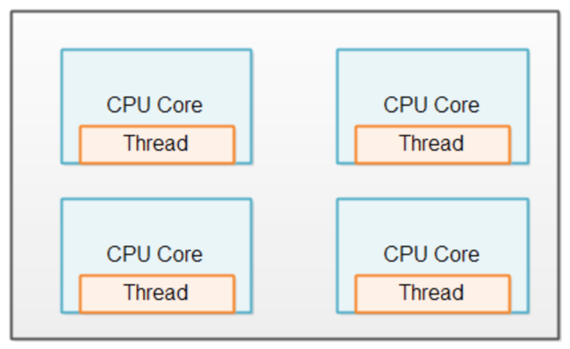
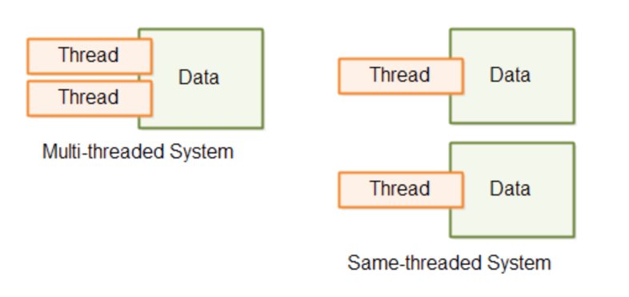
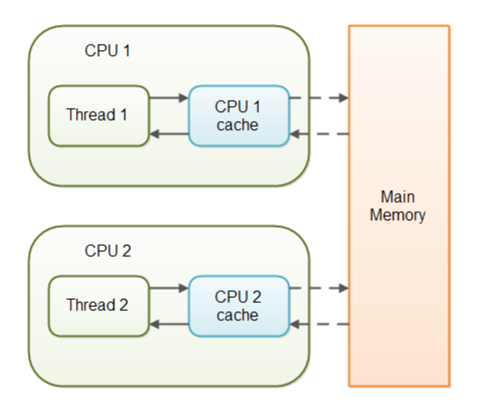

# Multi Threads & Concurrency

## Java Çok Kanallı Programlama

Aynı uygulama içinde çalışabilen birden fazla alt işlemler açabilmeyi ifade eder. Bu kavrama Çok Kanallı Programlama (Multithread Programming) diyoruz. Çok kanallı programlama yöntemi ile geliştirilen uygulamalarda kodun farklı bölümleri aynı anda işletilebilirler. Ya da aynı kod parçası farklı veri kümeleriyle aynı anda işletilebilir.

Thread, böldüğümüz alt işlemleri ifade eder. Thread içinde bir kod parçası çalışır. Birden fazla Thread ile aynı anda birçok kod parçası eş zamanlı olarak çalıştırılabilir. Fakat, Thread diye bahsettiğimiz her iş parçası CPU demek değildir. Aynı CPU’da birden fazla Thread aynı anda çalışabilir. CPU kaynaklarını Thread’leri çeşitli zaman aralıklarında sıralı olarak işletir. 

Bir Thread işletilirken bir diğerine geçmek gerektiği zaman içerikleri hafızada saklanarak diğerine geçiş yapılır. Thread’ler arasında böyle geçişler yapılarak eş zamanlı çalışma sağlanır. Aynı uygulamanın Thread’leri (iş parçacıkları) farklı CPU’larda işlenebilir. Eğer bilgisayarın fiziksel olarak birden fazla CPU’su varsa bu iş parçacıkları gerçek manada eş zamanlı çalışabilir. 

Tek CPU’lu bilgisayarlarda eş zamanlı çalışabilmek için CPU zamanı minik dilimlere ayırır ve bu ayırdığı zaman dilimlerinden birinde iş parçacığının bir kısmını çalıştırır, ardından bir başka iş parçacığına geçer. Bunu o kadar hızlı yaparki tek CPU’lu bilgisayarlarda bile eş zamanlı çalışıyormuş hissi verir.


Geçmişte tek CPU’lu bilgisayarlar eş zamanlı programlama yöntemi olmadığı zamanlarda aynı anda sadece tek bir uygulama çalıştırabilmekteydiler. Yani bizler müzik dinliyorken, Word dokümanı yazamıyorduk. Veya konsolda kod yazıyorken başka bir işlem yapamıyorduk.

### Multitasking

Aynı anda eş zamanlı olarak birçok programın CPU ve işletim sistemi kaynaklarını kullanarak işletilebilmesidir.

#### Multithreading

Aynı uygulamada, yani yazılımda, birden fazla alt iş parçacığının yine CPU ve işletim sistemi kaynaklarını kullanarak çalıştırılabilmesidir.

**Neden Multithreading?

- Performans kazancı sağlamak
- CPU’nun (işlemci) zamanını verimli kullanabilmek
- CPU’nun hızından faydalanmak

**Multithreading Zordur!

Multithread (çok kanallı) programlama yöntemiyle performanslı uygulamalar yazma fikri kulağa çok hoş gelebilir. Gerçekten de çok kanallı programlama yaparak uygulamanızın performansını arttırabilirsiniz. Fakat, bu yöntemle programlama yapabilmek bir o kadar zordur. Çünkü, birden fazla olan bu iş parçacıkları aynı hafıza kaynağını kullanıp okuma ve yazma işlemlerini tek bir hafızaya yapmaktadırlar. Her ne kadar işlemci sayısı artıp işlemciler bağımsız çalışma birimleri olsa da hafıza tek bütün halindedir.

Ve bu hafızanın yazma ve okuma işlemlerinde kontrollü bir şekilde koordine edilmesi gerekir. Düzgün organize edilmemiş çok kanallı programlar kararsız bir şekilde çalışır. Hafızada tutulan verilere yanlış yazma işlemleri uygulayarak tutarsız veriler oluşmasına sebep olurlar. Böyle bir durumda program istenilen şekilde çalışmaz ve tek thread’li (iş parçacığı) yapılarda görmediğimiz sorunlar ortaya çıkabilir. 

Yazılımcı birden fazla CPU’ya sahip bir donanımda her iş parçacığını bağımsız olarak farklı CPU’larda çalıştırsa bile hafıza ortak olduğu için buraya yapılacak erişimleri koordine edecek kodları yazmalıdır. Hafızaya yapılacak yazma ve okuma işlemlerini sıralı erişime koymalıdır.

**CPU Verimli Kullanmak

Diyelimki diskteki dosyaları okuyup işleyen bir program yazıyoruz. Bu yapılan işlemlerin süreleri aşağıdaki gibi ardışıl şekilde olsun.

* A dosyasını okumak - 5 saniye

* A dosyasını işlemek - 2 saniye
* B dosyasını okumak - 5 saniye
* B dosyasını işlemek – 2 saniye

**Toplam süre:** 14 saniye

Dosyalar sistemden okuma yapılırken CPU neredeyse tamamıyla boş durumdadır. CPU bu zamanı daha iyi değerlendirip birtakım işlemler yapabilirdi. İşte çok kanallı programlama ile bu boş süreleri değerlendirip CPU’yu daha verimli kullanabiliriz.

Bu tarz IO işlemlerinde, ki biz IO işlemleri giriş-çıkış işlemleri diyoruz, CPU boş bir şekilde beklemektedir.

Oysa CPU bu zamanda bir yandan dosya işleme işlemini başlatsa daha verimli çalışmış olurdu. Yazılımımızda daha performanslı çalışırdı.

A dosyasını okumak (5 saniye)
B dosyasını okumak (5 saniye) + A dosyasını işlemek (2 saniye) B dosyasını işlemek (2 saniye)

**Toplam süre: 12 süre

Görüldüğü gibi süre anlamında kazanç sağlamış oluyoruz.

Not: gerçekten çok kanallı programlama için ciddi bir sebep olmadan bu yönteme başvurmamak lazım. Performans kazancı gerektiren durumlarda bunu deneyebilirsiniz. Örneğin yoğun miktar veriyi işleyip veri kümesi içinden aradığınızı bulmanız gerektiğinde bu yönteme başvurulabilir. Böyle geçerli bir sebep olması gerekir.

Not: Birden fazla iş parçacığı (Thread) olan bir uygulama yazarken, iş parçacıklarının ortak olarak kullandıkları kaynakları senkronize edip sıralı erişime açmak gerekir. Buradaki ortak kaynak genellikle aynı hafıza bölgesindeki bir veri parçası olabilir. Bir iş parçacığı ortak kaynağı kullanıyorken bu durumda diğerleri o işini bitirene kadar beklemelidir. Aksi durumda hafızaya yazma ve okuma esnasında tutarsızlıklar oluşabilir. Bunların tespiti ve düzeltilmesi ciddi zaman ve iş gücü maliyetine yol açabilir.

Not: Bir iş parçacığı CPU’da işletilirken birtakım kaynakları kullanır. İş parçacığının kullandığı veri, o anda kod icra edilirken kullanılan tüm kaynaklar iş parçacığının kullanımındadır. CPU ise zamanı dilimlere ayırarak aynı anda bir iş parçacığını işletebilir. Bu nedenle CPU iş parçacıklarının kullandığı bu kaynakları bir yere kaydedip, yeni iş parçacığını son haliyle yükleyip çalıştırmalı ve ardından bu işlemi iş parçacıkları arasında sürekli tekrarlamalıdır.

Bu yorucu ve maliyetli bir işlemdir. Bu nedenle CPU’yu “context switching” darboğazı yaratmamak gerekir. Bu nedenle optimum sayıda Thread açılmalıdır. Yüzlerce iş parçacığı açmak uygulamayı hızlandırmaz aksine yavaşlatır. Genelde 5-10 iş parçacığı (Thread) iş görebilir. Bu birazda deneyimsel bir durumdur. Uygun sayıyı yazılımcı deneyerek bulabilir.

### Paylaşımlı Durum ve Ayrık Durum

Çok kanallı programlamanın en önemli noktasından biri de kullanılan kaynağın paylaşılıp paylaşılmadığıdır. Yani bazı modellerde iş parçacıkları ortak bir “state”’i (durum) kullanıyor olabilirler. Yani “state”’den kastımız ortak bir veri kaynağını kullanıyorlardır. Örneğin, aynı diziye eleman eklemeye çalışan birden fazla iş parçacığı olduğunu düşünün burada tümü ortak bir kaynağı, yani ortak bir “state”’i kullanıyorlardır.


Ya da bazı problemlerde birden fazla iş parçacı bağımsız olarak ayrı ayrı “state”2lerde çalışabilirler. Yan, iş parçacıkları işleyecekleri verileri alırlar ve iş parçacıkları arasında herhangi bir senkronizasyon gerekmeden çalışabilirler. Bu durumda aslında çok kanallı programlama yapmak daha performanslı olabilir. Ayrıca, senkronizasyon için ekstra bir çaba harcanmaz. 

Daha az sorun çıkar. Örneğin elimizde 100 bin elemanlık bir dizi olsun ve bu dizinin toplamını hesaplamak isteyelim. Bu durumda 100 binlik diziyi 10 parçaya ayırıp her veri parçasını bir iş parçacığının işlemesini sağlayabiliriz. Bu iş parçacıkları kendi veri kümesinin toplamanı bulur. Ardından 10 iş parçası işini bitirdiğinde 10 sonucu bir araya getirip toplama işlemini hızlandırmış oluruz.


Her bir iş parçacığı için bir CPU

Eğer birden fazla CPU içeren bir donanımınız varsa her CPU’ya bir iş parçacığı atanır. Bu durumla CPU’lar verimli bir şekilde kullanılır.



Yukarıdaki duruma ek olarak ortak paylaşılan herhangi bir kaynak (state) yoksa her CPU’ya atanan iş parçacığı birbirleri arasında senkronizasyona ihtiyaç duymazlar. Bu duruma “Same-Threaded System” denilmektedir. Eğer iş parçacıkları ortak paylaşımlı bir kaynak (state) kullanıyorsa bu durumda iş parçacıklarının bu ortak kaynaklara erişimi senkronize edilmelidir. Bu duruma “Multi-Threaded System” denilmektedir.



#### Java Thread’lerin Oluşturulması ve Kullanılması
Java’da herhangi bir uygulamayı çalıştırdığımızda varsayılan olarak ana (main) bir iş parçacığı (Thread) ayağa kaldırılır. Bu ana iş parçacığına ek olarak yazılımcılarda alt iş parçacıkları çalıştıralabilir. Bundan zaten bahsetmiştik. Şimdi Java dilinde Thread nasıl tanımlanır ve çalıştırılır onu inceleyelim.

Java’da iş parçacığı oluşturmak için “Thread” isminde bir sınıf bulunmaktadır. Böylece, basit anlamda iş parçacığı açmış oluruz. Tabi, unutmamak lazım Thread açmak sisteme maliyeti olan bir iştir. Sürekli Thread üretmek kaynak kullanımını olumsuz etkiler. Bu nedenle bu sorunu çözmek Thread Pooling kavramı vardır. 

Bu maliyetli nesneler ilk başta belli bir miktarda yaratılır ve hazır durumda olacak şekilde havuza konulur. Thread ihtiyacı olanlar bu havuzdan bir Thread’i kullanır ve sisteme geri iade eder. Böylece, performans kazancı yanı sıra kaynak kullanımı da iyi bir hale getirilir.

```java
Thread thread = new Thread();
```
Yukarıda görüldüğü gibi “Thread” sınıfından bir nesne oluşturup bir iş parçacığı üretmiş olduk. Bu iş parçacığını çalışmaya başlatmak için “start” fonksiyonunu çağırmamız gerekecektir.

```java
thread.start();
```
Böylece, iş parçacığımız işini bitirene kadar çalışmaya devam edecektir. Fakat, yukarıdaki örnekte iş parçacığının çalıştıracağı bir kod parçası vermedik. Bunu verebilmenin iki yolu vardır. 

1.	“Thread” sınıfından kalıtım alan bir alt sınıf yaratıp, onun “run” fonksiyonunu override (ezme) etmek gerekir.
2.	“Runnable” interface’den kalıtım alan bir alt sınıf yaratmak ve “run” fonksiyonunu override etmek, ardından “Thread” sınıfının kurucusuna nesne olarak göndermek.
```java
public class SimpleThread extends Thread {

	@Override
	public void run() {
```
```java
		// o an çalışan Thread'in ismini alıyoruz.
		String threadName = Thread.currentThread().getName();
		
		System.out.println("My summation " + threadName + " is started!");
		
		int total = 0;
		for(int i=0; i < 1000; i++) 
		{
			total += i;
		}
		
		System.out.println("Total: " + total);
	}
}
```
Yukarıda “SimpleThread” isminde Java’nın “Thread” sınıfından kalıtım alan bir sınıf tanımladık. Bu sınıf içindeki “run” metodu içine Thread’de çalıştırmak istediğimiz kodları yazıyoruz. Bu kod parçası işletim sistemi düzeyinde herhangi bir CPU’da eş zamanlı olarak çalıştırılacaktır. Unutulmamalı ki yarattığımız iş parçacığı hazırladığımız Java konsol uygulamasının bir alt iş parçacığıdır.

```java
SimpleThread simpleThread = new SimpleThread();
simpleThread.start();
```
“SimpleThread” sınıfından bir nesne üretiyoruz. Ardından, “start” fonksiyonunu çağırdığımızda işletim sistemi bize bir Thread kaynağı yaratıyor ve “SimpleThread” sınıfında override ettiğimiz “run” fonksiyonu işletilmeye başlanıyor. “run” fonksiyonu içindeki kodlar artık ayrı bir Thread içinde işlem görmeye başlıyorlar. Aynı şekilde bir nesne daha üretip “start” dediğimizde yeni bir Thread daha oluşturulup başka bir iş parçacığı oluşturulur.

```java
SimpleThread simpleThread2 = new SimpleThread();
simpleThread2.start();
```
Sonuçlar aşağıdaki gibidir. Görüldüğü üzere iki farklı Thread aynı anda işletilmiştir.

```java
My summation Thread-0 is started!
Total: 499500
My summation Thread-1 is started!
Total: 499500
```
Runnable interface ile Thread Kullanımı

Thread’lere Runnable tipinde nesne vererek kod parçasını bir iş parçacığı olarak işletebiliriz.

```java
public class SimpleRunnable implements Runnable {

	@Override
	public void run() {
		
		// o an çalışan Thread'in ismini alıyoruz.
		String threadName = Thread.currentThread().getName();
		
		System.out.println("My summation " + threadName + " is started!");
		
		int total = 0;
		for(int i=0; i < 1000; i++) 
		{
			total += i;
		}
		
		System.out.println("Total: " + total);
	}

}
```
Yukarıda “Runnable” interface’den kalıtım alan “SimpleRunnable” isminde bir sınıf tanımladık. Bu sınıf içindeki “run” metodunu override ederek iş parçacığı içinde çalıştırılacak olan kodu yazıyoruz.

```java
// Runnable interface'den kalıtım almış olan "SimpleRunnable" sınıfından bir nesne oluşturuyoruz.
SimpleRunnable simpleRunnable = new SimpleRunnable();

// Runnable tipindeki nesneyi Thread kurucusuna gönderiyoruz.
Thread simpleThread3 = new Thread(simpleRunnable);

// start fonksiyonunu çağırdığımızda "SimpleRunnable" sınıfı içindeki "run" fonksiyonu işletilecektir.
simpleThread3.start();
```
“Runnable” tipindeki sınıfımızdan bir nesne oluşturuyoruz. Ardından, Thread sınıfından bir nesne oluşturup kurucu metodun içine “Runnable” tipte oluşturduğumuz nesneyi gönderiyoruz. Bununla birlikte 3 Thread (iş parçacığı) tanımlamış oluyoruz.

```java
My summation Thread-0 is started!
My summation Thread-1 is started!
Total: 499500
Total: 499500
My summation Thread-2 is started!
Total: 499500
```
3 iş parçacığının sonuçları yukarıdadır.

Not: Thread.currentThread() ile o anda aktif olarak çalışan iş parçacığının referansını alabiliyoruz. Burada aldığımız Thread nesnesi iş parçacığı içinde çalıştırılan kodu ifade eder.

**Thread’i beklemeye almak**
Java’da bir iş parçacığını belli bir süre bekletmek istersek, Thread sınıfına ait “sleep” fonksiyonunu kullanabiliriz.

“sleep” fonksiyonu milisaniye cinsinden bir değer bekler. Yani örneğin 3000 değeri 3 saniyeye karşılık gelmektedir.

```java
try {
    Thread.sleep(10L * 1000L);
} catch (InterruptedException e) {
    e.printStackTrace();
}
```
Yukarıda Thread.sleep ile iş parçacığı 10 saniye beklemeye alınmıştır. “sleep” fonksiyonu hata fırlatabilen bir fonksiyon olduğundan önceki konularda da görmüştük try-catch bloğu içinde kontrol edilmelidir veya fırlattığı hatayı “throws” anahtar kelimesi ile bir üste doğru fırlatmamız gerekmektedir.

**Thread’i durdurmak**

Bir iş parçacığı çalışmaya başladığında bir CPU tarafından işletilmeye başlanır. İş parçacığını durdurmak için Thread sınıfı içinde “stop” fonksiyonu vardır. Fakat, bu fonksiyon iş parçacığını durdurma garantisi vermez. O nedenle Thread içinde çalışacak kodu tasarlarken çalışan kod parçasının nasıl durdurulacağını yazılımcı kendisi kodlamalıdır. Bu nedenle Thread sınıfında veya Runnable interface’den türemiş bir sınıf içinde boolean bir değer tutarak kod parçasını sonlandırmayı garanti altına alabiliriz.

Bunu bir örnek ile inceleyelim.

public class ThreadSleeper {
```java
	public static void sleep(long milliseconds) {
		
		try {
			Thread.sleep(milliseconds);
		} catch (InterruptedException e) {
			e.printStackTrace();
		}
	}
}
```

“ThreadSleeper” isminde bir sınıf oluşturduk. Bu sınıf içindeki “sleep” fonksiyonu iş parçacığını belli bir süre bekletmeyi sağlamaktadır.

Ardından “SimpleRunnable” sınıfımızdaki “run” metodu içine yazdığımız kod parçasında güncelleme yapıyoruz. Çalışan kod parçacığını durdurmak için “live” isminde boolean bir değişken tanımladık. Bu değişken ile Thread içinde çalışan çalışmayı durduruyoruz.

```java
public class SimpleRunnable implements Runnable {

	private boolean live = true;
	
	@Override
	public void run() {
		
		// o an çalışan Thread'in ismini alıyoruz.
		String threadName = Thread.currentThread().getName();
		
		System.out.println("My summation " + threadName + " is started!");
		
		int total = 0;
		while(live) 
		{
			total += 1;
			
			// yarım saniye bekletiyoruz.
			ThreadSleeper.sleep(500);
		}
		
		System.out.println("Total: " + total);
	}
	
	public void stop() {
		this.live = false;
	}

}
```
Thread’i start fonksiyonu ile çalışmaya başlatıyoruz. Ardından ana programı 10 saniye bekletiyoruz. Bekleme bitince “SimpleRunnable” içindeki “stop” fonksiyonunu çağırıp çalışan kod parçasını durduruyoruz.
```java
// Runnable interface'den kalıtım almış olan "SimpleRunnable" sınıfından bir nesne oluşturuyoruz.
SimpleRunnable simpleRunnable = new SimpleRunnable();

// Runnable tipindeki nesneyi Thread kurucusuna gönderiyoruz.
Thread simpleThread3 = new Thread(simpleRunnable);

// start fonksiyonunu çağırdığımızda "SimpleRunnable" sınıfı içindeki "run" fonksiyonu işletilecektir.
simpleThread3.start();

ThreadSleeper.sleep(10000);

simpleRunnable.stop();
```
**Kritik Bölümler (Critical Sections) ve Veriye Erişim Yarışması (Race Condition)**

Tek Thread şeklinde çalışan uygulamalar hafıza bölgesine ve diğer sistem kaynaklarına erişirken herhangi bir senkronizasyon ihtiyacı bulunmaz. Program çalışır ve kaynakları kullanır, ardından kaynakları sisteme iade eder. Fakat, çok kanallı programlamada birden fazla iş parçacığı (Thread) aynı anda ortak bir kaynağa erişmeye kalkışırlarsa bunları sırayla erişim vermek gerekecektir. 

Bir iş parçacığı kaynağı kullanıyorken diğerleri onu beklemelidirler. İşte birden fazla iş parçacığının kullandığı bu paylaşımlı ortak alanlara “Critical Sections” adı verilmektedir. Buna en güzel örnek bir değişkenin değerinin değiştirilmesidir. Çünkü, değişkenin değerinin değişmesi demek hafıza bölgesinde bir değişim yapmak demektir. Böyle ortak bir kaynağı kullanan Thread’ler okuma ve yazma yaparken bu “Critical Section”’a sırayla erişmeleri gerekir.

```java
public class QMatic implements Runnable {

	private int orderNo;
	
	public QMatic() {
		this.orderNo = 0;
	}
	
	@Override
	public void run() {
		
		// a little bit delay to see race condition!
		ThreadSleeper.sleep(50);
		
		// Critical section for all threads!
		this.orderNo = this.orderNo + 1;
		
		StringBuilder builder = new StringBuilder();
		builder.append(Thread.currentThread().getName());
		builder.append(" thread got ");
		builder.append(this.orderNo);
		builder.append(" from Qmatic!");

		System.out.println(builder.toString());
	}
}
```
Yukarıdaki örnekte bir banka şubesinde sıra numarası alınan bir cihaz olduğunu düşünün. Gelen müşteri sıraya göre bir fiş alıp numarasını görmektedir. “QMatic” ismindeki sınıfın içindeki “run” metodu içinde “orderNo” isimli değişkenin değeri değiştirilmektedir. Müşteriler cihaz butonuna basınca sıra numarası bir artmaktadır. 

Şube içinde tek cihaz üzerinden tüm müşteriler numara alırsa sorun yoktur. Tek cihaz tek Thread! Fakat, şube müdürü verimlilik adına şube içine bu cihazlardan bir tane eklettiğini düşünün. 2 tane numara alma cihazımız oldu. 

Fakat, 2 cihaz olsa da sıra numaralarını yine ardışıl ve tutarlı vermemiz gerekiyor. 2 Thread 1 Critical Section! 2 cihaz demek bizim için 2 Thread demek, sıra numarası ise bizim için “Ciritical Section” demektir. Buradaki sıra numarasını düzgün yönetmemiz gerekiyor. 

Yukarıdaki örnek kodda “Critical Section” olan kısım    this.orderNo = this.orderNo + 1;   ifadesidir. Bu tek satırlık bir komut gibi gözükebilir ama arka planda işlemci seviyesinde bu işlem birden fazla adımdan oluşmaktadır.

Qmatic1: this.orderNo değişkenindeki değeri hafızadan 0 olarak okur.
Qmatic2: this.orderNo değişkenindeki değeri hafızadan 0 olarak okur.
Qmatic2: Elindeki 0 değerine 1 ekler.
Qmatic2: “orderNo” değişkenini 1 olarak değiştirir. orderNo değişkeninin değeri şuan 1’dir.
Qmatic1: Elindeki 0 değerine 1 ekler.
Qmatic1: “orderNo” değişkenini 1 olarak değiştirir. orderNo değişkeninin değeri şuan 1’dir.


Görüldüğü gibi iş parçacıkları (Thread’ler) için okuma ve yazma işlemleri senkronize edilmezse aynı sıra numarasını birden fazla kişiye verebiliriz. İşte bu olaya “Race Condition” denilmektedir. Çünkü, Thread’ler ortak kaynağa erişmek için birbiriyle yarışır.

İlk erişen işlemlerini yapmaya başlar, fakat diğer Thread’ler onun işini bitirmesini beklemezlerse yukarıdaki gibi tutarsız durumlar oluşur. Bu nedenle Thread’lerin ortak kaynağa erişimi sıralı olmalıdır.

**Sonuçlar :**
```java
Thread-2 thread got 1 from Qmatic!
Thread-9 thread got 1 from Qmatic!
Thread-1 thread got 1 from Qmatic!
Thread-0 thread got 2 from Qmatic!
Thread-7 thread got 2 from Qmatic!
Thread-3 thread got 2 from Qmatic!
Thread-4 thread got 2 from Qmatic!
Thread-8 thread got 2 from Qmatic!
Thread-5 thread got 4 from Qmatic!
Thread-6 thread got 4 from Qmatic!
```
**Java “synchronized” Anahtar Kelimesi**

Yukarıdaki gibi “Ciritical Section” olan kod bölgelerinde “Race Condition” durumuna engel olmak için kullanılabilecek yöntemlerden biri de “synchronized” anahtar kelimesidir. Bu anahtar kelime ile “Critical Section” kod bölgesini Thread’ler arasında sıralı erişime açabilirsiniz.

“synchronized” anahtar kelimesini bir değişkene, bir bloğu parçasına veya metoda verebilirsiniz. Yukarıdaki örneğimizi şimdi “Thread Safe” bir hale getirelim.

```java
public class QMatic implements Runnable {

	private int orderNo;
	
	private Object LOCK = new Object();
	
	public QMatic() {
		this.orderNo = 0;
	}
	
	@Override
	public void run() {
		
		// a little bit delay to see race condition!
		ThreadSleeper.sleep(50);
		
		// Critical section for all threads!
		
		synchronized (LOCK) {
			this.orderNo = this.orderNo + 1;
			
			StringBuilder builder = new StringBuilder();
			builder.append(Thread.currentThread().getName());
			builder.append(" thread got ");
			builder.append(this.orderNo);
			builder.append(" from Qmatic!");

			System.out.println(builder.toString());
		}
		
	}
}
```
QMatic isimli “Runnable” interface’den türemiş sınıfımızda “LOCK” isminde Object türünden bir kilit nesnesi oluşturuyoruz. Ardından “Critical Section” olarak belirttiğimiz tüm Thread’lerin ortak kullandığı “orderNo” değişkeniyle işlem yapan kod bloğunu “synchronized” anahtar kelimesiyle korumaya alıp, Thread’ler için sıralı erişime açıyorum. Eğer bir Thread “Critical Section” olarak işaretlediğim kod bloğuna girip kaynakları kullanmaya başlarsa diğer Thread’ler o işini bitirene kadar beklemek zorundadırlar.

```java
Thread-9 thread got 1 from Qmatic!
Thread-1 thread got 2 from Qmatic!
Thread-3 thread got 3 from Qmatic!
Thread-7 thread got 4 from Qmatic!
Thread-2 thread got 5 from Qmatic!
Thread-4 thread got 6 from Qmatic!
Thread-5 thread got 7 from Qmatic!
Thread-0 thread got 8 from Qmatic!
Thread-6 thread got 9 from Qmatic!
Thread-8 thread got 10 from Qmatic!
```
Yukarıda “synchronized” olarak belirttiğimiz kod bloğunu bir metod içine alsaydık. Aşağıdaki gibi yapabilirdik.

```java
private synchronized void increment() {
	
	this.orderNo = this.orderNo + 1;
	
	StringBuilder builder = new StringBuilder();
	builder.append(Thread.currentThread().getName());
	builder.append(" thread got ");
	builder.append(this.orderNo);
	builder.append(" from Qmatic!");

	System.out.println(builder.toString());
}
```
**Java “volatile” Anahtar Kelimesi**

“volatile” anahtar kelimesi değişkenin sakladığı değerin Thread’ler tarafından okunmaya çalışıldığında hepsinde aynı değerin okunacağının garantisini verir. Bilgisayar mimarisinde ana hafıza bölgemiz vardır. Biz program çalıştığı süre boyunca işlediği verileri ve programın komutlarını bu ana hafıza bölgesinde saklarız. 

Bu hafıza bölgesi RAM diye bilinir. Ayrıca, bilgisayar mimarisinde işlemciler (CPU) vardır. CPU ile hafıza bölgesi sürekli haberleşme halindedir. Sıkı bir iletişim trafiği vardır.

Bu nedenle aşağıdada görüldüğü gibi CPU tarafında küçük hafıza bölgeleri bulunur. Bu hafıza bölgeleri sık kullanılan değişken değerlerini buraya cache’lerler. Böylece sürekli ana hafızaya giderek zaman kaybetmek yerine daha hızlı işlem görürler. 

“volatile” anahtar kelimesi ile işaretlenmiş bir değişkenin değerine erişmek gerektiğinde direkt olarak ana hafızadan alınacağını ve ilgili değişkene yazma işlemi uygulanacaksa yine direkt olarak ana hafıza bölgesine yazılacağını belirtmiş oluruz. 

Böylece bu değişken üzerinde işlem yapan tüm Thread’ler aynı değeri görecekleri garanti altına alınmış olunur. Normalde “volatile” demeseydik değişkenimiz CPU cache bölgesinden okunabilirdi. Bu durumda tutarsız durumlar oluşabilirdi. Kritik değerler için “volatile” anahtar kelimesi kullanabilirsiniz.



```java
private volatile int orderNo;
```
Yukarıda QMatic örneğimizde “volatile” anahtar kelimesinin kullanımını gördük.

**Kilit Nesneler ile Çok Kanallı Programlama (Locks in Java)**

“synchronized” anahtar kelimesi ile “Critical Sections” kod bölgelerini sıralı erişime açıp Thread’lerin ortak kullandığı bu alanı düzgünce kullanabilmelerini sağlıyorduk. Aynı şekilde “Lock” yani kilit mekanizmaları ile belli kod bloklarını “synchronized” gibi sıralı erişime açabiliriz.

Bunun için “ReadWriteLock” sınıfını kullanarak hem okuma hem de yazma işlemleri için sıralı erişim olanağı veren bir örnek geliştireceğiz. Bunun için “SimpleCounter” isminde “Runnable” interface’den kalıtım alan bir sınıf tasarlıyoruz.

```java
public class SimpleCounter {

	private volatile int counter;
	
	private final ReadWriteLock readWriteLock = new ReentrantReadWriteLock();
	
	public SimpleCounter() {
		this.counter = 0;
	}
	
	public void incrementCounterWithThreadSafety(String threadName) {
		
		this.readWriteLock.writeLock().lock();
		
		try {
			this.counter++;
			System.out.println("Counter was updated to '" + this.counter + "' from " + threadName);
		}
		finally {
			this.readWriteLock.writeLock().unlock();
		}
		
	}
	
	
	public int readCounterWithThreadSafety() {
		
		this.readWriteLock.readLock().lock();
		
		try {
			return this.counter;
		}
		finally {
			this.readWriteLock.readLock().unlock();
		}
		
	}
}
```
Yukarıdaki örnekte “readWriteLock” isminde bir nesne oluşturuyoruz. Bizim kod içindeki kilit mekanizmamızı bu nesne yönetecektir.

“incrementCounterWithThreadSafety” metodu içinde değişkenin değerini güncelleyeceğimiz için bir yazma işlemi yapacağız bu nedenle aşağıdaki komutla bir yazma kilidi alıyoruz.

```java
this.readWriteLock.writeLock().lock();
```
Ardından koruma altına almak istediğim kod bloğunu bir “try” bloğu içine yerleştiriyorum. İşlemler bitince ise aşağıdaki gibi kilidi serbest bırakıyorum.

```java
finally {
			this.readWriteLock.writeLock().unlock();
		}
```
Hatırlayacaksınızdır, finally anahtar kelimesi ile “try” bloğunda hata olsun veya olmasın mutlaka çalıştırılırdı. Mutlaka kilidi öyle ya da böyle serbest bırakıyorum. Kilidi serbest bırakamazsam sıkıntılı sorunlarla boğuşabiliriz.


“readCounterWithThreadSafety” metodunda ise “counter” isimli değişkenin değerini okuyacağız ve burada da okuma yaptığımız kod bloğunu korumaya almak istiyoruz diyelim. Bu durumda ise okuma kilidini alıp kullanacağız ve sisteme geri iade edeceğiz.

```java
this.readWriteLock.readLock().lock();
```
işimiz bitince aşağıdaki gibi finally bloğu içinde mutlaka kilidi serbest bırakıyoruz.

```java
finally {
			this.readWriteLock.readLock().unlock();
		}
```
**İş Parçacığı Havuzları (ThreadPooling)**

Thread yaratmak cidden maliyetli bir olaydır. Her Thread için sistemde belli bir kaynak ayrılır. Bu kaynaklar CPU, Hafıza gibi önemli olanlardır. Uygulamamız çalışırken belli miktarda bir Thread ile sınırlandırmak isteyebiliriz. 

Bu nedenle Thread havuzu oluşturup bu havuzu önceden oluşturulmuş ve kullanıma hazır Thread nesneleri ile doldururuz. Böylece, performans kazanımı ve sistem kaynaklarının verimli kullanımını sağlayabiliriz.

```java
ExecutorService executor = Executors.newFixedThreadPool(15);
```
Yukarıdaki Java’da hazır bulunan “Executors” sınıfındaki “newFixedThreadPool” metodunu çağırarak bir Thread havuzu oluşturabilirsiniz. Ardından bize 15 Thread’in kullanıma hazır halde bulunduğu bir havuz oluşturup verecektir. Bu fonksiyon ayrıca bize bu havuz üzerinde Thread kullanımını yönetecek “ExecutorService” tipinde bir nesne verecektir. Bu nesne üzerindeki “execute” fonksiyonuyla havuzdaki bir Thread’i kullanıp işimiz bitince tekrar sisteme iade edeceğiz.

```java
ExecutorService executor = Executors.newFixedThreadPool(15);

QMatic qmatic = new QMatic();

for(int i=0; i < 100; i++) {
 executor.execute(qmatic);
}
```
Yukarıdaki örnekte “QMatic” isminde önceden de kullandığımız Runnable tipinde sıra numarası veren sınıftan bir nesne yaratıyoruz. Bu kod parçasını “execute” fonksiyonuyla havuzdaki bir Thread’i kullanarak çalıştırıyoruz. Görüldüğü gibi havuz 15 kapasiteli olmasına rağmen döngüde 100 kez Thread kullanma talebi gelmiş. Eğer havuzda uygun boş bir Thread yoksa beklemede kalacaktır. Havuzdan ilk boşa çıkan Thread nesnesini alıp çalışacaktır.