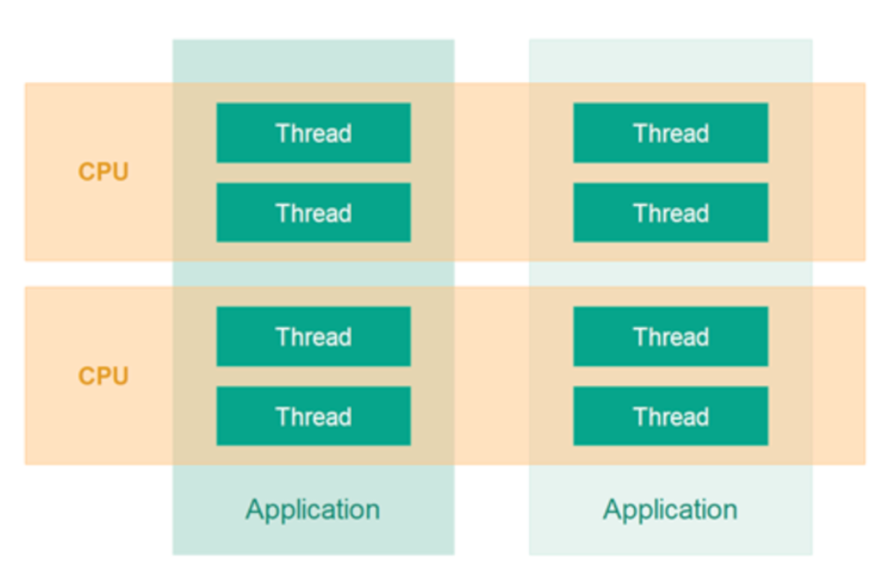

# Multi Threads & Concurrency

Aynı uygulama içinde çalışabilen birden fazla alt işlemler açabilmeyi ifade eder. Bu kavrama Çok Kanallı Programlama (Multithread Programming) diyoruz. Çok kanallı programlama yöntemi ile geliştirilen uygulamalarda kodun farklı bölümleri aynı anda işletilebilirler. Ya da aynı kod parçası farklı veri kümeleriyle aynı anda işletilebilir.

Thread, böldüğümüz alt işlemleri ifade eder. Thread içinde bir kod parçası çalışır. Birden fazla Thread ile aynı anda birçok kod parçası eş zamanlı olarak çalıştırılabilir. Fakat, Thread diye bahsettiğimiz her iş parçası CPU demek değildir. Aynı CPU’da birden fazla Thread aynı anda çalışabilir. CPU kaynaklarını Thread’leri çeşitli zaman aralıklarında sıralı olarak işletir. 

Bir Thread işletilirken bir diğerine geçmek gerektiği zaman içerikleri hafızada saklanarak diğerine geçiş yapılır. Thread’ler arasında böyle geçişler yapılarak eş zamanlı çalışma sağlanır. Aynı uygulamanın Thread’leri (iş parçacıkları) farklı CPU’larda işlenebilir. Eğer bilgisayarın fiziksel olarak birden fazla CPU’su varsa bu iş parçacıkları gerçek manada eş zamanlı çalışabilir. 

Tek CPU’lu bilgisayarlarda eş zamanlı çalışabilmek için CPU zamanı minik dilimlere ayırır ve bu ayırdığı zaman dilimlerinden birinde iş parçacığının bir kısmını çalıştırır, ardından bir başka iş parçacığına geçer. Bunu o kadar hızlı yaparki tek CPU’lu bilgisayarlarda bile eş zamanlı çalışıyormuş hissi verir.

Geçmişte tek CPU’lu bilgisayarlar eş zamanlı programlama yöntemi olmadığı zamanlarda aynı anda sadece tek bir uygulama çalıştırabilmekteydiler. Yani bizler müzik dinliyorken, Word dokümanı yazamıyorduk. Veya konsolda kod yazıyorken başka bir işlem yapamıyorduk.

## Multitasking

Aynı anda eş zamanlı olarak birçok programın CPU ve işletim sistemi kaynaklarını kullanarak işletilebilmesidir.

### Multithreading

Aynı uygulamada, yani yazılımda, birden fazla alt iş parçacığının yine CPU ve işletim sistemi kaynaklarını kullanarak çalıştırılabilmesidir.

**Neden Multithreading?**

- Performans kazancı sağlamak
- CPU’nun (işlemci) zamanını verimli kullanabilmek
- CPU’nun hızından faydalanmak

**Multithreading Zordur!**

Multithread (çok kanallı) programlama yöntemiyle performanslı uygulamalar yazma fikri kulağa çok hoş gelebilir. Gerçekten de çok kanallı programlama yaparak uygulamanızın performansını arttırabilirsiniz. Fakat, bu yöntemle programlama yapabilmek bir o kadar zordur. Çünkü, birden fazla olan bu iş parçacıkları aynı hafıza kaynağını kullanıp okuma ve yazma işlemlerini tek bir hafızaya yapmaktadırlar. Her ne kadar işlemci sayısı artıp işlemciler bağımsız çalışma birimleri olsa da hafıza tek bütün halindedir.

Ve bu hafızanın yazma ve okuma işlemlerinde kontrollü bir şekilde koordine edilmesi gerekir. Düzgün organize edilmemiş çok kanallı programlar kararsız bir şekilde çalışır. Hafızada tutulan verilere yanlış yazma işlemleri uygulayarak tutarsız veriler oluşmasına sebep olurlar. Böyle bir durumda program istenilen şekilde çalışmaz ve tek thread’li (iş parçacığı) yapılarda görmediğimiz sorunlar ortaya çıkabilir. 

Yazılımcı birden fazla CPU’ya sahip bir donanımda her iş parçacığını bağımsız olarak farklı CPU’larda çalıştırsa bile hafıza ortak olduğu için buraya yapılacak erişimleri koordine edecek kodları yazmalıdır. Hafızaya yapılacak yazma ve okuma işlemlerini sıralı erişime koymalıdır.

**CPU Verimli Kullanmak**

Diyelimki diskteki dosyaları okuyup işleyen bir program yazıyoruz. Bu yapılan işlemlerin süreleri aşağıdaki gibi ardışıl şekilde olsun.

* A dosyasını okumak - 5 saniye

* A dosyasını işlemek - 2 saniye
* B dosyasını okumak - 5 saniye
* B dosyasını işlemek – 2 saniye

**Toplam süre:14 saniye**

Dosyalar sistemden okuma yapılırken CPU neredeyse tamamıyla boş durumdadır. CPU bu zamanı daha iyi değerlendirip birtakım işlemler yapabilirdi. İşte çok kanallı programlama ile bu boş süreleri değerlendirip CPU’yu daha verimli kullanabiliriz.

Bu tarz IO işlemlerinde, ki biz IO işlemleri giriş-çıkış işlemleri diyoruz, CPU boş bir şekilde beklemektedir.

Oysa CPU bu zamanda bir yandan dosya işleme işlemini başlatsa daha verimli çalışmış olurdu. Yazılımımızda daha performanslı çalışırdı.

A dosyasını okumak (5 saniye)
B dosyasını okumak (5 saniye) + A dosyasını işlemek (2 saniye) B dosyasını işlemek (2 saniye)

**Toplam süre: 12 süre**

Görüldüğü gibi süre anlamında kazanç sağlamış oluyoruz.

Not: gerçekten çok kanallı programlama için ciddi bir sebep olmadan bu yönteme başvurmamak lazım. Performans kazancı gerektiren durumlarda bunu deneyebilirsiniz. Örneğin yoğun miktar veriyi işleyip veri kümesi içinden aradığınızı bulmanız gerektiğinde bu yönteme başvurulabilir. Böyle geçerli bir sebep olması gerekir.

Not: Birden fazla iş parçacığı (Thread) olan bir uygulama yazarken, iş parçacıklarının ortak olarak kullandıkları kaynakları senkronize edip sıralı erişime açmak gerekir. Buradaki ortak kaynak genellikle aynı hafıza bölgesindeki bir veri parçası olabilir. Bir iş parçacığı ortak kaynağı kullanıyorken bu durumda diğerleri o işini bitirene kadar beklemelidir. Aksi durumda hafızaya yazma ve okuma esnasında tutarsızlıklar oluşabilir. Bunların tespiti ve düzeltilmesi ciddi zaman ve iş gücü maliyetine yol açabilir.

Not: Bir iş parçacığı CPU’da işletilirken birtakım kaynakları kullanır. İş parçacığının kullandığı veri, o anda kod icra edilirken kullanılan tüm kaynaklar iş parçacığının kullanımındadır. CPU ise zamanı dilimlere ayırarak aynı anda bir iş parçacığını işletebilir. Bu nedenle CPU iş parçacıklarının kullandığı bu kaynakları bir yere kaydedip, yeni iş parçacığını son haliyle yükleyip çalıştırmalı ve ardından bu işlemi iş parçacıkları arasında sürekli tekrarlamalıdır.

Bu yorucu ve maliyetli bir işlemdir. Bu nedenle CPU’yu “context switching” darboğazı yaratmamak gerekir. Bu nedenle optimum sayıda Thread açılmalıdır. Yüzlerce iş parçacığı açmak uygulamayı hızlandırmaz aksine yavaşlatır. Genelde 5-10 iş parçacığı (Thread) iş görebilir. Bu birazda deneyimsel bir durumdur. Uygun sayıyı yazılımcı deneyerek bulabilir.

