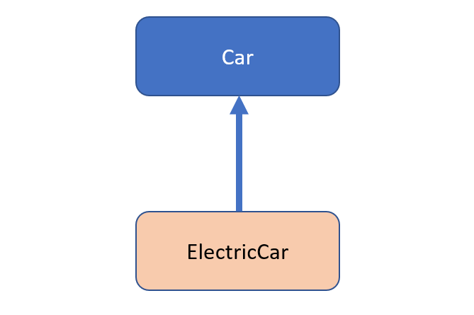
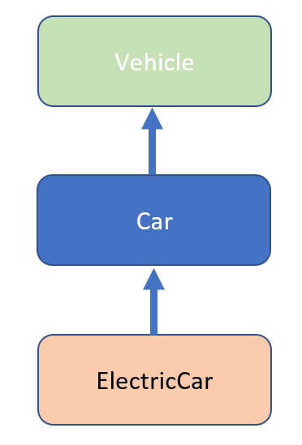
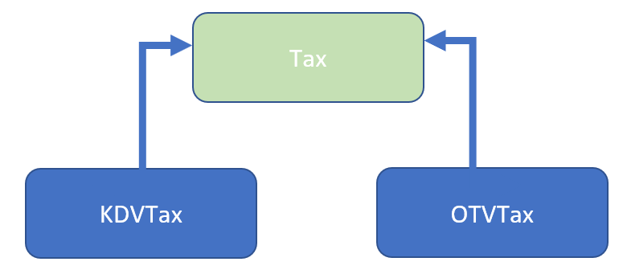

Bölüm-2

# Nesneye Dayalı Programlama Nedir?

Nesneye Dayalı Programlama kavramı aslında bir yazılım geliştirme tekniğidir. Bu tekniği destekleyen dillere de Nesneye Dayalı programlama dilleri denilir. Nesne kavramı gerçek hayatta karşılığı olan varlıklardır. Gerçek hayattaki bu nesneleri yazılım dünyasında modelleyebilmek için Nesneye Dayalı Programlama kavramı ortaya çıkmıştır. Bu yöntemde her şey Sınıf&#39;lardan (Class) ve Nesne&#39;lerden (Object) oluşur. Bu oluşturduğumuz nesnelerin birbiriyle haberleşmesi etkileşimde bulunması ile birlikte büyük ve karışık sistemler modellenebilir.

# Java&#39;da Sınıf Kavramı (Class)

Sınıflar aslında nesnelere ait özelliklerin ve fonksiyonlarının bir araya getirilip bir veri tipi olarak tanımlandığı şablonlardır. Sınıf tanımlar aşağıdaki yapıya uygun olarak tanımlarız.

````java
class class_name{
değişkenler;
metotlar;
}
````

Java&#39;da sınıf tanımlamak için &quot; **class**&quot; anahtar kelimesi kullanılır. Bu anahtar kelimeden sonra yazılım sınıfa bir isim belirler. Bu isim tamamen geliştiricinin tercihine bağlıdır. Fakat, sınıf isimlerinin ilk harfinin büyük olmasına lütfen özen gösterelim.

Sınıf ismini de verdikten sonra &quot;{&quot; işareti ile sınıfa ait kapsamı yani kod bloğunu oluştururuz. &quot;}&quot; parantezi ile de sınıfa ait kapsamı kapatırız. Böylece, sınıfımız için yazacağımız kodlar &quot;{}&quot; arasında kalan alanda yazılacaktır. Bu da sınıfın kapsamını ifade eder.

Sınıf kod bloğunu açtıktan sonra bu kod bloğu için değişkenleri ve fonksiyonları yazarız. Unutmayınız ki fonksiyonların da kendilerine ait kod blokları, yani kapsamları vardır. Onları da &quot;{}&quot; ile belirtiriz.

Not: Java&#39;da Sınıf&#39;lar ve Metotlar (Fonksiyonlar) kodun yeniden kullanılabilirliği için kullanılır. Derste yaptığımız örneklerle de aynı kod bloğunu birden fazla kere kopyalayıp farklı yerlerde kullanmaya çalışıyorsak bunu fonksiyona çekmek gerekiyor. Böylece, yeniden kullanılabilirliği arttırmış oluyoruz.

Not: Aynı şekilde bir nesneye ait fonksiyonları ve değişkenleri bir araya toplayıp bir veri tipi oluşturarak yeniden kullanılabilir bir kod bloğu oluşturmuş oluyoruz.

Örnek bir sınıfı aşağıda inceleyelim.

````java
// class anahtar kelimesi ile bir sınıf tanımladığımızı söylüyoruz.
// ardından sınıfımıza bir isim veriyoruz. Bu örnekte sınıf ismimiz "DatabaseConnection"
class DatabaseConnection 
{ // sınıfın kod bloğunun başladığı nokta  
    
    // Veritabanı bağlantısı için kullanılan değişkenler
    // url değişkeni ile veritabanı sunucusuna hangi adres üzerinden erişeceğimizi tutarız.
    // name değişkeni ile hangi veritabanına bağlanacağımızı tutuyoruz.
    // portNo değişkeni ile veritabanı sunucusuna hangi port üzerinden bağlanacağımızı tutarız.
    private String url;
    private String name;
    private int portNo;


    // Fonksiyonlar (Metotlar yani) aşağıdaki yapıda tanımlanırlar.
    // public/private/protected gibi 3 erişim belirtecinden biri seçilir. Bu örnekte public demişiz ki dışarıdan herkes çağırabilsin diye.
    // Değer döndüren bir fonksiyon ise dönüş tipi verilir. Değer döndürmüyorsa void olarak belirtilir. Bu örnekte boolean olarak belirtilmiş.
    // Ardından () parantez ile fonksiyonun hangi girdileri alabileceği belirtilir. Bu örnekte parametresiz fonksiyon olduğu için () şeklinde tanımlandı.
    // Ardından {} süslü parantezler ile fonksiyonun kod bloğu açılır ve fonksiyon ile ilgili kodlar bu aralığın içine yazılır.
 
    public boolean open() {

    	// Veri tabanı bağlantısı açar.
    	// Bu fonksiyon boolean tipinde bir değer döndürür.
    	// { } ile fonksiyonun kapsamını yani kod bloğunu tanımladık. Bu fonksiyon ile ilgili kodlar bu kapsam içine yazılacaktır.
    	
    	// Eğer bağlantı işlemi başarılı ise true değer döndürecektir.
    	return true;
    }

    // Aşağıdaki fonksiyon veritabanı ile ilgili özet bilgileri ekrana döker.
    // Değer döndürmediği için void tipindedir. 
    // () içinde "boolean detailedInfo"  isminde bir girdi verdiğimiz için parametre alan bir fonksiyondur.
    public void showDatabaseInfo(boolean detailedInfo) {

    }


} // sınıfın kod bloğunun bittiği nokta
````

Yukarıda sınıf ve fonksiyon tanımlamalarına detaylıca yer verilmiştir.

# Java&#39;da Nesne Kavramı (Object)

Sınıflar nesneleri tarif eden şablonlardı. Nesneler ise bu şablonlardan üretilen fiziksel yapılardır. Her üretilen nesne Heap Hafıza Bölgesi&#39;nde tutulur. Böylece sınıftan fiziksel karşılığı olan bir yapı elde etmiş oluruz. Sınıftan onlarca, yüzlerce nesne yaratabiliriz. Hepsi de hafıza başka adresleri gösterirler. Java&#39;da nesne üretmek için &quot;new&quot; anahtar kelimesini kullanırız.

````java
// DatabaseConnection sınıfından new anahtar kelimesi ile yeni bir nesne ürettik.
// Ürettiğimiz nesne hafıza bir adrese yerleşti. Artık kullanılabilir durumdadır.
DatabaseConnection dbConnection = new DatabaseConnection();


// Oluşturduğumuz nesne üzerinden "open" isimli fonksiyonu çağırıyoruz.
// Fonksiyon çağırmak için ismini yazıp () içine gerekli parametreleri göndermek gerekiyor.
// "open" fonksiyonu parametresiz olduğu için open() şeklinde bir çağrım yeterli olacaktır.
// Bu fonksiyonu çağırabilmemizin sebebi "public" olarak dışarıya açmamızdır.
dbConnection.open();


// Yine oluşturduğumuz nesne üzerinden "showDatabaseInfo" fonksiyonunu çağırıyoruz.
// Bu fonksiyon içine boolean tipinde bir parametre alıyor. Bu nedenle true veya false bir değer göndermemiz gerekiyor.
dbConnection.showDatabaseInfo(true);
````


## Java&#39;da Kurucu Metotlar (Constructors)

Kurucu metotlar sınıf tasarlanırken yazılırlar. Sınıfınızı yazarken kurucu metotlarınızı da tanımlayabilirsiniz. Eğer sınıf içinde hiç kurucu metot tanımlamazsınız parametresiz boş bir kurucu metot Java tarafından otomatik olarak tanımlanır.

Kurucu metotlar ilgili sınıftan bir nesne üretmeye çalıştığınızda daha nesne üretme aşamasında çalıştırılan özel metotlardır (fonksiyonlardır). **Kurucu metotların isimleri Sınıf ismiyle aynı olmak zorundadır.** Dönüş tipi olarak veya void olarak herhangi bir tanımlama yapılmasına gerek yoktur.

&quot;new&quot; anahtar kelimesi ile nesne üretirken kurucu metot çağrımı yapılır. İki tip kurucu metot vardır:

- Parametresiz Varsayılan Kurucu Metot
- Parametreli Kurucu Metot

## Parametresiz Varsayılan Kurucu Metot

````java
class DatabaseConnection {

	private String url;
	private int portNo;

	// Parametresiz varsayılan boş kurucu metot.
	// Kurucu metot içinde port numarasını sıfıra, bağlantı cümlesini de boş String'e eşitliyoruz.
	public DatabaseConnection() {
		this.url = "";
		this.portNo = 0;
	}

}
````

Aşağıdaki gibi parametresiz şekilde bir nesne oluşturma esnasında otomatik olarak yukarıdaki &quot;Parametresiz Kurucu Metot&quot; çağrılacaktır.

````java
// nesne oluştururken new anahtar kelimesinden sonra hangi kurucuyu çağıracağımızı belirtiyoruz.
// "DatabaseConnection()" ifadesi ile aslında Parametresiz varsayılan kurucuyu çağıracağımızı söylüyoruz.
DatabaseConnection dbConnection = new DatabaseConnection();
````

## Parametreli Kurucu Metot

````java
class DatabaseConnection {

	private String url;
	private int portNo;
	

	// Parametreli kurucu metot.
	// url ve port bilgisi dışarıdan nesne oluşturulurken verilir.
	public DatabaseConnection(String url, int portNo) {
		this.url = url;
		this.portNo = portNo;
	}  
}
````

Aşağıdaki gibi parametreli bir şekilde nesne oluşturma esnasında otomatik olarak yukarıdaki &quot;Parametreli Kurucu Metot&quot; çağrılacaktır.

````java
// Nesne oluştururken new anahtar kelimesinden sonra parametreli kurucuyu çağıracağımızı söylüyoruz.
// Çünkü nesne oluşturma aşamasında "DatabaseConnection("jdbc:Mysql//localhost", 3307)" şeklinde bir çağrım yaparak, sınıfı yazarken tanımlamış olduğumuz parametreli kurucuyu çağırıyoruz.
DatabaseConnection dbConnection = new DatabaseConnection("jdbc:Mysql//localhost", 3307);
````


## Nesneye Dayalı Programlama Yönteminin Özellikleri

- Nesne (Object)
- Sınıf (Class)
- Kalıtım (Inheritance)
- Çok Biçimlilik (Polymorphism)
- Soyutlama (Abstraction)
- Kapsülleme (Encapsulation)


### Nesne Kavramı (Object)

Durum bilgisi (State) ve Davranış özellikleri barındıran yapılara nesne denilir. Nesne, yazılım dünyasında bir Sınıf&#39;tan oluşturulan (kendi ürettiğimiz veri tipi) ve hafızada saklanan yapıdır. Nesneler, nesneye ait özelliklerin (renk, uzunluk, fiyat gibi) ve davranışların (SMS göndermek, yazıyı formatlamak, ekrana yazdırmak gibi) bir araya toplanmasıyla oluşurlar. Bir de buna ek olarak özellikler içinde tuttukları bilgiyle (veriyle) bir durum bilgisine sahip olurlar. Örneğin: bir ilan nesnesi içinde başlık, açıklama metni, fiyat gibi alanlar o nesnenin özellikleridir. Bu özelliklerin her biri bir veriyi tutar. Örneğin: başlık=süper indirimli otomobil, açıklama=kaçmaz bu fırsat, fiyat=23400TL gibi veriler o nesnenin o anki durumunu (State) ifade eder. Nesnenin durumu fonksiyonlar vasıtasıyla değişebilir. Örnek ilan nesnesinin başlığı ve fiyatı güncellenirse yeni bir duruma geçmiş olur.

### Sınıf Kavramı (Class)

Sınıflar nesneler oluşturabilmek için yazılım dünyasında oluşturulmuş şablonladır. Bu şablon nesne ile ilgili modellenecek tüm özellikleri ve davranışları bir taslak halinde kodlanmasını sağlar. Böylece, tanımlanmış bir sınıftan binlerce nesne oluşturabiliriz.

Örneğin: Veritabanına bağlantıyı sağlayan bir sınıf tasarladığımızı hayal edelim. Bu durumda sınıfa bazı değişkenler tanımlamak gerekecektir. Örneğin: bağlanılacak veritabanı ismi, veritabanı sunucusunun URL&#39;i, veritabanı bağlantısı için kullanıcı adı ve şifre gibi özellikler değişkenler olarak tanımlanmalıdır. Çünkü bunlar veritabanı bağlantısı için gerekli olan özellikleri ifade eder. Aynı zamanda veritabanı bağlantısı için çeşitli metotlarda gereklidir. Bağlantı açmak, bağlantı kapatmak gibi eylemler metotları ifade eder.

### Kalıtım Kavramı (Inheritance)

Kalıtım gerçek hayattaki gibi ebeveynlerden alınan genetik özellikleri temsil eder. Yazılım dünyasında da ortak özellikler bir üst sınıfta toplanır ve alt sınıflar bu özellikleri kalıtım yoluyla alır. Java&#39;da bir alt sınıf sadece bir üst sınıftan kalıtım alabilir. Java&#39;da birden fazla sınıftan kalıtım alınamaz.

Kalıtımda bir ATA sınıf vardır. Bu ata sınıftan kalıtım alan alt sınıflar olur.

#### Tekli Kalıtım (Single Inheritance) 




&quot; **Car**&quot; isminde bir ATA sınıf tanımladık. Ardından, &quot; **ElectricCar**&quot; isminde bir sınıf oluşturduk. &quot; **ElectricCar**&quot; isimli sınıf &quot; **Car**&quot; sınıftan kalıtım almaktadır. &quot; **extends**&quot; anahtar kelimesi ile &quot; **Car**&quot; sınıftan kalıtım almasını sağladık. Böylece, &quot; **ElectricCar**&quot; sınıfı &quot; **Car**&quot; sınıfa ait değişkenleri ve fonksiyonları kalıtım yoluyla almış olur. &quot; **ElectricCar**&quot;ise sınıfı alt sınıftır. Artık, &quot; **ElectricCar**&quot; sınıfta da &quot; **setBrand**&quot; ve &quot; **setLicensePlate**&quot; fonksiyonlarını ve &quot; **licensePlate**&quot;, &quot; **brand**&quot; değişkenlerini bünyesine almış olur. Aynı zamanda &quot; **charge**&quot; fonksiyonu da kendisine aittir. Bu fonksiyon ATA sınıfta yer almaz.

````java
// Ata sınıf
public class Car {

	// "protected" anahtar kelimesi ile tanımlanmış değişkenleri sadece kalıtım alan alt sınıflar erişebilir.
    protected String licensePlate = null;

    protected String brand;

    public Car() {
	this.licensePlate = "";
	this.brand = "";
    }

    public Car(String brand, String licensePlate) {
	this.licensePlate = licensePlate;
	this.brand = brand;
    }

    
 // "protected" anahtar kelimesi ile tanımlanmış fonksiyonları sadece kalıtım alan alt sınıflar erişebilir.
    protected void setLicensePlate(String license) {
        this.licensePlate = license;
    }

    protected void setBrand(String brand) {
    	this.brand = brand;
    }

    protected void showInfo() {
	System.out.println("Car: " + toString());
    }

    @Override
    public String toString() {
	
	StringBuilder builder = new StringBuilder();
	builder.append("[");
	builder.append(this.brand);
	builder.append(" ");
	builder.append(this.licensePlate);
	builder.append("]");
	return builder.toString();
    }
}


public class ElectricCar extends Car {

	// "private" anahtar kelimesi ile tanımlanmış değişkenlere veya fonksiyonlara sadece sınıf içinden erişebilir.
	// Sınıf içinden kasıt bu sınıftaki {} arasındaki kod bloğudur.
	private double power = 1000.0;


	public ElectricCar() {
	
	   // Car sınıfına ait parametresiz kurucu metodu çağırıyoruz.
	   super();
	}

      public ElectricCar(String brand, String licensePlate, double power) {
	
	// Car sınıfına ait parametreli kurucu metodu çağırıyoruz.
	// Bu kurucu metot "public Car(String brand, String licensePlate)" kendisidir.
	   super(brand, licensePlate);
	
	   this.power = power;
	}

	// "public" anahtar kelimesi ile tanımlanmış değişkenler veya fonksiyonlar sınıf dışından çağrılabilir. Dışarıya açık demektedir.
	public void charge(double extraPower) {
		this.power += extraPower;
	}

	@Override
	public void showInfo() {
		System.out.println("ElectricCar: " + toString());
	}

	public void showPower() {
		System.out.println("Electric Power: " + this.power);
	}

	@Override
	public String toString() {
	
		StringBuilder builder = new StringBuilder();
		builder.append("[");
		builder.append(this.brand);
		builder.append(" ");
		builder.append(this.licensePlate);
		builder.append(" ");
		builder.append(this.power);
		builder.append("]");
		return builder.toString();
	}
}
````


#### Erişim belirteçleri (Access Modifiers):

- &quot;private&quot; Erişim Belirteci: private anahtar kelimesi ile tanımlanmış değişkenlere veya fonksiyonlara sadece sınıf içinden erişilebilir.

- &quot;public&quot; Erişim Belirteci: public anahtar kelimesi ile tanımlanmış değişkenlere veya fonksiyonlara dışarıdan erişilebilir.

- &quot;protected&quot; Erişim Belirteci: protected anahtar kelimesi ile tanımlanmış değişkenlere veya fonksiyonlara sadece kalıtım alan alt sınıflar sahip olabilir ve erişebilir.

  

  ````java
  ElectricCar electricCar = new ElectricCar();
  
  /* 
   * "setLicensePlate" fonksiyonu "Car" sınıfına aittir.
   * Fakat, "ElectricCar" sınıfı kalıtım yoluyla "Car" sınıfından kalıtım aldığından ve 
   * "setLicensePlate" fonksiyonu "protected" olduğundan dolayı "ElectricCar" sınıfından üretilmiş olan "electricCar" nesnesi de bu fonksiyonu çağırabilir.
   */
  electricCar.setLicensePlate("45 FB 1907");
  
  
  // "ElectricCar" sınıfındaki "power" isimli değişken "private" olduğundan dışarıdan erişilemez.
  // Bu nedenle oluşturulmuş nesne üzerinden bu değişkene erişilemez. Sadece, sınıf içinden erişim sağlanabilir.
  electricCar.power = 3000;
  
  
  // "ElectricCar" sınıfındaki "charge" isimli fonksiyon "public" olduğundan dışarıdan erişilebilir.
  // Bu nedenle oluşturulmuş nesne üzerinden "public" olan "charge" isimli fonksiyonu çağırabilir.
  electricCar.charge(100);
  ````

&quot; **setLicensePlate**&quot; fonksiyonu &quot; **Car**&quot; sınıfına aittir. Fakat, &quot; **ElectricCar**&quot; sınıfı kalıtım yoluyla &quot; **Car**&quot; sınıfından kalıtım aldığından ve &quot; **setLicensePlate**&quot; fonksiyonu &quot; **protected**&quot; olduğundan dolayı &quot; **ElectricCar**&quot; sınıfından üretilmiş olan &quot; **electricCar**&quot; nesnesi de bu fonksiyonu çağırabilir.

&quot; **ElectricCar**&quot; sınıfındaki &quot; **power**&quot; isimli değişken &quot; **private**&quot; olduğundan dışarıdan erişilemez. Bu nedenle oluşturulmuş nesne üzerinden bu değişkene erişilemez. Sadece, sınıf içinden erişim sağlanabilir.

&quot; **ElectricCar**&quot; sınıfındaki &quot; **charge**&quot; isimli fonksiyon &quot; **public**&quot; olduğundan dışarıdan erişilebilir. Bu nedenle oluşturulmuş nesne üzerinden &quot; **public**&quot; olan &quot; **charge**&quot; isimli fonksiyonu çağırabilir.

#### Tip Dönüşümü (Type Casting)

Java&#39;da kalıtım alan sınıflar arasında tip dönüşümü yapılabilir. Üst yönde (Upcasting) veya Alt yönde (Downcasting) tip değiştirme yapılabilir. Değişkenin referans değeri üst sınıf tipinde olabilmektedir. Örneklerle durumu inceleyelim.

````java
ElectricCar electricCar1 = new ElectricCar();

// Üst yönde (Upcasting) tip dönüşümü
/* 
 * Bu tip dönüşümünde "car" isimli değişkenin tipi ATA sınıf olan "Car" sınıfıdır.
 * Car tipinde bir referansa "ElectricCar" tipinde bir nesneyi atayabiliriz.
 * Çünkü, "Car" ile "ElectricCar" arasında kalıtım yoluyla Parent-Child ilişkisi vardır.
 * "car" isimli değişkenin tipi Car olmasına rağmen kendisinden kalıtım alan ve alt sınıfı olan ElectricCar tipinde bir nesneyi atayabiliriz.
 * İşte buna Upcasting tip dönüşümü denir.
 */
Car car = electricCar1;


// Aşağı yönde (Downcasting) tip dönüşümü
/*
 * Bu tip dönüşümünde "Car" sınıfı tipinde olan "car" isimli nesnemizi tip dönüşümü yaparak "ElectricCar" tipine çevirip atama yapıyoruz.
 * Dikkat ederseniz "electricCar2" isimli değişken "ElectricCar" tipindedir. "car" isimli değişkeni bu değişekene atama yaparken
 * "(ElectricCar)car" şeklinde değişkenin önüne dönüştürmek istediğimiz tipi veriyoruz.
 * İşte buna Downcasting tip dönüşümü denir.
 */ 
ElectricCar electricCar2 = (ElectricCar)car;
````


##### Üst yönde (Upcasting) tip dönüşümü

Bu tip dönüşümünde &quot;car&quot; isimli değişkenin tipi ATA sınıf olan &quot;Car&quot; sınıfıdır. Car tipinde bir referansa &quot;ElectricCar&quot; tipinde bir nesneyi atayabiliriz. Çünkü, &quot;Car&quot; ile &quot;ElectricCar&quot; arasında kalıtım yoluyla Parent-Child ilişkisi vardır. &quot;car&quot; isimli değişkenin tipi Car olmasına rağmen kendisinden kalıtım alan ve alt sınıfı olan ElectricCar tipinde bir nesneyi atayabiliriz. İşte buna &quot;Upcasting&quot; tip dönüşümü denir.

##### Aşağı yönde (Downcasting) tip dönüşümü

Bu tip dönüşümünde &quot;Car&quot; sınıfı tipinde olan &quot;car&quot; isimli nesnemizi tip dönüşümü yaparak &quot;ElectricCar&quot; tipine çevirip atama yapıyoruz. Dikkat ederseniz &quot;electricCar2&quot; isimli değişken &quot;ElectricCar&quot; tipindedir. &quot;car&quot; isimli değişkeni bu değişkene atama yaparken &quot;(ElectricCar)car&quot; şeklinde değişkenin önüne dönüştürmek istediğimiz tipi veriyoruz. İşte buna &quot;Downcasting&quot; tip dönüşümü denir.

#### Metotların Ezilmesi (Overriding Metods)

Java&#39;da alt sınıflar ATA sınıftan aldıkları metotları ezebilirler. Bu yönteme &quot;Overriding&quot; denilmektedir. Alt sınıfta üst sınıfın metodunu ezmek için &quot;@Override&quot; anahtar kelimesi kullanılır.

Önemli: Metodu ezebilmek için alt sınıftaki metot imzasıyla, üst sınıftaki metot imzası aynı olması gerekmektedir. Metot imzasından kasıt, metot isimlerinin aynı olması, aynı girdileri alması ve aynı tipte değer döndürmeli veya döndürmemelidir. Ayrıca, Java&#39;da üst sınıftaki &quot;private&quot; metotları ezemezseniz, yani &quot;override&quot; edemezsiniz.

````java
@Override
protected void showInfo() {
	System.out.println("ElectricCar: " + toString());
}
````

Yukarıdaki &quot;showInfo&quot; metodu, &quot;ElectricCar&quot; sınıfı içinde &quot;@Override&quot; tanımlamasıyla üst sınıftaki metodu ezmektedir. &quot;ElectricCar&quot; tipinden oluşturulan nesneler üzerinden &quot;showInfo&quot; metodunu çağıracak olursak &quot;ElectricCar&quot; sınıfı içindeki metodu çağıracaktır.

````java
ElectricCar electricCar3 = new ElectricCar();
electricCar3.setLicensePlate("45 FB 1907");
electricCar3.setBrand("BMW");
/* ElectricCar tipinde bir nesne yaratıp, bu nesne üzerinden "showInfo" metodunu çağırdığımızda,
 * "ElectricCar" sınıfı içindeki metodu çağıracaktır. 
 * Metot ezmesi yaptığımız için kalıtım aldığı üst sınıftaki "Car" sınıfındaki "showInfo" metodunu çağırmayacaktır.
 */
electricCar3.showInfo();
````

Ekran Çıktısı:
````terminal
ElectricCar: [BMW 45 FB 1907 1000.0]
````


&quot;Car&quot; sınıfı tipinden üretilmiş olan nesne üzerinden &quot;showInfo&quot; metodu çağırıldığında alt sınıftakileri değil de &quot;Car&quot; sınıfında tanımlı olan metodu çağıracaktır.

````java
Car carObject1 = new Car();
carObject1.setBrand("Mercedes");
carObject1.setLicensePlate("34 AKH 1970");
/* Car tipinde bir nesne yaratıp, bu nesne üzerinden "showInfo" metodunu çağırdığımızda,
 * "Car" sınıfı içindeki metodu çağıracaktır. Alt sınıftaki sınıflara ait metotları çağırmayacaktır.
 */
carObject1.showInfo();
````

Ekran Çıktısı:

`````terminal
Car:[Mercedes 34 AKH 1970]
`````


#### &quot;instanceof&quot; Komutu

&quot;instanceof&quot; komutu ile nesnenin kontrol edilen sınıf tipinde olup olmadığını söyler. Bu nedenle true/false bir sonuç döner.

````java
// "Car" tipinden oluşturulmuş "carObject1" nesnesinin "Car" tipinde olup olmadığını kontrol ediyoruz.
// "carObject1" nesnesi Car tipinde olduğu için true dönecektir.
boolean isCar = carObject1 instanceof Car;
System.out.println("Is Car class => " + isCar);
````

Yukarıdaki örnekte &quot;Car&quot; tipinden oluşturulmuş &quot;carObject1&quot; nesnesinin &quot;Car&quot; tipinde olup olmadığını kontrol ediyoruz.&quot;carObject1&quot; nesnesi Car tipinde olduğu için &quot;true&quot; dönecektir.


````java
// "ElectricCar" tipinden oluşturulmuş "electricCar3" nesnesinin "Car" tipinde olup olmadığını kontrol ediyoruz.
// "electricCar3" nesnesi "ElectricCar" tipindedir. Normalde false dönmesi beklenir.
// Fakat, "ElectricCar" sınıfı "Car" sınıfından kalıtım aldığı için true döner.
boolean isBaseCar = electricCar3 instanceof Car;
System.out.println("Is Car class => " + isBaseCar);
````

&quot;ElectricCar&quot; tipinden oluşturulmuş &quot;electricCar3&quot; nesnesinin &quot;Car&quot; tipinde olup olmadığını kontrol ediyoruz. &quot;electricCar3&quot; nesnesi &quot;ElectricCar&quot; tipindedir. Normalde &quot;false&quot; dönmesi beklenir. Fakat, &quot;ElectricCar&quot; sınıfı &quot;Car&quot; sınıfından kalıtım aldığı için &quot;true&quot; döner.


````java
// "ElectricCar" tipinden oluşturulmuş "electricCar3" nesnesinin "Car" tipinde olup olmadığını kontrol ediyoruz.
// electricCar3 nesnesi "Car" sınıfından kalıtım almış olan "ElectricCar" isimli alt sınıftan üretilmiştir.
// Bu nedenle true dönecektir.
boolean isElectricCar = electricCar3 instanceof ElectricCar;
System.out.println("Is ElectricCar class => " + isElectricCar);
````

&quot;ElectricCar&quot; tipinden oluşturulmuş &quot;electricCar3&quot; nesnesinin &quot;Car&quot; tipinde olup olmadığını kontrol ediyoruz. &quot;electricCar3&quot; nesnesi &quot;Car&quot; sınıfından kalıtım almış olan &quot;ElectricCar&quot; isimli alt sınıftan üretilmiştir. Bu nedenle &quot;true&quot; dönecektir.


#### &quot;super&quot; Anahtar Kelimesi ile ATA Sınıfa Erişim Sağlamak

Alt sınıflar kalıtım yoluyla ATA sınıfa ait metotları ve değişkenleri de kendi bünyelerine alabilirler. ATA sınıftaki bir değişkene veya metoda erişmek istediğimizde &quot;super&quot; anahtar kelimesini kullanırız.

&quot;super&quot; Anahtar Kelimesi ile ATA Sınıfın Kurucularını Çağırmak

````java
public ElectricCar() {
	
	// Car sınıfına ait parametresiz kurucu metodu çağırıyoruz.
	super();
}

public ElectricCar(String brand, String licensePlate, double power) {
	
	// Car sınıfına ait parametreli kurucu metodu çağırıyoruz.
	// Bu kurucu metot "public Car(String brand, String licensePlate)" kendisidir.
	super(brand, licensePlate);
	
	this.power = power;
}

````

&quot;**super();**&quot; komutuyla birlikte &quot; **Car**&quot; sınıfına ait parametresiz kurucu metodu çağırıyoruz. Böylece, kalıtım aldığımız ATA sınıfın kurucusuna erişmiş olduk.

&quot;**super(brand, licensePlate);**&quot; komutuyla &quot; **Car**&quot; sınıfına ait parametreli kurucu metodu çağırıyoruz. Bu kurucu metot &quot;**public Car(String brand, String licensePlate)**&quot; kendisidir.

&quot;super&quot; Anahtar Kelimesi ile ATA Sınıfın Metotlarını Çağırmak

&quot;super&quot; anahtar kelimesi ile ATA sınıfa ait kurucu metotları, değişkenleri ve fonksiyonları çağırabiliriz.

`````java
@Override
public void showInfo() {
	
	// üst sınıfın, yani "Car" sınıfının "showInfo" metodunu çağıracaktır.
	super.showInfo();
	
	System.out.println("ElectricCar: " + toString());
}
`````

&quot;super.showInfo();&quot; komutuyla birlikte ATA sınıfa ait, yani &quot;Car&quot; sınıfına ait &quot;showInfo&quot; metodunu çağırmış oluyoruz.

#### Çok Katmanlı Kalıtım (Multilevel Inheritance)

Bu modelde zincirleme bir kalıtım hiyerarşisi mevcuttur. Örneğin: C sınıfı B sınıfından kalıtım alsın. Bu durumda B sınıfı C için ATA sınıf olmuş oluyor. Farz edelim ki B sınıfı da A sınıfından kalıtım aldı. Bu durumda B sınıfının ATA sınıfı A olmuş oldu. Fakat, C sınıfı hem A sınıfının hem de B sınıfının özelliklerini kalıtım yoluyla kendisine almış oldu.



Yukarıdaki örnekte &quot;ElectricCar&quot; sınıfı &quot;Car&quot; sınıfından kalıtım alıyor. Ardından, &quot;Car&quot; sınıfı da &quot;Vehicle&quot; sınıfından kalıtım alıyor. Böylece dikey yönde çok katmanlı bir hiyerarşik kalıtım modeli oluşuyor.

````java
public class Vehicle {

	// Vehicle sınıfına ait kodlar
}

// "Car" sınıfı extends anahtar kelimesi ile "Vehicle" sınıfından kalıtım alıyor.
// Car sınıfı Vehicle sınıfa ait metotları ve değişkenleri kendi bünyesine almış oluyor.
public class Car extends Vehicle {

	// Car sınıfına ait kodlar
}

// "ElectricCar" sınıfı extends anahtar kelimesi ile "Car" sınıfından kalıtım alıyor.
// ElectricCar sınıfı Crr sınıfa ait metotları ve değişkenleri kendi bünyesine almış oluyor. 
// Fakat aynı zamanda Car sınıfı Vehicle sınıfı ile ilgili özelliklere sahip olduğundan ElectricCar sınıfı da dolaylı yoldan Vehicle sınıfından kalıtım almış oluyor.
public class ElectricCar extends Car {

	// ElectricCar sınfına ait kodlar
}
````


#### Hiyerarşik Kalıtım (Hierarchical Inheritance)

Bu modelde bir tane ATA sınıfımız vardır ve bu sınıftan kalıtım alan birden fazla alt sınıf vardır. Örneğin: A sınıfı ATA sınıf olsun. B,C,D ondan kalıtım alıyor olsunlar. Bu modele hiyerarşik kalıtım denir.



````java
public class Tax {
	
	public double calculate(double value) {
		
		return value + value * 0.1;
	}
}

public class OTVTax extends Tax {

	@Override
	public double calculate(double value) {
		
		return value + value * 0.2;
	}
}

public class KDVTax extends Tax{

	@Override
	public double calculate(double value) {
		
		return value + value * 0.3;
	}
}
````


## Çok Biçimlilik (Polymorphism)

Çok biçimlilik aynı görevin veya işin farklı yollarla yapılabilmesini ifade eder. Nesne, aynı davranışı farklı formlar ve görünüşler ile yerine getirebilir.

Bunu yapabilmek için iki yöntem vardır.

1. Overriding in Java (Ezme)
2. Overloading in Java (Aşırı yükleme)

### Aşırı Yükleme (Overloading)

````java
public class Sum { 
  
    // aşırı yüklenmiş sum() fonksiyonu
    // metod ismi aynı ve 2 parametre alıyor.
    public static int sum(int x, int y) 
    { 
        return (x + y); 
    } 
  
    // aşırı yüklenmiş sum() fonksiyonu
    // metod ismi aynı ve 3 parametre alıyor.
    public static int sum(int x, int y, int z) 
    { 
        return (x + y + z); 
    } 
  
    // aşırı yüklenmiş sum() fonksiyonu
    // metod ismi aynı ve 2 parametre alıyor. Fakat veri tipi int değil, double oldu!
    public static double sum(double x, double y) 
    { 
        return (x + y); 
    } 
} 
````


Yukarıda &quot;Sum&quot; sınıfı içinde &quot;sum&quot; isimli metotlar vardır. Bu metotların hepsi aynı isimle, aynı işi yapıyorlar. Fakat, farklı biçimlerle bunu yapıyorlar.

Metot ismi aynı olsa da farklı sayıda parametre alıyorlar. Farklı veri tipleri alabiliyorlar. Aynı isimli metodun farklı sayıda parametre veya farklı sayıda veri tipiyle ile çalışmasına metot aşırı yüklenmesi diyoruz.

### Metotların Ezilmesi (Overriding Metods)

Java&#39;da alt sınıflar ATA sınıftan aldıkları metotları ezebilirler. Bu yönteme &quot;Overriding&quot; denilmektedir. Alt sınıfta üst sınıfın metodunu ezmek için &quot;@Override&quot; anahtar kelimesi kullanılır.

Önemli: Metodu ezebilmek için alt sınıftaki metot imzasıyla, üst sınıftaki metot imzası aynı olması gerekmektedir. Metot imzasından kasıt, metot isimlerinin aynı olması, aynı girdileri alması ve aynı tipte değer döndürmeli veya döndürmemelidir. Ayrıca, Java&#39;da üst sınıftaki &quot;private&quot; metotları ezemezseniz, yani &quot;override&quot; edemezsiniz.

````java
@Override
protected void showInfo() {
	System.out.println("ElectricCar: " + toString());
}
````

Yukarıdaki &quot;showInfo&quot; metodu, &quot;ElectricCar&quot; sınıfı içinde &quot;@Override&quot; tanımlamasıyla üst sınıftaki metodu ezmektedir. &quot;ElectricCar&quot; tipinden oluşturulan nesneler üzerinden &quot;showInfo&quot; metodunu çağıracak olursak &quot;ElectricCar&quot; sınıfı içindeki metodu çağıracaktır.


````java
ElectricCar electricCar3 = new ElectricCar();
electricCar3.setLicensePlate("45 FB 1907");
electricCar3.setBrand("BMW");
/* ElectricCar tipinde bir nesne yaratıp, bu nesne üzerinden "showInfo" metodunu çağırdığımızda,
 * "ElectricCar" sınıfı içindeki metodu çağıracaktır. 
 * Metot ezmesi yaptığımız için kalıtım aldığı üst sınıftaki "Car" sınıfındaki "showInfo" metodunu çağırmayacaktır.
 */
electricCar3.showInfo();
````

````
Ekran Çıktısı:
ElectricCar: [BMW 45 FB 1907 1000.0]
````

&quot;Car&quot; sınıfı tipinden üretilmiş olan nesne üzerinden &quot;showInfo&quot; metodu çağırıldığında alt sınıftakileri değil de &quot;Car&quot; sınıfında tanımlı olan metodu çağıracaktır.


````java
Car carObject1 = new Car();
carObject1.setBrand("Mercedes");
carObject1.setLicensePlate("34 AKH 1970");
/* Car tipinde bir nesne yaratıp, bu nesne üzerinden "showInfo" metodunu çağırdığımızda,
 * "Car" sınıfı içindeki metodu çağıracaktır. Alt sınıftaki sınıflara ait metotları çağırmayacaktır.
 */
carObject1.showInfo();
````
````
Ekran Çıktısı:
Car: [Mercedes 34 AKH 1970]
````


## Soyutlama (Abstraction)

&quot;abstract&quot; Anahtar Kelimesi ve Soyut Sınıf Kavramı (Abstract Class)

Soyutlama kavramı sınıfın içindeki iç işleyişi dışarıdan izole etmek, yani gizlemektir. Örneğin: bilgisayarı kullanırken çoğu kullanıcı bilgisayarın iç işleyişinden haberi olmaz. Hafızanın işlemciyle haberleşmesi, işlemler arası senkronizasyon, klavyeden girilen değerlerin ekrana yansıması gibi birçok işlemin detayı kullanıcılardan gizlenmiş durumdadır. Kullanıcılar sadece bu fonksiyonları veya işlevleri bir arayüz vasıtasıyla çağırıp kullanmaktadır. İç detaylarına müdahale etmemektedir.

Aynı şekilde Java&#39;da sınıflarımızı tasarlarken bazı fonksiyonların ve işlevlerin sadece sınıf içinde kalması, dış dünyada bu sınıftan nesneleri kullanan kişilerin bu iç fonksiyonları bilemelerine gerek yoktur. Örneğin: KDV tutarını hesaplayan fonksiyonun sınıf içinde kullandığı birçok başka fonksiyon olabilir. Bu fonksiyonların sınıf dışına açılmasının bir anlamı yoktur. Sadece miktarı verip o miktara göre KDV tutarını hesaplayacak bir dış fonksiyon yeterlidir. Yazılım dünyasında bu nedenle soyutlama kavramı yazılım tasarımında önemli bir kavramdır. Soyutlama yapabilmek için &quot;abstract&quot; anahtar kelimesi, &quot;interface&quot; gibi yapılar bizlere yardımcı olmaktadır.

Soyutlama için Java&#39;da iki yöntem mevcuttur:

- &quot;interface&quot; tanımlamak
- &quot;abstract&quot; sınıf tanımlamak

### Soyut Sınıf (Abstract Class)

&quot;abstract&quot; anahtar kelimesi ile tanımlanan sınıflardır. Sınıfın içinde soyut (&quot;abstract&quot;) metotlar veya normal fonksiyonlar tanımlanabilir. Soyut sınıflardan &quot;new&quot; anahtar kelimesi ile bir nesne oluşturulamaz.

#### Soyut Sınıf Özellikleri:

- &quot;abstract&quot; anahtar kelimesi ile tanımlanmış olması gerekiyor.
- Soyut veya soyut olmayan fonksiyonlar tanımlanabilir.
- Soyut sınıflardan &quot;new&quot; anahtar kelimesi ile nesne oluşturulamaz.
- Kurucu metodu ve static fonksiyonlar tanımlanabilir.
- &quot;final&quot; kelimesi ile tanımlanmış fonksiyonları içerebilir. Bu final fonksiyonlar alt sınıflarda ezilemezler (override).


````java
// abstract sınıf örneği
public abstract class Doping {

	protected double price;
	protected double[] taxes;

	public double[] getTaxes() {
		return taxes;
	}

	public void setTaxes(double[] taxes) {
		this.taxes = taxes;
	}

	public double getPrice() {
		return price;
	}

	public void setPrice(double price) {
		this.price = price;
	}

	// soyut metot örneği
	public abstract double calculate();
}
````

Yukarıda soyut bir sınıf tanımladık. &quot;abstract&quot; kelimesi ile sınıf tanımladık, ayrıca sınıfın içinde &quot;calculate&quot; isimli &quot;abstract&quot; metot tanımladık. Aynı zamanda soyut olmayan metotlar da tanımladık. Senaryomuzda bir e-ticaret sisteminde &quot;Doping&quot; tipinde ek ürünler olduğunu düşünelim. İlan tarihini güncelleyen bir doping çeşidimiz olsun, bir de üst sırada çıkmanızı sağlayan bir doping olsun. Bu iki alt sınıfta &quot;Doping&quot; isimli sınıftan kalıtım alarak belli özellikleri kendilerine alsınlar. Fakat, her dopingin ücret hesaplama yöntemi birbirinden farklı olabilir. Ayrıca, her dopingin mutlaka fiyat hesaplama fonksiyonu olmalıdır.

Yukarıdaki durumda &quot;abstract&quot; sınıf tanımlayıp diğer doping çeşitleri bu ATA sınıftan kalıtım alacaklardır. &quot;calculate&quot; isimli &quot;abstract&quot; metodu, &quot;metod ezme&quot; (overriding) yöntemiyle ezip metodun içini kendilerine göre dolduracaklardır. Alt sınıflardaki diğer özellikler soyutlama tekniğiyle dış dünyadan gizlenecektir. Dış dünyadan dopingi kullanmak isteyen baka bir sınıf veya kod parçası doping nesnesi üzerindeki &quot;calcualte&quot; fonksiyonunu çağırıp fiyatı hesaplacaktır. Diğer iç hesaplama ve çalışma detaylarını bilmeyecektir.

````java
public class TopOfListDoping extends Doping {

	public TopOfListDoping(double price) 
	{
		super.setPrice(price);
	}
	
	// "Doping" soyut sınıfından kalıtımla gelen, "calculate" isimli soyut metodu metot ezmesi yöntemiyle alt sınıf kendi ihtiyacına göre dolduruyor.
	// "TopOfList" isimli doping tipinde vergiler olmadığı için komisyon oranı eklenip ücret hesaplanıyor. Fakat, başka doping çeşitlerinde hesaplama farklı olabilir.
	@Override
	public double calculate() {
		
		return super.getPrice() + super.getPrice() * 0.35;
	}

}

public class UptodateDoping extends Doping {

	public UptodateDoping(double price, double[] taxes) {
		super.setPrice(price);
		super.setTaxes(taxes);
	}
	
	// "Doping" soyut sınıfından kalıtımla gelen, "calculate" isimli soyut metodu metot ezmesi yöntemiyle alt sınıf kendi ihtiyacına göre dolduruyor.
	// "UptodateDoping" isimli doping tipinde vergiler fiyata dahil olduğu için komisyon oranı eklenip ve vergiler hesaplanıp ücret belirleniyor.
	// Görüldüğü gibi her doping çeşidinin fiyat hesaplama yöntemleri birbirinden farklıdır. Soyutlama ile sınıflara ait iç çalışma detayları gizlenmmiş oluyor.
	// Doping tiplerinde sadece "calculate" isimli fonksiyonu dış dünyaya açtık. Diğer tüm fonksiyonlar ve özellikler sınıf içinde kaldı.
	@Override
	public double calculate() {
		
		return calculateTaxes() + commisionRate();
	}
	
	private double calculateTaxes() {
		
		double totalTaxValue = 0;
		for(int i=0; i < super.getTaxes().length; i++) {
			totalTaxValue += super.getTaxes()[i];
		}
		return totalTaxValue;
	}
	
	private double commisionRate() {
		return super.getPrice() * 0.2;
	}
}
````

&quot;Doping&quot; soyut sınıfından kalıtımla gelen, &quot;calculate&quot; isimli soyut metodu metot ezmesi yöntemiyle alt sınıf kendi ihtiyacına göre dolduruyor. &quot;TopOfList&quot; isimli doping tipinde vergiler olmadığı için komisyon oranı eklenip ücret hesaplanıyor. Fakat, başka doping çeşitlerinde hesaplama farklı olabilir.

&quot;Doping&quot; soyut sınıfından kalıtımla gelen, &quot;calculate&quot; isimli soyut metodu metot ezmesi yöntemiyle alt sınıf kendi ihtiyacına göre dolduruyor. &quot;UptodateDoping&quot; isimli doping tipinde vergiler fiayta dahil olduğu için komisyon oranı eklenip ve vergiler hesaplanıp ücret belirleniyor. Görüldüğü gibi her doping çeşidinin fiyat hesaplama yöntemleri birbirinden farklıdır. Soyutlama ile sınıflara ait iç çalışma detayları gizlenmiş oluyor. Doping tiplerinde sadece &quot;calculate&quot; isimli fonksiyonu dış dünyaya açtık. Diğer tüm fonksiyonlar ve özellikler sınıf içinde kaldı.

### Arayüzler (Interface)

Java&#39;da soyutlamayı sağlamanın bir başka yolu &quot;interface&quot; tanımlamaktır. &quot;interface&quot; &#39;ler abstract sınıflara göre soyutlama oranı çok yüksektir. Çünkü, &quot;interface&quot; içinde sadece soyut fonksiyonlar tanımlayabilirsiniz. Metot gövdesi olan normal fonksiyonlar tanımlayamazsınız.

&quot;interface&quot; &#39;ler sözleşmeler gibidir. Bir sınıf eğer bir interface&#39;den kalıtım alıyorsa o &quot;interface&quot; &#39;de tanımlı olan tüm soyut özellikleri karşılamak zorundadır. Eğer, kalıtım alan sınıf &quot;interface&quot; &#39;deki bazı metotlara ihtiyaç duymuyorsa yazılım tasarımınızda bir problem var demektir. Bu noktada &quot;Interface Segregation&quot; yapmanızı öneririm. &quot;Interface Segregation&quot; ile interface&#39;ler alt interface tanımlarına bölünebilir.

Neden &quot;interface&quot; kullanırız?

- En önemli sebebi soyutlama ve çok biçimliliği sağlamak için
- &quot;interface&quot; ile çoklu kalıtımı sağlayabiliriz. Bir sınıf birden fazla interface&#39;den kalıtım alabilir. Ayrıca, interface&#39;ler de birbirinden kalıtım alabilir.
- Gevşek bağlı yazılım modülleri kurmak için gereklidir.
- 


Bir sınıf &quot;interface&quot; &#39;den kalıtım alıyorsa &quot;implements&quot; anahtar kelimesi kullanılır. Örnek bir tanımlamaya göz atalım.

````java
// interface anahtar kelimesi ile bir interface tipi tanımlanır.
public interface PaymentProvider {
	
	// interface içinde yer alan fonksiyonların hepsi soyuttur.
	// Bu soyut fonksiyonlar interface'den kalıtım alan alt sınıflarda doldurulur.
	public boolean cancelCharge(int chargeId);
	
	public int charge(double totalPrice);
	
	public String loadInvoice(int chargeId);
	
}
````


Alt sınıflar interface&#39;den kalıtım alırlar.

````java
public class AssecoPaymentSystem implements PaymentProvider {

	@Override
	public boolean cancelCharge(int chargeId) {
		// TODO Auto-generated method stub
		return false;
	}

	@Override
	public int charge(double totalPrice) {
		// TODO Auto-generated method stub
		return 0;
	}

	@Override
	public String loadInvoice(int chargeId) {
		// TODO Auto-generated method stub
		return null;
	}

}

public class IyzicoPaymentSystem implements PaymentProvider {

	@Override
	public boolean cancelCharge(int chargeId) {
		// TODO Auto-generated method stub
		return false;
	}

	@Override
	public int charge(double totalPrice) {
		// TODO Auto-generated method stub
		return 0;
	}

	@Override
	public String loadInvoice(int chargeId) {
		// TODO Auto-generated method stub
		return null;
	}

}
````

#### Nesneye Dayalı Programlamada &quot;IS-A&quot; İlişkisi

Sınıflar arasında kalıtım (Inheritance) yoluyla kurulan ilişkiler &quot;IS-A&quot; ilişki biçimidir. &quot;IS-A&quot; kalıbı İngilizce&#39;den türemiştir. Aslında, bu nesne arabadır, bu nesne faturadır, bu nesne insandır demenin bir başka biçimidir. Kalıtım konusunda da işledik, kalıtım yoluyla aslında bir aileye üye olursunuz. Nasıl ki gerçek hayatta genetik olarak ebeveynlerinizden miras alıyorsanız, aynı şekilde yazılımda da bir sınıf başka sınıftan kalıtım alıyorsa o ailenin bir alt türü olmuş oluyor.

Mesela, Tax tipinde bir ATA sınıf oluşturmuştuk. Bu sınıftan kalıtım alan KDVTax, OTVTax tipinde alt sınıflar da oluşturduk. Bu alt sınıflara &quot;Bu nesne nedir?&quot; sorusunu sorduğumuzda &quot;Tax&quot; sınıfının bir alt türüdür diyebiliyoruz. Yani bu nesne KDV vergisidir. Bu nesne OTV vergisidir diyebiliyoruz. Yani İngilizce&#39;ye dökecek olursak &quot;KDVTax class is a Tax&quot;, &quot;OTVTax class is a Tax&quot; prensibine uyuyor. Genellikle, ebeveyn-çocuk ilişkisi olan durumlar &quot;IS-A&quot; ilişkisine örnektir. Zaten, Kalıtım yoluyla sınıflar arasında ebeveyn-çocuk ilişkisi kurduğumuzdan Kalıtım yoluyla kurulan ilişkilerde &quot;IS-A&quot; ilişkisi vardır diyebiliriz.

#### Nesneye Dayalı Programlamada &quot;HAS-A&quot; İlişkisi

İngilizce terim olarak &quot;Aggregation&quot; olarak adlandırılır. Kelime anlamı olarak &quot;bir araya getirme&quot; olarak adlandırılır. Sınıf içinde başka bir sınıfın nesne referansını tutuyorsak bu &quot;HAS-A&quot; ilişki biçimidir. &quot;HAS-A&quot; ifade de &quot;sınıfımız bu nesneye sahip midir?&quot; sorusundan ortaya çıkıyor. HAS-A ilişkilerde bir aile üyesi olmanıza gerek yoktur. Bunu Computer sınıfı örneğimiz üzerinden açıklayalım.


````java
public class Computer {

	// Screen ve Keyboard tipinden bir nesneleri referans olarak tutuyoruz.
	// "keyboard" ve "screen" isimli nesneler "HAS-A" ilişkisine örnektir.
	// "Inheritance" yoluyla değil de "Aggregation" yoluyla sınıf içinde tanımlanmıştır.
	
	/*
	 * Keyboard ve Screen niçin Computer sınıfına kalıtım vermemiştir diye sorabilirsiniz.
	 * Çünkü, Keyboard ve Screen veri tipi, Computer veri tipiyle bir akrabalık ilişkisi yoktur.
	 * Computer başka bir nesnedir. Keyboard başka bir nesnedir. Akrabalık bağı bulunmadığı için bu sınıflardan nesneleri "Aggregation" yoluyla
	 * Computer sınıfı içinde kullandık.
	 * 
	 * Fakat, Computer sınıfından kalıtım almış Laptop ve Desktop alt sınıfları kalıtım oluyla ilişki kurarlar.
	 * Çünkü, Desktop ve Laptop, Computer nesnesinin bir alt türüdür. Bir akrabalık ilişkisi vardır. 
	 * Aynı ailenin üyesidirler. Computer sınıfı ile Desktop ve Laptop sınıfları arasındaki ilişki "IS-A" ilişkisidir.
	 * 
	 */
	
	protected Keyboard keyboard;
	protected Screen screen;
	
	protected Computer(Screen screen, Keyboard keyboard) {
		
		this.screen = screen;
		this.keyboard = keyboard;
	}
	
	public void showOnScreen(String message) {
		
		this.screen.show(message);
	}
	
	public String readFromKeyboard() {
		
		return this.keyboard.readFromKeyboard();
	}
}

````


&quot;Screen&quot; ve &quot;Keyboard&quot; tipinden bir nesneleri referans olarak tutuyoruz. &quot;keyboard&quot; ve &quot;screen&quot; isimli nesneler &quot;HAS-A&quot; ilişkisine örnektir. &quot;Inheritance&quot; yoluyla değil de &quot;Aggregation&quot; yoluyla sınıf içinde tanımlanmıştır.

&quot;Keyboard&quot; ve &quot;Screen&quot; sınıfları ile &quot;Computer&quot; sınıfı arasında neden kalıtım yoluyla bir ilişki kurmuyoruz diye sorabilirsiniz. Çünkü, &quot;Keyboard&quot; ve &quot;Screen&quot; veri tipi, &quot;Computer&quot; veri tipiyle bir akrabalık ilişkisi yoktur. &quot;Computer&quot; başka bir nesnedir. Keyboard başka bir nesnedir. Akrabalık bağı bulunmadığı için bu sınıflardan nesneleri &quot;Aggregation&quot; yoluyla &quot;Computer&quot; sınıfı içinde kullandık.

````java
public class Desktop extends Computer {

	public Desktop(Screen screen, Keyboard keyboard) {
		super(screen, keyboard);
	}

}

public class Laptop extends Computer {

	public Laptop(Screen screen, Keyboard keyboard) {
		super(screen, keyboard);
	}

}
````


Fakat, &quot;Computer&quot; sınıfından kalıtım almış &quot;Laptop&quot; ve &quot;Desktop&quot; alt sınıfları kalıtım yoluyla ilişki kurarlar. Çünkü, &quot;Desktop&quot; ve &quot;Laptop&quot;, &quot;Computer&quot; nesnesinin bir alt türüdür. Bir akrabalık ilişkisi vardır. Aynı ailenin üyesidirler. &quot;Computer&quot; sınıfı ile &quot;Desktop&quot; ve &quot;Laptop&quot; sınıfları arasındaki ilişki &quot;IS-A&quot; ilişkisidir.

## Kapsülleme Kavramı (Encapsulation)

Yazılımdaki nesneler gerçek dünyadaki nesnelere benzer yapıdadır. Her nesnenin durumu ve bazı davranışları vardır. Nesnenin durumu sahip olduğu verilerin değerleri ile temsil edilir. Örneğin bir araba nesnesi söz konusu ise arabanın sahibi, plakası, markası, o andaki hızı vb bilgiler nesnenin durumunu gösterir ve bu veriler nesnede tanımlı olan değişkenlerde saklanır. Sınıfların, değişkenlerin ve fonksiyonların bir araya gelmesinden oluştuğunu önceden belirtmiştik. Nesneler ise tanımlanan sınıflardan oluşturulur. Nesneye ait işlevler ise araba sınıfı içindeki fonksiyonlar (metotları) ifade eder. Örneğin arabanın motorunun çalışması, arabanın konum bilgisini bildirmesi, frenleme yapabilmesi, vites değiştirmesi bunlar da araba nesnesine ait fonksiyonlardır.

Nesne, kendi durumunu gösteren verilerini ve bazı davranışlarını diğer nesnelerden gizlemelidir. Kapsülleme yöntemi özellikle nesnenin durumunu ifade eden değişkenlerdeki verilerin dışarıdaki nesneler tarafından direkt olarak değiştirilmesini kısıtlamayı ifade eder.

Bu nedenle nesnenin durum verisini değiştirme yetkisi sadece nesnenin kendisine ait olmalıdır. Nesnenin durumu ifade eden değişkenlerin sakladığı veriler değiştirilmek istenirse sadece nesnede tanımlı olan fonksiyonlar vasıtasıyla değiştirilmelidir. Örneğin arabanın vites bilgisini arttırmak veya azaltmak işini sınıf içinde tanımladığımız fonksiyonlar vasıtasıyla yapmamız gerekir. Bu bir bakıma veri gizlemesidir (data-hiding). Bunu bir örnekle açıklayalım. Yine &quot;Engine&quot; tipinde bir sınıf tanımlayıp bir kapsülleme örneği yapalım. Engine sınıfı Car sınıfı içinde &quot;Aggregation&quot; ilişkisi ile yer alan bir nesnedir. Arabanın motorunu temsil eder.


Özet bir örnek:

````java
public class Engine {

	private float temperature;
	
	private short activePistonCount;
	
	private boolean status = false;
	
	public Engine() {
		this.temperature = 0.0f;
		this.activePistonCount = 0;
	}
	
	// motor çalışmaya başladıktan sonra derecesi 5 derece artmaktadır.
	// "temperature" değişkeninde motorun sıcaklık bilgisi tutulmaktadır.
	// Bu da nesnenin durumunu ifade eder. Bu durum değişikliğini bir fonksiyon yardımıyla yapıyoruz.
	// Engine tipindeki nesnenin sıcaklık bilgisi direkt olarak değiştirilemez. Bu kapsüllemeye iyi bir örnektir.
	public void start() {
		
		// motorun çalışma durumunu saklayan değişkeni true'ya çekip motorun çalışmaya başladığını belirtiyoruz.
		this.status = true;
		this.activePistonCount = 4;
		this.temperature += 5;
	}
	
	// Aynı şekilde moturu durdurma işini de bir fonksiyon yardımıyla yapıyoruz. 
	// Bu değişkenler üzerindeki veri değişimini fonksiyonlar ile yönetiyoruz.
	public void stop() {
		this.status = false;
	}
	
	
	// Motorun sıcaklığını azaltmak için soğutma ünitesinden faydalanıyoruz.
	// Böylece yine sıcaklık bilgisini direkt erişime açmadan dışarıdan bir fonksiyon yardımıyla değiştirilmesini sağlamış oluyoruz.
	// İşte bu da bir kapsülleme örneğidir.
	public void freezeTemperature(float freezeValue) {
		
		this.temperature -= freezeValue;
	}
	
	
	// Nesne üzerindeki private değişkenlerdeki değerleri dışarıdan okuyabilmek için yine fonksiyonlardan faydalanıyoruz.
	// Veri okuma işini de kapsülleme prensibine uygun şekilde yapmış oluyoruz.
	public boolean getStatus() {
		return this.status;
	}
	
	public int getActivePistonCount() {
		return this.activePistonCount;
	}
	
	public float getTemperature() {
		return this.temperature;
	}
	
}
````


Daha detaylı bir örnek :

````java
package main.encapsulation.sample;

public class Engine {

	private float temperature;
	
	private short activePistonCount;
	
	private boolean status = false;
	
	public Engine() {
		this.temperature = 0.0f;
		this.activePistonCount = 0;
	}
	
	// motor çalışmaya başladıktan sonra her 2.5 saniyede sıcaklık derecesi 5 derece artmaktadır.
	// "temperature" değişkeninde motorun sıcaklık bilgisi tutulmaktadır.
	// Bu da nesnenin durumunu ifade eder. Bu durum değişikliğini bir fonksiyon yardımıyla yapıyoruz.
	// Engine tipindeki nesnenin sıcaklık bilgisi direkt olarak değiştirilemez. Bu kapsüllemeye iyi bir örnektir.
	public void start() {
		
		// motorun çalışma durumunu saklayan değişkeni true'ya çekip motorun çalışmaya başladığını belirtiyoruz.
		this.status = true;
		this.activePistonCount = 4;
		
		// Ayrı bir thread içinde yapıyoruz.
		Thread thread = new Thread(new Runnable() {
			
			@Override
			public void run() {
				while(status) {
					temperature += 55;
					
					// her 25 saniyede bir motorun sıcaklık derecesi 5 derece artıyor.
					try {
						Thread.sleep(2500);
					} 
					catch (InterruptedException e) {
						e.printStackTrace();
					}
				}
			}
		});
		
		thread.start();
	}
	
	// Aynı şekilde moturu durdurma işini de bir fonksiyon yardımıyla yapıyoruz. 
	// Bu değişkenler üzerindeki veri değişimini fonksiyonlar ile yönetiyoruz.
	public void stop() {
		this.status = false;
	}
	
	
	// Motorun sıcaklığını azaltmak için soğutma ünitesinden faydalanıyoruz.
	// Böylece yine sıcaklık bilgisini direkt erişime açmadan dışarıdan bir fonksiyon yardımıyla değiştirilmesini sağlamış oluyoruz.
	// İşte bu da bir kapsülleme örneğidir.
	public void freezeTemperature(float freezeValue) {
		
		this.temperature -= freezeValue;
	}
	
	
	// Nesne üzerindeki private değişkenlerdeki değerleri dışarıdan okuyabilmek için yine fonksiyonlardan faydalanıyoruz.
	// Veri okuma işini de kapsülleme prensibine uygun şekilde yapmış oluyoruz.
	public boolean getStatus() {
		return this.status;
	}
	
	public int getActivePistonCount() {
		return this.activePistonCount;
	}
	
	public float getTemperature() {
		return this.temperature;
	}
	
}
````

&quot;Car&quot; sınıfının durumunu yine fonksiyon yardımıyla değiştiriyoruz. &quot;start&quot; fonksiyonu ile motoru çalıştırıyoruz. Böylece nesnemizin durumu değişmiş oluyor. Fakat, bunu kapsülleme yöntemiyle bunu yapıyoruz. Böylece, değişkenin değerini direkt olarak dışarıdan değiştirilemez kılıyoruz.

Dışarıdan biri nesnenin durumunu değiştirmek istiyorsa yazılımcının tanımladığı bu fonksiyonlar vasıtasıyla durum değişimini yapmalıdır. İşte bu yönteme biz kapsülleme diyoruz.

# Hata Yönetimi

## İstisna Durum Nedir? (Exception)

İstisna durum, İngilizce Exception diye ifade edilir. Programın normal akışını beklenmeyen şekilde hatalı şekilde kesen durumlara karşılık gelir. Örneğin bir dosya okuması yaparken dosyanın harddiskte olmaması hatası, veritabanına bağlanırken bağlantı hatası, bir web servisi çağırırken bağlantı hatası veya null bir nesneye erişim hatası gibi bir çok hatalı durum meydana gelebilir. Java normal akışı kesen bu hatalı durumları yönetebilmek için yazılım geliştiricilere çeşitli imkanlar sunmuştur. Bu özelliği sayesinde Java programları tutarlı ve güvenli bir şekilde çalışabiliyor.

Bir hata oluştuğunda iki farklı durumla ele alınabilir.

- Hatanın oluştuğu noktada önlem alıp hata kontrol altına alındıktan sonra programın kaldığı noktadan çalışmasına devam etmesini sağlamak bir seçenektir. Örneğin okumaya çalıştığınız klasörde olmayan bir dosyayı yaratıp programın kaldığı noktadan çalışması sağlanabilir.
- Hata oluştuğunda bu hata üste doğru fırlatılabilir. Bu fırlatılan hatayı dinleyen istemci (client) tarafı hatayı uygun bir mesajla kullanıcıya gösterebilir. Örneğin sorgulamaya çalıştığını TC numarası eksik veya hatalı gibi bir bildirimle kullanıcı önyüzde bilgilendirilebilir.

İki tip hata çeşidimiz vardır.

- **Unchecked Exceptions** : Programın derlenmesi sırasında bilinemeyen ancak program çalıştığı esnada ortaya çıkan hata tiplerdir. Çalışma zamanında ortaya çıktıklarından yeniden oluşturulmaları ve tespit edilmeleri daha zordur.
- **Checked Exceptions** : Derleme aşamasında tespit edilen hatalardır.Bu hataların alınabileceği önceden bilinir. Örneğin dosyayı açma işlemi Java&#39;da hata oluşturabilecek bir işlemdir. Bu fonksiyonun hata fırlatabileceği önceden belirtildiği için kodu yazarken Java geliştirme platformu ona göre önlem almamızı ister.

## Exception Hiyerarşisi

Java&#39;da Exception&#39;larda birer sınıftır. Bu sınıfların hepsi &quot;Throwable&quot; sınıfından türemişlerdir.


Throwable

     

Error

RuntimeException

Exception

**Throwable** : Expetion hiyerarşinin en üstündeki sınıftır. Tüm Exception sınıfları ondan kalıtım alır.

**Error** : Programdaki ciddi hatalı temsil eder. JVM tarafından iletilen uygulama dışında oluşan hatalardır. Bu tip hatalar da &quot;Unchecked Exceptions&quot; tipindedir. Örneğin veritabanı sunucusuna bağlanmaya çalışınca bağlantı hatası verirse bunu ancak çalışma zamanında anlayabiliriz.

**Exception** : Kullanıcı tanımlı Exception sınıfları dahil olmak üzere tüm Exception alt sınıflarının ATA sınıfıdır. &quot;RuntimeException&quot; dışındaki tüm Exception hataları &quot;Checked Exceptions&quot; tipindedir. Bu hata tipleri daha derleme aşamasında belirtilir. Bu hatalara göz önününde bulundurarak bir kod yazmamızı bizden bekler.

**RuntimeException** : Geçersiz ya da hatalı bir işlem sonucunda uygulamada oluşan hatalardır. Bunlar da JVM tarafından fırlatılır. &quot;Unchecked Exceptions&quot; kategorisine girer. Çünkü, ancak çalışma zamanında ortaya çıkarlar. Derleme aşamasında bu hataları yakalama şansımız yoktur. Örneğin null bir nesne üzerinden bir fonksiyon çağırmak veya sayı formatına uygun olmayan bir veriyi sayıya çevirmeye çalışmak gibi hataları örnek verebiliriz.

## İstisnai Durumların Yönetilmesi

Hata durumlarını yönetmek için 2 yöntem vardır.

- Try-catch blokları ile hatayı kontrol altına almak
- Hatayı throws anahtar kelimesi ile çağrıldığı bir üst noktaya fırlatmak

### &quot;try-catch-finally&quot; Mekanizması

Bu yöntem hata oluştuğunda &quot;catch&quot; bloğu adını verdiğimiz kod bloğuna düşer ve biz hataya dair işlemlerimizi burada yaparız. &quot;try-catch&quot; mekanizmasının kullanımı maliyetlidir. Yani, programınızın her noktasını gerekli gereksiz &quot;try-catch&quot; ile doldurursanız programınız performans sorunu yaşayabilirsiniz.

````java
public class DataConverter {

	
	public int convertToInt(String numberAsText) {
		
		// bu örnekte hatayı tespit ediyoruz ve oluştuğu noktada önlemler alıyoruz.
		try {
			int number = Integer.parseInt(numberAsText);
			return number;
		}
		catch (NumberFormatException e) {
			e.printStackTrace();
			// bu kısımda mutlaka loglama yapmanız önerilir.
			// kurumsal projelerde hata takibi ve logların izlenmesi hataların çözümü için çok önemlidir.
		}
		catch (NullPointerException e) {
			// farklı hata tiplerine göre birden fazla catch bloğu açabilirsiniz.
			e.printStackTrace();
		}
		
		return -1;
	}
	
	
	public Date convertToDate(String dateAsText) throws ParseException {
		
		SimpleDateFormat dateFormatter = new SimpleDateFormat("yyyy-MM-dd");
	
		// bu örnekte ise String haldeki date bilgisini Date verisine çevirmeye çalıştık.
		// parse fonksiyonu "ParseException" tipinde bir hata fırlattığı için biz de bu hatayı çağrıldığımız bir üste ilettik.
		return dateFormatter.parse(dateAsText);
	}
	
}
````

&quot;catch&quot; bloklarının sıralaması önemlidir. Çünkü, sıralanmış haline göre işletilir.

````java
   catch (NumberFormatException e) {
			e.printStackTrace();
			// bu kısımda mutlaka loglama yapmanız önerilir.
			// kurumsal projelerde hata takibi ve logların izlenmesi hataların çözümü için çok önemlidir.
   }
   catch (NullPointerException e) {
			// farklı hata tiplerine göre birden fazla catch bloğu açabilirsiniz.
			e.printStackTrace();
   }
````

Yukarıdaki örnekte ilk önce gelen hatanın &quot;NumberFormatException&quot; tipinde olup olmadığına bakılır. Eğer gelen hata bu tipte değilse, sonra sırayla alttaki catch blokları kontrol edilir. Uygun hata hangi bloğa denk geliyorsa o &quot;catch&quot; bloğu işletilir.

Eğer, belirli hata tiplerine göre işlemler yaptırmanız gerekmiyorsa tek bir &quot;catch&quot; bloğu yazıp tüm hataların aynı &quot;catch&quot; bloğuna düşmesini sağlayabilirsiniz. Bunun içinde ATA sınıf olan &quot;Exception&quot; tipinde bir hata tipi belirtmeniz gerekir.

````java
catch (Exception e) {
	e.printStackTrace();
}
````

### &quot;finally&quot; Bloğu

&quot;try-catch&quot; sonrasında opsiyonel olarak &quot;finally&quot; kod bloğunu ekleyebilirsiniz. &quot;try&quot; bloğu içindeki kod bloğu hata alsın ya da almasın &quot;finally&quot; bloğu her koşulda çalıştırılır. Bunu bir örnekle açıklayalım.

````java
public int readIntFromKeyboard() {
	
	Scanner scanner = new Scanner(System.in);
	
	// bu örnekte hatayı tespit ediyoruz ve oluştuğu noktada önlemler alıyoruz.
	try 
	{	
		String inputFromKeyboard = scanner.nextLine();
		
		int number = Integer.parseInt(inputFromKeyboard);
		
		return number;
		
	}
	catch (Exception e) 
	{
		e.printStackTrace();
	}
	// hata olsun veya olmasın mutlaka çalıştırılır.
	finally 
	{
		scanner.close();
	}
	
	return -1;
}
````

Yukarıdaki örnekte &quot;Scanner&quot; sınıfından bir nesne üretiyoruz. Bu nesne klavyeden girilen değeri alıyor. Aldığımız değeri int tipinde bir sayıya dönüştürüyoruz. Bu dönüşüm esnasında bir hata olsun ya da olmasın &quot;finally&quot; bloğunda &quot;Scanner&quot; sınıfının dinlediği Stream&#39;i close ediyoruz.

### Kendi Hata Tipimizi Oluşturmak

&quot;Exception&quot; ATA sınıftan türeterek kendimize ait hata tipleri oluşturabiliriz.

````java
public class BatuxException extends Exception {

	private static final long serialVersionUID = -1512968406062966965L;
	
	private String message;
	
	public BatuxException(String message) {
		this.setMessage(message);
	}

	public String getMessage() {
		return message;
	}

	public void setMessage(String message) {
		this.message = message;
	}
}
````


### &quot;throw&quot; Anahtar Kelimesi ile Hata Fırlatmak

&quot;try-catch&quot; yöntemiyle hatayı kontrol edip uygulamanın kırılmasını engelleyebiliyorduk. Bir başka yöntem de hata fırlatarak hatanın çağrıldığı noktada kontrolünün sağlanmasıdır.

````java
public int indexOf(String value, String searchedText) throws BatuxException {
	
	if(value == null) {
		throw new BatuxException("Gelen değer null olamaz!");
	}
	
	return value.indexOf(searchedText);
}
````

Yukarıdaki örnekte bir String değer içinde aranan ifadenin hangi indekste olduğunu bulmaya çalışıyoruz. Fakat, gönderilen değer &quot;null&quot; ise &quot;throw&quot; anahtar kelimesi ile yukarıda oluşturduğumuz kendi hata tipimizden bir hata fırlatıyoruz.