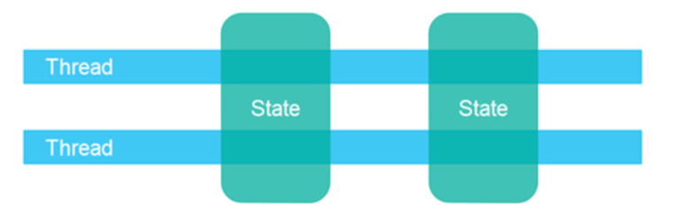
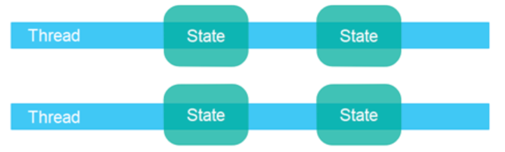
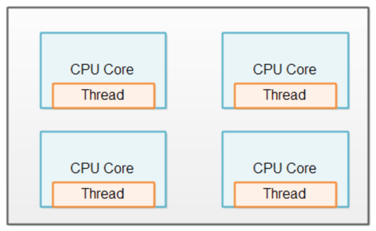
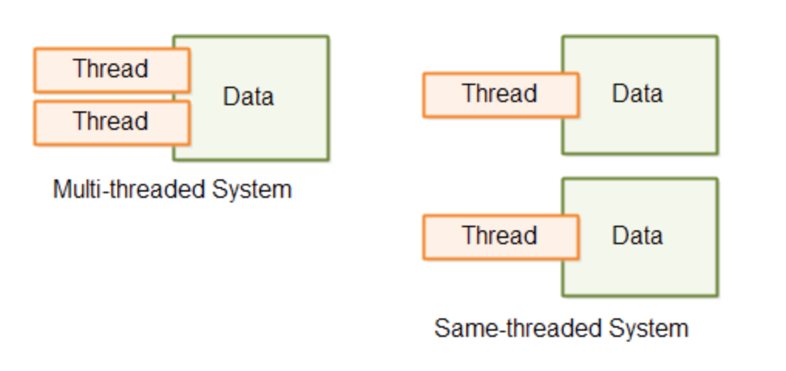

# Paylaşımlı Durum ve Ayrık Durum

Çok kanallı programlamanın en önemli noktasından biri de kullanılan kaynağın paylaşılıp paylaşılmadığıdır. Yani bazı modellerde iş parçacıkları ortak bir “state”’i (durum) kullanıyor olabilirler. Yani “state”’den kastımız ortak bir veri kaynağını kullanıyorlardır. Örneğin, aynı diziye eleman eklemeye çalışan birden fazla iş parçacığı olduğunu düşünün burada tümü ortak bir kaynağı, yani ortak bir “state”’i kullanıyorlardır.

Ya da bazı problemlerde birden fazla iş parçacı bağımsız olarak ayrı ayrı “state”2lerde çalışabilirler. Yan, iş parçacıkları işleyecekleri verileri alırlar ve iş parçacıkları arasında herhangi bir senkronizasyon gerekmeden çalışabilirler. Bu durumda aslında çok kanallı programlama yapmak daha performanslı olabilir. Ayrıca, senkronizasyon için ekstra bir çaba harcanmaz. 

Daha az sorun çıkar. Örneğin elimizde 100 bin elemanlık bir dizi olsun ve bu dizinin toplamını hesaplamak isteyelim. Bu durumda 100 binlik diziyi 10 parçaya ayırıp her veri parçasını bir iş parçacığının işlemesini sağlayabiliriz. Bu iş parçacıkları kendi veri kümesinin toplamanı bulur. Ardından 10 iş parçası işini bitirdiğinde 10 sonucu bir araya getirip toplama işlemini hızlandırmış oluruz.

**Her bir iş parçacığı için bir CPU**

Eğer birden fazla CPU içeren bir donanımınız varsa her CPU’ya bir iş parçacığı atanır. Bu durumla CPU’lar verimli bir şekilde kullanılır.

Yukarıdaki duruma ek olarak ortak paylaşılan herhangi bir kaynak (state) yoksa her CPU’ya atanan iş parçacığı birbirleri arasında senkronizasyona ihtiyaç duymazlar. Bu duruma “Same-Threaded System” denilmektedir. Eğer iş parçacıkları ortak paylaşımlı bir kaynak (state) kullanıyorsa bu durumda iş parçacıklarının bu ortak kaynaklara erişimi senkronize edilmelidir. Bu duruma “Multi-Threaded System” denilmektedir.

