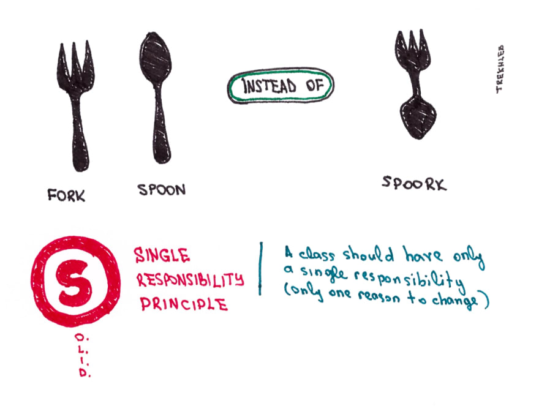
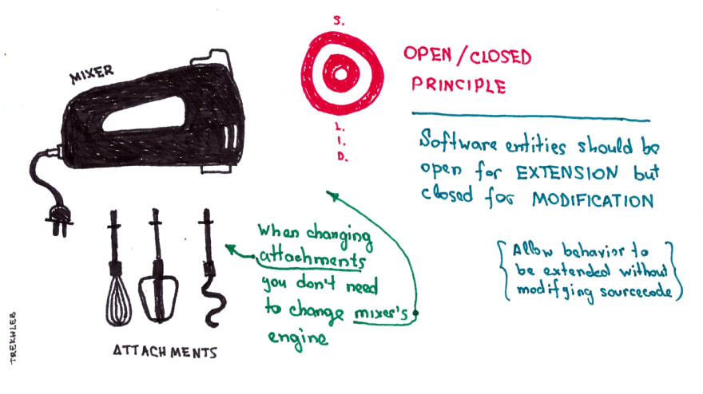
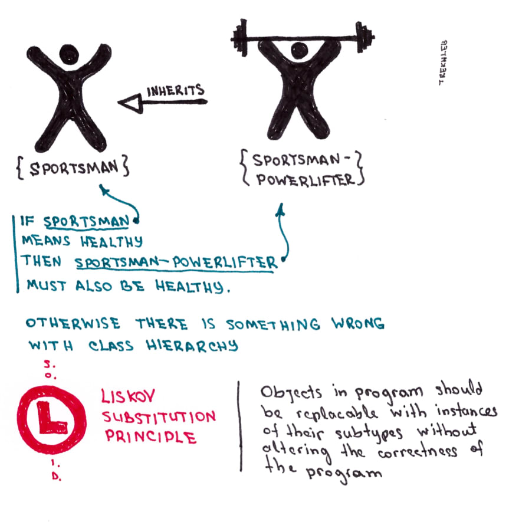
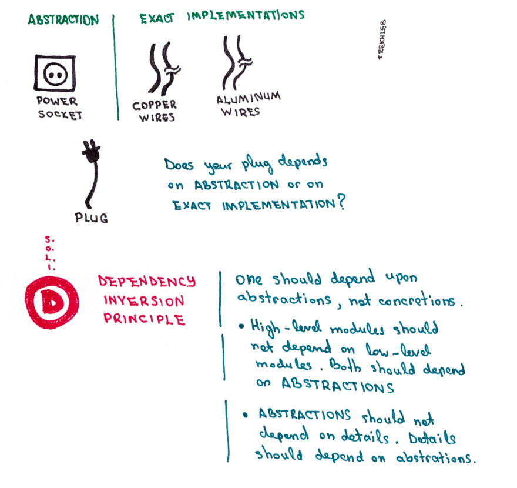

# SOLID Prensipler

Daha temiz, okunabilir, bakımı kolay ve esnek bir yapıya sahip kodlar yazabilmek için prensipler bütünüdür. Her prensibin özel bir ismi vardır. Böylece İngilizce isimlerin baş harflerin bir araya gelmesiyle SOLID olarak isimlendirilmiştir. Bu kavram ilk kez Robert C. Martin isimli yazılımcının “Design Principles and Design Patterns” isimli kitabında geçmiştir.

S: Single Responsibility Principle (Tek Sorumluluk)
O: Open/Closed Principle (Açık-Kapalı Olma Durumu)
L: Liskov Substitution Principle (Liskov Prensibi)
I: Interface Segregation Principle (Arayüzlerin Ayrılması Prensibi)
D: Dependency Inversion Principle (Bağımlılıkları Tersine Çevirme)

Şimdi her prensibi ayrı ayrı inceleyelim. Konu sonunda da hepsini içeren bir örnek uygulama yapmış olacağız.

## Single Responsibility Prensibi

Yazılımları oluştururken projeler büyüdüğünde karmaşıklık boyutu da artmaya başlar. Böyle durumlarda sınıfların dizaynında ve sınıfların bir araya getirdiği mimari boyutunda sorunlar ortaya çıkabilir. Proje büyüdükçe bazı sınıflar gereğinden fazla sorumluluğu fark etmeden üzerlerine çekmeye başlarlar. Bu tarz sınıflar “God Class” ismi verilir. Sorumluluğu dışında birçok iş yapıp birçok bağımlılığı bünyesinde barındırır.

Tasarladığımız sınıfların tek bir işi yerine getiriyor olması gerekir. Aynı şekilde mantıksal olarak birbirine yakın sınıflar bir araya gelmelidir. Inheritance (Kalıtım) veya Aggeration (Biraraya Getirme) gibi ilişki biçimleriyle sınıfları da organize etmeliyiz.

Bu prensip bizlere bir sınıfın ve bir fonksiyonun sadece bir görevi olduğunu söylemektedir. 

## Open/Closed Prensibi

Yazdığımız kodların birbirinden iyi izole olmuş olması gerekmektedir. Böylece, bakımı kolay programlar yazılabilir. Tasarladığımız sınıflarda kod değişikliği yapabilmek için gerçekten tek bir nedenimizin olması gerekmektedir. Bir üstte bahsettiğimiz Single Responsibility prensibi gereği her sınıf tek bir işi yapmakla yükümlü olmalıdır.

Diyelim ki yazılım üzerine yeni bir istek geldi. Eğer bu durumda hemen sınıf içinde birçok kod değişikliği yapmaya başlıyorsak, tasarladığımız sınıf Open/Closed prensibe uygun değildir. Bunun yerine ek bir özellik için sınıflarımız genişleyebilir olmalıdır. Sınıf içinde yapılan değişiklik bir başka sorunun (bug) ortaya çıkmasına sebep olabilir.

Örümcek ağı gibi birbirine bağlı karmaşık bir sınıf yapısı var ise bu değişiklik pahalıya patlayabilir. Bu nedenle sınıflarımız gelen değişim isteklerine kalıtım yoluyla başka sınıflar eklenebilir olma özelliğiyle cevap vermelidir. Yani, bir değişiklik olduğunda ilgili sınıfın kodlarını değiştirmek yerine, yeni özelliği ayrı bir sınıf şeklinde tasarlayıp kullanabilmek gerekmektedir. Bu birbirinden iyi izole olmuş sınıflar olmasını sağlayacaktır. Buna değişime kapalı, genişlemeye açık sınıflar diyoruz.

## Liskov Substitution Prensibi

SOLID prensipler içinde en muğlak kalan başlıklardan biridir. Özetle, kalıtım yoluyla birbiriyle ilişkisi olan A ve B sınıfımız olsun. A sınıfı ATA (üst) sınıf olsun. B ise A sınıfından türemiş alt sınıfımız olsun. B herhangi bir özellik kaybına veya değişime uğramadan A referansında kullanılabilmelidir. Yani, A  b = new B(); dediğimizde B’de fonksiyon kaybına veya bir bozulmaya sebep vermemeliyiz.

## Dependency Inversion Prensibi (Bağımlılığın tersine çevrilmesi)

Yazılımları gerçekleştirirken onlarca sınıf yazarız. Bu sınıflar bir diğerine mutlaka ihtiyaç duyar. Bu ihtiyaç sonucu bazı sınıfları diğer sınıfların özelliklerini “Aggregation” yoluyla veya “Inheritance” yoluyla bünyesine alır. İşte bu durumda diğer sınıfın özelliklerini kullanan sınıf ona karşı bir bağımlılığı oluşur. Sınıflar arası bağımlılığın olması çok normaldir. 

Fakat, bu sınıflar arası bağımlılığın nasıl düzgün yönetileceği önemli bir konudur. İşte bağımlılığı tersine çevirme de bu kolaylığı sağlayan prensiptir. Bir sınıf başka bir sınıfa ihtiyaç duyduğunda onun alt sınıflarından birine referans alıp sınıf içinde oluşturmak yerine, kalıtım aldığı ATA sınıf tipinde bir referans tutarak bu nesnenin dışarıdan gönderilmesini bekler. Bu bağımlılığı tersine çevirmek için önemli bir adımdır.

Burada amaç oluşan bağımlılığın referansının interface veya abstract class tipinde olmasıdır. Ayrıca diğer önemli nokta sınıf içinde “new” anahtar kelimesi ile bu interface veya abstract class’dan türeyen bir alt sınıfın yaratılmaması gerekmektedir.

