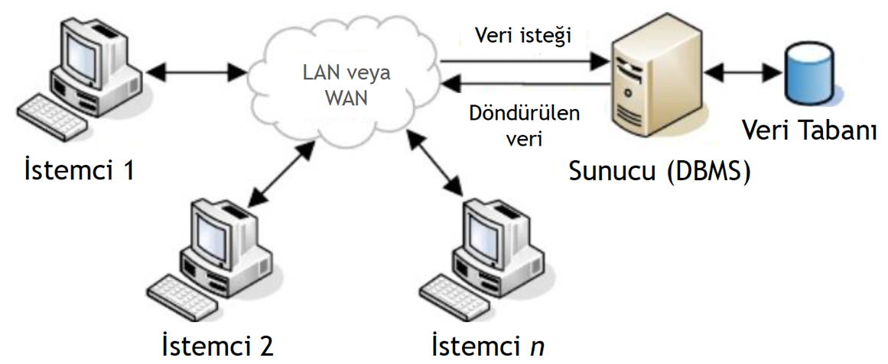
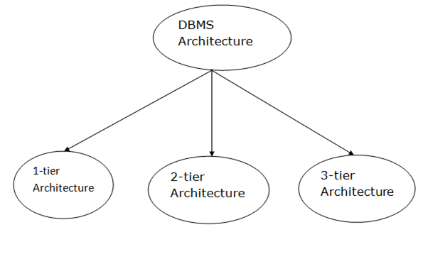
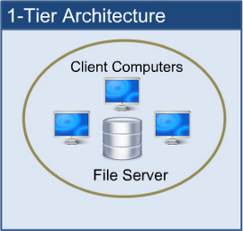
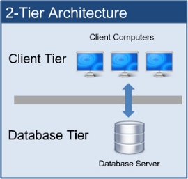
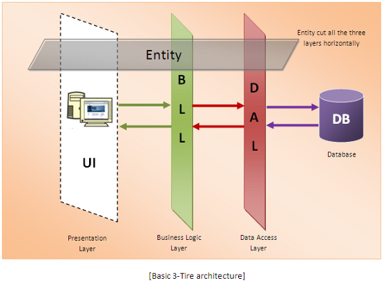
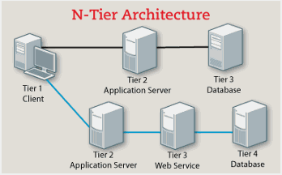
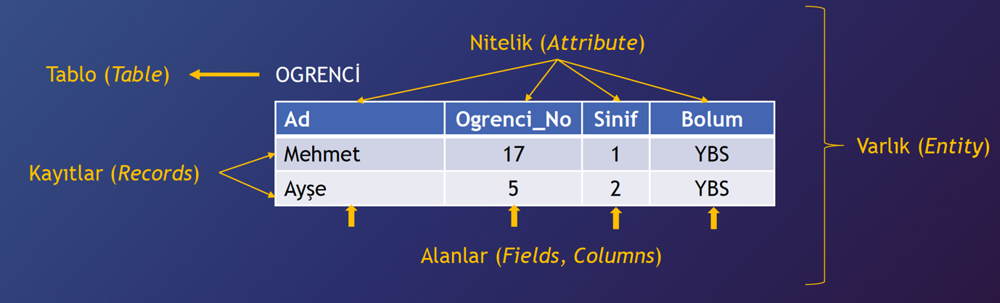

# Veri Tabanı Yönetim Sistemi Mimarisi

Modern veri tabanı yönetim sistemleri istemci-sunucu (Client-Server) mimarisine sahiptir. Bu nedenle MySQL kurulumu yaptığımızda aslında sunucu şeklinde isteklere cevap verebilen bir yazılım çözümünü ayağa kaldırmış oluruz. Kullanıcılar veya yazdığımız programlar veri tabanlarıyla ve onların içindeki tablolarla etkileşim kurmak istediğinde veri tabanı sunucu yazılımına istekler ulaşır. Sunucu yazılımı bu istekleri ilgili veri tabanında işletir ve sonuçları istemciye geri döner.

Aslında DBMS (Database Management Sytem) tasarımı mimariye bağlıdır. İstemci - Sunucu mimarisi, çok sayıda PC, web sunucusu, veri tabanı sunucusu ve ağlara bağlı diğer bileşenlerle başa çıkmak için kullanılabilir.  Bunu biraz daha açıklayalım.

DBMS package mimarisi, bir adet sıkıca birbirine entegre edilmiş tekil mimariden, client/server (istemci/sunucu) olarak tanımlayabileceğimiz modern DBMS package mimarisine doğru gelişmiştir. Artık büyük merkezi bir bilgisayar yerine yüzlercesine ayrılmış ve kişisel bilgisayarlar web server, database server, file server (dosya server), application server(uygulama server) gibi birçok bilgisayar ile iletişim halinde olmaya başlamışlardır. DBMS mimarisi 2 modüle dayanıyor diyebiliriz.

* Client Module : İş yerleri ve kişisel bilgisayarlar bu gruba girer. Yani uygulama ve ara yüzler üzerinden veri tabanına bağlananlardır. Client modülü kullanıcı etkileşimini elinde bulundurur ve GUI (Grafical User Interface) gibi kulanıcı dostu arayüz sağlar.
* Server Module : Veri saklama, ulaşım, arama ve diğer fonksiyonları sağlar.

Bir DBMS tasarımı mimarisine bağlıdır. Merkezi, merkezi olmayan ya da hiyerarşik bir yapıda olabilir. Örneğin, bir istemci sunucu mimarisinde, sunucu makinesindeki veri tabanı sistemleri, istemci makine tarafından yapılan istekleri çalıştırabilir.

## DBMS Mimari Türleri

DBMS mimarisi tek katmanlı veya çok katmanlı olarak görülebilir. Yukarıdaki resimde de görüldüğü gibi 3 farklı mimari gözükmektedir.

* ## 1 Katmanlı Mimari

  

   

  Tek katmanlı mimari, bir yazılım uygulaması veya teknolojisi için gerekli tüm bileşenlerin tek bir sunucu veya platforma yerleştirilmesini içerir. Buradan yapılan herhangi bir değişiklik doğrudan veri tabanının kendisinde yapılacaktır. Ağ bağlantısı gerektirmez. 1 Katmanlı mimari, veri tabanı ile doğrudan iletişim kurabildiği için yerel uygulama geliştirmede tercih edilir. Veri tabanı tasarımcıları ve programcıları normalde tek katmanlı mimari kullanmayı tercih ederler.

  Örneğin veri tabanımızda öğrenci kayıtları olduğunu düşünelim. Öğrenci kayıtlarını almak için istek yapıp ve kayıtların veri tabanından sizin tarafınızdan getirilecektir. Bu tür yapılar yerel veri tabanı sistemi olarak adlandırılır.

* ## 2 Katmanlı Mimari

  

  2 katmanlı mimari, istemci sunucu mimarisine dayanır. Doğrudan iletişim istemci ve sunucu arasında gerçekleşir. İstemci tarafındaki uygulamalar, sunucu  veri tabanı ile doğrudan iletişim kurabilir. Yani veri tabanı sistemi server da bulunur. İstemci SQL gibi bir sorgu dili kullanarak sunucuda bulunan veri tabanına erişimde bulunduğunda  sunucu isteği veri tabanında gerçekleştirir ve sonucu istemciye geri döndürür. Bu kısım için API'lar kullanılabilir. Örnek ODBC, JDBC gibi.

  - Kullanıcı ara yüzleri ve uygulama programları istemci tarafından çalıştırılır. 
  - Sunucu, sorgu işleme ve benzeri işlemleri sağlar.

  DBMS ile iletişim kurmak için, istemci uygulaması sunucu ile bağlantı kurar.
  
* ## 3 Katmanlı Mimari

  

  Kullanıcıların veri tabanında bulunan verileri nasıl kullandıklarına  bağlı olarak katmanlarını  birbirinden ayırır. Bir DBMS (Database Management System) tasarlamak için kullanılan en yaygın yöntemdir. İstemci sunucu arasında başka bir katman var. Bu  mimaride istemci sunucu ile doğrudan iletişim kuramaz. Yani istemci tarafındaki uygulama, veri tabanı ile daha fazla iletişim kuran uygulama sunucusu ile etkileşime girer. 

  **Veri Katmanı** : Sorgu işleme dilleri bulunur. Bu katmanda verileri ve kısıtlamalarını tanımlayan ilişkilerde vardır.

  **Uygulama Katmanı** :Uygulama sunucusu ve veri tabanına erişen program bulunur. Veri tabanının soyutlanmış  bir görünüm sağlar. Aslında son kullanıcılar, uygulama dışında veri tabanının varlığından habersizdir. Aynı şekilde veri tabanı katmanı uygulama katmanı dışındaki kullanıcının farkında değildir. Sonuç olarak, Uygulama katmanı ortada yer alır ve son kullanıcı ile veri tabanına aracı görevi görür.

  **Sunum Katmanı** : Son kullanıcılar bu katmanda çalışır. Veri tabanı varlığından haberdar değildir. Veri tabanının  birden fazla görünümü uygulama tarafından sağlanabilir. Aslında tüm görünümler, uygulama katmanında bulunan uygulamalar tarafından oluşturulur.

* ## n - Katmanlı Mimari

  

  Bu katmanlı mimari, uygulamanın 3 farklı katmana bölünmesini inceler. Logic tier, Presentation tier ve Data tier olarak ayrılır.Model-görünüm-denetleyici (MVC) çerçevesindeki öğelerin genellikle kavramsal veya mantıksal olarak ayrılmasının aksine, uygulamanın farklı bölümlerinin fiziksel olarak ayrılmasıdır. MVC çerçevesinden bir başka fark, n katmanlı katmanların doğrusal olarak bağlanmasıdır, yani tüm iletişim, mantık katmanı olan orta katmandan geçmelidir. MVC'de gerçek bir orta katman yoktur çünkü etkileşim üçgen şeklindedir; kontrol katmanının hem görünüm hem de model katmanlarına erişimi vardır ve model de görünüme erişir; controller ayrıca gereksinimlere göre bir model oluşturur ve bunu görünüme iter. 

Bu şekilde DBMS mimarilerini ve nasıl neden kullanıldıklarını öğrenmiş olduk.

## Veri Modeli

Veri tabanları verilerin tablolar halinde saklandığı alanlardı. Bu veriler kalıcı diskte (Hard-Disk) belli bir format biçiminde saklanır. Veri tabanı aşağıdaki 3 yapıdan oluşur. DBMS kullanarak her veri tabanında yer alacak veriler ve veriler arası ilişkiler oluşturulur. Mantıksal olarak alakalı veri modeline göre düzenlenir. Bu veri modeli kullanılarak da veri tabanının kavramsal ve dış şemaları oluşturulur.

* Entity (Varlık): Gerçek hayat nesnesini veya kavramını ifade eder. Örneğin, öğrenci, çalışan personel, adres, maaş gibi kavramlar veya nesneler varlıkları ifade eder. Varlıklar genelde veri tabanı dünyasında tablolar şeklinde ifade edilir.
* Nitelik (Attribute): Yukarıda bahsettiğimiz gerçek hayat varlığı veya kavramının niteliklerini ifade eder. Örneğin, öğrenciyi tanımlayan nitelikler numarası, bölümü, ismi, soy ismi gibi nitelikleridir. İşte bu nitelikler tablodaki sütunları ifade ederler. Her nitelik bir sütunu ifade edebilir.
* İlişki (Relationship): İki varlık arasındaki mantıksal bağlantıyı ifade eder. Örneğin Öğrenci ile Ders varlıkları arasında doğası gereği bir ilişki söz konusudur. Yahut, Personel ile Maaş arasında da benzer bir ilişki vardır. Varlıklar arasındaki ilişki veri tabanı dünyasında tablolar arasındaki ilişkiyi ifade eder.

En çok kullanılan veri modellerini 4 grupta inceleyebiliriz.

### İlişkisel Veri Modeli

1969 yılında çıkmış, 1970 li yılların sonunda kullanılmaya başlanmış ve1985 yılından sonra yaygınlaşmaya başlamıştır. 1990 lı yıllarda yaygın kullanılan veri tabanlarının çoğunun ilişkisel tabanlı olduğu söylenebilir. Varlıkların veri tabanı tarafında tabloları ifade ettiğinden bahsetmiştik. Ayrıca, bu varlıkların birçok niteliği bulunmaktaydı. Bu nitelikler tablolardaki sütunları ifade etmektedir. Bu birbiriyle ilişki niteliklerin bir araya gelmesiyle ilişki veri modeli ortaya çıkmaktadır.

Yukarıdaki örnekte “OGRENCI” isminde bir tablo oluşturulmuştur. “Ogrenci_No”, “Sinif” ve “Bolum” isminde nitelikler bir araya gelerek bu tablo yapısını meydana getirmiştir. Tablodaki her bir satır ise bir öğrenci kaydını ifade etmektedir. Yani bir gerçek hayat varlığının verileriyle birlikte tabloda yer almasını ifade eder.

### Nesneye Yönelik Veri Modeli (Object oriented Data Model) 

10 yıldan fazla süredir gündemde olan, günümüzde çok yaygın kullanılmasa da , kullanımı yaygınlaşan bir modeldir. Veriler nesne olarak modellenir. OOP de olan sınıf ve miras kavramlarına sahiptir. Karmaşık veriler üzerinde yüksek performans sunar. İlişkisel modelin  özelliklerini Nesne tabanlı özellikler ile birleştirir.

- Kullanıcı tanımlı veri türleri
- Kalıtım ve alt sınıflar
- Kullanıcı tanımlı fonksiyonlar

 ### Sıra düzensel Veri Modeli (Hierarchical Data Model)

En eski model olup 60 ve 70’li yıllarda çok kullanılmıştır. Ağaç veri yapısına benzer bir yapıdadır. Her kaydın bir parent ve child kayıtları vardır. Her kaydın birçok parent ve birçok child kaydı bulunabilir. Örnek veri tabanları , IDMS, RDM Embedded, RDM Server gibi.

### Ağ Veri Modeli (Network Data Model)  

1969’da ortaya çıkan Ağ Veri Modeli 1970’li yıllarda ve 1980’li yılların ilk yarısında kullanılmıştır.

! Günümüzde hem ilişkisel hem de nesneye-yönelik yaklaşımı birlikte kullanan VTYS’lerinin yaygınlaştığı görülmektedir (ORDBMS).

​		

> KAYNAKÇA
>
> [DBMS architecture](https://slideplayer.biz.tr/slide/10181951/)
>
> [DBMS Concepts and Architecture](https://medium.com/oceanize-geeks/concepts-of-database-architecture-dfdc558a93e4#:~:text=A%20database%20architect%20develops%20and,single%20tier%20or%20multi%2Dtier.)
>
> [DBMS-beginnersbook](https://beginnersbook.com/2018/11/dbms-architecture/)
>
> [DBMS architecture- tutorialspoint](https://beginnersbook.com/2018/11/dbms-architecture/)
>
> [DBMS architecture - javaTpoint](https://www.javatpoint.com/dbms-architecture#:~:text=The%20DBMS%20design%20depends%20upon,are%20connected%20via%20the%20network.)
>
> [DBMS architecture - medium](https://medium.com/kodcular/katmanl%C4%B1-mimari-9fb34ef8c376)
>
> [DBMS Varlık Model](https://ozlemerden.wordpress.com/2012/02/09/veri-modelleri/#:~:text=Bir%20VTYS'yi%20kullanarak%20olu%C5%9Fturulacak,kavramsal%20ve%20d%C4%B1%C5%9F%20%C5%9Femalar%C4%B1%20olu%C5%9Fturulur.&text=Bug%C3%BCne%20kadar%20geli%C5%9Ftirilmi%C5%9F%20olan%20%C3%A7ok%20say%C4%B1da%20veri%20modeli%20vard%C4%B1r.)
>
> 