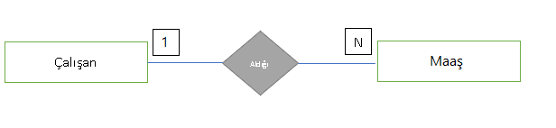
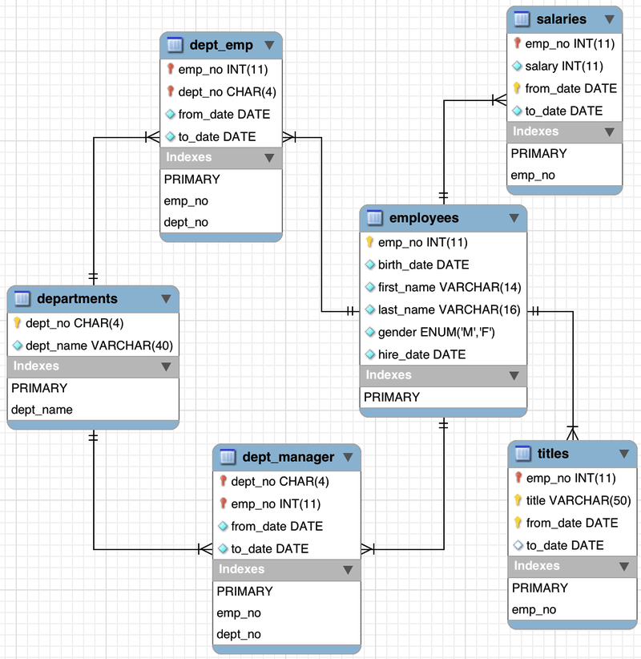

# İlişki Türleri

## Bire Bir İlişki

1-1’e ilişki biçimi bir tablodaki kayıt ile ilişki kurulan diğer tabloda sadece bir kayıt ile eşleşir. Örnek olarak Çalışan tablosunda bir personelin sadece bir tane giriş kartı olabilir. Aynı şekilde Giriş Kartı tablosunda bir giriş kartına ait kayıt sadece bir kişiye ait olabilir. Çalışan ile Giriş Kartı arasında bire bir ilişki vardır. İlişkiyi yönetecek tablo ilişki kurulacak tablonun primary key değerini foreign key olarak tutar.

## Bire Çok İlişki

Bir tablodaki kayıt diğer tablodaki bir veya birden fazla kayıt ile eşleşebilir. Örneğin, çalışan personel ile maaş varlıkları arasında bire çok ilişki biçimi vardır. Çünkü, bir çalışanın birden fazla maaş kaydı olabilir. Fakat, bir maaş kaydı sadece bir çalışana aittir. İlişkiyi yönetecek tablo ilişki kurulacak tablonun primary key değerini foreign key olarak tutar.

## Çoktan Çoğa İlişki

Bir tablodaki bir kayıt diğer tablodaki bir veya birden çok kayıt ile eşleşebilir. Aynı şekilde diğer tablodaki tek bir kayıt ilişkili olduğu tabloda bir veya birden çok kayıtla eşleşebilir. Örneğin Çalışan tablosundaki bir personelin birden çok unvanı olabilir. Aynı şekilde Unvan tablosundaki bir görev tanımı birden fazla çalışanda olabilir. Yani bir çalışan hem Yazılım Mühendisi unvanına hem de Takım Lideri unvanına sahip olabilir. Aynı şekilde Yazılım Mühendisi unvanı birden fazla çalışana ait olabilir. Bu ilişki biçiminde mutlaka ara bir tablo oluşur. Bu ara tabloda her iki tablodaki primary key değerleri foreign key olarak tutulur.

## Normalizasyon

Veritabanı dünyasında bir varlığı temsil bir tablo oluşturduğumuzda onunla ilişkili nitelikleri de aynı tabloda sütun olarak açıyorduk. Fakat, o varlıkla ilgili tüm nitelikleri veya alanları aynı tabloya doldurup tek bir tabloda yüksek sayıda sütunlardan oluşan geniş bir tablo yapısı kurmak çok sağlıklı değildir. Bunun büyük zararı her kayıt eklendikçe gereksiz veri tekrarları yaşanmasına sebep olacaktır. Örneğin Çalışan verilerini bir tabloda sütunlarla temsil ettik diyelim. İsim, soy isim, doğum tarihi vb sütunlar açtık. Ardından, çalışana ait adres verilerini tutmak gerektiğinde gidip bu nitelikleri Çalışan tablosunda birer sütun olarak açarsak veri tekrarına sebep oluruz. Çünkü, çalışanın birden fazla adresi olabilir. Her yeni adres kaydı eklendiğinde bütünüyle yeni bir satır eklenir. Bu durumda çalışanın isim, soy isim ve doğum tarihi gibi verileri sürekli tekrar eder. Böylece, veri tabanının veri tutma kapasitesini doğru kullanmamış oluruz. 

İşte bu sebeple bir tablodaki çok fazla sütun ve satırdan oluşan tabloyu tekrarlardan arındırmak için alt kümelerden oluşan yeni tablolar oluşturup bu varlıklar arası ilişki kurabiliriz. Bu alt kümelere, yani alt tablolara ayırma işlemine normalizasyon denir.

### Normalizasyon amaçları

\- Veri tekrarını önlemek

\- Performans ve veri tutma kapasitesini verimli kullanmak

\- Veri tutarlılığını arttırmak

**Çalışan Veri Tabanı Örneği**

Örneklerimizi gerçekleştirmek için MySQL’in sağladığı örnek bir veri tabanı şeması üzerinden gideceğiz. Bu veri tabanında çalışan verileri, çalışan maaşları, çalışanların unvanları, departman verileri gibi tablolar yer alacaktır. Bu tablolar arasında Bire-Çok (1-N), Çoğa-Çok (N-N) gibi ilişki biçimleri vardır. N-N ilişkilerde mutlaka ara bir tablo oluşur.

Ayrıca, Primary Key ve Foreign Key ile ilişkiler kurulmuştur. Örnek şemayı aşağıda veriyoruz.

“employees” tablosu çalışan verilerini depolar. “titles” tablosu çalışana ait unvanları depolar. Bir çalışanın birden fazla unvanı olabilir. Çalışan ile ünvan tablosu arasında bire çok ilişki vardır. “salaries” tablosu çalışana ait maaşları depolar. Yine bir çalışanın her yıl için bir maaş tutarı vardır. Bu durumda çalışan ile maaş kayıtları arasında bire çok ilişki vardır. “departments” tablosu şirkette bulunan departmanları depolar. Çalışan geçmişte birden fazla departmanda çalışmış olabilir veya halen aynı departmanda çalışmaya devam ediyor olabilir. Bu durumda “departments” tablosu ile “employees” arasında çoğa-çok bir ilişki vardır. O nedenle “dept_emp” tablosu bu çoğa çok ilişkideki kayıtları tutar, bu tablo çalışan ve departman tablolarındaki primary key değerlerini tutar. Aynı şekilde bir çalışan departman yönetici konumunda olabilir. Hatta, geçmişte birden çok departmanda yöneticilik de yapmış olabilir. Bu nedenle yine “departments” tablosu ile “employees” tablosu arasında çoğa-çok bir ilişki vardır. Bu çoğa çok ilişki sonucunda bir ara tablo ihtiyacı doğar. “dept_manager” tablosunda çalışanların hangi departmanlarda veya departmanda görev aldıklarının kayıtları vardır, çalışan ve departman tablosundaki primary key değerlerini tutar.

**Sorular**

1- Bir tablodaki bir sütuna ait verilerin başka bir tablonun sütunundan getirilmesini sağlayan anahtar aşağıdakilerden hangisidir?

A.Birincil Anahtar

B.Yabancı Anahtar

C.Sütunlar

D.Unique Kısıtlaması

E.Unique kısıtlaması

Cevap: B

**Kaynakça**

> [Kaynak 1](http://auzefkitap.istanbul.edu.tr/kitap/cografi_bilgi_sistemleri_onlisans_ue/veritabanlarina_giris.pdf)