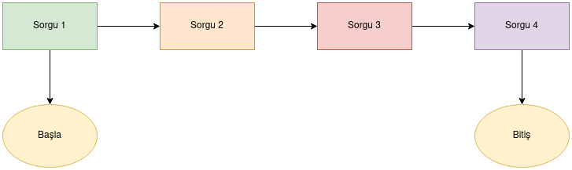
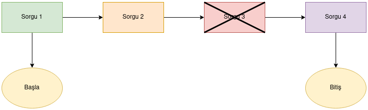

# JDBC ile Transaction Yönetimi

Yazdığımız uygulamalar bazen bir işlem çağrısıyla bir ya da birden fazla tabloda işlem yapabilir,
bir ya da birden fazla sorguyu ardışık olarak çalıştırmayı gerektirebilmektedir. Bu durumlarda ardışık işlemler gerçekleşirken
sürecin bir noktasında bir sorgu hata verebilir. Bu durumlarda süreçteki diğer işlemleri de geri almak isteyebiliriz. Bu durumlarda
tablolara gitmek ve yaptığımız işlemlerin tersini yapmak bir hayli zor ve karmaşık olacaktır.

Bunu bir diagram ile açıklamak istersek



 şeklinde bir işlemimiz olsun. Yani kullanıcı bir butona basacak ve bu işlemler ardışık olarak gerçekleşecek.



Diagramda görüldüğü gibi **Sorgu 3**'te bir nedenden dolayı bir hata gerçekleşti. Bu durumda verilerin bütünlüğünü ve doğruluğunu
sağlamamız için işlemi geri almamız gerekir. Bunu yapmak için de JDBC bize bazı fonksiyonlar sağlamaktadır.

Veri tabanlarında eğer, bir veri tabanı Transaction’ı başarılı ise “commit” edilir, değilse “rollback” edilir. “commit” 
edildiğinde değişiklikle kalıcı olarak veri tabanına gönderilir. “rollback” yapılırsa ise o ana kadar yapılmış 
olan tüm değişiklikler geri alınır.

```java
try {
  
  Class.forName(jdbcDriver);
  dbConnection = DriverManager.getConnection(dbHost, userName, password);
  dbConnection.setAutoCommit(false);
  
  PreparedStatement preparedStatement = 
      dbConnection.prepareStatement("INSERT INTO employees_auto_inc (emp_no, first_name, last_name, gender, birth_date, hire_date) VALUES(?,?,?,?,?,?)");
  
  preparedStatement.setLong(1, 0);
  preparedStatement.setString(2, "Ayşe");
  preparedStatement.setString(3, "Kalem");
  preparedStatement.setString(4, "F");
  preparedStatement.setDate(5, new java.sql.Date(new Date().getTime()));
  preparedStatement.setDate(6, new java.sql.Date(new Date().getTime()));
  
  int insertedRowCount = preparedStatement.executeUpdate();
  
  System.out.println(insertedRowCount + " record inserted!");
  
  /* Sembolik olarak hata oluşturuyoruz. Hata oluşunca kayıt veritabanına yansımıyor.
   * Çünkü, Transaction'da hata oluşursa rollback ediyoruz.
  if(insertedRowCount == 1) {
    throw new RuntimeException("Waowww SQL Exception!");
  }
  */
  
  dbConnection.commit();
  
}
catch (Exception e) {
  
  e.printStackTrace();
  
  try {
    // Hata olursa rollback edip tüm değişiklikleri geri alıyoruz.
    dbConnection.rollback();
    
  } catch (SQLException e1) {
    e1.printStackTrace();
  }
}

```

“JDBC” veri tabanı bağlantılarında Transaction’lar otomatik olarak commit edilir. “setAutoCommit” fonksiyonu ile otomatik commit işlemi kapatılabilir. Böylece, Transaction yönetimini yazılımcının üstlenmesi gerekmektedir.

 

Yukarıdaki örnekte false yaparak Transaction yönetimini üzerimize aldık. “commit()” fonksiyonunu çağırarak değişiklikleri kalıcı olarak gönderebiliriz.

 

Sembolik olarak bir if bloğu içine hata fırlatan bir kod ekledik. O hata fırlatan kısmı açtığımızda veri tabanına bir kayıt eklemek komutu işletmiş olsa bile hata alındığından “rollback” fonksiyonu çağırıyoruz. Böylece, o ana kadar yapılmış olan değişikliklerin geri alınmasını sağlıyoruz.


## Sorular
**Soru 1** JDBC' de connection otomatik olarak yapılan işlemleri kaydetmesini sağlayan
özelliği devre dışı bırakıldığında yapılan işlemin kaydedilmesini ve tablolarda uygulanmasını
hangi fonksiyon ile sağlarız?

A) accept()

B) acceptAll()

C) apply()

**D) commit()**

E) make()

-----

**Soru 2** JDBC' de connection'nın yapılan işlemlerin otomatik olarak kaydetmesini
ve tablolara uygulanmasını kontrol eden özellik hangisidir?

A) autoAccept

B) acceptMod

**C) autoCommit**

D) applyMod

E) makeMod


## Kaynak:

* [Konu derlemesi](https://medium.com/s%C4%B1f%C4%B1rdan-i%CC%87leri-d%C3%BCzeye-java-e%C4%9Fitim-serisi/jdbc-ile-veritaban%C4%B1-i%CC%87%C5%9Flemleri-e7348de4c88c)