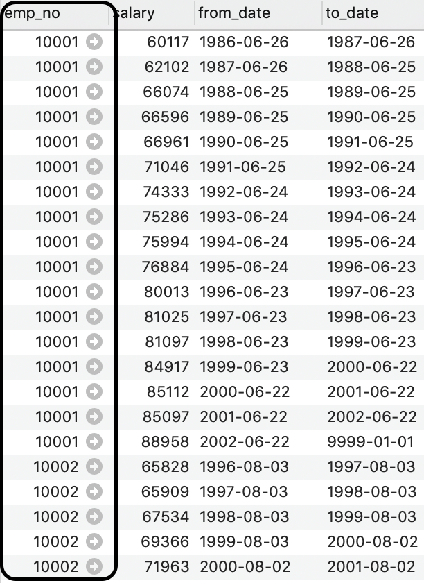
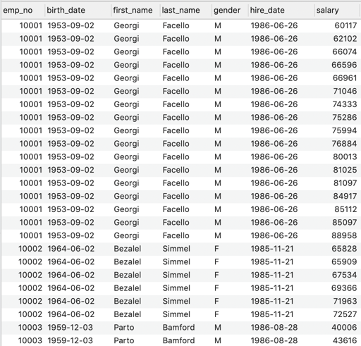
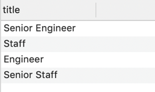

# Temel SQL

SQL programlama dilinin ilişkisel veri tabanı yönetim sistemlerinde veya ilişkisel formattaki veri tabanlarında veri sorgulama dili olduğundan bahsetmiştik. Şimdi bu sorgulama diliyle yapılabilecekleri yukarıdaki veri tabanını örnek alarak inceleyelim.

## DDL SQL Komutları (Data Definition Language)

DDL komutları veri tabanı ve tablolar üzerinde yapısal değişiklikler yapmayı sağlar.

### Veri tabanı oluşturmak

```
CREATE DATABASE mycompany_db;
```

CREATE DATABASE SQL komutu ile yeni bir veri tabanı yaratabilirsiniz.

**Veri tabanını seçmek**

```
USE mycompany_db;
```

USE komutu ile çalışmak istediğiniz veri tabanını seçebiliyorsunuz. Biliyorsunuz ki veri tabanı yönetim sistemleri birden fazla veri tabanı içerebilirler. Hangi SQL komutlarının hangi veri tabanında çalıştırılacağı USE komutu ile belirtilir.

**Tablo oluşturmak**

Veri tabanını oluşturduktan sonra veri tabanı içinde birden fazla tablo oluşturabiliriz.

```
CREATE TABLE employees (
    emp_no      INT             NOT NULL,
    birth_date  DATE            NOT NULL,
    first_name  VARCHAR(14)     NOT NULL,
    last_name   VARCHAR(16)     NOT NULL,
    gender      ENUM ('M','F')  NOT NULL,    
    hire_date   DATE            NOT NULL,
    PRIMARY KEY (emp_no) );
```

Yukarıda CREATE TABLE komutu ile yeni bir tablo oluşturuyoruz. Bu komuttan hemen sonra tablo isminin ne olacağını yazıyoruz. Biz “employees” isminde bir tablo oluşturduk. Tabloyu oluştururken bu ilişkisel veri formatında hangi sütunlar yer alacak onları belirtiyoruz. Bu sütunlar hatırlayacaksanız ki varlığın nitelikleriydi.

Bu niteliklere sütun isimleri ve veri tipinin ne olacağını veriyoruz. Bu konuda veri tipleri detaylı işlenmeyecektir. İlgili veri tipleri veri tabanı yönetim sistemlerinin resmi dokümanlarında bulabilirsiniz. Sütunların isimlerini ve veri tiplerini girdikten sonra artık tabloda hangi sütunun Primary Key olacağını belirtmek gerekiyor.

Bunun için “PRIMARY KEY” komutu kullanılır. Bu komuttan hemen sonra () parantezler içinde tekil anahtar olarak kullanmak istediğiniz sütunun ismini yazarsınız.  Bu örnekte “emp_no” sütunu “employees” tablosunun. PRIMARY KEY’i olacaktır.

Foreign Key ile İlişkili tablolar yaratmak

Foreign Key (Yabancı Anahtar) hatırlayacağınız üzere bir tablo ile diğeri arasında ilişki kurmayı sağlıyordu.

```
CREATE TABLE salaries (
    emp_no      INT             NOT NULL,
    salary      INT             NOT NULL,
    from_date   DATE            NOT NULL,
    to_date     DATE            NOT NULL,
    FOREIGN KEY (emp_no) REFERENCES employees (emp_no) ON DELETE CASCADE,
    PRIMARY KEY (emp_no, from_date)
);
```

Yukarıda “salaries” isminde bir tablo oluşturuyoruz. Yukarıda tablo oluşturmak için bahsettiğimiz her şey burada da geçerlidir. Fakat, bu SQL komutunda bir fark bulunmaktadır. “salaries” tablosu ile “employees” tablosu arasında bire-çok ilişki bulunmaktadır. FOREIGN KEY komutu ile iki tablo arasında bir ilişki kuruyoruz. 

Bu komuttan hemen sonra () parantezler arasında “salaries” tablosunda hangi sütunun FOREIGN KEY verisini tutacağını belirtiyoruz. Böylece, “employees” tablosunda hangi çalışan ise onun tekil verisi bu sütunda tutulacaktır. Ardından REFERENCES komutu ile hangi tablo ile ilişki kurmak istiyorsak onun ismini yazıyoruz. 

Bu örnekte “employees” tablosu ile ilişki kuracağımız için onun ismini yazdık. İlişki kurulacak tabloyu belirledikten sonra () içine bu tablonun hangi sütununu kullanacağımızı belirtiyoruz. Genellikle ilişki kurulan tablonun PRIMARY KEY sütunu burada belirtilir. Bizim örneğimizde “employees” tablosu olduğu için onun “emp_no” isimli PRIMARY KEY sütunuyla ilişki kuruyoruz.



Yukarıda “salaries” tablosuna ait kayıtlar görülmektedir. Tablodaki “emp_no” sütunundaki veriler ilişki kurduğumuz “employees” tablosunun PRIMARY KEY alanından gelmektedir. Böylece, her çalışana ait ne kadar maaş kaydı var bulmak çok kolay oluyor.

### Veri tabanı silmek

```
DROP DATABASE mycompany_db;
```

DROP DATABASE komutundan sonra silinmesini istediğimiz veri tabanı ismini veririz. Böylece veri tabanı silinmiş olur.

### Tablo silmek

```
DROP TABLE salaries;
```

**DROP TABLE** komutundan sonra tümüyle silinmesini istediğimiz tablonun ismini yazıyoruz. Tablo yapısal olarak içindeki verilerle birlikte silinir.

Tablo verilerini tümüyle silmek

```
TRUNCATE TABLE salaries;
```

TRUNCATE TABLE komutu ile tabloyu yapısal olarak koruyarak sadece içindeki verilerin silinmesini sağlayabiliriz.

### Tabloyu yapısal olarak değiştirmek

Tablolar üzerinde bazen yeni sütun eklemek çıkarmak veya değiştirmek gerekir. Bu yapısal anlamda tabloyu değiştirmek demektir.

Tabloya yeni bir sütun eklemek

```
ALTER TABLE salaries
ADD COLUMN yeni_sutun VARCHAR(10); 
```

“salaries” tablosuna “yeni_sutun” isminde bir alan eklemek istediğimizi düşünelim. Bu durumda ALTER TABLE komutundan sonra değişiklik yapılacak tablonun ismi verilir. ADD COLUMN komutundan sonra yeni sütunun ismi verilir. Yeni sütunu tanımlarken veri tipinin ne olacağı da mutlaka belirtilmelidir. Bu örnekte maksimum 10 karakter uzunluğunda yazı tabanlı bir veri tutacağımızı söylüyoruz.

### Tablodan bir sütunu silmek

```
ALTER TABLE salaries
DROP COLUMN yeni_sutun;
```

DROP COLUMN komutu ile silmek istediğimiz sütunu tablodan çıkarabiliriz.

### Tablonun bir sütununu değiştirmek

```
ALTER TABLE salaries
MODIFY yeni_sutun INT(10);
```

Tabloda bir sütunun veri tipini veya ismini değiştirmek isteyebiliriz. Sütun üzerinde değişiklik yapabilmek için MODIFY komutu kullanılabilir.

### DML SQL Komutları (Data Manipulation Language)

DML komutları ile tablolardaki veriler üzerinde sorgulama, değiştirme ve silme işlemleri uygulayabiliriz.

### Tablodan veri çekmek

```
select * from employees;
```

SELECT komutu ile tablodan veri çekeceğimizi belirtiyoruz. FROM kelimesi ile hangi tablodan bu verinin alınacağını belirtiyoruz. * işareti tabloda ne kadar sütun varsa hepsini sorgu ve getir demektir.

```
select * from employees where emp_no = 10004;
```

yukarıdaki örnekte ise koşullu bir sorgulama işlemi yapıyoruz. WHERE komutundan sonra sorgunun koşulunu oluşturuyoruz. WHERE’den sonra birden fazla sorgulama koşulu verebilirsiniz. Bu örnekte “emp_no” sütununda verisi “10004” olan kayıtları getirmişiz.

```
select * from salaries where emp_no = 10001 and salary >= 80000;
```

Yukarıdaki örneğimizde WHERE ifadesinden sonra birden fazla koşulu bir arada kullanmışız. İki koşulu birbirine AND ifadesi ile bağlamışız. AND ifadesi ve bağlacı anlamındadır. Java’daki && operandı gibi işlevi vardır. Örneğin burada 10001 nolu kaydın 80000’den büyük olan maaş bilgilerini “salaries” tablosundan getiriyoruz.

Çoklu tabloları bir araya getirerek sorgulamak

Veri tabanı tablolarını bir araya getirip sorgulama yapabiliriz.

```
select emp.*, s.salary from employees emp 
inner join salaries s on s.emp_no = emp.emp_no
where emp.emp_no = 10004;
```

Bu örneğimizde INNER JOIN birleştirme işlemini göreceğiz. INNER JOIN bir araya getirilen tablolardaki kayıtları bire bir eşleştirerek getirir. Eğer bire bir eşleşmiyorsa o kayıt sorgu sonucunda gelmez. INNER JOIN ifadesinden sonra bir arada kullanmak istediğimiz tablo ismini vermektir. Ardından bu tabloların hangi sütunları üzerinden bağlantı kurulması gerektiği belirtilmelidir. Bunun için ON ifadesinden sonra “salaries” tablosundaki “emp_no” sütunu ile “employees” tablosundaki “emp_no” sütununu kıyaslıyoruz. Her iki sütunda birbirine eşit olan kayıtları JOIN’lenmiş biçimde adeta tek bir tabloymuş gibi sorgu sonucunda bir araya getiriyoruz.



```
select emp.*, dm.* from employees emp 
left join dept_manager dm on dm.emp_no = emp.emp_no;
```

Yukarıdaki komutta ise yine bir araya getirme örneği inceliyoruz. Fakat, LEFT JOIN ile tabloları birleştirmek INNER JOIN’e göre farklıdır. INNER JOIN’de bire bir eşleşen kayıtları bir araya getirip tek bir tablo gibi sunmaktadır. LEFT JOIN’de ise sol tarafta kalan “employees” tablosunda kayıt olmasına rağmen eğer ki sağdaki “dept_manager” tablosunda eşleşen bir kayıt yoksa da sorgu sonucunda “employees”’e ait kayıt getirilir. “dept_manager” tablosunda eşleşmeyen kısımlar ise NULL olarak getirilir.


```
select emp.*, dm.* from dept_manager dm 
right join employees emp on dm.emp_no = emp.emp_no;
```

RIGHT JOIN ise LEFT JOIN ile aynı sadece yönü tersidir. Yukarıdaki ile aynı sonucu verir. RIGHT ve LEFT JOIN sorgular mülakatlarda gelebilir. İyi kavramakta fayda vardır.

Mesela LEFT JOIN’in anlamlı bir şekilde kullanıldığı bir örnek verelim. Diyelim ki, şu anda aktif olarak yönetici olan çalışan kişileri bulmak istediğimizde LEFT JOIN işimize yarayacaktır. “employees” tablosunu, “dept_manager” tablosunu ve “departments” tablosunu bir araya getirip 3 tabloyu tek bir tablo olarak LEFT JOIN ile bir araya getirdik. Daha sonra “dept_manager” tablosundaki “to_date” sütunu bugünden büyük olan çalışanlar halen aktif olarak yöneticilik yapıyor demektir. 

```
-- şuan aktif olarak yönetici olan personel
select emp.*, dm.*, dp.* from employees emp 
left join dept_manager dm on dm.emp_no = emp.emp_no
left join departments dp on dp.dept_no = dm.dept_no
where dm.to_date >= NOW();
```

Tekrarlı verileri yalnızca bir kayıt olacak şekilde sorgulamak.

```
select distinct title from titles
```

DISTINCT anahtar kelimesi ile belirtilen sütunda tekrarlı geçen her ifade bir kayıt şeklinde gösterilir.



Metin içinde belirtilen ifade ile sorgulama yapabilmek

```
select * from titles where title like '%Senior%';
```

LIKE komutu ile metin tabanlı sütunlarda aramak istenilen ifade koşul olarak verilebiliyor. Yukarıdaki örnekte “titles” tablosundaki “title” isimli sütunundaki verilerde “Senior” kelimesi geçen kayıtları arıyoruz. % işareti aradığımız ifadenin önüne gelirse, ki burada “Senior” ifadesinin önündedir, aradığımız ifadeden önce hangi karakterlerin olduğunu dikkate almıyoruz. % karakteri ile joker karakter gibi ifadenin önünde veya sonunda ne olduğundan bağımsız şekilde veri içinde “Senior” ifadesinin geçip geçmediğini soruyoruz.

### Değer aralığında sorgulama yapmak

```
select * from salaries where salary between 80000 and 100000;
```

BETWEEN komutu ile belli bir aralık içinde olan kayıtları bulmaya çalışıyoruz. Bu örnekte maaşı 80000 ile 100000 arasında kalan kayıtları sorgulamış olduk.

**Sonuçları sıralama**

```
select * from dept_emp order by from_date desc;
```

ORDER BY ifadesi ile gelen sorgu sonucunu büyükten küçüğe veya küçükten büyüğe doğru sıralayabiliriz. DESC ifadesi ile sorgu sonucunu büyükten küçüğe doğru sıralayacağımızı söylüyoruz. ASC ifadesi ile ise küçükten büyüğe doğru sıralayacaktık.

Yukarıdaki sorguda departmanda işe başlayanları günümüze en yakın tarihten en eskiye doğru sıralamış oluyoruz.

```
select * from dept_emp order by from_date asc;
```

ASC komutu ile aynı şekilde bu sefer de en eski tarihten günümüze doğru sıralamış oluyoruz.

**Temel fonksiyonlar**

```
select count(*) from employees where gender = 'M';
select count(*) from employees where gender = 'F';
```

Yukarıdaki örnekte COUNT fonksiyonu ile tablodaki kadın ve erkek çalışan sayılarını bulabiliyoruz. COUNT fonksiyonu ile tabloda istenilen arama koşulunu sağlayan kaç kayıt olduğunu bulabiliyoruz.

```
select avg(salary) from salaries;
```

AVG fonksiyonu ile tablodaki ilgili sütunun ortalamasını alabiliyoruz. Örneğimizde “salaries” tablosundaki tüm kayıtların maaş ortalamasını bulmuş oluyoruz.

```
select sum(salary) from salaries;
```

SUM fonksiyonu ile tablodaki ilgili sütunun toplam değerini bulabiliyoruz. Örneğimizde “salaries” tablosundaki tüm maaş toplamını bulmuş oluyoruz.

Veri üzerinde değişiklik yapabileceğimiz SQL komutları

Tablodaki veri üzerinde değiştirme, silme veya tabloya yeni bir satır kayıt eklemeyi sağlayan komutları inceleyeceğiz. Yine sıkça kullanacağımız INSERT, UPDATE, DELETE gibi komutlar olacaktır.

Tabloya yeni kayıtlar eklemek

```
insert into employees 
  (emp_no, birth_date, first_name, last_name, gender, hire_date)
values 
  (10004, '1954-05-01', 'Chirstian', 'Koblick', 'M', '1986-12-01');
```

**INSERT INTO** komutundan sonra bir tablo ismi verip yeni bir kayıt ekleme yapılabilir. Tablo isminden sonra tablonun sütunları tek tek yazılır ve ardından bu sütunlara karşılık gelecek olan veri değerleri VALUES ifadesinden sonra sırayla yazılır.

Tablodaki kayıtları güncellemek

```
update employees set first_name = "Alex" where emp_no = 10004 limit 1;
```

UPDATE SET komutu ile tablodaki kayıtları güncelleyebiliriz. UPDATE ifadesinden hemen sonra güncelleme yapılacak tablo ismi verilir. Ardından SET ifadesi getirilir ve güncellemesi istenilen sütun ismi yazılıp karşısına değeri yazılır. WHERE ifadesinden sonra hangi kayıtların güncelleneceğine dair koşul ifadesi yazılır. Mesela örneğimizde emp_no sütunundaki değeri 10004 olan kayıtları güncellemişiz.

### Tablodaki kayıtları silmek

```
delete from employees where emp_no = 10004;
```

DELETE FROM ifadesinden hemen sonra kayıt silme işlemi yapılacak olan tablonun ismi verilir. Ardından WHERE koşuluna hangi kayıtların silineceği belirtilir.
