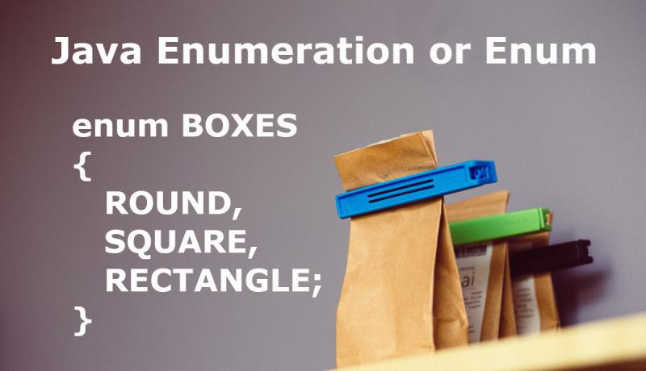

# Enumeration veya Enum Nedir?



Elimizde küme oluşturabileceğimiz veriler ve bu kümeye ait verileri projenin çeşitli yerlerinde kullanmaya ihtiyacımız olduğunu düşünelim.Bu verilere ihtiyaç duyduğumuzda sürekli bir dizi oluşturup bu kümeye ait verileri o dizide tutmamız gerekecek ve bu işi her o verilere ihtiyaç duyduğumuzda tekrar etmiş olacağız.Burada bu tekrarı yapmamak ve işimizi kolaylaştırmak için Enumere-tionları kullanabiliriz.Örnek üzerinden gidecek olursak,projenin farklı yerlerinde ay bilgilerine ihtiyaç duyduğumuzu varsayalım.           Eğer Enumaration kullanmadan ay bilgilerini kullanmak istersek bir dizi içerisine ay bilgilerini ekleyip kullanabiliriz. Aşağıda örneğimize ait kodda bir Arraylist oluşturduk ve listeye ay bilgilerini ekledik.

```java
ArrayList<String> aylar = new ArrayList<>();

        aylar.add("");
        aylar.add("OCAK");
        aylar.add("ŞUBAT");
        aylar.add("MART");
        aylar.add("NİSAN");
        aylar.add("MAYIS");
        aylar.add("HAZİRAN");
        aylar.add("TEMMUZ");
        aylar.add("AGUSTOS");
        aylar.add("EKIM");
        aylar.add("KASIM");
        aylar.add("ARALIK");
        
        System.out.println(aylar.get(1));

Output:OCAK
```

Şimdi bu örneği Enum yapısı kullanarak inceleyelim.

```java
public enum Aylar {
    OCAK,
    SUBAT,
    MART,
    NİSAN,
    MAYIS,
    HAZİRAN,
    TEMMUZ,
    AGUSTOS,
    EYLUL,
    EKIM,
    KASIM,
    ARALIK
}

public static void main(String[] args) {
        Aylar ay = Aylar.OCAK;

        System.out.println(ay);
}

Output:OCAK
```

Görüldüğü üzere herhangi bir dizi tanımlamadan sadece Class tanımlar gibi Enum tanımladık ve ay isimlerini yazdık.Artık ihtiyaç duyulan bir noktada bu yapı kullanılarak ay bilgilerine erişim sağlayabileceğiz.Genel kullanım yöntemi bu şekilde diyebiliriz.Şimdi ise Enum yapısına ait kurallara bakalım;

- Enumlarda tür güvenliği (type safety) mevcuttur. Yani bir enum referensına sadece o türden bir enum sabiti atayabilirsiniz.
- Enumlar if/else ve switch içerisinde kullanılabilirler, == operatörü ile karşılaştırılabilirler
- Derleyici tarafından eklenen `values()` metodunu kullanarak bir Enum türü içerisindeki bütün sabitleri alabiliriz.
- `new` operatörü kullanılarak nesneleri yaratılamaz. Yapıcı metotları private olmak zorundadır.
- İçerisinde yapıcı metotlar, alanlar ve yardımcı metotlar tanımlanabilir.
- `java.lang.Enum` sınıfını otomatik olarak kalıttıkları için başka sınıfı kalıtamazlar. Ancak başka arayüzleri uygulayabilirler.
- Enum sabitleri otomatik olarak static ve final tanımlanırlar, yaratıldıktan sonra değiştirilemezler.
- Enum türleri bir sınıfın içinde veya dışında yaratılabilirler.

### Collections Kütüphanesine ait enumeration() Methodu

Enumeration arayüzü ile veri kümesindeki nesneler üzerinde tek tek gezme işlemi yapılabilir. Enumeration’lar bir veri listesi üzerine kurulur. Enumeration nesnesi bir gezgin gibi veri kümesindeki elemanları tek tek dolaşırken indeks numarasına gerek duymaz. Veri kümesi üzerinde döngü kurulmasını sağlar.

Enumeration’ların yerini Iterator interface’i almıştır. Yeni yazılan Java projelerinin Iterator interface’den türemiş nesneleri kullanması istenir. Enumeration geriye dönük uyumluluk nedeniyle kaldırılmamıştır.

Enumeration interface’in `hasMoreElements()` ve `nextElement()` isimli iki soyut metodu vardır. Bunlardan ilki Enumeration nesnesinin o anda bulunduğu konumdan sonra veri kümesinde başka eleman olup olmadığını belirtir. İkinci fonksiyon ise nesnenin bulunduğu konumdan bir sonraki elemana gitmesini sağlar.

```java
List<ElectricCar> electricalCars = new ArrayList<ElectricCar>();
electricalCars.add(new ElectricCar("BMW", "34 AL 377", 100));
electricalCars.add(new ElectricCar("Mercedes", "35 Aa 547", 200));
electricalCars.add(new ElectricCar("BMW", "45 AB 547", 200));
 
Enumeration<ElectricCar> enumerationObject = Collections.enumeration(electricalCars);
 
while(enumerationObject.hasMoreElements()) 
{       
        ElectricCar electricCar = enumerationObject.nextElement();
        electricCar.showInfo();
}
 
Vector<ElectricCar> electricCarVector = new Vector<ElectricCar>();
electricCarVector.add(new ElectricCar("BMW", "34 AL 377", 100));
electricCarVector.add(new ElectricCar("Mercedes", "35 Aa 547", 200));
electricCarVector.add(new ElectricCar("BMW", "45 AB 547", 200));
 
// Vector veri yapısında "elements" isimli fonksiyon Enumeration tipinde bir nesneyi oluşturup döndürür.
Enumeration<ElectricCar> enumerationObject1 = electricCarVector.elements();
 
// Ya da Collections sınıfı içindeki static "enumeration" fonksiyonu ile Enumeration nesnesi oluşturabiliriz.
Enumeration<ElectricCar> enumerationObject2 = Collections.enumeration(electricCarVector);
 
 
while(enumerationObject1.hasMoreElements()) 
{       
        ElectricCar electricCar = enumerationObject1.nextElement();
        electricCar.showInfo();
}
```

Yukarıdaki örnekte bir veri kümesinden Enumeration oluşturup while döngüsünde kullanımı gösterilmiştir. Buradaki veri kümemiz liste tipinde elektrikli araçlar listesidir. Bu araç listesini tek tek dolaşacak bir Enumeration nesnesi oluşturuyoruz. Bunu yaparken Collections isimli sınıfın `enumeration()` isimli statik fonksiyonunu kullanıyoruz. Bu fonksiyona elimizdeki veri kümesini girdi olarak gönderiyoruz. "enumeration" fonksiyonu da bu veri kümesi üzerinde dolaşabileceğimiz bir enumeration nesnesi döndürüyor.

### Kaynaklar

- [https://www.geeksforgeeks.org/collections-enumeration-method-in-java-with-examples/](https://www.geeksforgeeks.org/collections-enumeration-method-in-java-with-examples/)
- [https://koraypeker.com/2018/12/01/enumeration-nedir/](https://koraypeker.com/2018/12/01/enumeration-nedir/)
- [https://www.injavawetrust.com/tag/enum-nedir/](https://www.injavawetrust.com/tag/enum-nedir/)
- [https://www.seckintozlu.com/1361-javada-enum-turleri.html](https://www.seckintozlu.com/1361-javada-enum-turleri.html)
