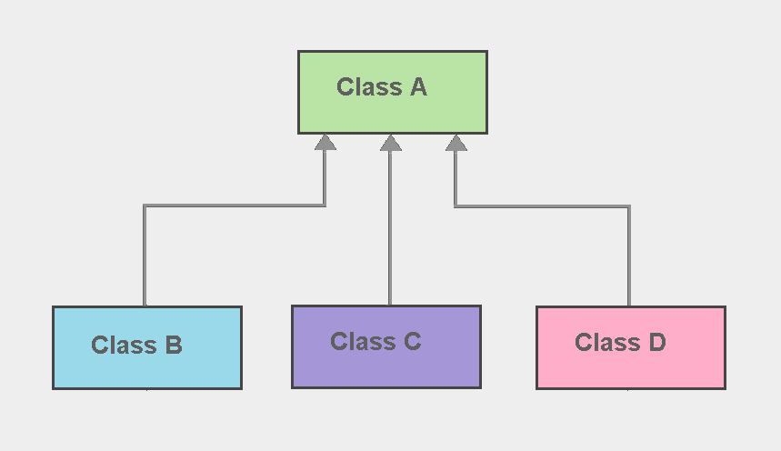

# Hiyerarşik Kalıtım (Hierarchical Inheritance)

Java’da nesne yönelimli programlamayı oluşturan 4 önemli unsurdan bir tanesi Inheritance kavramıdır. Inheritance, sınıflar arasında kalıtımı mümkün kılarak, bir sınıf özelliklerinin başka bir sınıf içerisinde kullanılabilmesine olanak sağlamaktadır. Bu sayede classlar arasında ortak kullanıma sahip kod parçacıklarının birden fazla yazılması engellenmiş olur. Ayrıca kodun tekrar kullanılabilirliğini sağlayarak performansı artırdığı ve kolay okunabilir bir program yapısı sağladığından dolayı Inheritance kavramı oldukça önemli bir konudur.

Inheritance birçok farklı tipte uygulanabilmektedir. Bunlardan başlıcaları şunlardır; Single Inheritance, Multilevel Inheritance, Multiple Inheritance ve Hierarchical Inheritance. Java programlama dilinde single, multilevel ve hierarchical inheritance uygulanabilirken multiple inheritance yapısı doğrudan uygulanamamaktadır. Bu yazıda sizlere Java’nın kullanmamıza imkan sağladığı Inheritance tiplerinden olan **Hierarchical Inheritance** yapısından bahsedeceğim.

Hiyerarşik kalıtım, bir superclassın birden fazla subclassa sahip olduğu ve her subclassın ise sadece bir tane superclassa sahip olduğu bir kalıtım çeşididir.



Yukarıdaki akış şemasında da görüldüğü üzere, class A ‘dan B, C ve D isminde 3 farklı sınıf türetilmiştir. Ve bu türetilen sınıflar yalnızca bir superclass üzerinden miras alabilmektedir. Bu durumda class A superclass, B,C ve D classları ise subclassdır. 

Hierarchical Inheritance sözdizimi aşağıdaki gibidir:

```java
class A {

public static void methodA() {
                   ………………
}}

class B extends A  {

public static void methodB() {
                   ………………
}}

class C extends A  {

public static void methodC() {
                   ………………
}}

class MainClass {

public static void methodB() {
                    ………………
}

public static void main (String [] args) {
 
B objectB = new B();
C objectC = new C();

objectB.methodA();
objectC.methodA();

}}
```

Kalıtım hiyerarşisinde, subclasslar üzerinde yeni özellikler ve metotlar tanımlanabilirken ayrıca superclasstan kalıtım yoluyla alınan özellikler ve metotlar yeniden tanımlanarak da kullanılabilmektedir. Bu yönteme Overriding denilmektedir. Yani bir üst classtan gelen özelliklerin geçersiz kılınarak, yeniden implemente edilmesi olayıdır.

Hiyerarşik Kalıtım örnek uygulamalar ile daha da anlaşılır hale gelecektir. Örneğin; aşağıdaki modelde bir tane ata sınıfımız ve bu sınıftan kalıtım alan iki tane alt sınıfımız bulunmaktadır. OTVTax, KDVTax subclassları Tax sınıfından kalıtım yoluyla eriştikleri calculate metotunu yeniden implemente ederek Tax sınıfını override etmişlerdir. Bu model hiyerarşik kalıtımın basit bir örneğidir.


```java
public class Tax {
	public double calculate(double value) {
		return value + value * 0.1;
	}
}

public class OTVTax extends Tax {
	@Override
	public double calculate(double value) {
		return value + value * 0.2;
	}
}

public class KDVTax extends Tax{
	@Override
	public double calculate(double value) {
		return value + value * 0.3;
	}
}
```


Aşağıdaki bir diğer örneğimizi inceleyecek olursak; görüldüğü üzere subclass olan Cat, Dog ve Bird sınıfları "extend" anahtar sözcüğü ve main class içerisinde oluşturulmuş olan objeler aracılığı ile Animal superclass'ından miras almıştır. Ata sınıf olan Animal sınıfı birden fazla alt sınıfa özelliklerini aktarabiliyorken, alt sınıflar yalnızca bir üst sınıfın özelliklerini miras alabilmektedir. 


```java
class Animal
{
   public void methodAnimal()
   {
      System.out.println("method of Class Animal");
   }
}
class Cat extends Animal
{
   public void methodD()
   {
      System.out.println("method of Class Cat");
   }
}
class Dog extends Animal
{
  public void methodB()
  {
     System.out.println("method of Class Dog");
  }
}
class Bird extends Animal
{
  public void methodC()
  {
     System.out.println("method of Class Bird");
  }
}
class InheritanceExample
{
  public static void main(String args[])
  {
     Cat c = new Cat();
     Dog d = new Dog();
     Bird b = new Bird();
     
     c.methodA();
     d.methodA();
     b.methodA();
  }
}
```

**Output:**

method of Class Animal

method of Class Animal

method of Class Animal
