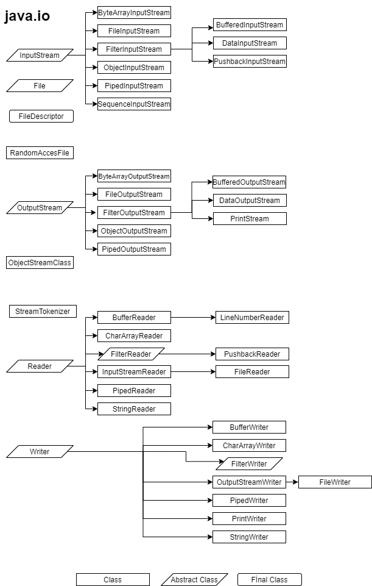

# Girdi Çıktı (Input / Output) Sınıfları

Bütün programcıların başlangıçta öğrendiği gibi, birçok program dışarıda bulunan verilere erişmeden görevini yapamaz. Çoğu zaman programımızın ürettiği veya kullandığı verileri dış bir kaynaktan almak veya dış bir kaynağa vermek zorunda kalırız. Dış kaynaklardan gelen veriye **girdi** (input), dış kaynaklara yollanan veriye **çıktı** (output) denir.

Girdi/Çıktı (I/O) işlemlerine örnek olarak bir dosyadan veri okumak veya bir dosyaya veri yazmak verilebilir. Bu örneğimizde dış kaynak dosyadır. Aynı şekilde, ağ üzerinden gelen veriyi okumak veya ağ üzerinden veri aktarmak da bir girdi/çıktı işlemidir. Bir sunucuyla iletişime geçmek de girdi/çıktı işlemlerine örnek olarak gösterilebilir.

Java’da bu tarz işlemleri gerçekleştirebilmek için girdi/çıktı sınıflarını kullanırız. Bu sınıflar java.io paketi altında bulunur. Yukarıda birkaç örneğini verdiğimiz dış kaynaklar fiziksel olarak farklı olsalar da tek bir kavram altında ifade edilebilir. Bu soyut kavrama **akış** (**stream**) deriz. Bir girdi/çıktı akışı, veri üreten veya tüketen mantıksal bir birim ifade eder. Dolayısıyla, girdi/çıktı sınıfları akışlar üzerinde işlem yapmamızı sağlar. Java’nın sağladığı bu soyutlama sayesinde, fiziksel olarak farklı olsalar da bütün girdi/çıktı aygıtları üzerinde aynı şekilde işlem yapabiliriz.

Şimdi **java.io** paketi altındaki en çok kullanılan girdi/çıktı sınıflarını inceleyelim. Bu pakette 16 interface , 50 class ve 16 exceptions vardır.

Java'da *byte* ve *character* stream'lerini yapan sınıflar ve metotlar **4** ana soyut sınıftan elde edilir.

1. InputStream
2. OutputStream
3. Reader
4. Writer

## Kaynak: 
- http://web.deu.edu.tr/doc/oreily/java/javanut/ch24_js.htm
