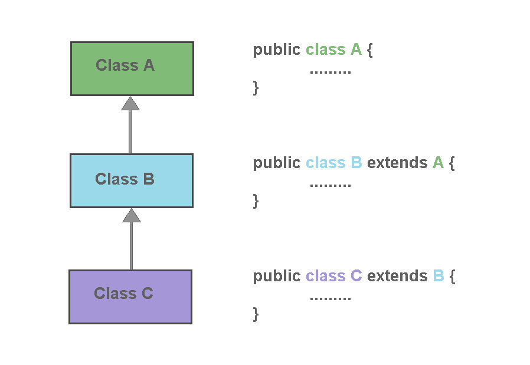

# Çok Katmanlı Kalıtım (Multilevel Inheritance)


Merhaba arkadaşlar,

Bu yazımızda Multilevel Inheritance kavramına giriş yapmadan önce kısaca Inheritance nedir ne amaçla kullanılır buna değinmek istiyorum. 

Bir sınıfın başka bir sınıftan miras almasına Inheritance(kalıtım) denilmektedir. Bir sınıf başka bir sınıftan miras alarak, o sınıfın değişkenleri ve metotlarını kullanabilme özelliğini kazanmış olmaktadır. Diğer bir deyişle, bir sınıftaki özellikler kalıtım sayesinde başka bir sınıfa aktarılarak kullanılabilmektedir. Java terminolojisinde, miras alan alt sınıfa subclass, miras veren üst sınıfa ise superclass denilmektedir. Java ’da Inheritance olayı extend anahtar sözcüğü ile gerçekleştirilmektedir. 

Sınıflar arası Inheritance kullanmak, kod parçacıklarının tekrar tekrar yazılmasını önler ve bu sayede performans ve zaman tasarrufu sağlanmış olur.

Şimdi gelelim **Multilevel Inheritance** kavramına… Bir sınıf miras alıyorken aynı zamanda miras veriyorsa burada çok katmanlı kalıtım vardır demektir. Bu mimaride, bir superclass sınıfının özellikleri kullanılarak subclass türetilirken, türetilmiş olan subclasstan da yeni bir subclass türetilebilmektedir. Bu durumda superclasstaki özellikler son katmanda bulunan subclassa aktarılmış olur. 





Yukarıda bulunan akış şemasında görüldüğü gibi; C sınıfı B sınıfından miras alırken, B sınıfı ise A sınıfından miras almaktadır. Bu durumda B sınıfı C sınıfı için bir superclass, A sınıfı için ise bir subclass durumundadır. B sınıfının A sınıfından miras olarak aldığı özellikler, C sınıfına miras olarak aktarılabilmektedir. 

----------------------------------------------


Aşağıdaki örnekte &quot;ElectricCar&quot; sınıfı &quot;Car&quot; sınıfından kalıtım alıyor. Ardından, &quot;Car&quot; sınıfı da &quot;Vehicle&quot; sınıfından kalıtım alıyor. Böylece dikey yönde çok katmanlı bir hiyerarşik kalıtım modeli oluşuyor.

````java
public class Vehicle {

	// Vehicle sınıfına ait kodlar
}

// "Car" sınıfı extends anahtar kelimesi ile "Vehicle" sınıfından kalıtım alıyor.
// Car sınıfı Vehicle sınıfa ait metotları ve değişkenleri kendi bünyesine almış oluyor.
public class Car extends Vehicle {

	// Car sınıfına ait kodlar
}

// "ElectricCar" sınıfı extends anahtar kelimesi ile "Car" sınıfından kalıtım alıyor.
// ElectricCar sınıfı Crr sınıfa ait metotları ve değişkenleri kendi bünyesine almış oluyor. 
// Fakat aynı zamanda Car sınıfı Vehicle sınıfı ile ilgili özelliklere sahip olduğundan ElectricCar sınıfı da dolaylı yoldan Vehicle sınıfından kalıtım almış oluyor.
public class ElectricCar extends Car {

	// ElectricCar sınfına ait kodlar
}
````


