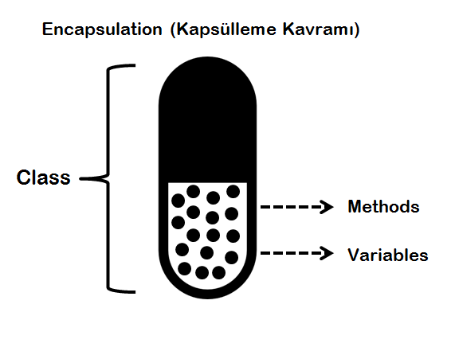

# Kapsülleme Kavramı (Encapsulation)



Yazılımdaki nesneler gerçek dünyadaki nesnelere benzer yapıdadır. Her nesnenin durumu ve bazı davranışları vardır. Nesnenin durumu sahip olduğu verilerin değerleri ile temsil edilir. Örneğin bir araba nesnesi söz konusu ise arabanın sahibi, plakası, markası, o andaki hızı vb bilgiler nesnenin durumunu gösterir ve bu veriler nesnede tanımlı olan değişkenlerde saklanır. Sınıfların, değişkenlerin ve fonksiyonların bir araya gelmesinden oluştuğunu önceden belirtmiştik. Nesneler ise tanımlanan sınıflardan oluşturulur. Nesneye ait işlevler ise araba sınıfı içindeki fonksiyonlar (metotları) ifade eder. Örneğin arabanın motorunun çalışması, arabanın konum bilgisini bildirmesi, frenleme yapabilmesi, vites değiştirmesi bunlar da araba nesnesine ait fonksiyonlardır.

Nesne, kendi durumunu gösteren verilerini ve bazı davranışlarını diğer nesnelerden gizlemelidir. Kapsülleme yöntemi özellikle nesnenin durumunu ifade eden değişkenlerdeki verilerin dışarıdaki nesneler tarafından direkt olarak değiştirilmesini kısıtlamayı ifade eder. Yani Java'da Kapsülleme, kodu ve verileri tek bir birimde bir araya getirme işlemidir. Tıpkı resimde gösterildiği gibi, birkaç ilacın karıştırıldığı bir kapsüle benzer. 

Bu nedenle nesnenin durum verisini değiştirme yetkisi sadece nesnenin kendisine ait olmalıdır. Yani sınıfa ait olan değişkenlerin türü private olmalıdır. Nesnenin durumu ifade eden değişkenlerin sakladığı veriler değiştirilmek istenirse sadece nesnede tanımlı olan fonksiyonlar vasıtasıyla değiştirilmelidir. Bahsedilen bu fonksiyonlar ise getter ve setter metotlarıdır. Örneğin arabanın vites bilgisini arttırmak veya azaltmak işini sınıf içinde tanımladığımız fonksiyonlar vasıtasıyla yapmamız gerekir. Bu bir bakıma veri gizlemesidir (data-hiding). 

Yani bir kapsüllemeden bahsediyorsak, şu şartları sağlamalıdır;

1.  Bir sınıfın değişkenleri private olmalı. 
2.  Değişkenlerin o sınıf dışında başka bir yerden değiştirilmek ya da çekilmek istenirse getter ve setter metotları kullanılmalı.

Peki bahsedilen private nedir? Bunun için Access Modifiers(Erişim belirleyiciler) kavramı bilinmelidir. Erişim belirleyiciler bize farklı seviyelerde kod erişimi imkanı sunar ve bunların 4 çeşidi vardır. Bunlar da şu şekilde özetlenebilir;

**Public:** Aynı sınıfta olmasına bakmaksızın her yerden erişim imkanı sunan erişim belirleyici türüdür. Kapsüllemeyi anlamak için bununla ilgili küçük bir örnek yapalım;

```java
public class RunEncapsulation{
public static void main(String[] args) {
    EncapsulationDemo encapsulationDemo = new EncapsulationDemo();
    encapsulationDemo.name = "kodluyoruz";
    encapsulationDemo.age = 4;
  }
}
class EncapsulationDemo {
  public String name;
  public int age;
}
```

Örnekte de görüldüğü gibi, EncapsulationDemo sınıfı içerisindeki değişkenleri public yaptığımızda kontrol dışı kalmıştır, yani EncapsulationDemo sınıfından objeler üreten tüm sınıflar bu değişkenleri istedikleri gibi kontrolsüz bir şekilde değiştirebilme imkanları vardır. Bu da kodlarımızın güvenliği için istenilmeyen bir durumdur. Bu nedenle kapsülleme yöntemini kullanırız. 

**Protected:** Kendini extends edenlere, yani subclasslarına ve aynı paket içerisindeki diğer kodlara erişim imkanı sunar. 

**Default:** Sadece aynı paket içerisinde bulunan sınıf ve metotlar tarafından erişilme imkanı vardır. 

**Private:** Sınıfa özeldir, başka bir sınıftan ya da paketten erişilemez bu nedenle kapsülleme yönteminde değişkenler için kullanılan erişim belirleyicisidir. Yukarıdaki kod örneğini bu sefer private ile şu şekilde yapalım;

```java
public class RunEncapsulation{
public static void main(String[] args) {
    EncapsulationDemo encap = new EncapsulationDemo();
    //encap.name = "kodluyoruz" -> Hata
    encap.setName("kodluyoruz");
    encap.setAge(4);
    System.out.println("name: "+encap.getName()+ "age: "+encap.getAge());
  }
}
class EncapsulationDemo {
  private String name;
  private int age;
    public void setName(String name){
        this.name = name;
    }
    public String getName(){
        return name;
    }
    public void setAge(int age){
        this.age = age;
    }
    public int getAge(){
        return age;
    }
}
```

Bu sefer önceki gibi EncapsulationDemo'dan çekilen veriler direkt olarak değiştirilemez, compile time'da hata alırız. Bunun yerine veriyi güncellemek veya değiştirmek için setter(write only) metodunu, veriyi çekmek için de getter(read only) metodunu kullanırız. Böylece her istenildiği zaman veri değiştirilmez, verinin güvenliği sağlanmış olur. 

Bunu daha detaylı ve gerçek hayata daha uygun bir örnekle açıklayalım. Yine "Engine" tipinde bir sınıf tanımlayıp bir kapsülleme örneği yapalım. Engine sınıfı Car sınıfı içinde "Aggregation" ilişkisi ile yer alan bir nesnedir. Arabanın motorunu temsil eder.

Özet bir örnek:

```java
public class Engine {

	private float temperature;

	private short activePistonCount;

	private boolean status = false;

	public Engine() {
		this.temperature = 0.0f;
		this.activePistonCount = 0;
	}

	// motor çalışmaya başladıktan sonra derecesi 5 derece artmaktadır.
	// "temperature" değişkeninde motorun sıcaklık bilgisi tutulmaktadır.
	// Bu da nesnenin durumunu ifade eder. Bu durum değişikliğini bir fonksiyon yardımıyla yapıyoruz.
	// Engine tipindeki nesnenin sıcaklık bilgisi direkt olarak değiştirilemez. Bu kapsüllemeye iyi bir örnektir.
	public void start() {
		
		// motorun çalışma durumunu saklayan değişkeni true'ya çekip motorun çalışmaya başladığını belirtiyoruz.
		this.status = true;
		this.activePistonCount = 4;
		this.temperature += 5;
	}

	// Aynı şekilde moturu durdurma işini de bir fonksiyon yardımıyla yapıyoruz. 
	// Bu değişkenler üzerindeki veri değişimini fonksiyonlar ile yönetiyoruz.
	public void stop() {
		this.status = false;
	}

	// Motorun sıcaklığını azaltmak için soğutma ünitesinden faydalanıyoruz.
	// Böylece yine sıcaklık bilgisini direkt erişime açmadan dışarıdan bir fonksiyon yardımıyla değiştirilmesini sağlamış oluyoruz.
	// İşte bu da bir kapsülleme örneğidir.
	public void freezeTemperature(float freezeValue) {
		
		this.temperature -= freezeValue;
	}

	// Nesne üzerindeki private değişkenlerdeki değerleri dışarıdan okuyabilmek için yine fonksiyonlardan faydalanıyoruz.
	// Veri okuma işini de kapsülleme prensibine uygun şekilde yapmış oluyoruz.
	public boolean getStatus() {
		return this.status;
	}

	public int getActivePistonCount() {
		return this.activePistonCount;
	}

	public float getTemperature() {
		return this.temperature;
	}
}
```

Daha detaylı bir örnek :

```java
package main.encapsulation.sample;

public class Engine {

	private float temperature;

	private short activePistonCount;

	private boolean status = false;

	public Engine() {
		this.temperature = 0.0f;
		this.activePistonCount = 0;
	}

	// motor çalışmaya başladıktan sonra her 2.5 saniyede sıcaklık derecesi 5 derece artmaktadır.
	// "temperature" değişkeninde motorun sıcaklık bilgisi tutulmaktadır.
	// Bu da nesnenin durumunu ifade eder. Bu durum değişikliğini bir fonksiyon yardımıyla yapıyoruz.
	// Engine tipindeki nesnenin sıcaklık bilgisi direkt olarak değiştirilemez. Bu kapsüllemeye iyi bir örnektir.
	public void start() {

		// motorun çalışma durumunu saklayan değişkeni true'ya çekip motorun çalışmaya başladığını belirtiyoruz.
		this.status = true;
		this.activePistonCount = 4;

		// Ayrı bir thread içinde yapıyoruz.
		Thread thread = new Thread(new Runnable() {

			@Override
			public void run() {
				while(status) {
					temperature += 55;

					// her 25 saniyede bir motorun sıcaklık derecesi 5 derece artıyor.
					try {
						Thread.sleep(2500);
					} 
					catch (InterruptedException e) {
						e.printStackTrace();
					}
				}
			}
		});

		thread.start();
	}

	// Aynı şekilde motoru durdurma işini de bir fonksiyon yardımıyla yapıyoruz. 
	// Bu değişkenler üzerindeki veri değişimini fonksiyonlar ile yönetiyoruz.
	public void stop() {
		this.status = false;
	}

	// Motorun sıcaklığını azaltmak için soğutma ünitesinden faydalanıyoruz.
	// Böylece yine sıcaklık bilgisini direkt erişime açmadan dışarıdan bir fonksiyon yardımıyla değiştirilmesini sağlamış oluyoruz.
	// İşte bu da bir kapsülleme örneğidir.
	public void freezeTemperature(float freezeValue) {
		
		this.temperature -= freezeValue;
	}

	// Nesne üzerindeki private değişkenlerdeki değerleri dışarıdan okuyabilmek için yine fonksiyonlardan faydalanıyoruz.
	// Veri okuma işini de kapsülleme prensibine uygun şekilde yapmış oluyoruz.
	public boolean getStatus() {
		return this.status;
	}

	public int getActivePistonCount() {
		return this.activePistonCount;
	}

	public float getTemperature() {
		return this.temperature;
	}
}
```

"Car" sınıfının durumunu yine fonksiyon yardımıyla değiştiriyoruz. "start" fonksiyonu ile motoru çalıştırıyoruz. Böylece nesnemizin durumu değişmiş oluyor. Fakat, bunu kapsülleme yöntemiyle  yapıyoruz. Böylece, değişkenin değerini direkt olarak dışarıdan değiştirilemez kılıyoruz.

Dışarıdan biri nesnenin durumunu değiştirmek istiyorsa yazılımcının tanımladığı bu fonksiyonlar vasıtasıyla durum değişimini yapmalıdır. İşte bu yönteme biz kapsülleme diyoruz.

Tüm bunları özetlemek ve kapsüllemenin avantajlarını sıralamamız gerekirse eğer, şunları söyleyebiliriz;

1. Esnek programlama sağlar. Değişkenleri salt okunur(read only) olmasını veya salt yazılır olmasını istiyorsak buna göre getter ve setter metotlarını düzenleyebiliriz. Yani uygulanan kodu, diğer kodları bozmadan değiştirme imkanı sağlar. Kodun yeni gereksinimlerle değiştirilmesi kolaydır. 
2. Bize hem veri gizliliği hem de veri üzerinde kontrolü sağlar. 
3. Reusability, yani yeniden kullanılabilirliği sağlar. Kodu yeniden kullanabilir ve yeni gereksinimlerini uygulayabiliriz.
4. Standart IDE'lerdeki araçlar getter ve setter metotlarını biz yazmadan üretmeyi sağlıyor bu nedenle Java'da kapsüllenmiş bir sınıf yaratmak hızlı ve kolay oluyor.


### Kaynak:
- [https://www.javapoint.com](https://www.javapoint.com)
- [https://www.scientecheasy.com](https://www.scientecheasy.com)
