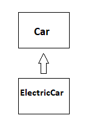

# Tekli Kalıtım (Single Inheritance) 



&quot;**Car**&quot; isminde bir ATA(parent) sınıf tanımladık. Ardından, &quot;**ElectricCar**&quot; isminde bir sınıf oluşturduk. &quot;**ElectricCar**&quot; isimli sınıf &quot;**Car**&quot; sınıftan kalıtım almaktadır. &quot;**extends**&quot; anahtar kelimesi ile &quot;**Car**&quot; sınıfından kalıtım almasını sağladık. Böylece, &quot;**ElectricCar**&quot; sınıfı &quot;**Car**&quot; sınıfa ait değişkenleri ve fonksiyonları kalıtım yoluyla almış yani değişken ve fonksiyonları genişletilmiş olur. &quot;**ElectricCar**&quot; sınıfı ise alt sınıf(childclass) olmuştur. Artık, &quot;**ElectricCar**&quot; sınıfı da &quot;**setBrand**&quot; ve &quot;**setLicensePlate**&quot; fonksiyonlarını ve &quot;**licensePlate**&quot;, &quot;**brand**&quot; değişkenlerine sahip olmuş olur. Buna ek olarak &quot;**charge**&quot; fonksiyonu da kendisine ait bir fonksiyondur. Bu fonksiyon ATA sınıfta yer almaz. Burada "Car" ve "ElectricCar" sınıfları arasında "IS-A" ilişkisi vardır. Yani  "ElectricCar" bir "Car" dır.

````java
// Ata sınıf
public class Car {

	// "protected" anahtar kelimesi ile tanımlanmış değişkenlere farklı paketlerden sadece kalıtım alan alt sınıflar erişebilir.
    protected String licensePlate = null;

    protected String brand;

    public Car() {
	this.licensePlate = "";
	this.brand = "";
    }

    public Car(String brand, String licensePlate) {
	this.licensePlate = licensePlate;
	this.brand = brand;
    }
    
 // "protected" anahtar kelimesi ile tanımlanmış fonksiyonlara farklı paketlerden sadece kalıtım alan alt sınıflar erişebilir.
    protected void setLicensePlate(String license) {
        this.licensePlate = license;
    }

    protected void setBrand(String brand) {
    	this.brand = brand;
    }

    protected void showInfo() {
	System.out.println("Car: " + toString());
    }

    @Override
    public String toString() {
	
	StringBuilder builder = new StringBuilder();
	builder.append("[");
	builder.append(this.brand);
	builder.append(" ");
	builder.append(this.licensePlate);
	builder.append("]");
	return builder.toString();
    }
}

public class ElectricCar extends Car {

	// "private" anahtar kelimesi ile tanımlanmış değişkenlere veya fonksiyonlara sadece sınıf içinden erişebilir.
	// Sınıf içinden kasıt bu sınıftaki {} arasındaki kod bloğudur.
	private double power = 1000.0;
    
	public ElectricCar() {
	
	   // Car sınıfına ait parametresiz kurucu metodu çağırıyoruz.
	   super();
	}
	// Car sınıfına ait parametreli kurucu metodu çağırıyoruz.	
     public ElectricCar(String brand, String licensePlate, double power) {
	
	
	   // Bu kurucu metot "public Car(String brand, String licensePlate)" kendisidir.
	   super(brand, licensePlate);
	
	   this.power = power;
	}

	// "public" anahtar kelimesi ile tanımlanmış değişkenler veya fonksiyonlar sınıf dışından çağrılabilir. Dışarıya açık demektedir.
	public void charge(double extraPower) {
		this.power += extraPower;
	}

	@Override
	public void showInfo() {
		System.out.println("ElectricCar: " + toString());
	}

	public void showPower() {
		System.out.println("Electric Power: " + this.power);
	}

	@Override
	public String toString() {
	
		StringBuilder builder = new StringBuilder();
		builder.append("[");
		builder.append(this.brand);
		builder.append(" ");
		builder.append(this.licensePlate);
		builder.append(" ");
		builder.append(this.power);
		builder.append("]");
		return builder.toString();
	}
}
````

