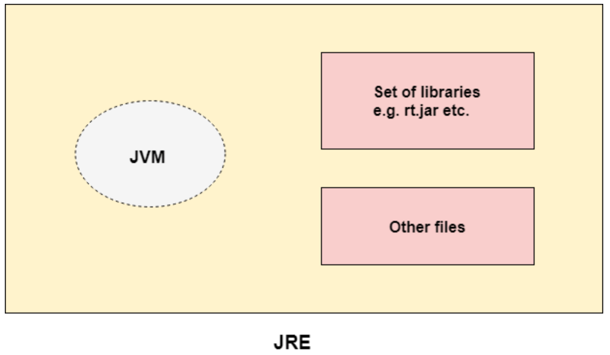
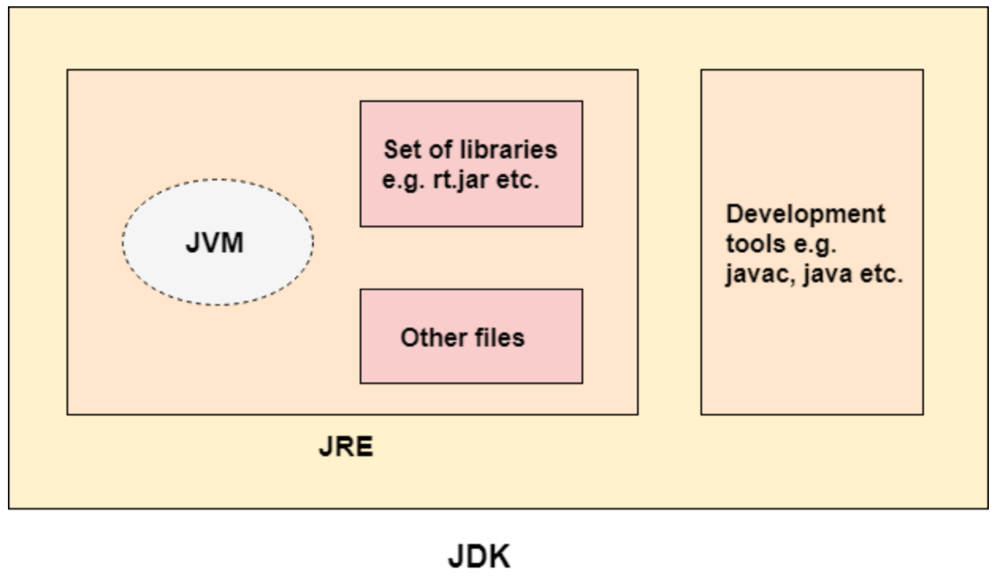

# JDK, JRE ve JVM Kavramları

## 1.Java Virtual Machine (JVM)

JVM aslında soyut bir kavramı ifade eder. JVM fiziksel olarak ortada var olan bir yapı değildir. Doğruyu söylemek gerekirse, Java Byte kodunun bilgisayarın en temel komutlarına nasıl dönüştürüleceğini, bu süreç içinde nelerin yapılması gerektiğini kurallar ile taslak olarak ifade eder. Aslında bir sistemin dokümantasyonu gibidir.

JVM, Java Byte koda dönüştürülebilen her yazılım geliştirme dilini çalıştırabilme yeteneğine sahiptir. Örneğin: Scala dilinde yazılmış bir kaynak kod Java Byte dönüştürülebildiği için JVM tarafından Java dilinde yazılmış bir kod parçası gibi işletilebilir.

JVM esas olarak aşağıdakileri yerine getirir:

- Kodu yükler, Classloader vasıtasıyla bu işi yapar.
- Hafıza yönetimiyle ilgili olayları yönetir. Heap/Stack, Class hafıza bölgeleri gibi alanların koordinasyonunu sağlar.
- Ara kodu kontrolden geçirip onaylar. Ara kod içinde sorun olabilecek kodları arar.
- Ara kodu alıp bilgisayarın anlayacağı temel komutlara dönüştürür ve programın çalışmasını sağlar.

## 2.Java Runtime Environment (JRE)

JRE, Java ile yazılmış uygulamaların çalıştırılabilmesini sağlayan gerekli araçları ve kütüphaneleri barındırır. Aslında, Java için uygulama çalıştırma ortamı sağlar. JRE içinde halihazırda yazılım modülleri bulunur. Aynı zaman JVM spesifikasyonuna ait bir JVM implemantasyonu da barındırır. JVM&#39;in fiziksel hali bünyesinde yer alır.

JRE, JVM&#39;in fiziksel olarak ortaya çıkmış halidir diyebiliriz.

### 3.Java Development Environment (JDK)

JDK ise biz yazılımcıların Java programlama diliyle uygulamalar geliştirmesini sağlayan tüm altyapıyı sağlar. Bu alt yapı içinde JRE&#39;yi de içinde bulundurur. Buna ek olarak geliştirme yapabilmek için gerekli olan yazılım modüllerini ve kütüphaneleri de JDK içinde yer almaktadır.

JDK üç tipte olabilir:

Standard Edition Java Platform (Java SE)

Enterprise Edition Java Platform (Java EE)

Micro Edition Java Platform (Java ME)

