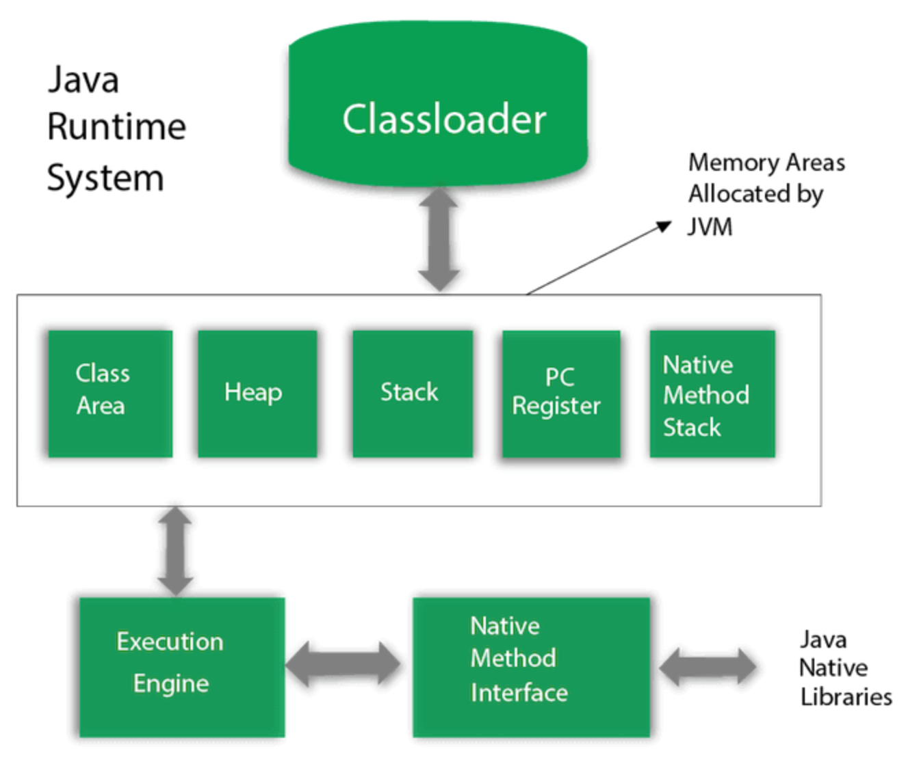
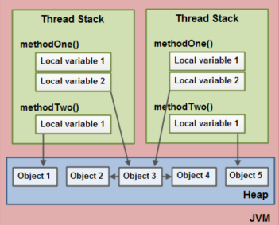
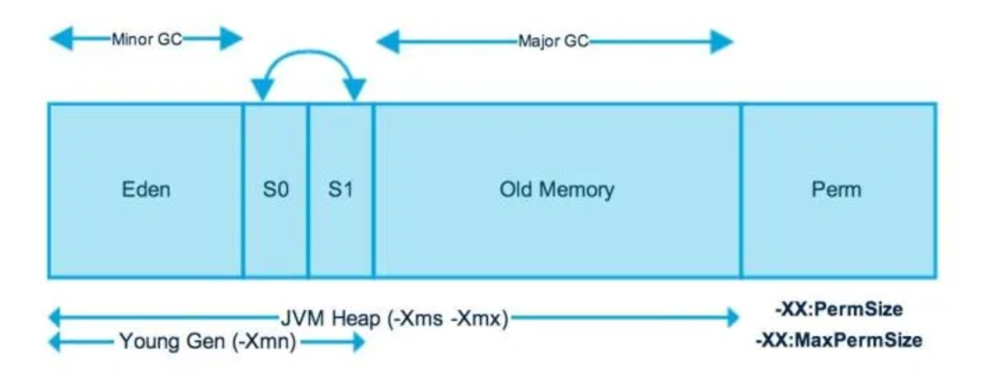

## Java Virtual Machine Mimarisi

JVM&#39;in Java Byte kodunu alıp işleyip bilgisayarın temel komutlarına dönüştürerek çalıştıran bir sistem olduğunu öğrenmiştik. Her işletim sistemi tipi için bir JVM implemantasyonu vardır. Windows, Mac OS ve Linux gibi işletim sistemleri için JVM&#39;in çalışan halleri mevcuttur. Bu nedenle platform bağımsız bir özelliğe sahiptir. Windows işletim sistemi üzerinde geliştirilmiş bir Java uygulamaları Java Byte&#39;a çevirilir. Ardından, oluşan Java Byte kodu Linux işletim sistemi üzerinde bir JVM vasıtasıyla çalıştırılabilir.

Yukarıda JVM&#39;in kabaca mimarisini özetlemiş oluyoruz.

Classloader ile derlenmiş Java kodları, ki bunlar Java Byte&#39;larıdır, JVM vasıtasıyla yüklenir. Ardından Classloader, JVM Hafıza bölgesine bu kodlar aktarılır.

JVM&#39;in kendine ayırdığı hafıza bölgesi belli alanlardan oluşur. Class Area denilen kısım yüklenen sınıflarla ilgili yapıları depolar. Metoda ait kod bloğunu, kurucu metodu ve metoda ait verileri saklar.

Heap hafıza alanı ise Java&#39;da sınıflardan oluşturulan nesneleri depolar. &quot;new&quot; anahtar kelimesiyle bir nesne yaratıyorsak bu Heap hafızada saklanır. Her metod çağrımında Stack hafıza bölgesinde bir alan oluşturulur. Metod çağrımı tamamlandığında ise metod çağrımına ayrılan bu alan geri iade edilir.

