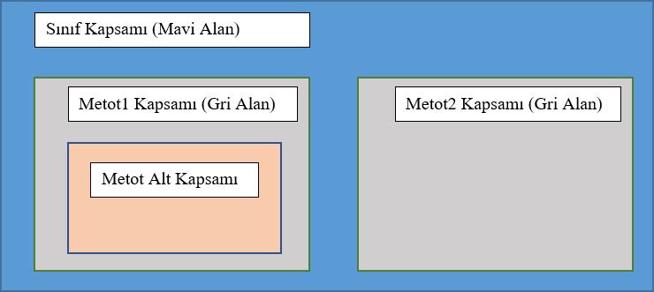

# Java Sınıf ve Nesne Kavramları

Java, önceden de belirttiğimiz gibi Nesneye Dayalı Programlama yöntemini tamamıyla destekleyen bir programlama dilidir. Java bu nedenle aşağıdaki konseptleri destekler ve uygulanmasına olanak tanır. Bu özellikler ileriki konularda tek tek ele alınacaktır.

- Çok Biçimlilik (Polymorphism)
- Kalıtım (Inheritance)
- Kapsülleme (Encapsulation)
- Soyutlama (Abstraction)
- Sınıflar (Classes)
- Nesneler (Objects)
- Metot (Method)
- Mesaj Yoluyla Değer Geçmek (Message Passing)

## Java&#39;da Nesneler (Objects)

Gerçek hayata döndüğümüzde etrafımızda yüzlerce nesne görürüz. Aslında, her nesnenin var olan bir durumu ve davranışı vardır.

Örneğin: bir köpeği ele aldığımızda rengi, ismi, cinsi köpeğe ait durumu ifade eder. Havlaması, koşmak, acıkması ise onun davranışlarını ifade eder.

Aynı şekilde köpeği modelleyen bir nesneyi yazılım dünyasında oluşturduğumuzda renk, isim, cins gibi durumu ifade eden bilgiler değişkenler ile tanımlanır. Ve bu veriler değişkenlerde saklanır. Koşmak, havlamak, acıkmak gibi davranışlar ise yazılım dünyasında metotlar (fonksiyonlar) ile tanımlanır. Metotlar nesneler arası iletişim ve etkileşim için yol sunarlar. Örneğin: bir nesne başka bir nesnenin davranışını o nesnenin metodunu çağırarak etkileşime geçer.

## Java&#39;da Sınıflar (Classes)

Yukarıdaki örneğimizde bir köpeğin yazılım dünyasında nesneler vasıtasıyla bir modelinin olabileceğinden bahsetmiştik. Nesne modelin var olan fiziksel halidir. İşte bu noktada sınıflar bir nesnenin modellenmesi için oluşturulan taslağın kendisidir. Sınıflar bir nesneye ait taslaktır diyebiliriz. Nesne ise o taslaktan üretilmiş bir fiziksel kopyadır. Sınıflardan üretilen yazılımsal nesnelerde bilgisayar hafızasında fiziksel var olan yapılardır.

`````java
public class Dog {

   String breed;
   int age;
   String color;

   void barking() {
   }

   void hungry() {
   }

   void sleeping() {
   }
}
`````

Yukarıda örnek bir sınıf tanımı vardır. Java&#39;da sınıflar aşağıdaki yapıda tanımlanır.

````java
public class <SINIF_İSMİ>
{

   // Kod bloğu 
  // Bu alan sınıfın kapsamını belirler. Bu iki süslü parantez dışında kalan kod bloğu sınıfın dışıdır.

}

````

Süslü parantezler o sınıfa ait kod bloğunu temsil eder. Java&#39;da her süslü parantez açıp kapatmak bir kod bloğu oluşturur. İç içe açılan her kod bloğu alt kümeler gibi birbirini kapsar. Kapsayan blok içindeki tüm alt kod bloklarına erişim hakkına sahipken, alt kapsamdaki bir kod bloğu direkt olarak bir üst kapsam bloğuna erişemez. Bunu iç içe kümeler gibi düşünebiliriz.




### Değişken Tipleri:

- Yerel Değişken: Bu değişkenler metot veya bir kod kapsamı içinde tanımlanmış olan değişkenlerdir. Tanımlandıkları metodun veya kod bloğunun işi bitince otomatik olarak hafızadan silinirler. Yaşam ömürleri kod kapsamının ömrü kadardır.
- Nesne Değişkenleri: Sınıf tanımı yaparken köpek örneğinde olduğu gibi renk, boy, isim gibi nitelikleri değişkenler vasıtasıyla tanımlarız. Sınıf içinde bunları değişken olarak tanımlarız. Ardından sınıftan üretilen her nesne bu değişkenlere sahiptir. İşte bunlara nesne değişkenleri denilmektedir.
- Sınıf Değişkenleri: Sınıf tanımı yapılırken bir değişken **static** anahtar sözcüğüyle tanımlanıyorsa bu sınıf tipi bir değişkendir. Değişkene değer atamak için bir nesne oluşturmanıza gerek yoktur. Sınıf ismi ve nokta operatörü kullanarak erişilir. Global kapsama sahip değişkenlerdir.

## Java&#39;da Sınıf Kurucuları (Constructors)

Sınıf içinde kurucu metotlar tanımlanabilir. Kurucu metotlar bir nesne oluşturulurken yapılması gerekenlerin tanımlandığı metotlardır. Nesne oluşturma aşamasında bu özel metotlar çağrılır. Her sınıfın mutlaka bir kurucu metodu olur. Eğer, siz kod yazarken kurucu metot tanımlamadıysanız Java derleyicisi boş bir taneyi otomatik olarak tanımlayacaktır.

Kurucu metotların ismi sınıf ismiyle aynı olmak zorundadır. Farklı parametreler alan birden fazla kurucu metot tanımlayabilirsiniz.

`````java
public class Puppy {

   public Puppy() {
     // parametresiz bir kurucu metot.
   }

   public Puppy(String name) {
      // name isminde bir değişkenle tanımlanmış bir kurucu metot. 
   }
}
`````

Yukarıdaki örnekte Puppy isminde bir sınıfa ait iki tane kurucu metot görülmektedir. Java&#39;da bir sınıftan yeni bir nesne üretmek istediğinizde &quot;new&quot; anahtar kelimesini kullanmanız gerekmektedir.

````java
Puppy p = new Puppy("Pamuk");
````

Yukarıdaki şekildeki gibi Puppy sınıfına ait bir nesne oluşturmak istediğinizde dikkat ederseniz nesne oluştururken &quot;Pamuk&quot; şeklinde bir isim bilgisi geçtik. Bu nedenle nesne oluşturma işlemi sırasında **public** Puppy(String name) isimli kurucu metot çağrılır ve çalıştırılır.

````java
Puppy p = new Puppy();
````


Yukarıdaki şekildeki gibi parametresiz bir nesne oluşturmuş olsaydık. ``public Puppy() ``isimli kurucu metot çağrılır ve çalıştırılırdı.

## Java&#39;da Paketler (Packages)

Java&#39;da sınıfları (classes) ve arayüzleri (interfaces) bir araya toplamak için paket kavramı vardır. Birbiriyle mantıksal ilişkiye sahip sınıflar bir paket altına hiyerarşik bir şekilde toplanır. Sizler de kendi Java uygulamalarınızı geliştirirken yeni paketler oluşturup birbiriyle alakalı sınıfları bir araya toplayabilirsiniz.

`````java
import java.io.*;
`````

Yukarıdaki Java paketinde giriş/çıkış işlemleriyle ilgili sınıflar **java.io** isimli bir paket altına toplanmıştır. Sondaki \* işareti ise **java.io** paketi altındaki tüm sınıfları projeye dahil et anlamına gelmektedir.