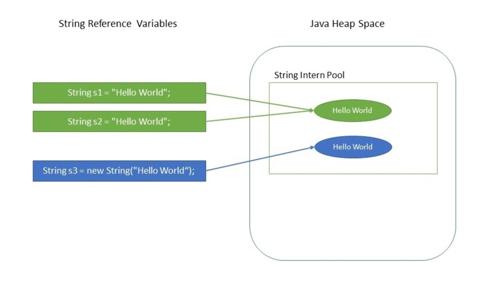

# Java&#39;da Döngü Mekanizmaları

Döngüler bilgisayara tekrarlı işleri yaptırabilmek için gereklidir. Örneğin, 1000&#39;e kadar olan tüm tek sayıları bulmak tekrarlı bir işlemdir. Müşteri şifresini tekrar tekrar girmeye çalışmakta tekrarlı bir işlemdir.

Döngüler 4 ana bileşenden oluşur:

- Döngünün iterasyon sayısını tutacak değişkene ilk değer atanır.
- Döngünün sonlandırılması veya devam etmesi için bir koşul cümlesi belirtilir.
- Döngünün her iterasyonda ne kadar artıp ne kadar azalacağı belirtilir.

## "for" Döngüsü

Bu döngü tipinde iterasyon sayısı belli bir miktardadır. Döngünün maksimum kaç kez işletileceği önceden bellidir.

````java
for( initialization; condition; incr/decr) {
	//statement or code to be executed  
}  
````

````java
for( int i=-100; i < 1000; i++) {
	// tek sayıları bul
	if(i % 2 == -1 || i % 2 == 1) {
		System.out.println("Tek sayı: " + i);
	}
}
````


Döngüler iç içe tanımlanabilir. Bunlara nested loops denir. Örneğin: çarpım tablosunu ekrana yazdırmak için iç içe 2 tane döngü tanımlamak gerekir.

````java
for(int i = 1; i <= 9; i++) {
	for(int j = 1; j <= 9; j++) {
		int result = i * j;
		String formattedOutput = String.format("(%d x %d)=%d",i,j,result);
		System.out.println(formattedOutput);
	}
}
````


## "while" Döngüsü

"for" döngüsüne benzerdir. "while" döngüsü genellikle işlemin kaç kez tekrar edeceği bilinmediği durumda kullanılır. Örneğin: müşterinin hesabına giriş şifresini kaç kez yanlış gireceğini bilemeyiz. Bu nedenle bu tarz durumlarda "while" döngüsü tercih edilir.

````java
Scanner scanner = new Scanner(System.in);
String customerPassword = "12345";
boolean passwordSuccessfull = false;

while(!passwordSuccessfull) {
	
	System.out.println("Hesap şifrenizi giriniz:");
	String typedPassword = scanner.next();
	if(customerPassword.contentEquals(typedPassword)) {
		passwordSuccessfull = true;
		System.out.println("Sisteme başarılı giriş yaptınız!");
	}
}

````


## "do-while" Döngüsü

"while" döngüsünün çok benzeridir. Bu döngüde koşul en sonda yer aldığı için en az bir kez tur çalıştırılır.

````java
int i = 1;
do {
	System.out.println("Sadece bir kez çalıştım :) ");
	i++;
} while(i==1);

````


## "break" ve "continue" Komutu ile Döngüyü Kontrol Etmek

İşletilen bir döngüyü bir koşul sonucu sonlandırmak için "break" komutu kullanılır. "continue" kelimesi ile döngünün devam etmesi sağlanır. Aşağıdaki örnekte döngü içinde ilk 50 değeri continue ile atlayacağız. Dizinin ortasına geldiğimizde ise break komutuyla döngüyü kıracağız.

````java
for(int i=1; i <= 100; i++) {
	
	if(i < 50) {
		System.out.println("Daha yarısına gelmedim!");
		continue;
	}
	
	if(i == 50) {
		System.out.println("Dizinin ortasındayım!");
		break;  }  }

````

## Java Sayı ve Yazı İşlemleri (Numbers &amp; Strings)

Java&#39;da ilkel (Primitive) veri tiplerinden bahsetmiştik. Bu veri tiplerinin bir de referans özellikte olanları da vardır. Bunlar sınıf tabanlı veri tipleri diyoruz. Örneğin: tamsayı olan ve ilkel bir veri tipi olan "int" tipinin bir de "Integer" şeklinde bir sınıf ile temsil edildiği veri tiplerine referans veri tipi diyoruz.

Bunun yanında matematiksel işlemlere yardımcı olmak ve matematiksek fonksiyonları hazır kullanmak için Java&#39;da Math isminde bir hazır tanımlanmış sınıf vardır. Aşağıdaki örnekler kodların içinde gerekli açıklamalar verilmiştir.

Örnek:

````java
// Veri dönüşümü
Long personelId = new Long(100);

int personalAsId = personelId.intValue();
byte personalAsByte = personelId.byteValue();
short personalAsShort = personelId.shortValue();
double personalAsDouble = personelId.doubleValue();
float personalAsFloat = personelId.floatValue();
String personalAsText = personelId.toString();

System.out.println(personalAsId);
System.out.println(personalAsByte);
System.out.println(personalAsShort);
System.out.println(personalAsDouble);
System.out.println(personalAsFloat);
System.out.println(personalAsText);

````

````java
// Kıyaslama metodu ===> compareTo
Long personelId = new Long(100);

System.out.println(personelId.compareTo(50L));
System.out.println(personelId.compareTo(100L));
System.out.println(personelId.compareTo(150L));
````

````java
// değerlerin eşitliğini karşılaştırma metodu ===> equals
Long personelId = new Long(100);

System.out.println(personelId.equals(50L));
System.out.println(personelId.equals(100L));
````

````java
// String değerlerden sayılara dönüşüm metodu ===> valueOf
long number1 = Long.valueOf("100");
int number2 = Integer.valueOf("5");
short number3 = Short.valueOf("1");
````

````java
// String değerlerden sayılara dönüşüm metodu ===> parseX
long number1 = Long.parseLong("100");
int number2 = Integer.parseInt("5");
short number3 = Short.parseShort("1");

````

`````java
// mutlak değer alma fonksiyonu ===> abs
Integer a = -8;
double d = -100;
float f = -90;

System.out.println(Math.abs(a));
System.out.println(Math.abs(d));     
System.out.println(Math.abs(f)); 

// ceil metodu ile yukarı yuvarlama, floor ile ise aşağı yönlü yuvarlama yapılır.
double d = 100.675;
float f = 90.15f;    

System.out.println(Math.ceil(d));
System.out.println(Math.ceil(f)); 

System.out.println(Math.floor(d));
System.out.println(Math.floor(f));  


// rint metodu ile ondalıklı kısım 0.5'den büyükse yukarı doğru
// eğer 0.5'e eşit ve küçük ise aşağı doğru yuvarlama yapar. rint fonksiyonu sonuç olarak sadece int tipinde değer verir.
double d = 100.675;
double e = 100.500;
double f = 100.200;

System.out.println(Math.rint(d));
System.out.println(Math.rint(e)); 
System.out.println(Math.rint(f)); 


// rint metodu ile ondalıklı kısım 0.5'e eşit ve büyükse yukarı doğru
// eğer 0.5'den küçük ise aşağı doğru yuvarlama yapar.

// round fonksiyonu long veya int döndürür. 
double d = 100.675;
double e = 100.500;
float f = 100;
float g = 90f;

System.out.println(Math.round(d));
System.out.println(Math.round(e)); 
System.out.println(Math.round(f)); 
System.out.println(Math.round(g));


// max verilen iki değerden en büyüğünü döndürür.
// min verilen iki değerden en küçüğünü döndürür.
System.out.println(Math.min(12.123, 12.456));
System.out.println(Math.max(12.123, 12.456));


// e tabanında log alma fonksiyonudur.
double x = 2.76;
System.out.printf("log(%.3f) is %.3f%n", x, Math.log(x));


// üs alma fonksiyonudur. 2 üzeri 3 gibi.
double x = 2;
double y = 3;
System.out.printf("pow(%f, %f) is %f", x, y, Math.pow(x, y));


// karekök alma fonksiyonudur.
double x = 4;
System.out.printf("sqrt(%.3f) is %.3f%n", x, Math.sqrt(x));


// 0-1 arasında rastgele sayı üretme fonksiyonudur.
System.out.println(Math.random());

`````


## Java&#39;da String İşlemleri

Java&#39;da varsayılan dil içerisinde gelen String işleme kütüphaneleri mevcuttur. String sınıfı içinde yer alan statik fonksiyonlarda yazılımcılara yardımcı olmaktadır.

String veri tipi Java&#39;da ilkel (primitive) bir veri tipi değildir. Bu nedenle "new" anahtar sözcüğü kullanılarak nesne şeklinde oluşturulabilir.

Java&#39;da String veri tipinde bir değişken tanımı aşağıdaki gibi yapılabilir. Buna Literal tanımlama diyoruz. Sıklıkla kullanılan bir tanımlama biçimidir. Değişkene direkt olarak veriyi "=" operatörüyle atama yapıyoruz.

````java
String greeting = "Hello world!";
````

Literal tanımlama dışında "new" anahtar sözcüğüyle bir nesne olarak oluşturabilirsiniz. Bu yöntemle Heap hafıza bölgesinde bir alan kaplamış olursunuz. Literal tanımlama ile Heap hafızadan kazanç sağlanır.

Örnek:

````java
String helloString = new String("Merhaba Dunya!");
````

String tipinde tanımlanan değişkenler veya nesneler değiştirilemez duruma sahiptir. Buna Immutable Object denir. String içindeki değeri değiştirmek isterseniz. Yeni bir değişken veya nesne tanımlama yapmak gerekecektir.

String veri tipi niçin Immurable (Değiştirilemez) tasarlandı diye düşünebilirsiniz. Bunun birden fazla sebebi vardır. Öncelikle, yazılım geliştirilirken String veri tipi çok sık kullanılır.

String tipinde sürekli nesne üretilmesi Heap hafıza bölgesini çok kötü kullanmaya ve performans problemlerine yol açar. Bu nedenle Literal tanımlarla ve özel String Pool (Havuz) ile birlikte performans kazancı hedeflenmiştir. String&#39;ler için Java&#39;da özel bir hafıza bölgesi vardır. Bu bölgede bir String havuzu vardır. Gerçekten bu havuz içinde belli miktarda tanımlı String nesneleri bulunur. Bu nesneler Heap hafızada belli bir bölgeyi kaplarlar. Fakat, sınırlı sayıdadırlar. Aşağıda, Literal tanımlama ile "new" ile String oluşturma arasındaki fark gösterilmektedir. İki tane Literal tanımlı s1 ve s2 isminde değişkenimiz olduğunu düşünelim.

```java
String s1 = "Hello World";
String s2 = "Hello World";
          
s1 == s2
```




Yukarıdaki örnekte bizler iki tane s1 ve s2 tipinde iki tane Literal tanımlı değişkenler oluşturduk. Aslında, bu iki değişken aynı değere sahip oldukları içim String Pool&#39;dan (Havuzdan) önceden oluşturulmuş bir nesneyi işaret ederek iki tane ayrı hafıza bölgesini doldurmaktan kurtuldular ve hafıza kazancı sağladılar. Yukarıdaki şekilde de bu durum izah edilmektedir. S3 değişkeni s1 ve s2 ile aynı değere sahip olsa da "new" ile yeni bir nesne olarak oluşturulduğu için hafızada başka bir bölgede oluşturulur.

Örnek:

````java
String s1 = "Hello";
String s2 = "Hello";
String s3 = "Merhaba";
String s4 = new String("Merhaba");

System.out.println("s1 == s2 : " + (s1 == s2));
System.out.println("s2 == s3 : " + (s2 == s3));
System.out.println("s3 == s4 : " + (s3 == s4));
````

Yukarıdaki örnekte de bu durum geliştirilmiştir. s1 ve s2 değişkenleri aynı değere sahip Literal tanımlı String değişkenleri oldukları için aynı hafıza bölgesini işaret ederler. s3 değişkeni Literal tanımlı olmasına rağmen başka bir değere sahip olduğu için String Pool&#39;dan (Havuzdan) başka bir nesneyi alıp onu işaret etmektedir. s4 değişkeni ise "new" ile oluşturulduğu için Heap hafızadan bambaşka bir alanı almıştır. Yukarıdaki programın çıktısı aşağıdaki gibidir. "==" operatörü String&#39;lerde hafıza adresi kıyaslaması yapar. s1 ile s2 aynı hafıza adresini gösterir. s2 ve s3 Literal tanımlı olsalar da havuzdaki farklı nesneleri işaret ettikleri için adresleri eşit değildir. s3 ve s4 aynı değerlere sahip olsa da biri Literal tanımlıdır ve havuzdaki bir nesneyi işaret eder. Diğeri ise "new" ile tanımlandığı için Heap hafızada başka bir adresi işaret eder.

````java
s1 == s2 : true

s2 == s3 : false

s3 == s4 : false
````


String&#39;ler değiştirilemez olduğu için Güvenlik ile ilgili konularda da varsayılan olan korumacı bir özelliğe sahiptir. Ayrıca, String değişkenler Immutable (Değiştirilemez) olduklarından dolayı Çok Kanallı (MultiThread) programlamada Thread-Safe özelliğe sahiptirler. String Pool, String Literal ve String new arasındaki fark size mülakatlarda sorulabilir.


Not: String veri tiplerinde verinin karakter uzunluğunu bulmak için "length()" metodundan faydalanılır. Örnek:

````java
String s1 = "Hello";
int lengthOfs1 = s1.length();
````


Not: String ifadeleri birbiriyle birleştirmek için "+" operatörü veya "concat" metodu kullanılır. Örnek:

````java
String namePrefix = "My name is ";
String greetimgMessage = namePrefix.concat("Zara");
````


### Formatlı String İfadeler Oluşturmak

Java&#39;da "String.format" metoduyla formatlı veriler oluşturabilirsiniz. "format" metodu String sınıfının static fonksiyonudur. Nesne üretmeksizin direkt sınıf ismiyle çağırabilirsiniz.

Örnek:

````java
int speed = 50;
String departureCityName = "Akhisar";
String arrivalCityName = "İstanbul";
String fullText = String.format("Aracın ortalama hızı: %d kilometredir." +
                   "Araç %s şehrinden kalkıp %s şehrine varacaktır.", speed, departureCityName, arrivalCityName);
System.out.println(fullText);
````


Yukarıdaki örnekte bir metin oluşturulmaya çalışılıyor. Metin içerisinde tanım sayıları ifade eden %d ve String veri tipini ifade eden %s alanları vardır. Bu alanlar dinamiktir. Gelen değerleri cümle içinde gösterilmesini sağlarlar.

`````java
String s = "Strings are immutable";

// s isimli String değişkendeki ifadenin 8. indeksindeki karakteri alır.
// Burada dikkat edilmesi gereken şey indeksler sıfırdan başlar. O yüzden 9. karakteri okuyoruz.
char result = s.charAt(8);

-----------------------------------------------------------

String str1 = "Strings are immutable";
String str2 = "Strings ARE immutable";

// s1 ve s2 değişkenleri içinde yer alan değerleri büyük küçük harf duyarlılığı olmaksızın kıyaslar.
int result = str1.compareToIgnoreCase(str2);
System.out.println(result);

-----------------------------------------------------------

String str = new String("This is really not immutable!!");

// String ifadenin sonu verilen ifadeyle bitiyor mu kontrol eder. true veya false döner.
// Cümlenin sonu "immutable!!" ile bitiyor mu kontrol ediyoruz. true döner.
boolean retVal = str.endsWith( "not immutable!!" );
System.out.println("Returned Value = " + retVal );

-----------------------------------------------------------


String str1 = new String("This is really not immutable!!");
String str2 = new String("This is really not immutable!!");
// equals metodu iki String değişkenin aynı değere sahip olup olmadığını kıyaslar.
// == operatörü ile iki String'leri kıyaslasaydık, hafıza adreslerini kıyaslamış olacaktır. O da false dönecekti.
boolean retVal = str1.equals( str2 );
System.out.println("Returned Value = " + retVal );

-----------------------------------------------------------

String str = new String("Welcome to kodluyoruz.org");
String subStr1 = new String("Tutorials");
// indexOf metodu verilen ifadenin cümlede nerede hangi indeksten itibaren başladığını belirtir.
// Eğer ifadeyi cümle içinde bulamazsa -1 döner.
System.out.println("Found Index :" + str.indexOf( subStr1 ));

-----------------------------------------------------------

String str = new String("Welcome to kodluyoruz.com");
// replace metoduyla bir cümle içindeki istediğimiz ifadeyi bir başka ifade ile değiştirebiliriz.
// Örneğin: Welcome ifadesini Merhaba ile değiştiriyoruz. Değişiklik sonucunda değişmiş halini yeni bir String olarak döner
str = str.replace("Welcome", "Merhaba");
str = str.replace("to", "");
System.out.println(str);

-----------------------------------------------------------

String str = new String("Welcome-to-kodluyoruz.org");
// split fonksiyonu cümleyi ayırmak için bir karakter alır. Sonra o karaktere göre cümleyi parçalara böler.
// bu örnekte - işaretiyle ayırma işlemi uygulanmıştır.
String[] items = str.split("-");
System.out.println("Return Value :" );    

-----------------------------------------------------------

String str = new String("Welcome to kodluyoruz.com");
// startsWith metoduyla cümle belirtilen ifadeyle başlıyor mu diye kontrol edilebilir.
System.out.println(str.startsWith("Welcome") );

-----------------------------------------------------------


String str = new String("Welcome to kodluyoruz.com");
// substring fonksiyonu verilen başlangıç indeksinden itibaren verilen bitiş indeksine kadar olan bölümü kırpar ve yeni bir string olarak döndürür.
String subStringPart = str.substring(10, 15);

`````


### StringBuilder Sınıfının Kullanımı

Java&#39;da performanslı String birleştirme işlemleri için "StringBuilder" sınıfı kullanılabilir. "+" operatörü ve "concat" fonksiyonuna göre daha performanslı bir yöntemdir.

Örnek:

````java
StringBuilder builder = new StringBuilder();

builder.append("İlk cümle");

builder.append("İkinci cümle");

builder.append("Üçüncü cümle");

System.out.println(builder.toString());
````

"append" metoduyla String ifadeler eklenir. Ardından, "toString" metoduyla birleştirilmiş tüm String ifade alınır.