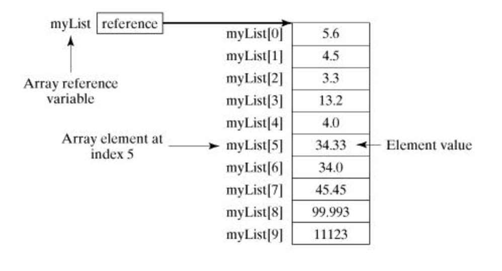

## Java&#39;da Dizi (Array)

Dizi (Array) kavramı programlama dillerinde bir veri tipini ifade eder. Bu veri tipi liste halindeki ardışık verileri bir arada tutan yapıya denilir. Bu ardışık yapıya ait elemanlara indeks yoluyla erişim sağlanabilir. Diziler sabit boyutludur. Örneğin: 10 elemanlık dizi. Dizilerde aynı tipten veri tutulur. Örneğin: tüm elemanları &quot;int&quot; olan bir dizi.

Dizi&#39;nin hafızada bir başlangıç adresi olur ve ardışık olan diğer elemanlar sırayla hafızaya yerleştirilir. Dizi&#39;ler &quot;new&quot; anahtar sözcüğüyle oluşturulur. Böylece, Heap Hafıza bölgesinde yer kaplarlar.

````java
double[] myList;   // tercih edilen yol

veya 

double myList[];   // başka türlü tanımlama biçimi
````

Diziler veri tipi ve [] parantezler ile belirtilir. Yukarıda iki farklı tanımı görülmektedir. Hafızadan yer alıp diziye alan ayırabilmek için &quot;new&quot; anahtar kelimesi kullanılır.

 ````java
double[] myList = new double[10];
 ````

Yukarıda maksimum 10 eleman alabilen &quot;double&quot; veri tipinde olan bir dizi oluşturulmuştur.




Yukarıda &quot;myList&quot; isminde bir dizi tanımlamıştık. Tanımlanan dizi hafıza yukarıdaki şekildeki gibi tutulur. &quot;myList&quot; değişkeni dizinin başlangıç adresini tutar. Dizilerde ardışık bir sıra olduğu için ilk elemandan sonra gelen elemanların hafıza adresleri de birer birer artar. Dizi blok halinde yer kaplar. Diziye erişmek için indeks numarası kullanılır. Örneğin: &quot;myList[0]&quot; demek dizinin 1. Elemanını verecektir. Java&#39;da dizilerin indeksleri sıfırdan başlar. Örneğin: &quot;myList[5]&quot;, yani 5 nolu indeksteki dizi elemanını ver dediğimizde aslında dizinin 6. Elemanına erişmiş oluruz.

Örnekler:

````java
// Java'da diziye ilk değerler süslü parantezler arasında verilir.
double[] myList = { 1.9, 2.9, 3.4, 3.5 };

// tüm dizi elemanlarını arada boşuk bırakarak sırayla ekrana yazdırır.
for (int i = 0; i < myList.length; i++)
{
	System.out.println(myList[i] + " ");
}
````

Yukarıdaki örnekte myList isimli diziye ilk değerleri hemen verilmiştir. Süslü parantezler arasında kalan değerler dizi elemanlarıdır.

Ardından, bir &quot;for&quot; döngüsü ile dizi elemanları ekrana yazdırılır.

## Dizileri fonksiyonlara parametre olarak göndermek

Tanımladığınız dizileri fonksiyonlara parametre olarak gönderebilirsiniz.

Örneğin elimizde static bir fonksiyon olsun. Bu fonksiyona int tipinde verileri olan bir diziyi girdi (input) olarak vermek istersek aşağıdaki gibi olur.

````java
public static void printArray(int[] array) 
{
   for (int i = 0; i < array.length; i++) 
   {
      System.out.print(array[i] + " ");
   }
}
````

printArray ( int[] array ) kırmızı olarak işaretlediğimiz yer diziyi yerel değişken olarak fonksiyona gönderdiğimiz noktadır. Java&#39;da tüm değişkenler &quot;Pass by Value&quot; yöntemiyle geçilir. Bu şu demektir. Sizin tanımladığınız değişkenin, nesnenin veya dizinin birebir kopyası oluşturulur. Bu kopya değer fonksiyona yerel değişken olarak gider. Bu Java mülakatlarında size sorulabilecek bir detaydır.

## Dizileri fonksiyonlardan geri döndürmek

Fonksiyonlar belli bir işi yapıp sonucunda değer dönebilen veya dönmeyen kod bloklarıdır. Fonksiyonlar için altın kural, her fonksiyonun tek bir işi olmalıdır. Örneğin: dizi ortalaması alma işi yapan bir fonksiyon dizileri ekrana yazdırma işini yapmamalıdır. Veya dizilerin ortalamasını alma işi ile dizileri toplama işlemi aynı fonksiyon içinde olmamalıdır. Her biri ayrı fonksiyonlar olmalıdır.

````java
public static int[] reverse(int[] list) 
{
   int[] result = new int[list.length];

   for (int i = 0, j = result.length - 1; i < list.length; i++, j--) 
   {
      result[j] = list[i];
   }
   
   return result;
}

````


Yukarıda dizinin tersine çevrilmiş halini döndüren bir fonksiyon vardır. public static **int[]** reverse(…)  koyu renkle işaretlenen alan dizi döndüreceğimizi ve bu dizinin veri tipini söylüyoruz. Burada veri tipimiz &quot;int".