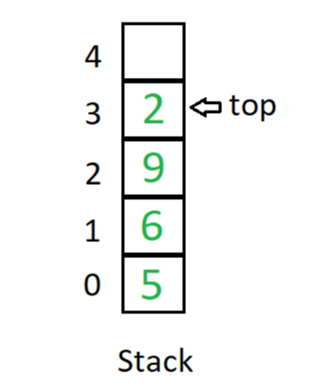
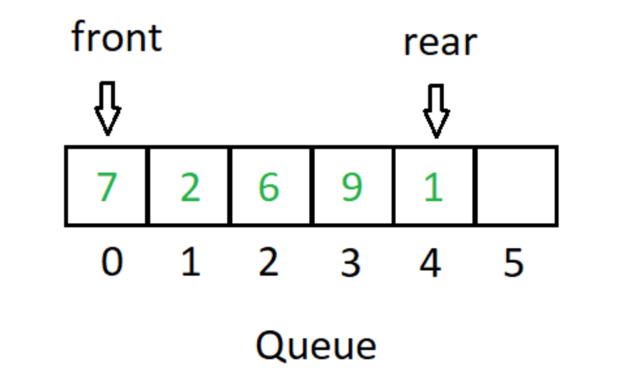
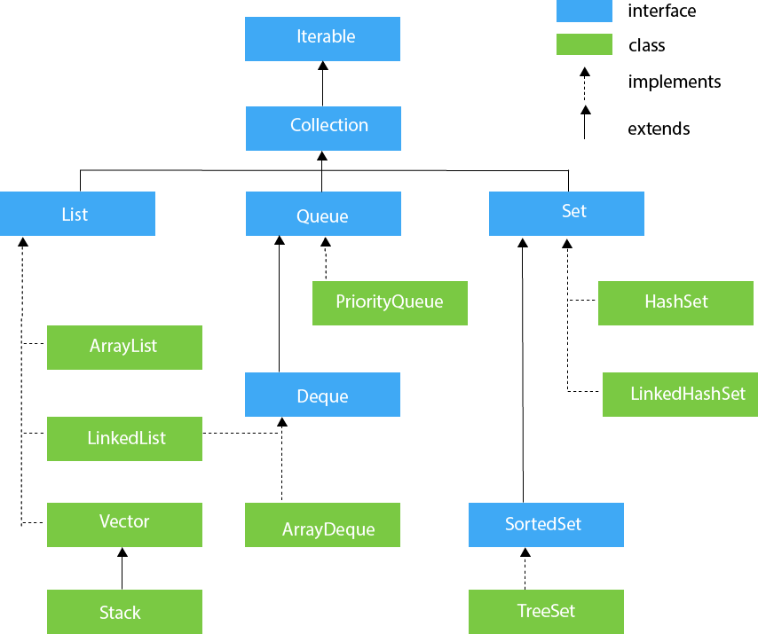
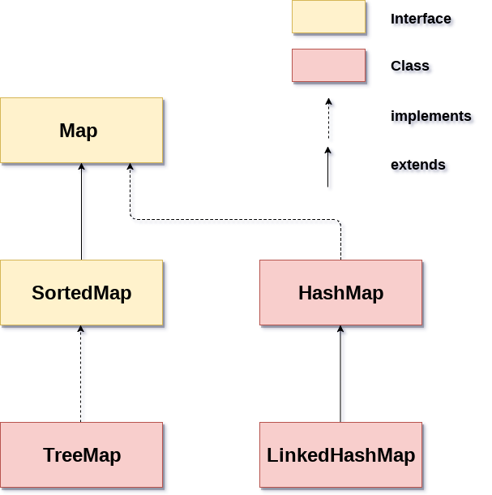

Bölüm-3

 

# “final” Anahtar Kelimesi

 

Java’da değiştirilemez olmayı sağlayan anahtar kelimedir. “final” anahtar kelimesini değişkenlerde, metotlarda ve sınıflarda da kullanabiliriz. Değiştirilemez olmayı sağlar.

 

“final” anahtar kelimesinin kullanılabildiği yerler:

 

- Değişkenler

- Metotlar

- Sınıflar

 

 

## Java “final” Değişkenler

 

Eğer bir değişkeni “final” olarak belirtilirse, değişkene değer ataması yapıldıktan sonra bir daha değiştirilemez. Aslında, değeri değiştirilemeyen sabit değer tanımlaması yapmış oluruz.

 

```java
public class Product {
 
        // "final" değişkenlere değer ataması bir kez yapılabilir.
        // Burada olduğu gibi tanımlar tanımlamaz değer ataması yapabiliyoruz.
        private final long maxPrice = 1000000;
        
        // Ya da ilk değer atamasını kurucu metot içinde değer atayabiliriz.
        // private final long maxPrice;
 
        public Product() {
               // maxPrice = 1000000;
        }
}
```

 

 

## Java “final” Metotlar

 

Java’da bir fonksiyonu (metodu) “final” ile tanımlarsak o metoda “override (ezmek)” işlemi uygulanamaz. Örneğin yukarıda tanımladığımız Product sınıfına “final” ile yeni bir fonksiyon tanımlarsak bu tanımlanan fonksiyon Product sınıfından kalıtım alan alt sınıflarda “override” edilemeyecektir.

 

```java
public class Product {
 
        // "final" değişkenlere değer ataması bir kez yapılabilir.
        // Burada olduğu gibi tanımlar tanımlamaz değer ataması yapabiliyoruz.
        private final long maxPrice = 1000000;
        
        // Ya da ilk değer atamasını kurucu metot içinde değer atayabiliriz.
        // private final long maxPrice;
        
        
        private long price;
 
        public Product() {
               // maxPrice = 1000000;
        }
        
        public long getPrice() {
               return price;
        }
 
        public void setPrice(long price) {
               this.price = price;
        }
        
        public long getMaxPrice() {
               return maxPrice;
        }
        
        // Bir metot final ile tanımlanmışsa, bu metoda override (ezme) işlemi uygulanamaz.
        // Product sınıfından kalıtım almış olan Computer alt sınıfında bu metodu override edemeyiz.
        public final boolean isPriceGreaterThanMaxPrice() {
               
               return price > maxPrice;
        }
}
```

 

“isPriceGreaterThanMaxPrice” fonksiyonu “final” ile tanımlandığı için alt sınıflarda ezilemeyecektir. Zaten ezilmesini de istemeyiz çünkü o anki ücretin maksimum değerden büyük mü olduğu kurgusu alt sınıflarda değişecek bir özellik değildir. Hiçbir alt sınıfın bu fonksiyonu kendisine göre yeniden tanımlamasına gerek yoktur.

## Java “final” Sınıflar

 

Java’da bir sınıfı “final” olarak tanımlarsa o sınıftan hiçbir sınıf kalıtım alamaz. Sınıfı diğer sınıflara kalıtım vermeye kapatmış oluruz. Örneğin “Computer” isminde “final” tanımlanmış bir sınıf tasarlayalım. “Laptop” isimli tasarladığımız bir başka sınıf bu Computer sınıfından kalıtım alamayacaktır.

 

```java
// Bir sınıfı final olarak tanımlarsak bu sınıftan hiç bir sınıf kalıtım alamayacaktır.
public final class Computer extends Product {
 
        // Alt sınıfta bu metodu override etmenize izin vermeyecektir.
        @Override
        public boolean isPriceGreaterThanMaxPrice() {
               
               return super.price > super.maxPrice;
        }
}
```

 

```java
// Laptop sınıfı Computer sınıfından kalıtım alamıyor.
public class Laptop extends Computer {
 
}
```

 

 

 

# Enum Tipler

 

Java’da sabit değişkenler “final” anahtar kelimesi ile oluşturulabilir. Program yazarken mutlaka bazı durumlarda sabit değerlere ihtiyaç duyarız. Elimizdeki bu değerleri sabitlerle sınırlandırarak tanımlamamıza fırsat veren yapılara Enum diyoruz. Örneğin bir ödeme kaydının belirli durum değerleri olabilir. SUCCESS, PROVISION, FAIL gibi durumlar olabilir. Bu durumlar sırasıyla ödeme başarıyla alındı, provizyon aşamasında beklemede ve başarısız oldu gibi değerler olsun. Bu değerleri “final” anahtar kelimesi ile tanımlayıp ayrı değişkenler halinde verebilirdik. Örneğin ödemeyi işlemi için bir sınıf tasarladığımızı düşünün. Aşağıdaki gibi içinde toplam ücreti tutan bir değişken bir de ödeme durumunu ifade eden sabitler olduğunu düşünelim.

 

```v
public class Payment {
        
        private final int SUCCESS = 1;
        private final int PROVISION = 2;
        private final int FAIL = 3;
        
        private double totalValue;
        private int status; // (SUCCESS-PROVISION-FAIL) durumlardan birini alacak.
        
        public Payment() {
               // kodlar ...
        }
}
```

 

Yukarıdaki sınıfta bir hata gözükmüyor. Aynen çünkü bir hata oluşacaksa çalışma zamanında (Runtime) oluşacaktır. Yani, programınız çalışırken. Ödemenin durum bilgisini “int” tipinde tamsayı olarak tanımladık. Alabileceği değerleri 3 tane “final” değişkende tuttuk. Fakat, durumu ifade eden veri tipini sınırlandırmadığımız için status değişkenine gidip 100 gibi bir int tipinde tamsayı da atanabilir. İşte bu noktada çalışma zamanında programınız anlamsız hatalar verebilir. Bunun önüne geçmek için hataları daha derleme aşamasında alabilmek için “Enum” yapılarını kullanabiliriz.

 

Java’da “Enum” yapıları “enum” anahtar kelimesi ile tanımlanır. Aynı sınıf tanımlar gibi bir notasyona, yani yazım biçimine sahiptir. “Enum” yapıların iççinde değişken, metot ve kurucu metot tanımlayabilirsiniz.

 

```java
public enum PaymentStatus {
        
        SUCCESS,
        PROVISION,
        FAIL;
        
}
```

 

Yukarıda en basit haliyle bir “enum” yapısı tanımlanmıştır. Artık ödemeye ait durum değeri önceden tanımlanmış sabitler ile kontrol altındadır. “int” veri tipindeki gibi esnek bir şekilde herhangi bir değeri atayamazsınız. 

 

Şimdi aynı Payment sınıfına bir enum tipi ekleyerek revize edelim.

 

```java
public class Payment {
        
        private double totalValue;
        private PaymentStatus status = PaymentStatus.SUCCESS; 
        
        public Payment() {
               // kodlar ...
        }
}
```

 

Görüldüğü gibi artık “status” değişkeninin tanımlı bir tipi mevcuttur. Bu enum tipinde alabileceği sabitlerde bellidir. Bu sabitler dışında başka bir değer ataması yapılamaz. Böylece, çalışma zamanında ortaya çıkacak hataların daha derleme aşamasında önüne geçmiş olacağız. Aynı zamanda kodun okunabilirliğini de arttırmış olacağız.

 

“enum” yapısı içinde tanımlanmış olan sabitler indeks değerine sahiptir. Enum içindeki sabitin hangi indeksi ifade ettiğini anlamak için “ordinal()” fonksiyonu kullanılır.

 

```java
PaymentStatus.SUCCESS.ordinal()
```

 

SUCCESS sabiti enum yapısı içinde ilk eleman olduğu için indeks değeri 0 (sıfır) gelecektir.

 

## Gelişmiş “enum” Yapıları

 

“enum” yapısı içinde kurucu metot, değişken ve metot tanımlayabileceğinizden bahsetmiştik. Yine PaymentStatus “enum” yapısı üzerinden örneğimize devam edelim. Bahsettiğimiz ödeme durum bilgilerine kısa kodlar vermek istediğimizi düşünelim. Bu durumda enum yapımızı daha gelişmiş bir şekilde tasarlamamız gerekiyordu. Aşağıda örneğini görebilirsiniz.

 

```java
public enum PaymentStatus {
 
        SUCCESS("200", "İşlem başarılıdır."), 
        PROVISION("202", "İşlem bankada askıda beklemektedir."), 
        FAIL("500", "İşlem başarısızdır.");
        
        
        // değişkenler
        private final String code;
        private final String description;
        
        // kurucu metot,
        // enum kurucuları private olmalıdır.
        private PaymentStatus(String code, String description) {
               this.code = code;
               this.description = description;
        }
        
        
        // metotlar
        public String getCode() {
               return this.code;
        }
        
        public String getDescription() {
               return this.description;
        }
}
```

 

Görüldüğü üzere değişkenler, kurucu ve fonksiyonlar tanımlayarak bir enum yapısı kurabiliyoruz.

Tüm enum değerlerini ekrana yazdırmak istersek aşağıdaki gibi bunu yapabiliriz. “enum” yapısı içindeki tüm sabitlerin listesini alabilmek için “values()” fonksiyonunu kullanabilirsiniz.

 

```java
public class Main {
 
        public static void main(String[] args) {
               
               
               PaymentStatus[] paymentStatusList = PaymentStatus.values();
               
               for(PaymentStatus paymentStatus : paymentStatusList) {
                       
                       StringBuilder builder = new StringBuilder();
                       builder.append("[Code: ");
                       builder.append(paymentStatus.getCode());
                       builder.append(" - ");
                       builder.append("Description: ");
                       builder.append(paymentStatus.getDescription());
                       builder.append("]");
                       
                       System.out.println(builder.toString());
               }
        }
 
}
```

# Generic Tipler

Generic’ler Java 5.0 ile birlikte gelen önemli özelliklerden bir tanesidir. Generic tanımlı yapılar ile tip güvenliğini sağlayıp çalışma zamanında (Runtime) çıkabilecek hataları daha derleme aşamasında görebilmeyi sağlarlar. Aynı zamanda Type Casting (Tip Dönüşümü) ihtiyacını azaltarak tip güvenli yazılımlar gerçekleştirmemizi sağlar. Type Casting’in çok yapıldığı yazılımlarda çalışma zamanı hatası alınma ihtimali yüksektir. Bunu bir önceki konuda “downcasting” yöntemini incelerken görmüştük. Aynı ATA sınıftan kalıtım alan alt sınıfların birbirine dönüşümü yapılırken derleme zamanında ortaya çıkmayan bir hata çalışma zamanında karşımıza çıkmıştı. Kurumsal projelerde çoğunlukla tercih edilir. Özellikle soyutlamayı arttırması nedeniyle Nesneye Dayalı Programlama prensiplerini destekler. 

Generic yapılar aynı zaman performans kazancı ve kodun yeniden kullanılabilirliği noktasında da bizlere yüksek fayda sağlarlar. Generic kullanılmadığı durumlarda “ClassCastException” hataları alabiliriz. 

Generic’lerin en çok kullanıldığı yerlerden biri de Java Collection Framework’tür (JCF). İlerleyen konularda JCF ile ilgili detaylı bilgiler verilecektir.


\-    Sınıf (Class)

\-    Metot (Method)

Yukarıdaki yapıları Generic olarak tanımlayabiliriz.

 

## Generic Sınıflar

 

Java’da Generic sınıf tanımlamak için sınıf isminden sonra <T> içinde sembolik bir ismi verilerek oluşturulur. Örneğin burada T isminde sembolik bir tip ismi verdik. Bu verilen sembolik tipin ne olacağı sınıftan bir nesne oluşturulurken verilecektir. Böylece, daha derleme aşamasında tip güvenliğini garanti altına alıp TypeCasting’e ihtiyaç duymadan çalışma zamanı hatalarının önüne geçebiliriz. 

 

!Not: Java’da her sınıfın en üstteki ATA sınıfı Object sınıfıdır. Yani Java’da tüm sınıflar mutlaka Object sınıfından kalıtım alırlar.

 

Generic sınıf tanımlamak için aşağıdaki gibi bir notasyona uymak yeterlidir.

```java
// "class" anahtar kelimesinden sonra sınıf isminizi vererek bir sınıf tanımlıyorsunuz.
// Ardından, <T> notasyonuyla bu sınıfın Generic tipler alabileceğini belirtiyoruz. 
// T yerine dilediğiniz ismi verebilirsiniz.
// T tipine kısıtlama getirmediğimiz için varsayılan olarak "Object" alt tipini alıyor.
public class sinif_isminiz <T> {
        
}
```

"class" anahtar kelimesinden sonra sınıf isminizi vererek bir sınıf tanımlıyorsunuz. Ardından, <T> notasyonuyla bu sınıfın Generic tipler alabileceğini belirtiyoruz. T yerine dilediğiniz ismi verebilirsiniz. T tipine kısıtlama getirmediğimiz için varsayılan olarak "Object" alt tipini alıyor.

 

Daha gelişmiş bir Generic sınıf örneğimiz. Bu örnekte veri yapılarında da aşina olduğunuz gibi “Stack” yapısından bahsettik. “Stack” liste halindeki verileri son giren ilk çıkar mantığına göre işleyen bir veri yapısıdır. Bu liste halinde yapı aslında herhangi bir tipte veri tutabilir. Örneğin bir tam sayı listesi, bir kitap listesi veya farklı tipte verileri tutabilir. Burada Stack algoritmasını ve sınıfı bir kez kuruyoruz ve ardından Generic bir sınıf halinde tasarlayarak bu veri yapısının farklı veri tipleriyle de çalışabilir hale gelmesini sağlıyoruz. Kodun yeniden kullanılabilirliği ve derleme aşamasında tip hatalarını fark etmek anlamında da kazanç sağlamış oluyoruz. Ayrıca, “TypeCasting” yaparak olası bir çalışma zamanı hatasının önüne geçmiş oluruz.

 



 

```java
// T tipine kısıtlama getirmediğimiz için varsayılan olarak "Object" alt tipini alıyor.
public class Stack <T> {
 
        private int topIndex;
        private int size;
        private T[] values;
        
        @SuppressWarnings("unchecked")
        public Stack(int size) {
               // Alttaki satırı yapamazsınız.
               // this.values = new T[this.size];
               this.size = size;
               this.values = (T[]) new Object[this.size];
               this.topIndex = -1;
        }
 
        public void push(T item) throws DataListOverFlowException {
               
               if(this.topIndex >= this.values.length) {
                       throw new DataListOverFlowException("Yığın kapasite hatası, üst limiti aştınız!");
               }
               
               this.topIndex++;
               this.values[this.topIndex] = item;
        }
 
        public T pop() throws DataListOverFlowException {
               
               if(this.topIndex < 0) {
                       throw new DataListOverFlowException("Yığın kapasite hatası, alt limiti aştınız!");
               }
               
               T value = this.values[this.topIndex];
               this.values[this.topIndex] = null;
               this.topIndex--;
               
               return value;
        }
 
        public void print() {
               
               for(T value : values) {
                       System.out.print(value + " ");
               }
               System.out.println();
        }
        
        public T[] getValues() {
               
               return this.values;
        }
        
}
```

 

 

Generic sınıfımızdan nesne oluşturup elemanlar eklemeye çalışalım.

 

```java
Stack<Integer> intStack = new Stack<Integer>(10);
intStack.push(10);
intStack.push(50);
intStack.push(100);
intStack.push(160);
 
System.out.println("Int Stack from: " + intStack.pop());
System.out.println("Int Stack from: " + intStack.pop());
System.out.println("Int Stack from: " + intStack.pop());
System.out.println("Int Stack from: " + intStack.pop());
 
intStack.push(200);
 
// Stack sınıfının tipini daha kodu yazarken Integer olarak verdiğimiz için,
// String tipte bir değer ekleyemiyoruz. Daha derleme aşamasında bu hatayı alıyoruz.
// Böylece, çalışma zamanında ortaya çıkacak hatayı önlemiş oluyoruz.
 
// intStack.push("200");
```

 

“new” anahtar kelimesi ile Stack sınıfından bir nesne üretmeye çalıştığımızda <Integer> şeklinde bu Stack sınıfının hangi tipte veriler tutacağını daha nesneyi tanımlarken bizden istiyor. Integer tipinde olacağını belirtten sonra artık sadece tamsayı tipinde değerleri kabul edecektir. Örneğin “intStack” isimli Stack nesnesine “push” metodu vasıtasıyla String tipte bir değer ekleyemezsiniz. Daha derleme aşamasında hata verecektir. Böylece, çalışma zamanı hatalarının önüne geçmiş oluyoruz.

 

## Generic Interface

 

Önceki konuda soyutlama gücümüzü arttıran “interface” kavramından bahsetmiştik. Generic olarak bir “interface” de tanımlama şansına sahipsiniz. Diğer alt sınıflar da bu Generic “interface”’den kalıtım alabilirler.

 

Yukarıdaki “Stack” örneğimizdeki yapıyı Generic “interface” kullanarak yeniden tasarlayalım.

 

Generic interface tanımlamak için aşağıdaki notasyon kullanılabilir.

 

```java
public interface DataList <T> {
 
        public void push(T item) throws DataListOverFlowException;
        public T pop() throws DataListOverFlowException;
        public void print();
}
```

 

“interface” anahtar kelimesinden sonra bir isim belirliyoruz. Ardından, <T> notasyonuyla bu interface’in Generic olacağını belirtiyoruz.

 

Elimizde “Stack” isminde bir veri yapısı var. Fakat, ileride bizden “Queue” tipinde bir veri yapısı da talep edilebilir. Bu iki veri yapısının da ortak bazı fonksiyonları vardır. Mesela, diziye eleman ekleme ve diziden eleman alma, tüm diziyi ekrana yazdırma gibi ortak fonksiyonlara sahiptirler. Bu fonksiyonlar ortak olsa da eleman ekleme ve alma algoritmaları farklı olabilir. Yani, bu fonksiyonlar alt sınıflarda “override” edilip ihtiyaçlara göre farklı çalışabilirler. Bu durumda elimizde soyutlama için güçlü bir aracımız vardır. O da “interface”!

 

Şimdi Stack sınıfı bu Generic interface’den nasıl kalıtım alıyor görelim. Aşağıda bunun örneği gözüküyor.

 

```java
public class Stack <T> implements DataList<T> {
        // yukarıdaki Stack sınıfındaki aynı kodlar
}
```

 

“implements” anahtar kelimesi ile “Stack” sınıfı “DataList” interface’den kalıtım alır. Stack sınıfındaki <T> notasyon yine belirtilir. Aynı şekilde interface’de de <T> notasyonu belirtilir.

 

Örneğimizi biraz daha geliştirip bir de “Queue” tipinde verileri tutabilen bir veri yapısı tasarladığımızı düşünelim. Bu veri yapısında da Stack sınıfındaki gibi ortak işlevler vardır. Mesela, eleman ekleme, eleman almak ve ekrana yazdırmak gibi işlevler ortaktır. O yüzde “Queue” sınıfı da Generic şekilde tanımlanmış olan “DataList” interface’den kalıtım almaktadır. 

 

“Queue” çalışma mantığı ilk eklenen eleman ilk önce listeden çıkartılır. Bunun için diziye eleman eklemeyi kontrol eden “rear” isminde bir indeks vardır. Diziden hangi elemanın okunacağını ise “front” isimli başka bir indeksle kontrol ederiz.

 



```java
public class Queue <T> implements DataList<T> {
 
        private int size;
        private int frontIndex;
        private int dataInsertionIndex;
        private T[] values;
        
        @SuppressWarnings("unchecked")
        public Queue(int size) {
               
               this.size = size;
               this.frontIndex = 0;
               this.dataInsertionIndex = -1;
               this.values = (T[]) new Object[this.size];
        }
        
        
        @Override
        public void push(T item) throws DataListOverFlowException {
               
               if(this.isEmpty()) {
                       this.frontIndex = 0;
                       this.dataInsertionIndex = -1;
               }
               
               if(this.isFull()) {
                       throw new DataListOverFlowException("Kuyruk dolu eleman ekleyemezsiniz!");
               }
               else if(this.frontIndex != 0 && this.dataInsertionIndex == this.size - 1) {
                       this.dataInsertionIndex = -1;
               }
               
               this.dataInsertionIndex++;
               this.values[this.dataInsertionIndex] = item;
        }
 
        @Override
        public T pop() throws DataListOverFlowException {
               
               if(this.isEmpty()) {
                       this.frontIndex = 0;
                       this.dataInsertionIndex = -1;
                       throw new DataListOverFlowException("Kuyruk boş eleman çekemezsiniz!");
               }
               
               T value = this.values[this.frontIndex];
               this.values[this.frontIndex] = null;
               this.frontIndex++;
               
               if(this.frontIndex == this.size && this.dataInsertionIndex != this.size - 1) {
                       this.frontIndex = 0;
               }
               
               return value;
        }
        
        @Override
        public void print() {
               
               for(T value : values) {
                       System.out.print(value + " ");
               }
               
               System.out.println();
        }
        
        public T[] getValues() {
               
               return this.values;
        }
        
        private boolean isFull() {
               
               return this.frontIndex == 0 && this.dataInsertionIndex == this.size - 1 || 
                               (this.frontIndex != 0 && 
                                this.values[this.frontIndex] != null &&
                                this.values[this.dataInsertionIndex] != null &&
                                this.dataInsertionIndex != this.size - 1 && 
                                Math.abs(this.frontIndex - this.dataInsertionIndex) == 1);
        }
        
        private boolean isEmpty() {
               
               return this.frontIndex == 0 && this.dataInsertionIndex == -1 || 
                               (this.frontIndex != 0 && 
                                this.dataInsertionIndex != this.size - 1 && 
                                this.values[this.frontIndex] == null &&
                                this.values[this.dataInsertionIndex] == null &&
                                Math.abs(this.frontIndex - this.dataInsertionIndex) == 1);
        }       
 
}
```

 

Generic tipi olarak hangi harfin kullanılacağı isteğe bağlıdır. Aşağıdaki harfler yaygın olarak kullanılmaktadır.

 

E: Eleman (Element). Özellikle Java Collection Framework içerisinde kullanılır.

K: Anahtar Alan (Key).

N: Numara (Number).

T: Tip (Type).

V: Değer (Value).

 

## Generic Metotlar

 

Java’da normal bir sınıf tanımlayıp sınıfın içindeki metodu da ayrıca Generic yapabiliriz. Generic metot tanımı için metot imzasında <T> şeklinde küçük büyük işaretleri arasında bir tip ismi verilir. Böylece, metodun Generic olacağı belirtilmiş olur.

 

```java
public class RepeatItemCounter {
 
        public static <T> int countAllRepeatedItems(T[] list, T item) {
               
               int count = 0;
               
               if (item == null) {
                       for (T listItem : list)
                               if (listItem == null)
                                      count++;
               } else {
                       for (T listItem : list)
                               if (item.equals(listItem))
                                      count++;
               }
               
               return count;
        }
 
}
```

 

Yukarıdaki örneğimizde verilen dizi içindeki mükerrer olan kayıtları bulan bir sınıf yaptığımızı düşünelim. Bu sınıf içinde tanımladığımız static tipteki fonksiyonu Generic olarak tanımladık. Böylece daha derleme aşamasında hangi tipte diziler geleceğini garanti altına almış olduk.

 

**static** <T> int countAllRepeatedItems(T[] list, T item)  

“static” kelimesinden sonra <T> ile Generic bir metot olacağını belirtiyoruz. Ardından metodun dönüş tipini int olacağını söyledik. Sonrasında metodun ismini belirtiyoruz. Metodun alacağı parametreleri belirtiyoruz. Parametrelerin tipi Generic olacağı için T tipinde diye isimlendiriyoruz. Ardından, aranacak kelimenin T tipinde olacağını söylüyoruz. Böylece, metoda gelecek olan dizi ve aranacak elemanın Generic tip olarak ifade edilmesiyle, bu metot birden fazla veri tipiyle güvenli bir şekilde çalışır hale gelecektir.

 

 

```java
String[] words = { "Batuhan", "Mehmet", "Beril", "Batuhan", "Berkehan", "Sevil", "Sevinç", "Sevil" };
 
int repeatedItemCount1 = RepeatItemCounter.countAllRepeatedItems(words, "Sevil");
int repeatedItemCount2 = RepeatItemCounter.countAllRepeatedItems(words, "Batuhan");
 
System.out.println("Sevil count: " + repeatedItemCount1);
System.out.println("Batuhan count: " + repeatedItemCount2);
 
 
// ilkel veri tiplerini Generic tip olarak kullanamayız :)
// int[] numbers = { 4, 45, 54, 3, 4, 100, 100, 90, 91, 90};
// int repeatedItemCount3 = RepeatItemCounter.countAllRepeatedItems(numbers, 4);
// int repeatedItemCount4 = RepeatItemCounter.countAllRepeatedItems(numbers, 100);
 
 
Integer[] numbers = { 4, 45, 54, 3, 4, 100, 100, 90, 91, 90};
int repeatedItemCount3 = RepeatItemCounter.countAllRepeatedItems(numbers, 4);
int repeatedItemCount4 = RepeatItemCounter.countAllRepeatedItems(numbers, 100);
 
System.out.println("4 count: " + repeatedItemCount3);
System.out.println("100 count: " + repeatedItemCount4);
```

 

Oluşturduğumuz Generic metodun kullanımı yukarıdaki gibidir. Metot çağrımı yapılırken verilen veri tipine göre metot çalışmaktadır. İlk örnekte tamsayılardan oluşan bir dizi verilmiştir. Aynı dizi içinde aranacak eleman da tamsayı tipinde verilmiştir. Aynı metot ikinci örnekte String tipinde bir dizi ile çağrılmıştır. Dizi içinde aranacak değer de String tipinde verilmiştir.

 

 

## Joker Karakterler (WildCards)

 

Yukarıda yaptığımız örneklerde Generic veri tipi üzerinde bir kısıtlama yapmadık. Sadece T isminde sembolik bir isim verip çeşitli veri tiplerini kullandık. Generic veri tipinde herhangi bir kısıtlama uygulanmazsa varsayılan olan tüm sınıfların ATA sınıfı sayılan Object tipini kabul eder.

 

### ? Karakteri

 

“?” karakteri bilinmeyen bir tipi ifade eder. “?” karakterini kullandığımız gelen veri tipi ne olursa olsun kabul ediyoruz anlamını taşır. Tipi belirtmediğimiz için gelen veri tipini Object tipinde kabul eder.

 

```java
public static void printAll(List<?> items) {
        
        for(Object item : items) {
               System.out.print(item + " ");
        }
        System.out.println();
}
```

 

Yukarıdaki fonksiyonda ? karakteriyle fonksiyona gelen listenin hangi tip veri taşıdığı ile ilgilenmiyoruz. Ucunu açık bırakmış olduk.

 

```java
public static void runJokerWildCard() {
        
        List<String> stringList = new ArrayList<String>(); 
        stringList.add("A");
        stringList.add("B");
        stringList.add("C");
        stringList.add("D");
        
        printAll(stringList);
        
        
        List<Long> longList = new ArrayList<Long>(); 
        longList.add(5L);
        longList.add(15L);
        longList.add(25L);
        longList.add(35L);
        
        
        printAll(longList);
}
```

 

Bu yazdığımız ? karakteriyle tipi belirsiz olan, yani hangi tipte olursa olsun çalışabilen bir fonksiyon tanımladık.

 

# Kısıtlanmış Generic Veri Tipleri

 

Kısıtlanmış veri tipleri iki türlü olabilir. “super” ve “extends” anahtar kelimelerini kullanarak Generic veri tiplerini kısıtlayabiliriz.

 

## Yukarı yönlü kısıtlama (Upper bounded)

 

Tanımladığımız Generic veri tipinin sadece belli bir sınıf ve onun alt türleri olmasını istiyorsak bu durumda “extends” anahtar kelimesi ise Generic veri tipini kısıtlayabiliriz. Örneğin sadece sayı tipinde verilerle çalışan Generic bir sınıf yapmak istersek bu durumda <T extends Number> şeklinde bir tanımlamayla veri tipini kısıtlamış oluyoruz. Artık veri tipi olarak sadece Number sınıfından kalıtım alan alt sınıfları kabul edecektir.

 

Yukarıdaki “Queue” ve “Stack” örneğimizi yine bir tık daha geliştirerek sadece belirli veri tiplerini kabul eden veri yapıları tanımlayalım. Bunun için önceden oluşturduğumuz “Stack” ve “Queue” sınıflarından kalıtım alan alt sınıflar tasarlayalım.

 

```java
public class NumberQueue <N extends Number> extends Queue<N>{
 
        public NumberQueue(int size) {
               super(size);
        }
 
}
 
public class NumberStack <N extends Number> extends Stack<N>{
 
        public NumberStack(int size) {
               super(size);
        }
 
}
```

 

“N extends Number” ifadesiyle sadece sayı tipini kabul eden Generic veri yapıları tanımladık.

 

## Aşağı yönlü kısıtlama (Lower bounded)

 

Tanımladığımız Generic veri tipinin sadece kendi veri tipi ve kalıtım aldığı ATA sınıfların tiplerini kabul etmesini istediğimiz durumlarda “super” anahtar kelimesi ile kısıtlandırabiliriz. Buna şöyle bir örnek verebiliriz. Örneğin ElectricCar tipinde bir alt sınıfımız olsun bu alt sınıf Car sınıfından kalıtım alsın. Kalıtım aldığı Car sınıfı da Vehicle isimli sınıftan kalıtım alsın. Böyle bir kalıtım hiyerarşisinde “T super ElectricCar” anahtar kelimesi ile veri tipini kısıtlandırırsak sadece “ElectricCar” veri tipini ve onun ATA sınıfları olan “Car”, “Vehicle” sınıf tiplerini kabul edecektir.

 

```java
public static <T> void showVehicleItems(List<? super ElectricCar> vehicles) {
        
        for(Object vehicle : vehicles) {
               
               ((Vehicle)vehicle).showInfo();
               System.out.println();
        }
        System.out.println();
}
```

 

“showVehicleItems” isimli fonksiyon Generic yapıdadır. Ayrıca, “? Süper ElectricCar” ifadesiyle sadece “ElectricCar” ve onun ATA sınıflarından olan tipleri kabul ediyor. Yani, “Car” ve “Vehicle” tiplerini de kabul etmektedir.

 

```java
public static void runGenericSuperLowerBound() {
        
        List<Vehicle> vehicles = new ArrayList<Vehicle>();
        vehicles.add(new Vehicle((short)6));
        
        showVehicleItems(vehicles);
        
        
        List<Car> cars = new ArrayList<Car>();
        cars.add(new Car("BMW", "34 AL 377"));
        cars.add(new Car("Mercedes", "35 Aa 547"));
        
        showVehicleItems(cars);
        
        
        List<ElectricCar> electricalCars = new ArrayList<ElectricCar>();
        electricalCars.add(new ElectricCar("BMW", "34 AL 377", 100));
        electricalCars.add(new ElectricCar("Mercedes", "35 Aa 547", 200));
        
        showVehicleItems(electricalCars);
}
```

 

 

1-   Generic tiplerden static bir değişken tanımlayamazsınız.

```java
public class GenericsExample<T>
{
   private static T member; // static bir değişken tanımlayamazsınız
}
```

 

2-   Örneğin T isminde oluşturduğunuz Generic tipten bir nesne oluşturamazsınız.

```java
public class GenericsExample<T>
{
   public GenericsExample(){
      (T)new Object(); 
       new T(); // nesne oluşturamazsınız
   }
}
```

 

3-   İlkel veri tiplerini Generic tipi olarak kullanamazsınız.

```java
List<int> ids = new ArrayList<>();
```

 

4-   Generic tipte bir Exception sınıfı oluşturamazsınız.

```java
public class GenericException<T> extends Exception {
  
}
```

 

# Java Koleksiyon Çatısı (Java Collection Framework) – (JCF)

Yazılım gerçekleştirirken mutlaka liste tipinde verilerle uğraşmak gerekecektir. Bu liste tipindeki verilere dinamik olarak eleman ekleme, eleman almak gibi işlemler gerekecektir. Hatta, limiti dolduğunda otomatik olarak listenin büyümesini de en esnek şekilde isteyeceğiz. Tüm bu özellikler ve hazır veri yapıları bizim daha hızlı kod geliştirmemize büyük katkı sağlayacaktır. Bu hazır algoritmalar, veri yapıları ve sınıflar ile yaptığımız işe daha çok odaklanacağız. JCF sınıfları da JDK içinde tanımlanmış hazır gelen yapılardır.

JCF sınıfları Java 1.2 ile birlikte hayatımıza girmiştir.

Önceki konularda dizi kavramından bahsetmiştik. Diziler de liste halindeki verileri yazılım dünyasında modellemek için kullanılabilir. Fakat, dizilerin iki önemli eksikliği vardır.

\-    Dizinin büyüklüğü çalışma zamanında değiştirilemez. (immutable)

\-    Dizi elemanları aynı veri tipinden olmak zorundadır.

**Yazılım = Veri + Algoritma** şeklinde özetlenebilir. Yazılımlar verileri belli başlı algoritmalar ile işleyip kullanan ve çeşitli çıktılar üreten sistemlerdir. Algoritmaları da Java gibi programlama dilleriyle gerçekleştiririz.

Java Collection Framework aşağıdaki temel bileşenlerden oluşur.

\-    Arayüzler (interfaces): Java Collection çatısı temelde iki tane interface’den türemiştir. En temel arayüzler “Map” ve “Collection” interface’leridir. “Map” interface’den türeyen alt sınıflar anahtar-değer biçimindeki verileri depolarlar. Bu duruma örnek olarak öğrenci numarasına göre dönemlik ders notlarının tutulmasını verebiliriz. “Collection” interface’den türemiş alt sınıflar ise düz liste halinde tutulan verileri depolarlar. Dizilere benzerdirler. Fakat, dizilere göre daha esnek işlevleri vardır. Buna örnek olarak kredi kartının aylık hesap hareketleri verilebilir.

\-    “Map” ve “Collection” interface’lerden türeyen alt sınıflar: Bu iki temel interface’den türemiş içinde belli başlı algoritmalar çalışan sınıflardır. Bu sınıflardan direkt olarak nesne üretip kullanabiliriz. Veri yapıları dersindeki bir çok veri yapısı burada hazır olarak kodlanmıştır. Biz programcılar bu hazır sınıfları kullanarak yazılım geliştirme hızımızı arttırabiliriz. Yaptığımız iş akışına daha çok odaklanabiliriz.

\-    Algoritmalar: Verinin hangi mantığa göre ekleneceği, listedeki elemanlara hangi sırayla erişilebileceği, veri içinde arama yapılması gibi bir çok işleme ihtiyaç duyarız. Java Collection Framework içindeki sınıflar bu saydığımız işlemleri belli algoritmalara göre yaparlar. Her sınıfın kendine özgü bir algoritması vardır.

Java Collection Framework Soyağacı (Kalıtım Şeması)



 

 

 

## Collection Arayüzü (interface) ve Alt Sınıfları

 

“Collection” interface’den kalıtım alan alt sınıflar “java.util” paketi altında toplanmıştır. “Collection” interface ile liste tipinde veri tutan bir veri yapısında hangi işlevlerin olması gerektiği belirtilmiştir. Liste tipinde veri tutacak olan her sınıf doğrudan veya dolaylı yoldan bu interface’den kalıtım almalıdır. Bu nedenle soyağacının en tepesinde “Collection” interface yer almaktadır.

Java Collection sınıfları ile liste halindeki veri üzerinde arama, ekleme, silme, sıralama gibi işlemler yapabilirsiniz.

 

Biliyoruzki interface’ler de birbirinden kalıtım alabilir. “Collection” interface’den kalıtım almış en önemli arayüzler “List”, “Queue”, “Set” interface’leridir.

 

Bu üç interface’den kalıtım alan alt sınıflar ise aşağıdaki gibidir.

 

\-    List interface’den kalıtım alan alt sınıflar: ArrayList, LinkedList, Vector, Stack

\-    Queue interface’den kalıtım alan alt sınıflar: PriorityQueue, ArrayQueue

\-    Set interface’den kalıtım alan alt sınıflar: HashSet, LinkedHashSet, TreeSet

 

Collection interface’den türeyen alt sınıfların sağlamak zorunda olduğu fonksiyonlar:

 

| int size()                                       | Veri kümesinin  eleman sayısını verir.                       |
| ------------------------------------------------ | ------------------------------------------------------------ |
| boolean  isEmpty()                               | Veri kümesinde  eleman yoksa true döner.                     |
| boolean  contains(Object element)                | Veri kümesinde  aranan elemanın olup olmadığını true/false şeklinde belirtir. |
| Iterator<E>  iterator()                          | Veri  kümesindeki elemanları tek tek dolaşmayı sağlayan nesneyi verir. |
| Object[]  toArray()                              | Veri kümesini dizi  halinde verir.                           |
| boolean add(E  e)                                | Veri kümesine  eleman eklemeyi sağlar.                       |
| boolean remove(Object  element)                  | Veri kümesinden  eleman silmeyi sağlar.                      |
| boolean  addAll(Collection<? extends E elements) | Collection  tipinde başka bir veri kümesini olduğu gibi mevcut veri kümesine bütünüyle  ekler. |
| void clear()                                     | Veri  kümesindeki tüm elemanları temizler, siler.            |
| boolean  removeAll(Collection<?> elements)       | Verilen  elemanlar kümesini mevcut veri kümesinden siler.    |

Collection interface’den kalıtım alan alt sınıfları kendiniz de türetebilirsiniz.

 

## List interface (Arayüzü)


Collection interface’den türemiş bir interface’dir. List interface’den kalıtım alan alt sınıflar vardır. Bu interface’den kalıtım alan sınıflarda veri kümesine mükerrer kayıt ekleyebilirsiniz. Aynı zaman null değere sahip elemanları da veri kümesine dahil edebilirsiniz.

 

List interface’den türemiş sınıflarda veri kümesine ekleme, çıkarma, okuma işlemleri yapabilirsiniz. Veri kümesindeki elemanların her birinin bir indisi vardır. Aynı dizilerdeki gibi veri kümesinden eleman okuması yaparken indis ile erişebilirsiniz. List interface de Generic Tipleri destekler. Böylece veri tipi güvenliği sağlar. TypeCasting (Tip Dönüşümü) yapmanıza gerek bırakmaz.

List interface Collection interface’e ek olarak aşağıdaki fonksiyonları da içerir.

 

| get(int index)                       | Verilen  indisteki nesneyi getirir.                          |
| ------------------------------------ | ------------------------------------------------------------ |
| add(Object  element)                 | Listeye eleman  eklemeyi sağlar. Eğer, indisle birlikte nesneyi verirseniz, ilgili indisin  gösterdiği noktaya elemanı ekler. Aynı indiste başka bir nesne varsa onun  üzerine yazar. |
| indexOf(Object)                      | Verilen bir  nesnenin listede hangi indiste tutulduğunu bulur. |
| remove(int  index)                   | Verilen  indisteki elemanı siler.                            |
| set(int index,  Object element)      | Verilen  indisteki elemanı başka bir eleman ile değiştirir.  |
| subList(int  fromIndex, int toIndex) | Verilen  indisler arasındaki elemanlardan oluşan yeni bir liste oluşturur. |

 

### List ve Set Farkları

List ve Set interfaceleri her ikisi de Collection interface’den kalıtım almıştır. Her iki interface’den türeyen alt sınıflar liste halindeki veri kümeleri üzerinde işlemler yaparlar. Bu nedenle aslında birbirine çok benzerdirler.

 

List ve Set arasındaki en önemli birinci fark List tipindeki sınıflarda liste halindeki veri içerisinde mükerrer kayıt bulunabilir. Yani elimizde basitçe bir isim listesi olsun “Mehmet”, “Ahmet”, “Mehmet” bu liste içinde “Mehmet” değerinden birden fazla olabilir. Set interface’den türeyen alt sınıflarda ise mükerrer kayıt olmaz. Her elemandan sadece bir adet olabilir. İkinci kez tekrar eden bir eleman bulunmaz.

 

Diğer ikinci önemli fark ise List interface’den türeyen alt sınıflarda veri kümesine eleman eklenme sırasına göre tutulur. Yani “5”, “10”, “20” gibi bir liste oluşturduğumuzda sırayla bu elemanlar veri kümesine dahil edilir. “5” 1. Eleman olacaktır, “10” 2. Eleman olacaktır. Set interface’den türeyen alt sınıflarda ise eklenme sırasına göre bir sıralama yapılmaz. Rastgele bir sıralamaya sahiptirler. Sıralı tutabilmek için “SortedSet” isminde “Set” interface’den kalıtım alan başka bir interface kullanmak gerekir.

 

### List interface’in alt sınıfları

 

\-    ArrayList

\-    LinkedList

\-    Vector

\-    Stack

 

En sık kullandığımız düz bir liste şeklinde verileri tutan “ArrayList” tipindeki alt sınıftır.

 

#### ArrayList Sınıfı

 

List interface’den türemiş bir alt sınıftır. Liste halindeki verileri tutabilmeyi sağlar. Liste halindeki verileri tutmak için sıkça kullanılır. ArrayList’in dizilerden farkı çalışma zamanında kapasitesi dolunca boyutunu kendiliğinden dinamik olarak büyüyebilir. Böylece, esnek bir yapıya sahiptir. Ayrıca eleman ekleme ve çıkarma işlemleri fonksiyonlar vasıtasıyla basit bir şekilde yapılır. Elemanları bir dizi gibi blok olarak tutar. Araya ekleme veya silme yapınca kaydırma işlemi yapması gerekir. Bu da maliyetli bir iştir.

 

```java
List<String> nameList = new ArrayList<String>();
nameList.add("Gamze");
nameList.add("Elif");
nameList.add("Mustafa");
nameList.add("Umut");
nameList.add("Umut");
nameList.add(null);
 
printAll(nameList);
 
System.out.println("Size of list: " + nameList.size());
 
// get ile listeden eleman okuması yapılır. Okunan eleman listeden çıkartılmaz.
System.out.println("Element of 1 index: " + nameList.get(1));
System.out.println("Element of 2 index: " + nameList.get(2));
 
 
// ilk geçen noktadaki Umut bilgisinin indis değerini veriyor.
System.out.println("Index of 'Umut': " + nameList.indexOf("Umut"));
 
// son geçen noktadaki Umut bilgisinin indis değerini veriyor.
System.out.println("Index of 'Umut': " + nameList.lastIndexOf("Umut"));
 
nameList.set(1, "Zeynep");
 
printAll(nameList);
 
 
// contains ile liste içinde aradığımız eleman var mı yok mu belirtir.
// varsa true, yoksa false döner
System.out.println(nameList.contains("Elif"));
System.out.println(nameList.contains("Mustafa"));
 
// remove fonksiyonu ile listeden belirttiğimiz indisteki değer silinir.
// silinen değer fonksiyondan bize geri döndürülür.
String firstElement = nameList.remove(0);
System.out.println(firstElement + " is removed from list!");
 
 
List<String> newNameList = new ArrayList<String>();
newNameList.add("Batuhan");
newNameList.add("Kemal");
 
// bir listeyi tümüyle bir diğer listeye eklemek için "addAll" fonksiyonu kullanılır.
nameList.addAll(newNameList);
 
 
// listeden alt bir liste oluşturmak için "sublist" fonksiyonunu kullanırız.
List<String> subList = nameList.subList(4, 6);
 
System.out.println("Sublist from name list");
printAll(subList);
 
 
// toArray fonksiyonu parametresiz çağırırsanız Object tipinde bir dizi döner.
Object[] objectArray = nameList.toArray();
 
// toArray fonksiyonuna hangi tipte bir dizi oluşturmak istiyorsak,
// o tipten bir nesne üretip parametre olarak göndeririz.
// String tipinden bir dizi almak istediğimiz için "new String[0]" şeklinde bir nesne üretip, "toArray" fonksiyonuna gönderdik.
String[] stringArray = nameList.toArray(new String[0]);
 
 
// listedeki tüm elemanları temizler. yani tümünü listeden siler.
nameList.clear();
```

 

#### LinkedList Sınıfı

 

ArrayList sınıfına çok benzer. Çift yönlü bağlı liste algoritmasının Java’da hazır haldeki halidir.


Yukarıdaki gibi her eleman önceki ve sonraki elemanını işaret edecek şekilde çift yönlü bir ilişki içindedir. Bu yapıda eleman silme veya araya eleman ekleme durumlarında kaydırma işlemi yapılmaz.

 

```java
 
List<String> nameList = new LinkedList<String>();
nameList.add("Hale");
nameList.add("Jale");
nameList.add("Lale");
nameList.add("Ahmet");
nameList.add("Mehmet");
nameList.add("Kemal");
 
// get ile listeden eleman okuması yapılır. Okunan eleman listeden çıkartılmaz.
System.out.println("Element of 1 index: " + nameList.get(1));
System.out.println("Element of 2 index: " + nameList.get(2));
```

 

#### LinkedList ile ArrayList Farkları

 

| **ArrayList**                                                | **LinkedList**                                               |
| ------------------------------------------------------------ | ------------------------------------------------------------ |
| Dinamik bir  dizi ile çalışır.                               | Çift yönlü  bağlı listeyi kullanır.                          |
| Veri kümesi  üzerinde eleman ekleme-çıkarma işlemleri yoğunsa ArrayList yavaş çalışır.  Çünkü, her araya ekleme ve çıkarma sonucu kaydırma işlemi yaptığından  performans düşer. | Veri kümesi  üzerinde eleman ekleme çıkarma işlemlerinde ArrayList’e göre hızlıdır. Çünkü,  veri yapısı gereği herhangi bir kaydırma işlemine gerek duymaz. |
| Veri saklamak  ve veriye erişimin yoğun olduğu durumlar için ArrayList tercih edilir. | Veri kümesi  üzerinde yoğun bir şekilde ekleme-çıkarma gibi güncelleme işlemleri varsa bu  durumda LinkedList tercih edilir. |

 

## Set interface (Arayüzü)

 

Collection interface’den kalıtım almıştır. Aynı elemanların veri kümesi içinde tekrar bulunmasına izin vermez. HashSet sınıfı en yaygın olan alt sınıfıdır. Eleman tekrarının olmamasını sağlayabilmek için veri kümesi içindeki nesnelerin “equals” ve “hashCode” fonksiyonlarının tanımlı olması gerekir.

 

Set interface’in alt sınıfları:

 

\-    EnumSet

\-    HashSet

\-    LinkedHashSet

\-    TreeSet

 

 

### HashSet Sınıfı

 

Liste tipinde veri tutmayı sağlar. Veri kümesindeki elemanlara ekleme, silme ve erişim imkanı tanır. Veri kümesinde mükerrer değer tutmaz. Mükerrer değer tutmamayı nesnelerdeki hashCode fonksiyonunu kullanarak sağlar. “null” değer eklemesi yapılabilir.

 

“equals” ve “hasCode” fonksiyonları doldurulmuş bir Book sınıfı tasarladık. Book nesnelerinden oluşan bir veri kümesi oluşturduk.

 

```java
public class Book implements Comparable<Book> {
 
        private String name;
        
        private String publisher;
        
        private int publishYear;
        
        private int pageCount;
        
        private double price;
        
        
        public Book(String name, String publisher, int publishYear, int pageCount, double price) {
               
               this.name = name;
               this.publisher = publisher;
               this.publishYear = publishYear;
               this.pageCount = pageCount;
               this.price = price;
        }
        
 
        public String getName() {
               return name;
        }
 
        public String getPublisher() {
               return publisher;
        }
 
        public int getPublishYear() {
               return publishYear;
        }
 
        public int getPageCount() {
               return pageCount;
        }
 
        public double getPrice() {
               return price;
        }
 
 
        @Override
        public int compareTo(Book book) {
               // doğal sıralamayı kitap ismine göre yapıyoruz.
               return this.getName().compareTo(book.getName());
        }
        
        @Override
        public String toString() {
               
               StringBuilder builder = new StringBuilder();
               builder.append("[");
               builder.append(this.getName());
               builder.append(" - ");
               builder.append(this.getPublisher());
               builder.append(" - ");
               builder.append(this.getPublishYear());
               builder.append(" - ");
               builder.append(this.getPageCount());
               builder.append(" - ");
               builder.append(this.getPrice());
               builder.append("]");
               
               return builder.toString();
        }
 
 
        @Override
        public int hashCode() {
               final int prime = 31;
               int result = 1;
               result = prime * result + ((name == null) ? 0 : name.hashCode());
               result = prime * result + pageCount;
               long temp;
               temp = Double.doubleToLongBits(price);
               result = prime * result + (int) (temp ^ (temp >>> 32));
               result = prime * result + publishYear;
               result = prime * result + ((publisher == null) ? 0 : publisher.hashCode());
               return result;
        }
 
 
        @Override
        public boolean equals(Object obj) {
               if (this == obj)
                       return true;
               if (obj == null)
                       return false;
               if (getClass() != obj.getClass())
                       return false;
               Book other = (Book) obj;
               if (name == null) {
                       if (other.name != null)
                               return false;
               } else if (!name.equals(other.name))
                       return false;
               if (pageCount != other.pageCount)
                       return false;
               if (Double.doubleToLongBits(price) != Double.doubleToLongBits(other.price))
                       return false;
               if (publishYear != other.publishYear)
                       return false;
               if (publisher == null) {
                       if (other.publisher != null)
                               return false;
               } else if (!publisher.equals(other.publisher))
                       return false;
               return true;
        }
}
```

 

 

```java
Set<Book> books = new HashSet<Book>();
books.add(new Book("Java Book", "Penguen Yayınevi", 2019, 500, 50));
books.add(new Book("Python Book", "Panda Yayınevi", 2012, 250, 45.5));
books.add(new Book("C# Book", "Elma Yayınevi", 2020, 660, 70));
books.add(new Book("Ruby Book", "Beyaz Balina Yayınevi", 2014, 450, 28));
books.add(new Book("Go Book", "Kanarya Yayınevi", 2017, 420, 80));
books.add(new Book("Javascript Book", "ABC Yayınevi", 2010, 300, 20));
books.add(new Book("Javascript Book", "ABC Yayınevi", 2010, 300, 20));
books.add(new Book("Javascript Book", "ABC Yayınevi", 2010, 300, 20));
 
printAll(books);
```

 

 

### SortedSet interface (Arayüzü)

 

Set interface’den kalıtım almıştır. Set’in tanımladığı özelliklere ek olarak veri kümesi içerisindeki elemanların sıralanması, ilk son elemana erişim, bir elemandan önce-sonra gelen elemanların alınması gibi ek özellikleri de tanımlar. SortedSet’in en yaygın kullanıldığı alt sınıf “TreeSet” sınıfıdır.

 

#### TreeSet Sınıfı

 

Veri kümesine konulan elemanların verdiğiniz kurala göre sıralanmasını sağlar. Bunun sağlanabilmesi için kullanacağınız sınıfın “sıralanabilir” olması gerekmektedir. Bir sınıfın sıralanabilir olması için “Comparable” interface’den kalıtım alıp “compareTo” metodunu doldurması gerekmektedir. Nesne üzerindeki “compareTo” fonksiyonu küçükten büyüğe doğal sıralama imkanı sağlar.

 

Eğer sıralanabilir bir nitelik yoksa veya doğal sıralama dışında değişik bir sıralama ile TreeSet’te elemanları saklamak istiyorsak, bu durumda “Comparator” interface’den türemiş alt sınıflar oluşturmak gerekecektir. Comparator sınıfları sıralama yapabilmeyi sağlamaktadır. İçinde “compare” isimli bir fonksiyonu bulunur.

 

Yine Book sınıfını kullanarak örneğimize devam edelim.

 

```java
Set<Long> yearSet = new TreeSet<Long>();
yearSet.add(2019l);
yearSet.add(2014l);
yearSet.add(2020l);
yearSet.add(2001l);
yearSet.add(2017l);
yearSet.add(2010l);
yearSet.add(2009l);
yearSet.add(2005l);
 
System.out.println("Doğal bir şekilde sıralanmış TreeSet");
printAll(yearSet);
 
Set<Book> books = new TreeSet<Book>();
books.add(new Book("Java Book", "Penguen Yayınevi", 2019, 500, 50));
books.add(new Book("Python Book", "Panda Yayınevi", 2012, 250, 45.5));
books.add(new Book("C# Book", "Elma Yayınevi", 2020, 660, 70));
books.add(new Book("Ruby Book", "Beyaz Balina Yayınevi", 2014, 450, 28));
books.add(new Book("Go Book", "Kanarya Yayınevi", 2017, 420, 80));
books.add(new Book("Javascript Book", "ABC Yayınevi", 2010, 300, 20));
books.add(new Book("Javascript Book", "ABC Yayınevi", 2010, 300, 20));
books.add(new Book("Javascript Book", "ABC Yayınevi", 2010, 300, 20));
 
System.out.println("Doğal bir şekilde sıralanmış kitap listesi");
printAll(books);
 
Set<Book> sortedBooksByPublisher = new TreeSet<Book>(new BookComparatorByPublisher());
sortedBooksByPublisher.add(new Book("Java Book", "Penguen Yayınevi", 2019, 500, 50));
sortedBooksByPublisher.add(new Book("Python Book", "Panda Yayınevi", 2012, 250, 45.5));
sortedBooksByPublisher.add(new Book("C# Book", "Elma Yayınevi", 2020, 660, 70));
sortedBooksByPublisher.add(new Book("Ruby Book", "Beyaz Balina Yayınevi", 2014, 450, 28));
sortedBooksByPublisher.add(new Book("Go Book", "Kanarya Yayınevi", 2017, 420, 80));
sortedBooksByPublisher.add(new Book("Javascript Book", "ABC Yayınevi", 2010, 300, 20));
sortedBooksByPublisher.add(new Book("Javascript Book", "ABC Yayınevi", 2010, 300, 20));
sortedBooksByPublisher.add(new Book("Javascript Book", "ABC Yayınevi", 2010, 300, 20));
 
System.out.println("Comparator ile sıralanmış kitap listesi");
printAll(sortedBooksByPublisher);
```

 

İlk örnekte Long değerleri tutan bir TreeSet veri kümesi oluşturduk. Long sınıfındaki “compareTo” metodu doldurulduğu için küçük büyüğe doğal bir sıralama yapıyor.

 

İkinci örnekte ise Book sınıfından oluşturulmuş nesneleri tutuyoruz. Book sınıfındaki compareTo metodu override edilmiş durumdadır. “compareTo” metodu kitapları isimlerine göre küçükten büyüğe sıralayacak şekilde doldurulmuştur. TreeSet’in kurucu metoduna herhangi bir Comparator nesnesi göndermezsek, nesneler üzerindeki doğal sıralama metodunu kullanır. Bu örnekte de kitap isimlerine göre bir sıralama yapacaktır.

 

Ardından aynı örnekte “BookComparatorByPublisher” isminde “Comparator” interface’den kalıtım alan bir sıralayıcı geliştirdik. Bu sıralayıcı kitap nesnelerini yayınevi ismine göre küçükten büyüğe doğru sıralıyor.

 

## Map interface (Arayüzü)

 

“java.util” paketi altında tanımlıdır. Map interface’den türeyen birden çok alt sınıf vardır. Map ile anahtar-değer (key-value) şeklinde veri formatına sahip verileri saklayabiliriz. Düz liste veri kümesinden farklıdır. Anahtarlar tekrar etmeyecek şekilde olmalıdır. Yani bir anahtara karşılık gelen yalnızca bir tane nesne olmalıdır.

 

### HashMap Sınıfı

 

Map interface’den kalıtım almıştır. Anahtar-değer şeklindeki verilerin saklanmasını sağlar. HashMap, anahtar (key) değerlerini hashcode’larına göre tutar. Bu nedenle anahtar olarak verdiğimiz nesnelerin “equals” ve “hashCode” fonksiyonlarını doldurmak gerekecektir. 

 

Aynı anahtara sahip iki elemanın eklenmesine izin vermez. İlgili anahtarda bir değer varsa üzerine yazar.

 

```java
Map<Student, List<Lesson>> studentLessonMap = new HashMap<Student, List<Lesson>>();
               studentLessonMap.put(
                               new Student("100", "Ahmet", "Mehmet"), 
                               Arrays.asList(
                                              new Lesson("Matematik", 90),
                                              new Lesson("Türkçe", 70) ));
               
               studentLessonMap.put(
                               new Student("101", "Ali", "Veli"), 
                               Arrays.asList(
                                              new Lesson("Matematik", 90),
                                              new Lesson("Türkçe", 70) ));
               
               studentLessonMap.put(
                               new Student("105", "Hale", "Jale"), 
                               Arrays.asList(
                                              new Lesson("Matematik", 80),
                                              new Lesson("Türkçe", 60) ));
               
               studentLessonMap.put(
                               new Student("90", "Ahmet", "Mehmet"), 
                               Arrays.asList(
                                              new Lesson("Matematik", 100),
                                              new Lesson("Türkçe", 60) ));
```

 

 

 

 

Java Collection Framework altyapısını incelerken işimize yaracak yardımcı konulardan ve kavramlardan bahsetmek gerekiyor. Bu önemli başlıkları aşağıdaki gibi beş konuya ayırdık.

 

1-   Enumeration

2-   Iterable

3-   Iterator

4-   Comparable

5-   Comparator

 

 

1- Enumeration Interface (Arayüzü)

 

Enumeration arayüzü ile veri kümesindeki nesneler üzerinde tek tek gezme işlemi yapılabilir. Enumeration’lar bir veri listesi üzerine kurulur. Enumeration nesnesi bir gezgin gibi veri kümesindeki elemanları tek tek dolaşırken indeks numarasına gerek duymaz. Veri kümesi üzerinde döngü kurulmasını sağlar.

 

Enumeration’ların yerini Iterator interface’i almıştır. Yeni yazılan Java projelerinin Iterator interface’den türemiş nesneleri kullanması istenir. Enumeration geriye dönük uyumluluk nedeniyle kaldırılmamıştır.

 

Enumeration interface’in “hasMoreElements()” ve “nextElement()” isimli iki soyut metodu vardır. Bunlardan ilki Enumeration nesnesinin o anda bulunduğu konumdan sonra veri kümesinde başka eleman olup olmadığını belirtir. İkinci fonksiyon ise nesnenin bulunduğu konumdan bir sonraki elemana gitmesini sağlar.

 

 

```java
List<ElectricCar> electricalCars = new ArrayList<ElectricCar>();
electricalCars.add(new ElectricCar("BMW", "34 AL 377", 100));
electricalCars.add(new ElectricCar("Mercedes", "35 Aa 547", 200));
electricalCars.add(new ElectricCar("BMW", "45 AB 547", 200));
 
Enumeration<ElectricCar> enumerationObject = Collections.enumeration(electricalCars);
 
while(enumerationObject.hasMoreElements()) 
{       
        ElectricCar electricCar = enumerationObject.nextElement();
        electricCar.showInfo();
}
 
Vector<ElectricCar> electricCarVector = new Vector<ElectricCar>();
electricCarVector.add(new ElectricCar("BMW", "34 AL 377", 100));
electricCarVector.add(new ElectricCar("Mercedes", "35 Aa 547", 200));
electricCarVector.add(new ElectricCar("BMW", "45 AB 547", 200));
 
// Vector veri yapısında "elements" isimli fonksiyon Enumeration tipinde bir nesneyi oluşturup döndürür.
Enumeration<ElectricCar> enumerationObject1 = electricCarVector.elements();
 
// Ya da Collections sınıfı içindeki static "enumeration" fonksiyonu ile Enumeration nesnesi oluşturabiliriz.
Enumeration<ElectricCar> enumerationObject2 = Collections.enumeration(electricCarVector);
 
 
while(enumerationObject1.hasMoreElements()) 
{       
        ElectricCar electricCar = enumerationObject1.nextElement();
        electricCar.showInfo();
}
```

 

Yukarıdaki örnekte bir veri kümesinden Enumeration oluşturup while döngüsünde kullanımı gösterilmiştir. Buradaki veri kümemiz liste tipinde elektrikli araçlar listesidir. Bu araç listesini tek tek dolaşacak bir Enumeration nesnesi oluşturuyoruz. Bunu yaparken Collections isimli sınıfın “enumeration()” isimli statik fonksiyonunu kullanıyoruz. Bu fonksiyona elimizdeki veri kümesini girdi olarak gönderiyoruz. “enumeration” fonksiyonu da bu veri kümesi üzerinde dolaşabileceğimiz bir enumeration nesnesi döndürüyor.

 

 

2- Iterable Interface (Arayüzü)

 

Iterable interface’i Collection interface’in ATA sınıfır. Böylece, Collection’dan kalıtım alan tüm alt sınıflarda da Iterable interface’i kalıtım almış olur. Iterable interface ile elimizdeki veri kümesini tek tek dolaşabilme olanağı kazanırız. Bir for-each döngüsünde veri kümesi elemanlarına erişebiliriz.

 

Iterable interface’i sadece “iterator” isminde bir tane soyut fonksiyona sahiptir. Bu fonksiyon “Iterator” tipinde bir nesne döndürür. Bu nesne ile veri kümesindeki elemanlara tek tek erişebiliriz.

 

```java
public interface Iterable<T> {
 
  public Iterator<T> iterator();    
 
}
```

 

Aşağıdaki gibi Person tipinde nesneleri tutan bir veri kümesini for-each döngüsüyle tek tek gezebiliyoruz.

 

```java
for(Person person : persons) {
    // do something with person object.
}
```

 

Elimizdeki veri kümesini binlerce kez döngüde kullanmamız gerektiği bir durumda Iterator ile for-each döngüsünde dolaşmak indeksli standart döngüyle dönmekten daha yavaş olacaktır. Bu bir performans kaybına sebep olur. Bunun sebebi her döngü iterasyonun “iterator” fonksiyonu çağrılıp yeniden bir nesne üretilecek ve bu milyonlarca kez tekrarlanırsa performans problemi yaratacaktır.

 

```java
for(int i=0; i<list.size(); i++) {
    Object obj = list.get(i);
}
```

 

Yoğun bir şekilde liste halindeki veriniz üzerinde binlerce, milyonlarca kez dönmeniz gerekiyorsa klasik for döngüsü, iterator ve for-each ile döngü kurmaktan daha performanslı olabilecektir.

 

 

 

 

 

3- Iterator Interface (Arayüzü)

 

Iterator interface bizlere veri kümesinde döngü kurabilen bir olanak tanır. Iterable interface ile bir Iterator’a sahip olabilme işlevine sahiptik. Iterator ile ise döngüde elemanlara erişim yapabilen bir altyapı kazanıyoruz. Collection interface’den türemiş alt sınıflarda “iterator” fonksiyonunu çağırarak bir “Iterator” nesnesi oluşturup alıyoruz. Iterator nesnesi o anki veri kümesini dolaşabilecek işleve sahiptir.

 

Iterator, veri kümesi içindeki elemanları tek tek dolaşabilmeyi sağlar. Bu dolaşma tek yönlüdür. İlk elemandan son elemana doğrudur. Bu durumu elindeki hasta listesini tek tek dolaşan bir doktora benzetebilirsiniz. Doktor sabah ilk hastasından son hastasına kadar tümüyle tek tek ilgilenir. Burada Iterator nesnesini doktora benzetip veri kümesi üzerinde dolaşan bir nesne olarak düşünebiliriz.

 

Not: İndeks değeri olmayan veri kümelerini indeksli klasik for döngüsüyle gezemeyiz. Bu durumda Iterator nesnesi ile elemanları tek tek dolaşabiliriz.

 

Iterator nesnesi aşağıdaki döngü tiplerinde kullanılabilir.

 

\-    while döngüsü (tavsiye edilen)

\-    for döngüsü

\-    do-while döngüsü

 

Iterator interface’in fonksiyonları:

 

| boolean  hasNext()                                 | Iterator ile  veri kümesi üzerinde dolaşırken devam edilebilecek bir sonraki elemanın var  olup olmadığını true/false şeklinde belirtir. |
| -------------------------------------------------- | ------------------------------------------------------------ |
| E next();                                          | Veri  kümesindeki bir sonraki elemanı almayı sağlar.         |
| void remove();                                     | Veri kümesinden  bir elemanı silmeyi sağlar.                 |
| void forEachRemaining(Consumer<?  super E> action) | Iterator  nesnesi veri kümesi üzerinde dolaşırken o andaki konumundan sonra gelenler  üzerinde döngü kurabilmeyi sağlar. |

 

Iterator nesnesi bir kere oluşturulduktan sonra artık veri kümesine ekleme yapılamaz. Veri kümesine ekleme yapıldıktan sonra mutlaka yeni bir Iterator nesnesi oluşturmak gerekecektir.

 

```java
List<ElectricCar> electricalCars = new ArrayList<ElectricCar>();
electricalCars.add(new ElectricCar("BMW", "34 AL 377", 100));
electricalCars.add(new ElectricCar("Mercedes", "35 Aa 547", 200));
 
Iterator<ElectricCar> iteratorObject = electricalCars.iterator();
 
while(iteratorObject.hasNext()) 
{       
        ElectricCar electricCar = iteratorObject.next();
        System.out.println(electricCar);
}
```

 

Yukarıda bir iteratorObject isimli Iterator ile veri kümesi üzerinde while döngüsüyle dolaşım yapıyoruz. List tipindeki bir listeden “electricalCars.iterator();” komutuyla iterator nesnesi oluşturmuş oluyoruz. Bu aşamadan sonra veri kümesine bir ekleme yapılırsa hata alınacaktır.

 

```java
Iterator<ElectricCar> iteratorObject = electricalCars.iterator();
 
electricalCars.add(new ElectricCar("Mercedes", "35 Aa 547", 200));
```

Yukarıda iterator nesnesi oluştuktan sonra veri setine yeni bir eleman eklemeye çalıştığımızda aşağıdaki hatayı alırız.

 

```java
Exception in thread "main" java.util.ConcurrentModificationException
        at java.util.ArrayList$Itr.checkForComodification(ArrayList.java:909)
        at java.util.ArrayList$Itr.next(ArrayList.java:859)
        at chapter3.generics.Main.main(Main.java:33)
```

 

Iterator ile döngü esnasında veri kümesinden eleman çıkarabilirsiniz. Normalde bir veri kümesi üzerinde Iterator nesnesi olmaksızın klasik bir döngü ile çalışıyorken eleman silme işlemi yapamazsınız. Bu durumda yine “ConcurrentModificationException” hatası alırsınız. Bu nedenle döngü içindeyken veri kümesinden eleman silmek istiyorsak Iterator nesnesini kullanmamız gerekir.

 

```java
List<ElectricCar> electricalCars = new ArrayList<ElectricCar>();
electricalCars.add(new ElectricCar("BMW", "34 AL 377", 100));
electricalCars.add(new ElectricCar("Mercedes", "35 Aa 547", 200));
electricalCars.add(new ElectricCar("BMW", "45 AB 547", 200));
 
 
Iterator<ElectricCar> iteratorObject = electricalCars.iterator();
 
while(iteratorObject.hasNext()) 
{       
        ElectricCar electricCar = iteratorObject.next();
        
        if(electricCar.getBrand().equals("BMW")) {
               iteratorObject.remove();
        }
}
 
Iterator<ElectricCar> iteratorObject2 = electricalCars.iterator();
 
while(iteratorObject2.hasNext()) 
{       
        ElectricCar electricCar = iteratorObject2.next();
        electricCar.showInfo();
}
```

 

Yukarıdaki senaryo mülakatlarda da çıkacaktır. Sizlere bir liste verilir ve döngü kurup içinden bazı elemanları silmeniz beklenir. Bu tarz durumlarda bu silme işlemini Iterator üzerinden yapabileceğinizi söylemek gerekiyor. Aynı, şekilde Iterator nesnesi ile döngü içindeyken yeni bir eleman eklemesi yapamazsınız. Bunu akılda tutmak gerekiyor.

 

Not: Veri kümemizde çok fazla eleman varsa, binlerce elemanlık bir veri kümesi gibi, Iterator ile while döngüsünü kullanmak performans kazancı sağlayacaktır.

 

4- Comparable Interface (Arayüzü)

 

Yazılımları kodlarken bir veri kümesinin sıralanması, veri kümesinde aranan bir elemana ulaşılması gibi gereklilikler mutlaka ortaya çıkacaktır. Özellikle, veri kümesinin artan veya azalan şekilde sıralanması gibi istekleri karşılamak gerekecektir. Verileri sıralamak için <, >, == gibi operatörleri kullanabiliriz. İlkel veri tipleri zaten varsayılan olarak bu operatörlerle çalışabilir. Zaten, 5 sayısının 10’dan küçük olup olmadığını kontrol etmek basit ve mantıklıdır. Fakat, “Order” tipinde bir sınıf oluşturduğunuzu düşünün bu sınıf içinde “value” isimli değişken siparişe ait toplam ücret değerini tutuyor olsun. Sizden kullanıcının tüm geçmiş siparişlerini en yüksek değerden en küçüğe doğru sıralamanızı istediklerinde Java’da bu sıralamayı yapmak için iki araç kullanabilirsiniz. Yazılımcının tasarladığı sınıflar olsun veya Java’da kendiliğindne tanımlı sınıflar olsun. Bunlardan oluşturduğumuz nesneleri direkt olarak >, <, == ile ifadeler ile kıyaslamak anlamsız kalır. İki nesnenin neye göre büyük veya küçük olduğunu tanımlamak gerekecektir. Bu nedenle bahsettiğimiz bu iki interface bizlere sıralama yapabilmek için yardımcı olacaktır.

 

\-    Comparable Interface

\-    Comparator Interface

 

Biz önce “Comparable” interface’i inceleyeceğiz. 

 

“Comparable” interface’i sınıflara kalıtım verir. Böylece, bu interface’den kalıtım alan sınıflar yani veri tipleri sıralanabilir özelliğine sahip olurlar. Sıralanabilirlik her veri tipi için olması gereken bir özelliktir. Fakat, sıralama için kurulacak algoritma ve hangi değişkenlere göre sıralama yapılabileceği alt sınıflarda doldurulması gerekir. Yani özetle sıralama için gerekli olan algoritma alt sınıflarda değişiklik gösterebilir ve her alt sınıf bu sıralama mantığını kendine göre doldurmalıdır. Bu da bize soyutlama yapmamız gerektiğini anlatıyor. Bu nedenle “Comparable” veri tipi bir interface olarak tanımlanmıştır.

 

“Comparable” interface içinde sadece “compareTo” metodu bulunur. Bu interface’den kalıtım alan sınıflar bu sana fonksiyonu ezmek (override) etmek zorundadırlar.

 

“compareTo” metodu kıyaslama yapabilmek için aynı veri tipinden bir tane nesne kabul eder. Fonksiyona gönderilen bu nesne ile kıyaslama yapılan nesnenin bazı özellikleri büyüklük küçüklük durumuna göre kıyaslanır. Bu metodun çalışma mantığı aşağıdaki gibidir.

“Order” sınıfından oluşturulmuş “a” ve “b” isminde iki tane nesnemiz olsun bunları kıyaslamaya kalktığımız şöyle bir kural ortaya çıkacaktır.

 

 

“a.compareTo(b)”  dediğimizde:

 

Eğer, a < b ise  -1,

Eğer, a == b ise  0,

Eğer, a > b ise  1,

 

şeklinde özetleyebiliriz. Şimdi bunu basit bir örnekle açıklayalım.

 

```java
public class Order implements Comparable<Order> {
 
        private double value;
        
        public Order(double value) {
               this.value = value;
        }
        
        public double getValue() {
               return this.value;
        }
        
        public void setValue(double value) {
               this.value = value;
        }
        
        @Override
        public int compareTo(Order order) {
               
               // Eğer b > a gibi
               if(order.getValue() > this.getValue()) {
                       return -1;
               }
               // Eğer a == b gibi
               else if(order.getValue() == this.getValue()) {
                       return 0;
               }
               // Eğer b < a gibi
               else if(order.getValue() < this.getValue()) {
                       return 1;
               }
               
               return this == order ? 1 : -1;
        }
        
        @Override
        public String toString() {
               
               return String.valueOf(this.getValue());
        }
 
}
```

 

“Order” sınıfı “implements Comparable<Order>” ifadesiyle kalıtım alıyor. Kalıtım aldıktan sonra “comperaTo” metodunu override ederek kendi ihtiyacına göre dolduruyor. Eğer fonksiyona gönderilen “order” isimli “Order” tipindeki nesnenin ücreti mevcut nesnenin ücretinden büyükse -1 dönüyoruz. Eğer, her iki nesnenin ücreti aynı ise 0 dönüyoruz. Eğer ki mevcut nesnenin ücret değeri fonksiyona gelen “order” isimli nesneden büyükse 1 dönüyoruz.

 

```java
public static void main(String[] args) {
        
        List<Order> orders = new ArrayList<Order>();
        orders.add(new Order(1001.5));
        orders.add(new Order(90.5));
        orders.add(new Order(1001.1));
        orders.add(new Order(20));
        orders.add(new Order(78.3));
        orders.add(new Order(9.4));
        
        System.out.println("Before Sorting");
        for(Order order : orders) {
               System.out.println(order);
        }
        
        Collections.sort(orders);
        
        System.out.println("After Sorting");
        for(Order order : orders) {
               System.out.println(order);
        }
}
```

 

Yukarıdaki örnekte “ArrayList” tipinde düz bir liste tutan veri yapısı oluşturuyoruz. Bu veri yapısına Order sınıfından oluşturduğumuz nesneleri ekliyoruz. Ardından, “Collections” isimli sınıfın “sort” isimli statik fonksiyonu ile listemizi sıralıyoruz. Bu sıralamayı yapabilmemizin sebebi “Order” sınıfının “Comparable” interface’den kalıtım alması ve “compareTo” fonksiyonunu doldurmamız. Bu fonksiyonda sıralamanın yönünü belirledik. Sıralamamız ücretlerin küçükten büyüğe doğru sıralanmış halidir.

 

“Comparable” interface kendi ürettiğimiz sınıflara ait nesnelerin birbiriyle sıralanmasını sağlar.

 

Peki listeyi büyükten küçüğe göre sıralamak isteseydik ne yapmamız gerekirdi. Bu durumda 1 ve -1 ifadelerinin yerini değiştirmek gerekecekti. Yani, “compareTo” fonksiyonunun içini aşağıdaki şekilde değiştirecektik.

 

```java
@Override
public int compareTo(Order order) {
        
        // Eğer b > a gibi
        if(order.getValue() > this.getValue()) {
               return 1;
        }
        // Eğer a == b gibi
        else if(order.getValue() == this.getValue()) {
               return 0;
        }
        // Eğer b < a gibi
        else if(order.getValue() < this.getValue()) {
               return -1;
        }
        
        return this == order ? 1 : -1;
}
```

 

 

İlkel veri tiplerini sıralamak istersek ise çeşitli statik fonksiyonlar bize yardımcı olmaktadır. Her ilkel veri tipinin sınıf tabanlı bir karşılığı vardı. Önceki konularda bundan bahsetmiştik.

 

Bu sınıflar içinde kıyaslama yapabilmek için “compare” isimli statik fonksiyon bulunur.

 

```java
double price1 = 100.2;
double price2 = 90.3;
 
// Eğer price1 > price2 ise 1 döndürür.
System.out.println(Double.compare(price1, price2));  
 
 
int age1 = 21;
int age2 = 34;
// Eğer age1 < age2 ise -1 döndürür.
System.out.println(Integer.compare(age1, age2));
 
 
long pageCount1 = 1000;
long pageCount2 = 1000;
// Eğer pageCount1 == pageCount2 ise 0 döndürür.
System.out.println(Long.compare(pageCount1, pageCount2));
```

 

 

5- Comparator Interface (Arayüzü)

 

Comparator interface’i de veri kümeleri üzerinde çeşitli sıralamalar yapabilmeyi sağlar. İki tane önemli fonksiyonu vardır.

 

 

**int compare(Object obj1, Object obj2)**

 

“obj1” ve “obj2” nesnelerini birbiriyle kıyaslar. Bu kıyaslama aşağıdaki kural ile olur.

 

Eğer obj1 < obj2 ise -1,

Eğer obj1 == obj2 ise 0,

Eğer obj1 > obj2 ise 1

 

Şeklinde bir kural uygulanır.

 

 

**boolean obj1.equals(obj2)**

 

“obj1” ve “obj2” nesnelerini eşit olup olmadığını kontrol eder. Eşit “true”, değilse “false” döner.

 

 

Bir önceki başlıkta “Comparable” interface’den bahsetmiştik. “Comparable” interface içindeki “compareTo” metodu bir veri kümesi üzerindeki doğal sıralamayı uygular.

 

Eğer veri kümesinde veri sıralaması yoksa ya da doğal sıralama dışında farklı tipte sıralamalar yapılması isteniyorsa bu durumda “Comparator” interface’i kullanılır. “Comparator” interface’den türemiş birden fazla alt sınıf oluşturup aynı veri kümesi üzerinde birbirinden farklı sıralama algoritmaları çalıştırabiliriz.

 

```java
public class BookPublisherComparator implements Comparator<Book> {
 
        // BookOrderType.ASC enum sabitini kullanırsak küçükten büyüğe doğru sıralama yapacak şekilde geliştirme yapacağız.
        // BookOrderType.DESC enum sabitini kullanırsak büyükten küçüğe doğru sıralama yapacak şekilde geliştirme yapacağız.
 
        private BookOrderType orderType;
        
        public BookPublisherComparator(BookOrderType orderType) 
        {
               this.orderType = orderType;
        }
        
        @Override
        public int compare(Book book1, Book book2) {
               
               String publisher1 = book1.getPublisher();
               String publisher2 = book2.getPublisher();
               
               int orderResult = publisher1.compareTo(publisher2);
               
               if(this.orderType.equals(BookOrderType.DESC)) {
                       
                       // "compareTo" fonksiyonun doğal sıralama davranışı küçükten büyüğe doğrudur.
                       // Bunu tersine çevirmek için gelen sonucun negatifini alırsak bu sefer büyükten küçüğe doğru sıralamaya başlar.
                       // normalde "orderResult" değişkenini -1 ile çarpıp kolayca işi çözebilirdik.
                       // fakat çarpma işlemi işlemcide ciddi bir maliyet.
                       // Bu nedenle ilk derslerde öğrendiğimiz bitwise operatörleri kullanarak, bir sayının negatifini alıyoruz.
                       
                       orderResult = ~(orderResult - 1);
               }
               
               return orderResult;
        }
 
}
```

 

Yukarıda “BookPublisherComparator” isimli sıralama sınıfını oluşturduk. Bu sınıf “Comparator” interface’den kalıtım almaktadır. Böylece, “compare” isimli override ederek kendi ihtiyacımıza göre dolduruyoruz. Oluşturduğumuz bu sınıf yayınevi ismine göre sıralama yapmaktadır.

 

Sıralamayı büyükten küçüğe veya küçükten büyüğe olmak üzere iki yönde yapabiliriz. Sıralamayı hangi yönde yapacağımızı “enum” tipinde bir veri tipiyle tutuyoruz. “BookOrderType” isimli enum’da “ASC” ve “DESC”isimli sabit değerler bulunmaktadır. “ASC” küçükten büyüğe doğru sıralamayı ifade eder. “DESC” ise büyükten küçüğe doğru sıralamayı ifade eder.

 

Şimdi de oluşturduğumuz Comparator sınıfının kullanımını inceleyelim.

 

```java
List<Book> books = new ArrayList<Book>();
               
books.add(new Book("Java Book", "Penguen Yayınevi", 2019, 500, 50));
books.add(new Book("Python Book", "Panda Yayınevi", 2012, 250, 45.5));
books.add(new Book("C# Book", "Elma Yayınevi", 2020, 660, 70));
books.add(new Book("Ruby Book", "Beyaz Balina Yayınevi", 2014, 450, 28));
books.add(new Book("Go Book", "Kanarya Yayınevi", 2017, 420, 80));
books.add(new Book("Javascript Book", "ABC Yayınevi", 2010, 300, 20));
 
 
// "sort" fonksiyonuna herhangi bir Comparator vermedik. 
// Bu nedenle "Book" sınıfı içindeki "compareTo" metoduna göre sıralayacaktır.
// Doğal sıralama yapıp kitap ismine göre küçükten büyüğe doğru sıralama yapacaktır.
Collections.sort(books);
 
 
BookPublisherComparator bookPublisherComparatorDesc = new BookPublisherComparator(BookOrderType.DESC);
Collections.sort(books, bookPublisherComparatorDesc);
 
System.out.println("Yayınevi bilgisine göre büyükten küçüğe doğru sıralanmış:");
printAll(books);
 
 
BookPublisherComparator bookPublisherComparatorAsc = new BookPublisherComparator(BookOrderType.ASC);
Collections.sort(books, bookPublisherComparatorAsc);
 
System.out.println("Yayınevi bilgisine göre küçükten büyüğe doğru sıralanmış:");
printAll(books);
```

 

Collections isimli sınıfın, “sort”isminde statik tanımlı bir fonksiyonu aracılığıyla veri kümesini sıralayabiliyoruz. “sort” fonksiyonuna eğer ki herhangi bir “Comparator” tipte bir nesne vermezseniz, varsayılan olarak veri kümesindeki nesnelerin “compareTo” metodunu kullanarak sıralama yapacaktır. Bu örnekte “BookPublisher” sınıfı kitap sınıfındaki yayınevi verisine göre, yani “publisher” isimli değişkenin değerine göre sıralama yapmaktadır. 

 

 

 