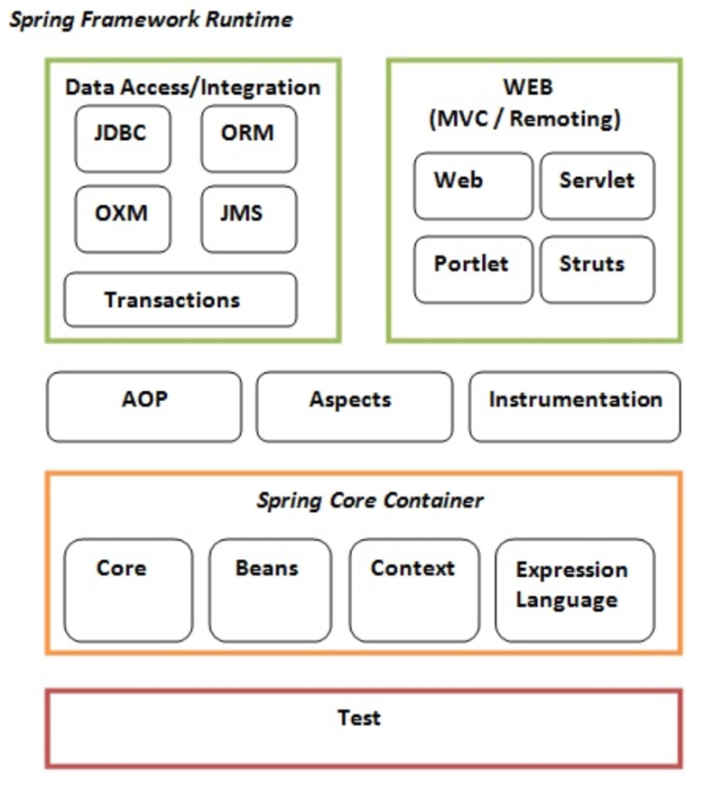
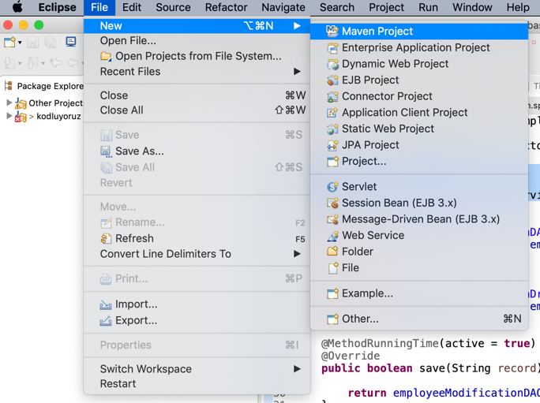
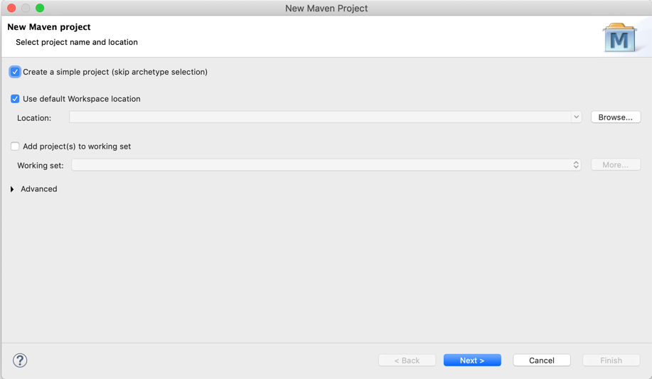
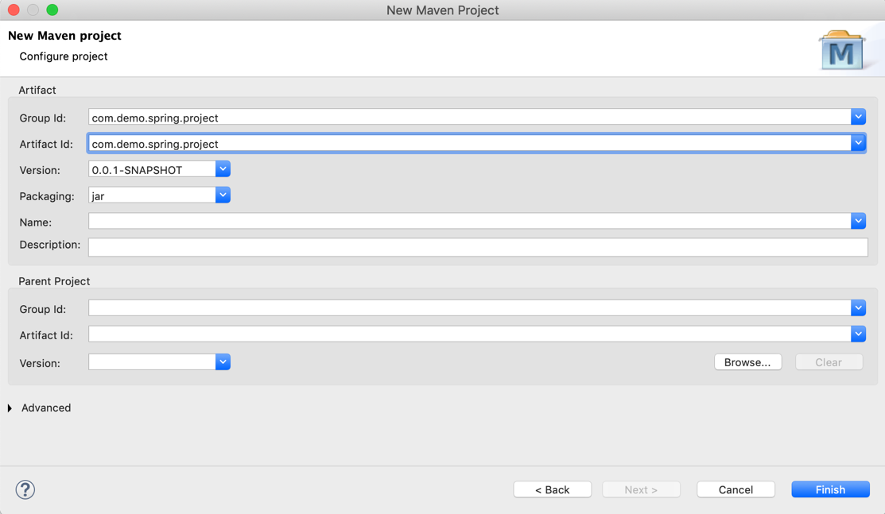
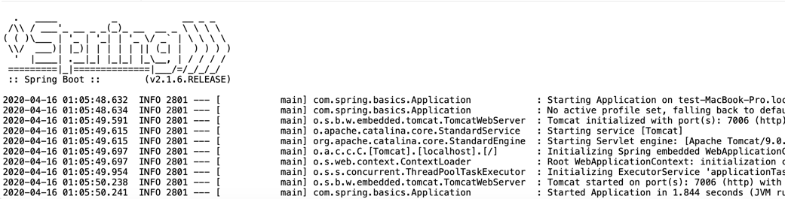
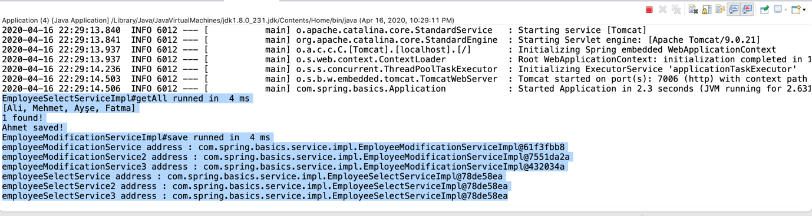

# Spring Framework

Spring Framework, birçok yazılım kütüphanesinin bir araya gelmesiyle ortaya çıkmış yazılım geliştirme platformudur. Spring Core (çekirdek) kütüphanesi en temel yapısıdır. Spring Core olmadan diğer Spring Framework kütüphaneleri de çalışmayacaktır. 

Bu nedenle çekirdek kütüphaneyi proje dahil ederek diğer kütüphaneleri dilediğiniz gibi de seçebilirsiniz. Örneğin, Hibernate, JSF, JSP, Struts gibi birçok Java teknolojisiyle birlikte çalıştırılabilir bir alt yapıdır.

Java’nın gücü topluluklarından gelmektedir. Spring Framework Java Community’lerden (topluluk) bir tanesidir. 2003 yılında ortaya çıkmıştır. Amacı yazılımcıların JavaEE (Java Enterprise Edition) projelerini daha kolay ve verimli bir şekilde geliştirmesini sağlamaktır.

Spring Framework’ün 3 tane önemli özelliği bulunmaktadır. 

-	Inversion Of Control
-	Dependency Injection
-	Aspect Oriented Programming


**Inversion Of Control**

Yazılımlarda sınıfları dizayn edip gerçek hayattaki nesneleri modellemeye çalışırız. Ardından, programımız çalışmaya başladığında tasarladığımız bu sınıflardan nesneler üretmeye başlarız. Nesnelerin birbirine ihtiyaçları olur. Bu kaçınılmaz bir durumdur. 

Tüm yazılımlarda sınıflar ihtiyaç duydukları ek özellikleri veya nitelikleri Inheritance (Kalıtım) yoluyla veya Aggregation (sınıf içinde bir nesne referansı tutarak) yoluyla bünyelerine dahil ederler. Böylece ihtiyaç duydukları fonksiyonları veya değişkenleri kullanabilirler.

Nesneler arası bu bağımlılıklar ve dolayısıyla bu nesnelerin yaşam döngüsü yazılımcı sorumluluğundadır. Nesnenin yaşam döngüsünden kastımızda nesneleri yazılımcıların yazdığı programlar üretirler, nesnelerin hafızadan temizlenmesi işi ise Garbage Collector (Çöp Toplayıcı) sistemine aittir. 

Bu hafıza temizleme mekanizması Java’nın yazılımcılara sunduğu bir alt yapıdır. Böylece, yazılımcılar nesneleri hafızadan temizlemekle uğraşmazlar ve hafıza yönetimini Java’nın sorumluluğuna bırakırlar.

İşte nesneler arası bu bağımlılıkların ve nesnelerin yaşam döngüsünün sorumluluğunun yazılımsal bir framework’e teslim edilmesine Inversion Of Control denir. Spring Framework bu sorumluluğu yazılımcıdan alıp kendisi üstlenir.

Gerektiğinde Spring Framework devreye girip yapması gerekenleri yaptıktan sonra kodun akışını tekrar yazılımcının koduna teslim eder. Bu mekanizma Spring Framework’ün yer aldığı projelerde program çalıştığı süre boyunca defalarca kez tekrarlanabilir.

**Dependency Injection/Inversion**

Yazılım projelerinde nesneler arası bağımlılıklardan kaçınmanın mümkün olmadığından bahsettik. Çünkü, bu nesneler bir araya gelerek yazılımın çalışmasını sağlarlar. O nedenle bu bağımlılık ne şekilde yönetileceği önemli bir konudur. 

ıkı bağlarla bir araya gelmiş nesnelerle oluşturulan yazılımların kırılganlığı ve kod bakım maliyeti yüksektir. Bir hatayı düzeltirken başka bir kod parçasının çalışmaz hale gelmesi kaçınılmaz olabilir. O nedenle SOLID Prensiplere, Nesneye Dayalı Programlama ilkelerine uygun kod yazmak yazılım bakım düşürdüğü gibi kaliteli bir yazılım projesinin oluşmasına olanak verir. Bu noktada Tasarım Desenleri de elimizi güçlendirir.

Nesneler arası bağımlılık konusuna dönecek olursak temel prensibimiz nesneler arasında gevşek bağlı (Loosely Coupled) ilişkiler oluşturmaktır. Tabi bunun sözel bir şekilde ifade edilmesi çok büyük bir anlam uyandırmayabilir. O nedenle bir örnek vererek açıklamaya çalışalım. Diyelim ki bir e-ticaret sitesinde alışveriş sepetinin toplam ücretini hesaplayıp ödeme yapabilen PaymentService isminde bir sınıfımız olsun.

Bu sınıf toplam ücreti bir ödeme sistemi vasıtasıyla gerçekleştirsin. Bu ödeme sistemi de BestFastPay isminde bir ödemesi sistemi olsun. PaymentService sınıfı Aggregation yoluyla BestFastPay isimli nesneye bağımlılığı olduğunu düşünelim. Dolayısıyla PaymentService sınıfı içinde BestFastPay sınıfından bir nesnenin değişken olarak bulunması doğaldır.

```java
public PaymentService {

	private BestFastPay paymentIntegrator;

	public PaymentService() {
		this.paymentIntegrator = new BestFastPay();
	}

	public void makePayment() {
		this.paymentIntegrator.charge();
	}

}
```
Yukarıdaki örnekte görüldüğü gibi ihtiyaç duyduğumuz nesne bağımlılığını “new” anahtar kelimesi ile oluşturuyoruz. Böylece PaymentService sınıfı ile BestFastPay ödeme sistemi nesnesi arasında sıkı sıkıya bir bağ kuruyoruz. Çünkü, artık PaymentService sınıfı “BestFastPay” dışında başka bir tip ödeme sistemi ile çalışamayacaktır. 

Ancak, kodun içine girip kurucudaki nesnenin tipini değiştirip yeni ödeme sistemini entegre edebiliriz. Bu durumda Open/Closed prensibe uygun değildir. Yazılan kodların değişime kapalı genişlemeye açık olması lazımdır. Bir sınıfın sadece bir sebeple değiştirilmesi gerekmektedir. İşte bu sıkı bağımlılığı tersine çevirmek gerekmektedir. 

Ayrıca, sınıfın ihtiyaç duyduğu nesneyi direkt olarak PaymentService içinde oluşturmaktansa bağımlılığın dışarıdan gönderilmesi gerekmektedir (Injection).

İleride ödeme sistemini değiştirmek istediğimizde PaymentService sınıfında değişiklik yapmak gerekecektir.

Kod mimarisini aşağıdaki gibi değiştirirsek gevşek bağlı bir yapı kurmuş olacağız (Loosely Coupled). 

Öncelikle ödeme sistemlerinin hepsi ödeme yapan bir fonksiyona sahiptir. Bu fonksiyon double tipte bir toplam fiyat bilgisi alır ve ödemeyi gerçekleştirir. Ödemeyi gerçekleştirdiği algoritma ve yöntem ödeme sistemlerinin hepsinde birbirinden farklı olabilir. Bu nedenle ödeme yapabilme özelliğini interface olarak soyut bir şekilde tanımlıyoruz. Çünkü, bu özellik alt sınıflarda kendi ihtiyaçlarına göre doldurulacaktır.

```java
public interface PaymentIntegrator {

	public boolean charge(double totalPrice);

}
```
Sonrasında tüm ödeme sistemleri yukarıdaki interface’den kalıtım alacaktır. Böylece ödeme sistemi sınıflarımı soyutlaştırarak tek bir interface altında toplayabiliyorum. “BestFastPay” ve “SuperFastPay” isminde iki tane ödeme sistemimiz olduğunu düşünün.

```java
public BestFastPay implements PaymentIntegrator {

	public boolean charge(double totalPrice) {
		// make best fast payment ...
	}

}

public SuperFastPay implements PaymentIntegrator {

	public boolean charge(double totalPrice) {
		// make super fast payment ...
	}

}
```
En başında belirttiğimiz gibi PaymentService sınıfı alışveriş sepetini hesaplayıp bağımlılık yoluyla bünyesinde barındırdığı herhangi bir ödeme sistemiyle ödemeyi gerçekleştirecektir. İşte bu noktada ödeme sisteminin ne olduğundan bağımsız bir kod parçası yazmalıyız ki ileride ödeme sistemi değiştiğinde PaymentService sınıfı bundan etkilenmesin. 

Bu noktada elimizde soyutlama gücünü arttıran interface’ler bulunmaktadır. Zaten bizler de ödeme sistemlerimizi tek bir interface tipinden kalıtım aldırmıştık. Böylece, PaymentService sınıfına ödeme sistemlerinden herhangi bir alt sınıfı bağımlılık olarak vermek yerine direkt olarak interface ile temsil edebiliriz. Böylece PaymentService sınıfı hangi ödeme sistemini tuttuğundan haberdar olmadan ödemeyi gerçekletirebilir.

```java
public PaymentService {

	private PaymentIntegrator paymentIntegrator;

	public PaymentService(PaymentIntegrator paymentIntegrator) {
		this.paymentIntegrator = paymentIntegrator;
	}

	public void makePayment() {
		this.paymentIntegrator.charge();
	}

}
```
Yukarıdaki örnekte de görüldüğü gibi PaymentService artık interface tipinde bir ödeme entegratör nesnesi tutmaktadır. Ayrıca, “new” kelimesi ile direkt bir nesne oluşturmuyoruz bu bağımlılığın kurucu metot üzerinden dışarıdan gönderilmesini sağlıyoruz. Böylece ileride PaymentService sınıfı BestFastPay ödeme sisteminden SuperFastPay ödeme sistemine geçtiğinde PaymentService sınıfındaki kodlarımız değişmeyecektir. Bu yolla Open/Closed prensibi de sağlamış oluyoruz.

İşte Spring Framework yazılımcıların yönettiği bu bağımlılıkların yönetilmesi sorumluluğunu kendi üzerine almaktadır. Ve Dependency Injection yöntemiyle ihtiyaç duyulan bağımlılığı Spring devreye girip yazılımcıya kullanıma hazır olacak şekilde sunmaktadır. 

Bağımlılığın da yaşam döngüsünü kendisi yönetmektedir. Spring Framework de bağımlılık yönetiminde interface’e dayalı bir yol izlenmesini beklemektedir. Interface’e dayalı Dependency Injection yukarıdaki gibi soyutluluğu arttırarak nesneler arası gevşek bağların kurulmasına yardımcı olmaktadır.

## **Aspect Oriented Programming (AOP)**

Spring Framework AOP’yi sıkı sıkıya destekler. AOP yöntemiyle yazdığımız projenin kodlarında belli noktaları keserek, kestiğimiz bu kesişim olan noktalarda bazı kodların bizim müdahalemiz olmadan otomatik olarak çalıştırılmasını isteyebiliriz. Bu kesişen noktalarda kodların otomatik çalıştırılması işi yine Spring Framework ile Aspect’lerin birlikte çalışmasıyla sağlanabilir.

Spring Framework bu programlama yöntemini destekler. Örneğin projenizde tüm fonksiyonların çalışma sürelerini ölçmenizi istediklerini düşünün. Bu durumda her fonksiyon içine girip tek tek çalışmasını ölçen kodları yazmak gerekecektir. Fakat, AOP’yi kullanarak bu fonksiyonları işaretleyip fonksiyonlar çalıştırıldığı esnada süre ölçmeyi sağlayan kodlar otomatik devreye girer ve süre ölçümünü loğlar. 

Bu kodların otomatik olarak devreye alınması ve sonra yine kod akışının yazılımcının koduna bırakılmasını Spring ve Aspect’ler sağlar. Böylece, her fonksiyona defalarca aynı kodu yazmaktan bizi kurtarır.

Aspect’leri de yine biz yazılımcılar tasarlarız, hatta aspect hangi işleri yapacağını da biz kodlarız. Fakat, bu kodun devreye alınıp otomatik olarak çalıştırılması ve tekrardan sorumluluğu yazılımcının koduna devretmesi Spring Framework ile olmaktadır. AOP de Spring Framework’ün güçlü bir özelliğidir.

**Spring Çekirdek Mimarisi**

Spring Framework ile nesne bağımlılıklarını yönetme işini çözüyoruz. Aynı zamanda Spring Framework içinde kurumsal anlamda yazılım geliştirmek için birçok kütüphane bulunmaktadır. Veri tabanına erişimden, web uygulamaları için gerekli olan kütüphanelere kadar geniş bir kütüphane yelpazesi vardır.



## **Spring Core**

Spring Core kütüphanesi çekirdek kütüphanedir. Bağımlılıkların yönetiminin yapıldığı yerdir. İçinde Core ve Beans nesneleri vardır, bu nesne ile yazılımın çalışma süresi boyunca Spring yöneteceği bağımlılıkları bu modüllerde yönetir. Spring Framework’de Bean olarak tanımlanmış sınıflar Context modülünde toplanılır. Yazılım çalışma zamanında ihtiyaç duyulan nesne bağımlılıkları Context üzerinden kullanıma sunulur.

## **Spring Test**

Spring Framework ile JUnit testlerin çalıştırılmasını sağlayan alt yapıdır.

## AOP (Aspect Oriented Programming)

Aspect tanımlayarak kodu belli noktalarda kesen ve ardından kestiği bu noktalarda otomatik olarak çeşitli kodlar çalıştırabilen mekanizmayı sağlar. Yukarıda detayları mevcuttur.

## **Data Access**

Spring Framework’ün veri tabanı yönetim sistemleriyle etkileşime geçmek için sunduğu alt yapıdır. Biliyoruz ki tüm kurumsal projeler verileri veri tabanı sistemlerinde saklamaktadırlar. Dolayısıyla yazdığımız projeler illaki veri tabanlarıyla iletişim halinde olacaklardır. Spring’in bu kütüphaneleri buna olanak tanımaktadırlar. JDBC, ORM Kütüphanelerini kullanımı, Transaction yönetimi gibi sorumlulukları bu kütüphane yerine getirir.

## **Web**
Spring Framework ile web uygulamaları geliştirebilmek için gerekli kütüphaneleri sağlar. Java Web-Servlet, Web-Portlet gibi teknolojilerle çalışabilmeyi kapsar.

## **Spring Uygulaması Oluşturmak**

Spring uygulaması oluşturmak için çeşitli ayarlar yapılması gerekmektedir. Bu ayarları Annotation (Etiket) tabanlı veya XML tabanlı yapabilirsiniz. Spring ilk çıktığı zamanlar XML ile ayalar yapmak yaygındı. Fakat, sonrasında bu daha kolay hale getirildi. Artık, neredeyse tüm konfigrasyon Annotation üzerinden yapılmaktadır.

Yazdığımız sınıfları Core, Beans altyapılarını kullanarak Spring’in Context modülüne eklemeliyiz. Spring Context’te yer almayan bir sınıf uygulama içinde Spring Framework tarafından nesne bağımlılığı olarak sunulamaz. Bu nedenle çeşitli tanımlamalar yaparak ilgili sınıfı Spring Context’e dahil etmek gerekmektedir.

Örneğin Salary isminde maaş bilgisini tutan bir sınıfımız olsun. Bu maaş bilgilerini de JSON veri formatına çeviren basit sınıf tasarladığınızı düşünün. Aşağıda “SalaryJsonConverter” isimli sınıf bulunmaktadır. Normal bir Java sınıfı tasarladık. Henüz ekstra bir özelliği yok ve Spring Context’e dahil edilmiş değil.

```java
public class SalaryJsonConverter {

	public String convertToJson(Salary salary) throws JsonProcessingException {
		
		ObjectMapper mapper = new ObjectMapper();
		return mapper.writeValueAsString(salary);
	}
	
}
```
Yukarıdaki sınıfı XML yoluyla Spring Context’e dahil edip Spring tarafından yönetilebilen bir bağımlılık haline getirmek istiyorsak bir XML dosyası oluşturup içine Bean olarak tanımlamak gerekecektir.

```java
<?xml version="1.0" encoding="UTF-8"?>
<beans
    xmlns="http://www.springframework.org/schema/beans"
    xmlns:xsi="http://www.w3.org/2001/XMLSchema-instance"
    xmlns:context="http://www.springframework.org/schema/context"
    xmlns:util="http://www.springframework.org/schema/util"
    xmlns:aop="http://www.springframework.org/schema/aop"
    xsi:schemaLocation="
        http://www.springframework.org/schema/beans    http://www.springframework.org/schema/beans/spring-beans-4.3.xsd
        http://www.springframework.org/schema/context  http://www.springframework.org/schema/context/spring-context-4.3.xsd
        http://www.springframework.org/schema/aop      http://www.springframework.org/schema/aop/spring-aop-4.3.xsd
        ">
    
    <bean id="jsonConverter" class="com.spring.webapplication.service.json.SalaryJsonConverter"></bean>
    
</beans>
```
Yukarıdaki gibi “applicationContext.xml” isminde bir dosya tanımladık. Bu Spring Framework için özel bir XML dosyasıdır. Spring Context’e dahil etmek istediğimiz sınıfları Bean olarak tanımlayıp kullanabiliriz.

```java
@Component
public class SalaryJsonServiceImpl {

	@Autowired
	private SalaryJsonConverter jsonConverter;
	
	
	public String convertToJson(Salary salary) throws JsonProcessingException {
		
		return jsonConverter.convertToJson(salary);
	}
}
```
Yukarıda “SalaryJsonConverter” sınıfından bir nesne bağımlılık olarak “SalaryJsonServiceImpl” sınıfında Dependency Injection yoluyla eklenmiştir. Spring Framework Context’in de olan bir bağımlılığı kullanmak için “@Autowired” anahtar kelimesi kullanılır. 

Böylece Spring Framework, Context’ten bu sınıfa ait bir nesneyi burada kullanılabilir bir nesne olarak kullanıma sunar. Dikkat ederseniz “new” anahtar kelimesi ile bu bağımlılığı biz oluşturmuyoruz. Spring “SalaryJsonConverter” sınıfından bir nesne üretip bizim kullanımımıza sunuyor. Bağımlılığı bizim yerimize kendisi yönetiyor. 

Üzerine düşen sorumluluğu yerine getirmek için devreye giriyor, bağımlılığı hazırlayıp bize teslim ediyor. Ardından kodun kontrolünü yazılımcıya tekrardan devrediyor.

XML ile Bean tanımı yapmadan da Spring Context’e Bean ekleyip bağımlılık olarak kullanabiliriz. Bunun içinde Annotation (Etiket) tabanlı yöntemi kullanıyoruz.

```java

@Configuration
public class ApplicationConfig {
	
	@Bean
	public SalaryJsonConverter getSalaryJsonConverter() {
		
		return new SalaryJsonConverter();
	}
}
```
Yukarıdaki örnekte “ApplicationConfig” sınıfı ile XML dosyası yerini tutan ayarlar sınıfını tasarlıyoruz. Spring Framework ile ilgili konfigürasyonları böylelikle etiket (annotation) tabanlı yöntemlerle bu sınıf üzerinde tanımlayabiliriz.

Dikkat ederseniz “SalaryJsonConverter” isimli sınıfımızı “@Bean” etiketi ile Spring Context’e dahil ediyoruz. Böylece, artık Spring tarafından bir nesne bağımlılığı olarak projede kullanılabilecek.

### Spring Bean Annonations (Etiketleri)

Spring Framework’de bir Java sınıfını Bean olarak ayarlamak için birden fazla yol bulunmaktadır. XML konfigürasyon tanımıyla ve @Bean etiketiyle (Annotation) Java sınıflarını Spring Bean olarak tanımlayabiliriz. Bu tanımlama biçimini yukarıdaki örneklerde ele almıştık. Bu yöntemler dışında Spring Framework’ün Bean tanımlamak için var olan etiketlerini kullanarak da Java sınıflarını Spring Bean olarak tanımlama şansına sahipsiniz.

Bu etiketler aşağıdaki gibidir:

-	@Component
-	@Service
-	@Repository
-	@Controller
-	@Configuration
-	@Aspect

Spring Framework’te ister XML tabanlı konfigürasyon olsun isterse de Etiket (Annotation) tabanlı konfigürasyon olsun her iki yöntemde de Spring Bean’lari tek tek tanımlamak zorunda değilsinizdir. Spring Framework belirttiğiniz Java paketleri (package) altında yer alan sınıfları tarayarak yukarıda bahsettiğimiz etiketler ile işaretlenmiş sınıfları Spring Bean olarak Spring Context içine dahil edebilir.

Artık Spring dünyasında etiket tabanlı ayarlama yaygın olduğu için ve bu yöntemin daha kolay, verimli olmasından dolayı Spring konfigürasyonlarınızı etiket tabanlı yöntemle yapmanız daha uygun olacaktır.

@ComponentScan etiketi ile bir veya birden fazla Java package altında bulunan @Component, @Service, @Repository, @Controller, @Configuration, @Aspect etiketlerinden birine sahip sınıfları tarayıp Spring Context’e dahil edebiliyoruz.

Aşağıda Spring Framework bulunan bir projedeki etiket tabanlı konfigürasyonu görüyorsunuz.

```java
@Configuration
@ComponentScan(basePackages = { 
		"com.spring.basics.dao.impl",
		"com.spring.basics.console",
		"com.spring.basics.service.impl",
		"com.spring.basics.aspect"})
public class ApplicationConfig {

}
```
@ComponentScan ile yukarıda 4 tane Java package Spring Framework taranacak ve sınıflar Spring Context’e dahil edilecektir.

## **@Componet Etiketi**

Bu etiket sınıf tanımı üstünde kullanılabilir. Yukarıda @ComponentScan ile Spring Framework’ün paketleri taradığından bahsetmiştik. Eğer ki taradığı sınıflar içinden @Component etiketiyle işaretlenmiş bir sınıf görürse bunu Spring Context’e dahil ediyor. Böylece, Spring Context’e dahil ettiği sınıfları yazılım geliştirirken bir nesne bağımlılığı olarak kullanabiliyoruz. Biliyorsunuz ki, @Autowired etiketi ile bir nesne bağımlılığı ilgili sınıfa inject edilebilir. Buna Dependency Injection diyoruz.

```java
@Component
public class EmployeeSelectService {

	// Java codes

}
```
## **@Repository Etiketi**

DAO veya Repository sınıfları veri tabanıyla etkileşim içinde olan sınıflardır. Bu nedenle bu veri erişimi sağlayan sınıflarda @Repository etiketi kullanabiliriz. Aynı şekilde bu katmandaki sınıflarda @Component etiketi kullanabilirdik.

Hibernate gibi ORM kütüphanesini Spring ile kullandığımızda, @Repository etiketi ile işaertlenmiş bu DAO sınıflarında oluşan hatalar otomatik olarak Spring’in DataAccessException’larına dönüştürülebilir. Böylece hataya ilişkin daha detaylı bilgi edinmiş oluruz.

```java
@Repository("employeeModificationDraftDAOImpl")
public class EmployeeModificationDAO {

	// Java codes
}
```
## **@Service Etiketi**

DAO katmanı ile veriye erişim sağlıyorduk. Service katmanı ise iş mantığını kodladığımız katmandır. Burada iş akışları yer alır. Mesela bir e-ticaret sitesinde ödeme akışı Service katmanında kodlanır. Ya da bankacılık uygulamasında para transferi akışı yine Service katmanında kodlanır. Bu sınıfları etiketlemek için @Service etiketi kullanılabilir. Aynı şekilde bu katmandaki sınıflarda @Component etiketi kullanabilirdik.

```java

@Service
public class EmployeeSelectService {

	// Java codes
}
```
## **@Controller**

Bu etiket daha çok web katmanı için kullanılır. Örneğin Spring MVC kütüphanesi ile REST katmanı yazdığımızı düşünelim. Bu durumda REST servisi için tasarladığımız sınıfları @Controller etiketi ile ifade edebiliriz.
```java
@Controller
public class VehicleController {
	
    // Java codes
}
```
## **@Configuration Etiketi**

Spring Framework ile ilgili konfigürasyonları etiket tabanlı yapabileceğinizden bahsetmiştik. Java tarafında bu konfigürasyon sınıflarını tanımlamak için @Configuration etiketi kullanılır. Böylece, Spring Framework bu sınıfın bir konfigürasyon sınıfı olduğunu anlar. Biliyorsunuz ki konfigürasyon sınıflarında Bean tanımları yapılabilir. Aynı şekilde hangi Java paketleri altında tarama yapılacağı belirtilerek Spring Context’e Spring Bean’leri otomatik olarak eklenir.

```java
@Configuration
@ComponentScan(basePackages = { 
		"com.spring.basics.dao.impl",
		"com.spring.basics.console",
		"com.spring.basics.service.impl",
		"com.spring.basics.aspect"})
public class ApplicationConfig {

	@Bean
	public EmployeeModificationService getEmployeeModificationService() {
		
		return new EmployeeModificationServiceImpl();
	}
}
```
Yukarıdaki örnekte 4 Java paketini tarayıp Bean olabilecek sınıfları Spring Context’e ekliyoruz. Yukarıda saydığımız Bean etiketlerinden herhangi birini sınıf tanımında bulunduran sınıf Spring Context’e dahil edilir. Aynı zamanda konfigürasyon sınıfımızda “EmployeeModificationService” tipinden bir sınıfı Bean olarak Spring Context’e dahil ediyorum. @Bean etiketiyle belirttiğimiz nesne artık Spring Context’te kullanabileceğimiz bir dependency (bağımlılık) olarak eklenmiş durumdadır.

## **@Aspect Etiketi**

Spring, AOP yöntemini destekleyen bir framework’tür. Spring projesinde bir Aspect sınıfı tanımlamak istiyorsak @Aspect etiketini kullanmalıyız.

```java
@Aspect
@Component
public class MethodRunningTimeAspect {

	// Java codes
}
```
#### Spring Bean Scopes (Kapsam)

Spring Bean Scope kavramı Spring Context’e dahil ettiğimiz nesnelerin yaşam süresini (Context’ten erişim biçimini) ve döngüsünü ifade eder. 


-	singleton
-	prototype
-	session
-	application
-	request

Yukarıda belirtilen Spring Bean Scope belirteçleri vardır. Bu belirteçlerin her biri Spring Context’te yer alan nesnelerin ne şekilde üretilip kullanılabileceğini belirtir.

Kapsamlar @Scope etiketi ile belirtilir. Hemen Spring Bean etiketi altında yer alır.

“singleton” Scope

“singleton” olarak belirtilmiş bir nesne bağımlılığı Spring Context içinde tekil bir nesne olarak tutulur. Bu nesne örneğine ihtiyaç duyan herkese aynı nesne referansı verilir. Yani, Spring Context’te ilgili sınıftan üretilmiş sadece bir nesne tutulur. Dolayısıyla yazılımı geliştirirken bu nesneye bağımlılık duyup @Autowired ile inject ettiğimiz her noktada Spring Context bize aynı nesneyi verecektir.

```java
@Service
@Scope(value = "singleton")
public class EmployeeSelectService {

	// Java codes
}
```
“prototype” Scope

“prototype” olarak belirtilmiş sınıflarda ise Dependency Inject ile (@Autowired ile) nesne bağımlılığı eklediğimiz her noktada Spring Context ilgili sınıfa ait yeni bir nesne üretip verecektir. Yani her @Autowired çağrımızda yeni bir nesne almış olacağız.

```java
@Service
@Scope(value = "prototype")
public class EmployeeModificationService {

	// Java codes
}
```
Yukarıda bahsettiğimiz “singleton” ve “prototype” kapsamları her tip Spring projesinde kullanılabilir. Fakat, “session”, “request” ve “application” kapsamları sadece web projelerinde kullanılabilir.


“request” Scope

“request” scope olarak tanımlanmış bir sınıf için Spring Context’ten bir nesne bağımlılığı talep edildiğinde her http isteğine karşılık yeni bir nesne örneği oluşturur. “prototype” gibidir. “request” scope olarak işaretlenmiş bir sınıfı proxy (temsili) bir örneği oluşturulur. Bunun sebebi Bean oluşturulurken henüz ortada bir http isteği yoktur. Bu nedenle proxy nesne oluşturulur.

```java
@Bean
@Scope(value = WebApplicationContext.SCOPE_REQUEST, proxyMode = ScopedProxyMode.TARGET_CLASS)
public HelloMessageGenerator requestScopedBean() {
    return new HelloMessageGenerator();
}
```

“session” Scope

“session” scope olarak belirtilmiş bir sınıfın nesne örneği HTTP Session oluştuğunda yaratılır. Session boyunca da kullanılır.

```java
@Bean
@Scope(value = WebApplicationContext.SCOPE_SESSION, proxyMode = ScopedProxyMode.TARGET_CLASS)
public HelloMessageGenerator sessionScopedBean() {
    return new HelloMessageGenerator();
}
```
“application” Scope

Web uygulaması yaşamına devam ettiği sürece “application” scope olarak oluşturulmuş nesneler tek bir nesne örneği oluşturulmuş şekilde kullanılacaktır. Yani burada web uygulamasının yaşam süresi ServletContext’in yaşam süresine bağlıdır. Aynı ServletContext’i paylaşan birden çok web uygulaması da yine “application” scope olarak belirtilmiş singleton (tekil) nesne örneğini kullanabilecektir. Bu özelliğiyle “application” scope “singleton” scope’dan ayrılır. “singleton” scope sadece ilgili uygulamanın yaşam süresi boyunca tekillik sağlar.

```java
@Bean
@Scope(
  value = WebApplicationContext.SCOPE_APPLICATION, proxyMode = ScopedProxyMode.TARGET_CLASS)
public HelloMessageGenerator applicationScopedBean() {
    return new HelloMessageGenerator();
}
```
##### Spring Boot

Spring Boot, Spring Framework ailesinin bir alt modülüdür. Spring Boot ile yazılımcıların hızlı geliştirme yapabilmesi sağlanmaya çalışılmıştır. Gerçekten çok hızlı bir şekilde diğer gereksiz detaylara takılmadan sıfırdan bir web uygulaması geliştirmek çok basittir.

Spring Boot, yazılımcıların yeni nesil geliştirme aracıdır. Özellikle “starter” isimli bağımlılıklara (dependency) dayalıdır. Buradaki bağımlılıktan kastettiğimiz Maven veya Gradle gibi bağımlılıkların yönetildiği alt yapılarda kullandıklarımızdır. 

Özetle, ihtiyacımız olan Java kütüphanelerini ifade eder. Biliyoruz ki Maven ve Gradle bu kütüphane bağımlılığını yönetmek için geliştirilmiş alt yapılardır. “starter” bağımlılıkları birbiriyle uyumlu versiyonda olan tüm kütüphaneleri bir araya getirmiştir.

Örneğin Maven projenizde aşağıdaki gibi web geliştirme yapabilmek için bir starter bağımlılığı eklediğinizde web için ihtiyacınız olan tüm kütüphaneler eklenecektir. Eklenen bu kütüphaneler topluluğu birbiriyle en uyumlu şekilde çalışan versiyonlardan oluşacaktır. Böylece hangi kütüphane hangi versiyon ile uyumluydu diye ayrıca efor harcayıp uğraşmayacaksınız.

```java
<dependency>
	<groupId>org.springframework.boot</groupId>
	<artifactId>spring-boot-starter-web</artifactId>
</dependency>
```
Spring Boot projeleri web uygulaması olarak tasarlansa bile “jar” uzantılı çalıştırılabilir bir çıktı üretir. Spring Boot içinde gömülü olarak bir web uygulama sunucusu taşıdığı için bu “jar” uzantılı çalıştırılabilir dosyalar web uygulaması olarak çalışabilir. Bu gömülü web uygulama sunucusu Tomcat vb araçlardır.

Klasik yöntemde Java web uygulamaları “war” uzantılı dosyalar olarak üretilir. Spring Boot bu açıdan da farklıdır. “jar” olarak web uygulaması üretilmesi komut satırından çalıştırılabilen web uygulamaları anlamına gelmektedir. Bu yönüyle microservices mimarisi için de uygundur.  

## **Spring Boot Otomatik Konfigürasyon**

Bildiğimiz üzere Spring Framework ile proje geliştirmek için XML tabanlı bir yöntemle veya etiket (Annotation) tabanlı bir yöntemle konfigürasyonlar yapmak gerekiyordu. Spring Boot ile artık siz hiçbir konfigürasyon tanımlamasanız bile Spring Boot kendisi classpathleri, Java package’ları otomatik olarak tarayıp gereken en iyi konfigürasyon kendisi arka planda oluşturma yeteneğine sahiptir. Böylece, biz yazılımcılar bir konfigürasyon yapmasak bile Spring Boot uygulamaları varsayılan bir konfigürasyon ile kendisi ayağa kalkabilmektedir.

@EnableAutoConfiguration etiketi ile bu özelliği aktif hale getirebilirsiniz.

## **Gömülü Web Uygulama Sunucusu Desteği**

Spring Boot ile gömülü web uygulama sunucusu desteği gelmektedir. Spring Boot uygulamaları bilindiği üzere “jar” uzantılı çalıştırılabilir dosyalar vermektedirler. Bu “jar” dosyası içinde gömülü bir web uygulama sunucusu ile oluşturulur. Örneğin içinde gömülü bir Tomcat bulunur. “jar” uygulaması çalıştırıldığında Tomcat ayağa kalkıp web uygulamasını kendi bünyesinde çalıştırmaya başlar. Böylece bir web uygulama sunucusu bulma derdi ortadan kalkar.

Varsayılan olarak Tomcat web uygulama sunucusu olarak gömülü gelir. Fakat, bunu değiştirme şansımız vardır. Örneğin aşağıdaki örnekte Tomcat yerine Jetty web uygulama sunucusu eklenmiştir.

```java
<dependency>
    <groupId>org.springframework.boot</groupId>
    <artifactId>spring-boot-starter-web</artifactId>
    <exclusions>
        <exclusion>
            <groupId>org.springframework.boot</groupId>
            <artifactId>spring-boot-starter-tomcat</artifactId>
        </exclusion>
    </exclusions>
</dependency>
 
<dependency>
    <groupId>org.springframework.boot</groupId>
    <artifactId>spring-boot-starter-jetty</artifactId>
</dependency>
```
“<exclusion>” XML etiketleri arasında yer alan ifadeyle “spring-boot-starter-web” bağımlılığı içinden Tomcat web uygulama sunucusu çıkartılmıştır. Aşağıda onun yerine “spring-boot-starter-jetty” bağımlılığı eklenerek varsayılan web uygulama sunucusu değiştirilmişti.

##### Spring Boot Application

Yukarıda Spring Boot ile temel özelliklerden bahsettik. Bir Spring Boot projesini Maven ve Gradle ile bir Java projesi açıp oluşturabilirsiniz. Spring Boot ile ilgili “starter” kütüphaneleri ekleyebilirsiniz. Tüm bunların ardından uygulamanızın Spring Boot projesi olduğunu belirtmek için bir hamle daha yapmanız gerekmektedir. @SpringBootApplication etiketiyle bir sınıf oluşturup tanımlama yapmak gerekmektedir. 

@SpringBootApplication etiketi tanımlayarak @Configuration, @EnableAutoConfiguration ve @ComponentScan etiketlerini bir arada tanımlamış gibi olursunuz. Bu üçünün de işlevini yerine getirir.

Spring Boot uygulaması ayağa kalkarken tüm paketleri ve classpath’leri tarayarak oluşturması gereken Bean’leri, bağımlılıkları ve konfigürasyonları Spring Context’e ekleyerek çalışmaya başlar. Spring Boot uygulamasının çalışabilmesi için @SpringBootApplication olarak işaretlediğimiz sınıfın içinde “static void main” isminde bir fonksiyon olmalıdır. Spring Boot uygulamaları bu fonksiyondan itibaren çalışmaya başlarlar.

```java
@SpringBootApplication
public class Application {

	public static void main(String[] args) {
		SpringApplication.run(Application.class, args);
	}
}
```
Yukarıda örnek bir Spring Boot Application sınıfı verilmiştir.

Spring Boot uygulamalarında çeşitli konfigürasyon bilgilerini “application.properties” isimli özel bir dosyada saklayabilirsiniz. Spring Boot bu özel dosyayı okuyup gerekli ayarlamaları yapmaktadır. Bu dosya genelde “src/main/resources” gibi bir Resource dosyasında bulunur.

### Server port ####
server.port=8080

Yukarıdaki örnekte “application.properties” dosyasında web uygulama sunucusunun, ki örneğimizde Tomcat sunucusunun port numarası belirtilmiştir. Spring Boot uygulaması “localhost” üzerinden 8080 nolu portta hizmet vermeye başlayacaktır.

**Spring Boot Avantajları**

-	Bağlılıklardaki ve kütüphanelerdeki versiyon uyumsuzluklarının önüne geçmektedir.
-	Classloader’ın çalışma süresini minimize eder. Hızlı bir şekilde uygulamanın ayağa kalkmasını sağlar.
-	“starter” bağımlılıklarla ve otomatik konfigürasyon seçenekleriyle hızlı geliştirme yapmayı sağlar. XML tabanlı konfigürasyonun getirdiği zorlukları ve hantallığı azaltır.
-	Gömülü basit bir web uygulama sunucusu barındırır. Tomcat veya Jetty gibi.
-	Eclipse ve IntelliJ gibi IDE ile mükemmel bir entegrasyonu vardır.

**Eclipse üzerinden Spring Boot Projesi Oluşturmak**

Eclipse üzerinden “New Project” diyerek yeni bir Maven projesi oluşturulur.



“Create a simple project” seçeneği seçilerek devam edilir.



Projenin Group Id ve Artifact Id alanları doldurulur. “Packaging” tipi “jar” olarak bırakılır.



Projede “com.spring.basics” isminde bir Java package oluşturulur.

Ardından “pom.xml” dosyasına gidip Spring Boot ile ilgili ayarlamalar yapılır.

İlk önce “pom.xml” dosyasına “spring-boot-starter-parent” bağımlılığı eklenir. Bu ana bağımlılık diğer eklentileri ve bağımlılıkları yönetmek için vardır. Kısacası projenin ana modülüdür. Nasıl ki normal maven projelerinde ana (parent) modül bağlayabiliyorduk. Spring Boot için de ana modülümüz “spring-boot-starter-parent” olacaktır.

Ardından gerekli “starter” bağımlılıklarımızı ekleyeceğiz ve son olarak “spring-boot-maven-plugin” eklentisini “pom.xml” dosyamıza tanımlayacağız. Bu eklenti ile Spring Boot uygulamalarımızı “jar” uzantılı dosyalar şeklinde paketleyebileceğiz. Örnek “pom.xml” aşağıdaki gibidir.

```java
<project xmlns="http://maven.apache.org/POM/4.0.0"
	xmlns:xsi="http://www.w3.org/2001/XMLSchema-instance"
	xsi:schemaLocation="http://maven.apache.org/POM/4.0.0 http://maven.apache.org/xsd/maven-4.0.0.xsd">
	<modelVersion>4.0.0</modelVersion>
	<groupId>chapter6-spring-basics</groupId>
	<artifactId>chapter6-spring-basics</artifactId>
	<version>0.0.1-SNAPSHOT</version>

	<parent>
		<groupId>org.springframework.boot</groupId>
		<artifactId>spring-boot-starter-parent</artifactId>
		<version>2.1.6.RELEASE</version>
		<relativePath />
	</parent>
	
	<dependencies>

		<dependency>
			<groupId>org.springframework.boot</groupId>
			<artifactId>spring-boot-starter</artifactId>
		</dependency>

		<dependency>
			<groupId>org.springframework.boot</groupId>
			<artifactId>spring-boot-starter-web</artifactId>
		</dependency>
		
		<dependency>
			<groupId>org.springframework.boot</groupId>
			<artifactId>spring-boot-starter-aop</artifactId>
		</dependency>
	
	</dependencies>
	
	<build>
		<finalName>chapter6-spring-basics</finalName>
		<plugins>
			<plugin>
				<groupId>org.springframework.boot</groupId>
				<artifactId>spring-boot-maven-plugin</artifactId>
			</plugin>
		</plugins>
	</build>

</project>
```
“spring-boot-starter”, “spring-boot-starter-web” ve “spring-boot-starter-aop” bağımlılıklarını projemize ekliyoruz. Yapacağımız uygulama henüz veri tabanına bağlanmayacaktır. Spring Bean’lerin kullanımı ve Dependency Injection örnekleri yer alacaktır. Scope’lar ile ilgili örnekler verilecektir.

Son olarak da projemizdeki tüm fonksiyonların ne kadar süre çalıştığını ölçen bir Aspect tasarlayacağız.

“com.spring.basics” paketi altına “Application” isminde bir sınıf oluşturalım. Bu sınıfımız Spring Boot Application sınıfı olacaktır.

```java
@SpringBootApplication
public class Application {

	@MethodRunningTime(active = false)
	public static void main(String[] args) {
		SpringApplication.run(Application.class, args);
	}
}
```
Spring Boot ile ilgili çeşitli ayarların tutalacağı sabit bir dosya tanımlayacağız. “application.properties” isimli bu dosyayı “src/main/resources” altında oluşturuyoruz.

server.port=7006

Şimdilik sadece Tomcat web uygulama sunucusunun hizmet vereceği port bilgisini 7006 olarak belirttik. Bu haliyle uygulamamız çalıştırılmaya hazır.



Yapacağımız örnekte veri tabanına erişim sağlayan bir DAO katmanı olduğunu hayal edelim. Fakat, ilgili DAO katmanı şu an sadece veri tabanına bağlı olarak çalışmayacaktır. Veri tabanına bağlanıyormuş gibi düşüneceğiz. Hibernate konusundan sonra Spring’e ile Hibernate kütüphanesini entegre edeceğiz. O bölümde veri tabanına bağlanan bir DAO katmanımız olacaktır.

Ardından, DAO katmanı ile haberleşen ve iş mantığını (Business Logic) kodladığımız katmanı yazacağız. Bu katmanda Service sınıflarımız olacaktır.

Yukarıdaki iki katmanı hazırladıktan sonra Spring üzerinden bir Java konsol uygulaması hazırlayacağız.

Böylece bu bölümde Dependency Injection, Spring Bean Annotations (Etiketleri) ve Spring Bean Scope’ları bir arada tek bir örnekte kullanacağız.

## **DAO Katmanı**

Önceki adımlarda hazırladığımız “spring-boot-basics” isimli Spring Boot projesine “com.spring.basics.dao” isminde bir Java package oluşturuyoruz. Hazırlayacağımız DAO sınıflarının kullanacağı interface’leri tasarlıyoruz. Biliyoruz ki Spring Framework’te Dependency Injection yöntemiyle bir nesne bağımlılığını kullanmak istediğimizde interface’den kalıtım almış alt sınıf tiplerinden birini tercih etmiyorduk. Onun yerine referans tipini interface tipi olarak vermeyi amaçlıyorduk.

```java
public interface EmployeeModificationDAO {

	public boolean save(String record);
	public boolean update(String record, Long id);
	public boolean delete(Long id);
}

public interface EmployeeSelectDAO {

	public List<String> getAll();
	public String findById(Long id);
}
```
Çalışan veri tabanına bağlanıp çalışan tablosuyla etkileşimde olan DAO katmanımız olduğunu düşünürsek, veriyi sorgulayacak ve veri üzerinde işlem yapacak fonksiyonları barındıran iki tane interface tasarladık. “EmployeeModificationDAO” isimli interface’de tablo üzerinde kayıt eklemek, çıkarmak ve güncellemek için gerekli olan fonskiyonlar tanımlanmıştır.

“EmployeeSelectDAO” isimli sınıfta ise çalışan tablosu üzerinde sorgu işlemleri yapabilecek interface tasarlanmıştır.

“com.spring.basics.dao.impl” Java paketini oluşturup yukarıda tanımladığımız DAO interface’lerden kalıtım alan alt sınıfları oluşturacağız.

```java
@Repository("employeeSelectDAOImpl")
public class EmployeeSelectDAOImpl implements EmployeeSelectDAO {

	@Override
	public List<String> getAll() {
		
		return Arrays.asList("Ali", "Mehmet", "Ayşe", "Fatma");
	}

	@Override
	public String findById(Long id) {
		System.out.println(id + " found!");
		return String.valueOf(id);
	}

}

@Repository("employeeModificationDAOImpl")
public class EmployeeModificationDAOImpl implements EmployeeModificationDAO {

	@Override
	public boolean save(String record) {
		System.out.println(record + " saved!");
		return true;
	}

	@Override
	public boolean update(String record, Long id) {
		System.out.println(record + " updated!");
		return true;
	}

	@Override
	public boolean delete(Long id) {
		System.out.println(id + " record deleted!");
		return false;
	}
}
```
Alt sınıfları tanımladık. Dikkat edilirse bu sınıfları Spring Context’e dahil edilip, Spring Framework üzerinden kullanılabilen bağımlılıklar haline getirebilmek için @Repository etiketiyle işaretledik. İleriki adımlarda bu sınıfların dahil edilebilmesi için Spring konfigürasyon sınıfı tasarlayacağız.

Bu konfigürasyon sınıfında Spring Framework’ün hangi paketleri taraması gerektiğini belirteceğiz. Böylece @Repository olarak işaretlediğimiz sınıflar Spring Context’e dahil olmuş olacaktır.

@Repository(“employeeSelectDAOImpl”) tanımlamasıyla çift tırnaklar arasında oluşacak Spring Bean’e bir isim veriyoruz. Bu isim belirleme konusu yazılımcının isteğine bağlıdır. Dilediğiniz ismi verebilirsiniz.

**Service Katmanı**

Temsili de olsa artık bir DAO katmanımız mevcut hale geldi. Şimdi iş mantığını kodladığımız Service katmanı hazırlayacağız. Service katmanı hem Java konsol katmanı ile hem de DAO katmanı ile konuşacaktır. Burada Sunum katmanı olarak Java konsol uygulamasını kullanıyor olacağız.

“com.spring.basics.service” isminde Service katmanındaki sınıflara kalıtım verecek olan interface’leri tasarlıyoruz.

```java
public interface EmployeeModificationService {

	public boolean save(String record);
	public boolean update(String record, Long id);
	public boolean delete(Long id);
}

public interface EmployeeSelectService {

	public List<String> getAll();
	public String findById(Long id);
}
```
“com.spring.basics.service.impl” paketini oluşturup yukarıda tanımladığımız interface’lerden kalıtım alacak olan alt sınıfları oluşturuyoruz.

```java
@Service
@Scope(value = "singleton")
public class EmployeeSelectServiceImpl implements EmployeeSelectService {

	
	@Autowired
	private EmployeeSelectDAO employeeDAO;
	
	
	@Override
	public List<String> getAll() {
		
		return employeeDAO.getAll();
	}

	@Override
	public String findById(Long id) {
		
		return employeeDAO.findById(id);
	}
}

@Service
@Scope(value = "prototype")
public class EmployeeModificationServiceImpl implements EmployeeModificationService {

	@Autowired
	private EmployeeModificationDAO employeeModificationDAO;
	
	
	@Override
	public boolean save(String record) {
		
		return employeeModificationDAO.save(record);
	}

	@Override
	public boolean update(String record, Long id) {
		
		return employeeModificationDAO.update(record, id);
	}
	
	@Override
	public boolean delete(Long id) {
		
		return employeeModificationDAO.delete(id);
	}

}
```
Tanımladığımız sınıfların en üstüne @Service etiketini ekleyerek bu sınıfları Spring Context’e dahil edilebilir diye şekilde işaretliyoruz. 

Ayrıca, önceki konularda da bahsettiğimiz gibi oluşacak Spring Bean’lere çeşitli kapsam (scope) belirlemeleri yapıyoruz. @Scope etiketi ile bir Spring Bean’in ne zaman ve nasıl yaratılacağını belirleyebiliyorduk.

“EmployeeSelectServiceImpl” sınıfını @Scope(value = “singleton”) yazarak bu sınıftan oluşturulacak nesnenin uygulama ayakta kaldığı süre boyunca tek bir nesne olacağını söylüyoruz. Projenin herhangi bir yerinde bu sınıfa ait bir nesneyi bağımlılık olarak talep ettiğimizde Spring Context bu sınıfın aynı nesne referansını döndürecektir. Biliyoruz ki @Autowired etiketiyle nesne bağımlılığını istediğimiz sınıfta inject edebiliriz.

“EmployeeModificationServiceImpl” sınıfının kapsamını ise “prototype” olarak belirttik. Böylece, her @Autowired etiketiyle nesne bağımlılığı eklediğimizde Spring Context bu sınıftan yeni bir nesne üretip kullanıma sunacaktır.

**Spring ile Java Konsol Uygulaması Çalıştırmak**

“com.spring.basics.console” Java package’ı oluşturup bu paket altında Java konsol uygulaması olarak çalışacak sınıfı tasarlayacağız. 

Spring Boot üzerinden bir sınıfı konsol uygulaması olarak çalıştırmak istersek Spring Framework’ün “CommandLineRunner” interface’inden kalıtım alması gerekecektir.

“ConsoleApplication” isminde sınıfı oluşturuyoruz.

```java

	public void run(String... args) throws Exception {
		
		List<String> employees = employeeSelectService.getAll();
		
		System.out.println(employees);
		
		
		employeeSelectService.findById(1L);
		
		employeeModificationService.save("Ahmet");
		
		System.out.println("employeeModificationService address : " + employeeModificationService);
		
		System.out.println("employeeModificationService2 address : " + employeeModificationService2);

		System.out.println("employeeModificationService3 address : " + employeeModificationService3);


		System.out.println("employeeSelectService address : " + employeeSelectService);
		
		System.out.println("employeeSelectService2 address : " + employeeSelectService2);
		
		System.out.println("employeeSelectService3 address : " + employeeSelectService3);
	}

}
```
Konsol sınıfında birçok bağımlılığa ihtiyacımız oluyor. Örneğin Service katmanındaki sınıflara konsol uygulamasının bir bağımlılığı var. Bu bağımlılıkları @Autowired etiketi ile Spring Context’ten talep ediyor. Buna da Dependency Injection diyoruz.

**Spring Boot @Configuration Sınıfı**

Ardından uygulamamız için bir configuration sınıfı oluşturuyoruz. Bu konfigürasyon sınıfında hangi Java paketlerini okuyup Spring Context’e dahil etmemiz gerektiğini belirteceğiz.

“com.spring.basics.config” paketi altında “ApplicationConfig” isminde bir sınıf açıyoruz.

```java
@Configuration
@ComponentScan(basePackages = { 
		"com.spring.basics.dao.impl",
		"com.spring.basics.console",
		"com.spring.basics.service.impl"})
public class ApplicationConfig {

}
```
İlk olarak bir konfigürasyon sınıfı olduğunu belirtmek için @Configuration etiketini kullanıyoruz. Böylece Spring Framework bunun bir konfigürasyon sınıfı olduğunu anlıyor. Görüldüğü gibi DAO, Service ve Console katmanındaki sınıflarımıza ait paketleri Spring Framework’ün tarayıp Spring Bean olarak Spring Context’e eklemesini sağlıyoruz.

Ardından uygulamamızı çalıştırdığımızda aşağıdaki sonuçları alıyoruz.



Mavi ile belirtilen bölge program çıktılarıdır. Görüldüğü gibi “singleton” olarak işaretlediğimiz “EmployeeSelectServiceImpl” sınıfından 3 kez @Autowired ile nesne bağımlılığı aldık. Görüldüğü gibi hep aynı nesne referansını döndürmüş gözüküyor. “prototype” olarak scope verdiğimiz “EmployeeModificationServiceImpl” sınıfından ise 3 kez yine @Autowired etiketi ile nesne bağımlılığı talep ediyoruz. Spring Context her istekte yeni bir nesne yaratıp bize vermiş oluyor.

**Spring AOP ile Geliştirme**

Aspect Oriented Programming yaklaşımıyla uygulamamızda Cross Cutting Point’ler (kod üzerinde belli kesişim noktaları) belirleyerek, bu kesişim noktalarında istenilen kodların otomatik olarak çalıştırılmasını sağlar. Örneğin, Spring Framework’te yer alan @Transactional etiketi arka planda bir Aspect ile ilişkili şekilde çalışır. Böylece, her fonksiyon bağlamadan önce ve bittikten sonra transaction bağlatma veya başarılı/başarısız sonlandırma gibi işlemleri yapar. 

Aynı şekilde örneğin projede yazdığınız her fonksiyonun çalışma süresinin ölçülmesinin istendiğini düşünün böyle bir durumda her fonksiyonun içine birtakım kodları yazmak zorundayız. Fonksiyonun çalışmaya başladığı noktada bir kronometre başlatıp, fonksiyon bittiğinde ise kronometreyi durdurup süreyi ölçmek isteriz. Bu amacı gerçekleştirmek için her fonksiyona bu kodları yazmaya kalkarız. 

Bu cidden maliyetli ve sıkıcı bir iş olurdu. Oysaki bizim yerimize bu kodları her fonksiyon çağrımında otomatik olarak işleten bir mekanizma olsa harika olmaz mıydı? İşte AOP bize bu fırsatı sunuyor. Bu tarz durumlarda gerektiğinde otomatik olarak çalışmasını istediğimiz kodları devreye alıyor. Sonrasında işi bitince kodun akışını ve işletim sorumluluğunu bizim yazdığımız koda devrediyor.

Yukarıda yaptığımız projede her fonksiyonun süresini ölçmek için bir kurgu tasarlayalım. Öncelikle kesişim noktalarını ifade etmek için bir Java Annotation yazacağız ve hangi fonksiyonun süresini ölçmek istersek onun tepesine bu etiketi yazacağız. Böylece süresini ölçmek istediğim fonksiyonları deklaratif bir biçimde ifade etmiş olacağım. Bu etiketi kullandığım noktalar AOP için bir Cross Cutting Point olacaktır. Yani kesişim noktalarımız olacaktır.

İlk iş olarak basit bir Java etiketi tanımlayalım.

```java
“com.spring.basics.annotion” Java paketi altında “MethodRunningTime” isminde bir Java etiketi tanımlıyoruz. Java’da etiket tanımlamak için @interface ifadesi kullanılır.

@Retention(RetentionPolicy.RUNTIME)
@Target(value = { ElementType.METHOD })
public @interface MethodRunningTime {

	boolean active();	
}
```
Tanımladığımız Java etiketin bazı alanları inceleyelim. @Retention etiketiyle tanımladığımız etiketin ne zaman ne yöntemle çalışacağını belirtiyoruz. RUNTIME şeklinde belirterek etiketimizin Reflection yöntemiyle çalışma zamanında kullanılabilir hale geleceğini söylüyoruz. @Target etiketi ile ise tanımladığımız “MethodRunningTime” isimli Java etiketinin hangi bölgelerde kullanılabileceğini belirtiyoruz. 

Örneğin METHOD olarak belirttiğimiz bir Java etiketini sadece fonksiyonlar için kullanabiliriz. Bu etiketi fonksiyon tanımının üstüne yazabilirim demek oluyor. Bu etiketi sınıf tanımı üstüne yerleştiremem buna izin vermeyecektir. Sebebi ise dediğimiz gibi METHOD olarak işaretleyip sadece fonksiyonların üstünde tanımlanabilir olmasıdır.

Etiketin içinde active isminde bir boolean değişken bulunmaktadır. active = true olarak kullanılmış etiketlere bağlı fonksiyonların süre ölçümü yapılabilir. Fakat, active = false olarak belirtilmiş ise bu etiketi bağlı fonksiyonun süre ölçümü yapılmaz.

Ardından “com.spring.basics.aspect” Java paketi tanımlanıp yukarıda tasarladığımız “MethodRunningTime” isimli etiket için bir Aspect hazırlamamız gerekmektedir. Bu Aspect içine yazdığımız kodlar etiket ile işaretlenmiş fonksiyonlar çalışmadan önce ve sonra devreye girip otomatik olarak işletilecektir. Aspect’in yapacağı iş fonksiyonun çalışma süresini ölçmek olacaktır.

```java
@Aspect
@Component
public class MethodRunningTimeAspect {

	
	@Around("@annotation(methodRunningTime1)")
	public Object execute(ProceedingJoinPoint point, MethodRunningTime methodRunningTime1) throws Throwable {
		
		if(!methodRunningTime1.active()) {
			return point.proceed();
		}
		
		String className = point.getSignature().getDeclaringType().getSimpleName();
		String methodName = point.getSignature().getName();
		
		StopWatch stopWatch = new StopWatch();
		
		stopWatch.start();
		
		Object result = point.proceed();
		
		stopWatch.stop();
		
		
		System.out.println(className + "#" + methodName + " runned in  " + stopWatch.getTotalTimeMillis() + " ms");
		
		
		return result;
	}
	
}
```
@Aspect etiketiyle sınıfımızın bir Aspect olarak kullanılacağını Spring Framework’e iletiyoruz. Ardından bu Aspect’in Spring Context’de yönetilebilir bir bağımlılık olması için @Componet etiketiyle işaretliyoruz.

Sınıfın içinde tasarladığımız “execute” isimli fonksiyon içindeki kodlar “MethodRunningTime” etiketiyle kestiğimiz fonksiyonlar çağrıldığında işletilecek olan Java kodlarıdır. Bu Java kodları fonksiyonun çalışma süresini ölçecektir. “execute” içindeki kodlar kestiğimiz fonksiyon çağrılmadan önce ve çağrıldıktan sonra otomatik olarak Spring Framework tarafından işletilecektir.

@Around etiketi ile kestiğimiz fonksiyonun çağrılmasından önce ve sonra birtakım işlemler yapacağımızı söylüyoruz. @Around etiketi içinde “@annotation(methodRunningTime1)” ifadesiyle “MethodRunningTime” tipindeki etiket ile kesişmiş olan fonksiyonlarda çalışabilirsiniz diyoruz. Yani aslında Aspect hangi koşulda “execute” fonksiyonu içindeki kodları çalıştıracağını belirtiyoruz.

@Around yerine aşağıdaki etiketleri de kullanabilirdik:

@Before etiketi ile fonksiyon çağrılmadan önce birtakım komutlar işletebiliriz. Yine @Before etiketi AOP ile kullanılabilir. Sadece fonksiyon çağrılmadan önce işletilir ve sonrasında bir işlem yapmaz.

@After etiketi ile ise fonksiyon çağrımı bittikten sonra Aspect içindeki Java kodları devreye alınır ve çalıştırılır. Fonksiyonun çağrımından önce herhangi bir kod çalıştırılmaz. @Before etiketinin tam tersidir.

## **@MethodRunningTime Etiketinin Kullanımı**

```java
@MethodRunningTime(active = true)
@Override
public List<String> getAll() {
	
	return employeeDAO.getAll();
}


@MethodRunningTime(active = false)
@Override
public String findById(Long id) {
	
	return employeeDAO.findById(id);
}
```
Görüldüğü gibi tanımlanan herhangi bir fonksiyonun üstüne @MethodRunningTime isimli etiketimizi kullanıp fonksiyonun çalışma süresinin Aspect tarafından ölçülmesini sağlayabiliriz. @MethodRunningTime etiketiyle kestiğimiz her fonksiyon AOP açısından bir kesişim noktasıdır. Bu kesim noktalarında Aspect’e ait Java kodları otomatik olarak Spring tarafından işletilir.

“active = false” olarak belirtilmiş etiketlerin kestiği fonksiyonların çalışma süresi ölçümü yapılmayacaktır.
