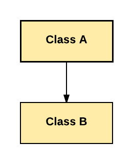
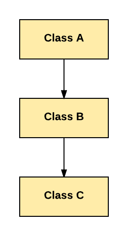
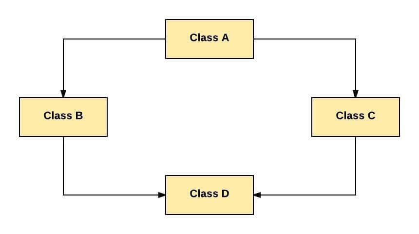

# Kalıtım (Inheritance)

Kalıtım, programlama ortamında da gerçek hayattaki tanımına benzer bir işi gerçekleştirir. Bir sınıfın başka bir sınıftan kalıtım yapması demek, kalıtımı yapan
sınıfın diğer sınıftaki nitelik ve davranışlarını kendisine alması demektir. Kalıtımı yapan sınıfa **alt sınıf**, kendisinden kalıtım yapılan sınıfa **ata
sınıf** dersek, ata sınıfta tanımlı olan herşeyin alt sınıf için de tanımlı olduğunu söyleyebiliriz.

Eğer bir A sınıfın B sınıfından kalıtım yapması isteniyorsa, aşağıda ki şekilde tanımlanır.

```java

public class A extends B {
     // 
}

```

## Kalıtım Türleri

### Tek Yönlü Kalıtım (Single Inheritance)

Bir sınıfın başka bir sınıfı genişlettiği alt ve ata sınıf ilişkisini ifade eder.



Bu örnekte B sınıfı A sınıfını miras alır.

### Çoklu Kalıtım (Multiple Inheritance)

Bir sınıfın birden fazla sınıfı miras almasını ifade eder; bu, bir alt sınıfın iki ata sınıfa sahip olduğu anlamına gelir.

Not : Java çoklu kalıtımı desteklemez. (Interface kullanılır)


### Çok Seviyeli Kalıtım (Multilevel Inheritance)

Bir sınıfa ait alt sınıfın başka sınıfları genişletmesine denir.



Bu örnekte , C sınıfı B sınıfını miras alır, B sınıfı ise A sınıfını miras alır. C sınıfı dolaylı yoldan A sınıfınıda miras almış olur.

### Hiyerarşik Kalıtım (Hierarchical Inheritance)

Birden fazla sınıfın aynı sınıfı genişlettiği bir alt ve üst sınıf ilişkisini ifade eder.


Bu örnekte : B, C ve D sınıfları aynı A sınıfını genişletir.

### Hibrit Kalıtım (Hybrid Inheritance)

Programda birden fazla kalıtım türünün kombinasyonuna denir. Örneğin, A ve B sınıfı, C sınıfını genişletir ve başka bir D sınıfı, A sınıfını genişletir, bu bir
hibrit kalıtım örneğidir, çünkü bu, tek yönlü ve hiyerarşik kalıtımın bir birleşimidir.


