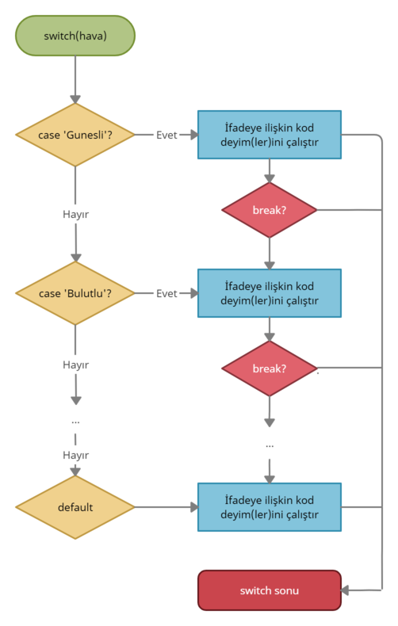

# Çoklu Koşul Yapısı Kullanımı
JavaScript'te if... else koşul yapısındaki koşulların arttığı durumlarda kod okunabilirliğini artırmak ve daha performanslı sayılabilecek bir yapı olan **switch** yapısı tercih edilebilir. Switch yapısı belirli bir değere göre hangi kodun çalıştırılacağını yönetmek için kullanılır. Bir switch yapısı tanımlarken **switch** keywordunu kullanırız ve ardından parantez içerisinde bir değer ya da değişken tanımlarız. Sonrasında switch ile birlikte açılan blok içerisinde yerine getirilmesi gereken koşulları **case** ifadeleriyle birlikte tanımlayabiliriz, tanımlanmış her bir case etiketinden sonra **:** koymalıyız. Case tanımlamalarından sonra çalışmasını istediğimiz deyimleri belirtebiliriz. Program akışında switch ifadesine verilmiş değeri sağlayan case etiketine geçerek ilgili deyimleri çalıştıracaktır, bu kontrol switch ifadesine verilmiş değerlerin tanımlanmış case etiketleri ile değer ve tip kontrolünün (===) otomatik tip dönüşümü olmadan yapılmasıdır. Aşağıdaki örnekte switch yapısının nasıl tanımlanabileceğini sonrasında akış diyagramı ile switch yapısının nasıl çalıştığını inceleyebilirsiniz.

```javascript
switch(ifade) {
  case a:
    // kod bloğu
    break;
  case b:
    // kod bloğu
    break;
  default:
    // kod bloğu
}
```



Şimdi switch yapısıyla bir örnek yapalım. Tanımlanmış **hava** değişkenine bağlı olarak konsola ilgili hava durumu için öneriler yazdıralım. Switch ifadesinde tanımlamış olduğumuz case etiketleri; _Yağmurlu, Güneşli, Bulutlu, Karlı_ ve _Fırtınalı_ şeklinde olsun.

```javascript
let hava = "Gunesli";
switch(hava) {
  case "Yagmurlu":
      console.log("Semsiyeni yanina almayi unutma");
      break;
  case "Gunesli":
      console.log("Hafif giyin");
  case "Bulutlu":
      console.log("Disari cik");
      break;
  case "Karlı":
      console.log("Kalin giyin");
      break;
  case "Firtinali":
      console.log("Bir süre disari cikma");
  default:
      console.log("Bilinmeyen hava durumu:" , hava);
}
```
Eğer switch ifadesine verilmiş değer herhangi bir case etiketi ile eşleşmezse **default (geçerli)** etiketine geçilecek ve ilgili deyimler çalışacaktır. Koşulu sağlayan bir case etiketinin deyimleri çalıştıktan sonra program akışında **break** ifadesiyle karşılaşana kadar diğer case etiketlerinin deyimleri de çalışacaktır. Yukarıdaki örnekte _Gunesli_ case etiketi için önce konsola _"Hafif giyin"_ yazdırıldı. Ardından break ifadesi ile karşılaşılmadığı için sonraki _Bulutlu_ etiketine geçildi ve konsola _"Disari cik"_ yazdırıldı.
