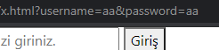

# Form ve Form Submit Yönetimi

Form içinde bulunduruğu form elementlerinin name'leri sayesinde değerlerini alıp bu değerlerle işlem yapmanıza olanak sağlayan bir yapıdır.
Form <form> Form elementleri </form> şeklinde tanımlanır.
Genellikle backend'e istek yapılacağı zaman kullanılır.(Veri göndermek gibi)

#### En önemli parametresi method parametresidir. method="post" veya method="get" olarak iki türlü değer alabilir.

### Get : verileri url üzerinden gönderir, örneğin mail diye bir alandan kullanıcının mailini istiyoruz, kullanıcı mailini girip göndere bastığı zaman mail alanına girdiği veri url üzerinden gönderilir.

> örneğin : http://siteadi.com/index.php?mail=mail%40hotmail.com

## Get metodu önemsiz verilerde kullanılmalıdır, kullanıcı adı ve şifre gibi bilgilerin bu metodla formdan aktarılması uygun değildir.

### Post : verileri arka planda gönderir, kullanıcı mail adresini girip gönder butonuna bastığı zaman veriler kullanıcıya gözükmeyecek şekilde sayfaya gönderilir.

# Form Elementleri

## İnput

İnput type'larına göre kullanıcıdan değer almamıza olanak sağlayan elementlerin başında gelmektedir. Kullanımı <input /> şeklindedir en sık kullanılan parametreler 'type' 'value' ve bizim için en önemli parametre 'name' parametresidir. type inputun kullanım şeklini belirleyen parametredir. En sık kullanılan type='text' değeridir. Default olarak tanımlanan değerdir. type='password',type='email' adından da anlaşılacağı üzere kullanıcan şifre ve email istediğimiz zaman kullanacağımız değerlerdir. Value default olarak bir değer vermek istediğimiz zaman kullanacağımız bir parametredir örneğin value='deneme'. Bizim için en önemli parametre name parametresidir. Alanın ismidir form gönderildiği zaman burada atanan ada göre veriler çağırılır, örneğin get ile gönderilen bir formda, name’i mail olan bir input düşünün bu durumda girilen veri adrese buradaki name ile yansıyacaktır.Olmazsa olmazımız <button>Değer</button>'larımız. Button elementinde form ekranında kullanırken bizim için en önemli parametresi type='submit' 'tir.Form'mumuzun submit eventini tetikler.  
Şimdi gelin aklımızda daha çok canlanması için bir örnek geliştirelim ve bir kullanıcı giriş formu tasarlayalım.

```html
<form  method="GET">
	<input
		type="text"
		name="username"
		placeholder="Kullanıcı adınızı giriniz"
	 
	/>
	<input
		type="password"
		name="password"
		placeholder="Şifrenizi giriniz."
 
	/>
	<button type="submit">Giriş</button>
</form>
```
Bu form ekranımızda submit ettiğimiz takdirde linkimizin değiştiğini göreceksiniz.Get methodu ile veri aktarmış olduk veriler inputun name parametresi ile taşınmış oldu. Değişen link 


## Kodumuza birde java script katalım ve bu veriyi post ile gönderelim

```html
<form onsubmit="handleSubmit(e)" method="POST">
			<input
				type="text"
				name="username"
				placeholder="Kullanıcı adınızı giriniz"
				onchange="handleChange(event)"
			/>
			<input
				type="password"
				name="password"
				placeholder="Şifrenizi giriniz."
				onchange="handleChange(event)"
			/>
			<button type="submit">Giriş</button>
		</form>

		<script>
			var username
			var password
			function handleSubmit(e) {
				e.preventDefault();
				console.log('username:'+username+'-'+'password:'+password);
			}
			function handleChange(e){
				if(e.target.name==='username')
				{
					username=e.target.value;
				}
				if(e.target.name==='password')
				{
					password=e.target.value;
				}
			}
		</script>
```
## onsubmit ve onchange eventleri 
### onsubmit = Form submit olduğu anda ne yapacağını söyleyeceğimiz eventtir.
### onchange = inputun value'su değiştiğinde bu değişen value'yu bizim elde etmemize olanak sağlayan eventtir.

Bu örneğimizde onsubmit eventi için handleSubmit onchange eventi için handleChange function'larını kullanıyoruz. handleChange'e ve handleSubmit'e tetiklenen değeri yani event'i gönderiyoruz ve function'larımızda karşılıyoruz. handleChange'te (e.target.name) hangi inputun değerini okuduğumuzu e.target.value ise o inputun value'sunu verir.Bu değerleri globalde tanımladığımız değişkenlere atadık. Böylece submit olduğumuz anda bu değerleri artık kullanabilir duruma geldik. Bu değer ile artık formumuz submit olduğunda ne yapmak istiyorsak onu yapabiliriz.