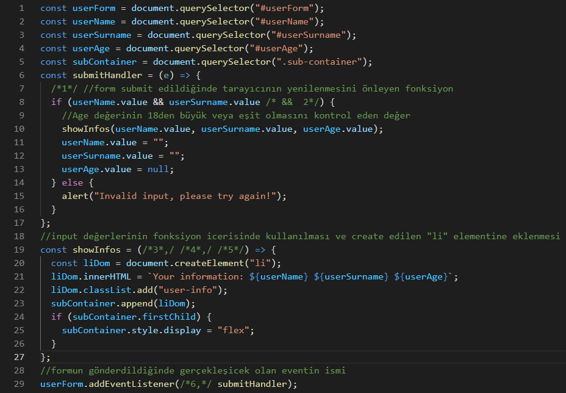

# Formlarla calismak-bolum-sonu-egzersizi

Sayfamız ilk yüklendiğinde aşağıdaki resimde görüleceği gibi bir form oluştuğunu düşünelim.


Formu doldurup submit butonuna her bastığımızda ise, girdiğimiz bilgiler formun altında oluşacak kısımda bize gösterilecektir.


Formda herhangi bir alanı boş bıraktığımızda veya "Age" kısmına 18'den küçük bir sayı girdiğimizde ise web tarayıcımız bize aşağıdaki gibi bir uyarı verecektir.


İlk sorumuz böyle bir formu oluşturmak ve verilerini kullanabilmek için nasıl bir html dosyası yazmamız gerektiğiyle ilgili olsun. Aşağıda bu form yapısının html kodlarını görüyoruz, tabi ki sizlerin tamamlaması için bazı eksiklikleri var. Sayfanın `class` isimleri ve style yapısıyla ilgili bu noktada herhangi bir işlemimiz olmayacak, o yüzden o kısımları düşünmenize hiç gerek yok, sadece form yapısına odaklanalım.

Aşağıdaki kod parçacığında satır sonlarında numaralarını belirttiğim ___ ile belirtilmiş boşluklara neler yazılmalıdır ? 

```html
    <div class="container">
      <form id="userForm">
        <div class="name">
          <label ___="userName">Name:</label> //1
          <input type="text" ___="___" id="userName" /> //2
        </div>
        <div class="surname">
          <label for="userSurname">Surname:</label>
          <input type="text" name="userSurname" id="userSurname" />
        </div>
        <div class="age">
          <label for="userAge">Age:</label>
          <input type="___" name="userAge" id="userAge" /> //3
        </div>
        <button type="___">Submit</button> //4
      </form>
    </div>
    <div class="sub-container"></div>
```
Cevaplar: 1:for, 2:name ve userName 3:number 4:submit

İkinci sorumuz ise bu form yapısını JavaScript kodumuzda nasıl manipüle edebileceğimiz ile ilgili olsun.
/*1*/ gibi belirttiğim yerlere hangi kodlar gelmelidir? Gelmesi gereken kodların kullanım amaçlarını kısaca yorum satırı olarak belirttim yanlarında.



Cevaplar: /*1*/: e.preventDefault();
/*2*/: userAge.value >= 18
/*3*/, /*4*/, /*5*/: userName, userSurname, userAge
/*6*/: "submit"

