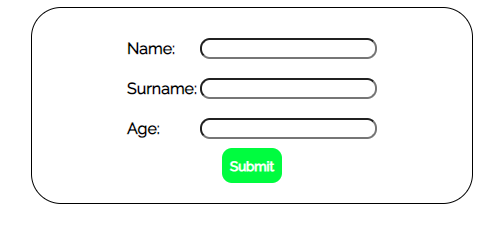
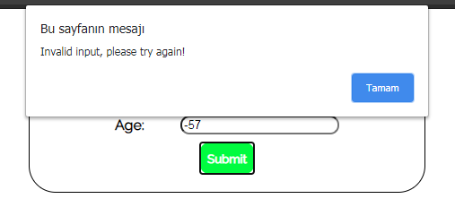

# Formlarla calismak-bolum-sonu-egzersizi

Sayfamız ilk yüklendiğinde aşağıdaki resimde görüleceği gibi bir form oluşacaktır.

Formu doldurup submit butonuna her bastığımızda ise, girdiğimiz bilgiler formun altında oluşacak kısımda bize gösterilecektir.

Formda herhangi bir alanı boş bıraktığımızda veya "Age" kısmına 18'den küçük bir rakam girdiğimizde ise web tarayıcımız bize aşağıdaki gibi bir uyarı verecektir.

