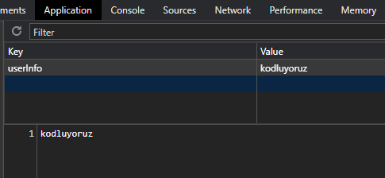
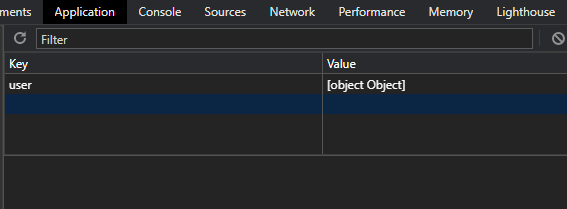
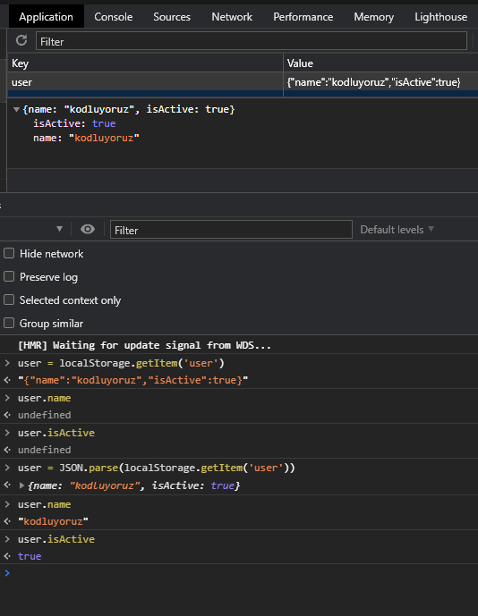

# Local Storage İçine Farklı Türde Veriler Eklemek

```bash
let user = "kodluyoruz" 
localStorage.setItem('userInfo', user)
``` 

User objesini localStorage'de tutmak için setItem() fonksiyonu yukarıdaki gibi kullanılabilir. localStorage içindeki görüntüsü aşağıda verilmiştir. Ancak daha kompleks objeler için bu kod satırı yetersizdir. 

  

 ```bash
let userStatus = {userName: 'kodluyoruz', isActive: true}
localStorage.setItem('user', userStatus)
``` 
Yukarıdaki komutun localStorage içerisindeki karşılığı aşağıdaki gibidir. 



Bunun sebebi localStorage içindeki bilgilerin key: value şeklinde, yalnızca string türünde değerler ile saklanmasıdır. İlk örnekteki user değişkeni userInfo bilgisine atanabilir ancak userStatus bir obje olduğundan yukarıdaki görseldeki sonuçla karşılaşırız. Bunu önlemek için userStatus objesini stringe çevirmek gereklidir.


 ```bash
let userStatus = {userName: 'kodluyoruz', isActive: true}
localStorage.setItem('user', JSON.stringify(userStatus))
``` 


### LocalStorage'den veri alma 
LocalStoragede değişkenler string olarak tutulduğundan, localStoragedan user objesini almak istediğimizde userName ve isActive değerlerine erişemeyiz. Stringify işlemini geri almak için parse() metodu kullanılabilir. 




## Sorular

1.localStorage hangi veri türünde data tutar?

- [ ] Boolean
- [x] String
- [ ] Object
- [ ] Number

2. `var movies = ["Kasaba", "Kış uykusu","Bir Zamanlar Anadolu"]` Verilen movies dizisini localStorage alanına nasıl kaydetmeliyiz?


- [ ] ```localStorage.setItem("Nuri Bilge Ceylan", movies);```

- [ ] ```localStorage.getItem("Nuri Bilge Ceylan", movies); ```

- [x] ```localStorage.setItem("Nuri Bilge Ceylan", JSON.stringfy(movies)); ```

- [ ] ```localStorage.getItem("Nuri Bilge Ceylan" , JSON.stringfy(movies));```

3.localStorage alanına kaydedilen veriye nasıl erişiriz ?

- [x] ```var retrievedData = JSON.parse(localStorage.getItem("Nuri Bilge Ceylan"))```

- [ ] ```var retrievedData = JSON.parse(localStorage.setItem("Nuri Bilge Ceylan"))```

- [ ] ```var retrievedData = localStorage.setItem("Nuri Bilge Ceylan")```
- [ ] ```var retrievedData = localStorage.getItem("Nuri Bilge Ceylan")```

4.localStorage alanından kaydedilen bütün verileri nasıl sileriz?

- [ ] `localStorage.clearItem()`
- [ ] `localStorage.remove()`
- [ ] `localStorage.removeItem(key)`
- [x] `localStorage.clear()`
