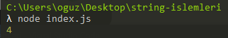
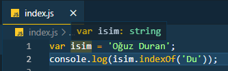
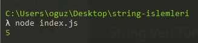
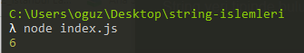
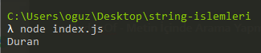
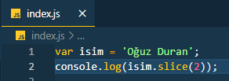
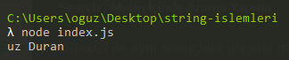
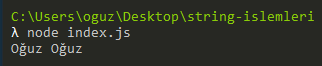
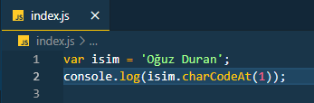
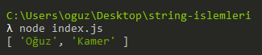

# String Veri Türü İşlemleri

#### **String nedir?**

JavaScript metinlerin tümü "**_string_**" veri tipi içinde tutulur ve "**_string_**" veri türü ile ilgili yapabileceğimiz birden fazla işlem vardır. Bu yazımızda bunlardan bahsedeceğiz.

#### **Length Özelliği - Uzunluk Değerini Alma**

String veri tipinde bulunan bir ifadenin ne kadar uzun olduğunu bulmak için "**_Length_**" özelliğimizi kullanırız.

#### **indexOf - Metin İçinde Arama Yapma**

Metnin içinde aramak istediğimiz değerin "**_index_**" numarasını bize verir.

#### **lastIndexOf - Metin İçinde Arama Yapma**

"**_indexOf_**" ile arasındaki tek fark aranan kelime birden fazla geçiyor ise en son eşleşmeden gelen "**_index_**" numarasını döndürür.

#### **Search - Metin İçinde Arama Yapma**

indexOf ile aynı sonuçlara ulaşırız genel olarak "**_Regular Expressions_**" işlemleri için çok kullanılan bir metottur.

#### **Slice - Metninden Parça Almak**

Metin içinden almak istediğimiz yerlerin index numaralarını vererek metin içinde bulunan parçayı alabiliriz.

Bitiş index numarasındaki karakter sonuca dahil edilmez.

#### Not: Tek index yazmak ise yazılan index numarasından sonra gelen tüm karakterleri almasına neden olur.

#### Replace – Metin Bulma ve Değiştirme

Aranan metni istediğimiz metin ile değiştirmemize olanak sağlar.

toUpperCase ve toLowerCase

**_toUpperCase_** metin içinde bulunan tüm karakterleri büyük harf yapmamıza olanak sağlar.

**_toLowerCase_** metin içinde bulunan tüm karakterleri küçük harf yapmamıza olanak sağlar.

#### Concat - Metin Birleştirme

Elimizde bulunan iki string türündeki veriyi birleştirmemize olanak sağlar.

##### charAt - İndex Numarasına Göre Karakter Bulmak

Belitrilen index numarasında yer alan karakteri verir.

#### charCodeAt – İndex Numarasına Göre Karakterin Unicode Değerini Bulma

Belirtilen index numarasında yer alan karakterin Unicode değerini verir.

#### Split – Metni Diziye Çevirme

Split metodu ile istenilen metin diziye çevrilebilir. Kullanılan parametre ile metnin nasıl parçalanacağı belirtilir.

## Sorular

1. Regular Expressions işlemlerinde çok kullanılan metin içinde arama methodu hangisidir ?

- [ ] indexOf Metodu
- [ ] lastIndexOf Metodu
- [ ] Slice Metodu
- [x] Search Metodu

2. Bir ifade arayıp, o ifadeyi başka bir metin ile değiştirmeye yarayan method hangisidir ?

- [ ] Search Metodu
- [ ] Concat Metodu
- [x] Replace Metodu
- [ ] indexOf Metodu

3. Index numarası ile belirtilen karakterin Unicode değerini veren method hangisidir ?

- [ ] Substring Metodu
- [ ] Replace Metodu
- [ ] Split Metodu
- [x] charCodeAt Metodu

## Kaynaklar

[JavaScript String Metotları](https://www.btdersleri.com/ders/JavaScript-String-Metotlar%C4%B1)
