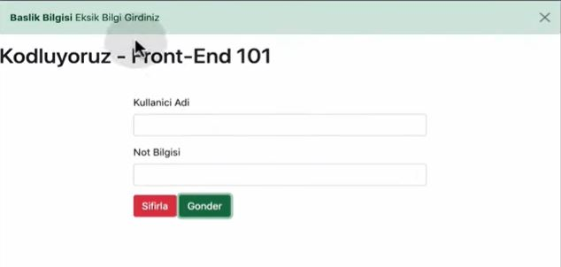

# FORMLARLA ÇALIŞMAK: Bölüm Sonu Egzersizi

## Genel Plan:
1.	Form seçimi
2.	Input Bilgisini UL içerisine ekle
3.	Form içindeki bilgiyi sıfırla
4.	Eğer forma bilgi girilmez ise kullanıcıyı uyar

### Adımlar

1. 

Öncelikle 1. ekran alıntısında bulunan html dosyasından, form seçimi yapabilmek için gerekli id'yi alıyoruz.
Burada form elementinin id'si userForm. 2. ekran alıntısında görüldüğü üzere userForm id'si querySelector fonkisyonu ile alınmıştır. Daha sonrasında addEventListener fonsiyonu ile "submit" olayı gerçekleşitğinde bu html elemntinde ne olması gerektiği ifade edilmiştir. Submit olduğunda formHandler fonsiyonu çağırılıyor

2. 

2.ekran alıntısında görülen formHandler fonsiyonu event parametresini alıyor. Daha sonrasında event.preventDefault() fonkisyonu ile submit anında sayfanın yenilenmesini engellemiş oluyoruz. Hemen sonraki satırlarda html dosyasından username ve score idlerini querySelector ile çağırıp bunların değerlerini listeye eklemek için 4. ekran alıntısında görülen addItem adlı fonksiyona yolluyoruz.


3. 

İlk aşamada tarayıcımızda gözükecek olan dizayn 3. ekran alıntısında gözükmektedir.

4. 

addItem fonksiyonu 2 tane parametre alıyor. Buraya gelen değerleri listenin en altına ekliyor.

5. 

5.ekran alıntısı dizayna liste elementi eklendikten sonraki halini göstermektedir.

6. 

Hatalı bir durumla karşılaştığımızda(bizimkinde bir şey yazmadan submitlemek) hata mesajı göstermemiz gerekiyor. 6.ekran alıntısında  bootstrap'ten aldığımız ALERT varsayılan mesajı göstermekteyiz. 7.ekran alıntısında nasıl bir sonuç verdiğini görebiliriz.

7. 

8. 

8.ekran alıntısında ALERT sabitini bir fonsiyona dönüştürerek ve template literals kullanarak istediğimiz mesajı formHandler fonksiyonundan göndererek bastırıyoruz. Burada "success" yazan yere "danger" yazarsak yukarıda görülen mesaj kırmızı olur. Ya da aynı yere "alert" yazarsak bu sefer de sarı gözükür.

9. 


## Ekstra Örnekler


Sayfamız ilk yüklendiğinde aşağıdaki resimde görüleceği gibi bir form oluştuğunu düşünelim.


Formu doldurup submit butonuna her bastığımızda ise, girdiğimiz bilgiler formun altında oluşacak kısımda bize gösterilecektir.


Formda herhangi bir alanı boş bıraktığımızda veya "Age" kısmına 18'den küçük bir sayı girdiğimizde ise web tarayıcımız bize aşağıdaki gibi bir uyarı verecektir.


İlk sorumuz böyle bir formu oluşturmak ve verilerini kullanabilmek için nasıl bir html dosyası yazmamız gerektiğiyle ilgili olsun. Aşağıda bu form yapısının html kodlarını görüyoruz, tabi ki sizlerin tamamlaması için bazı eksiklikleri var. Sayfanın `class` isimleri ve style yapısıyla ilgili bu noktada herhangi bir işlemimiz olmayacak, o yüzden o kısımları düşünmenize hiç gerek yok, sadece form yapısına odaklanalım.

**Örnek 1:** Aşağıdaki kod parçacığında satır sonlarında numaralarını belirttiğim ___ ile belirtilmiş boşluklara neler yazılmalıdır ? 

```html
    <div class="container">
      <form id="userForm">
        <div class="name">
          <label ___="userName">Name:</label> //1
          <input type="text" ___="___" id="userName" /> //2
        </div>
        <div class="surname">
          <label for="userSurname">Surname:</label>
          <input type="text" name="userSurname" id="userSurname" />
        </div>
        <div class="age">
          <label for="userAge">Age:</label>
          <input type="___" name="userAge" id="userAge" /> //3
        </div>
        <button type="___">Submit</button> //4
      </form>
    </div>
    <div class="sub-container"></div>
```
Cevaplar: 1:for, 2:name ve userName 3:number 4:submit

**Örnek 2:** İkinci sorumuz ise bu form yapısını JavaScript kodumuzda nasıl manipüle edebileceğimiz ile ilgili olsun.
/*1*/ gibi belirttiğim yerlere hangi kodlar gelmelidir? Gelmesi gereken kodların kullanım amaçlarını kısaca yorum satırı olarak belirttim yanlarında.


Cevaplar: /*1*/: e.preventDefault();
/*2*/: userAge.value >= 18
/*3*/, /*4*/, /*5*/: userName, userSurname, userAge
/*6*/: "submit"

Umarım bu sorular konuyu pekiştirmenize yardımcı olmuştur. Form yapıları çok sık karşımıza çıkmakta bu yüzden yaptığımız uygulamalarda form kullanmak ve sık sık örnekler yapmak yararımıza olacaktır.
