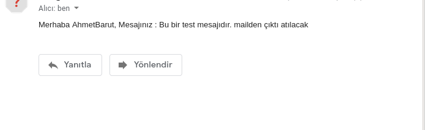

Laravelde posta gönderme işlemlerinde html dosyası gönderilir. Kullancıya göndermek istediğiniz herşey oraya yazılır. Örnek göstererek açıklamaya çalışacağım.

```resources/views/``` _mail_ diye bir dizin oluşturup içinde ```yeni_gonderi.blade.php``` dosyası oluşturacağım.

```php artisan make:controller GonderiController``` diye bir controller oluşturacağım.
Sadece örnek göstermek amacıyla controllerde herşeyi statik yapacağım mantığı göstermek amacıyla.

```app/Http/Controllers/GonderiController.php     ``` dosyasına 
```php
 use App\Mail\YeniGonderi; 
 use Illuminate\Support\Facades\Mail;
```
```App\Mail\YeniGonderi``` benim posta göndermem için kullandığım sınıf.
```Illuminate\Support\Facades\Mail``` postayı kime göndereceğimizi ve göndermemiz için kullanılan sınıf.
bunları dahil ediyorum

```YeniGonderi.php``` dosyasına girip
```php
namespace App\Mail;

use Illuminate\Bus\Queueable;
use Illuminate\Contracts\Queue\ShouldQueue;
use Illuminate\Mail\Mailable;
use Illuminate\Queue\SerializesModels;

class YeniGonderi extends Mailable
{
    use Queueable, SerializesModels;


    /**
     * bu değişkenlerin public olması gerekli bunlar
     * direkt view dosyasında yazdırılabiliyor.
     */
    public $alici_ismi,$mesaj;

    // __construct fonksiyonu ilk çalışan olduğundan dolayı parametreleri ordan eşleştiriyorum.

    public function __construct($alici_ismi,$mesaj)
    {
        $this->alici_ismi = $alici_ismi;
        $this->mesaj = $mesaj;
    }
    public function build()
    {
        return $this
                ->from("gonderici_mail@domain.com") // hangi mail olduğunu belirtmeniz gerekli 
                ->view('mail.yeni_gonderi');
                // view dosyası gönderilir
    }
}
```
```app/Http/Controllers/GonderiController.php```
```php
namespace App\Http\Controllers;

use App\Mail\YeniGonderi;
use Illuminate\Support\Facades\Mail;
use Illuminate\Http\Request;

class GonderiController extends Controller
{
    public function index()
    {
        $mail =new YeniGonderi("AhmetBarut","Bu bir test mesajıdır. mailden çıktı atılacak");
        // to() fonksiyonuna alıcı e-posta adresini yazıyoruz
        Mail::to("ahmetbarut400@gmail.com")->send($mail);
    }
}
```

```mail/yeni_gonderi.blade.php``` dosyasıda bu şekilde
```blade
Merhaba {{$alici_ismi}},

Mesajınız : {{$mesaj}}
```
#### Sonuç  



#### 