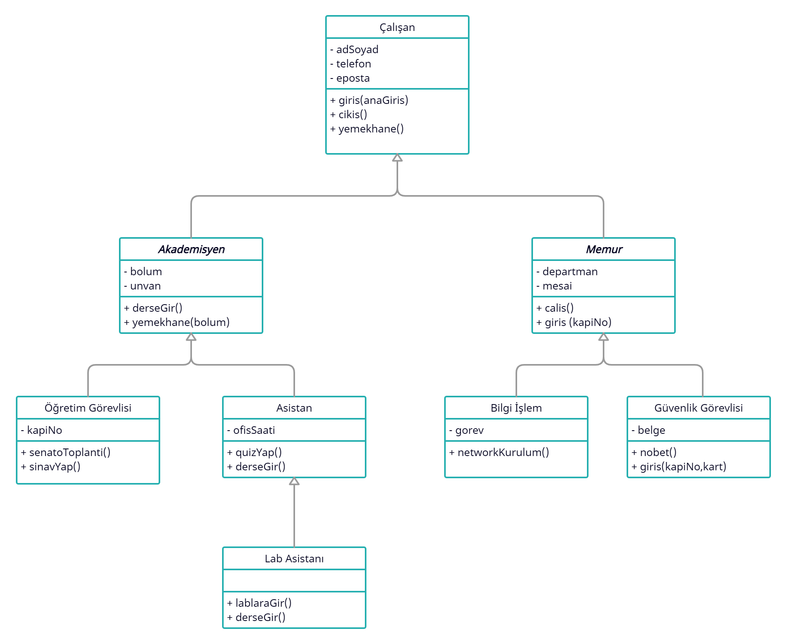

# Soyutlama (Abstraction)

Nesne yönelimli programlamada Soyutlama (Abstraction) ilkesi, eğer bir sınıf için nesne üretmek mantıksız geliyorsa o sınıf soyutlanabilir.Alt sınıfların ortak
özelliklerini ve işlevlerini taşıyan ancak henüz bir nesnesi olmayan bir üst sınıf oluşturmak istenirse bir soyut (abstract) üst sınıf oluşturulur.

Soyutlama, bir sınıfa veya metoda temel görevlerin tanımlanması, detayların ise tanımlanmaması demektir. Temel olarak bir soruna ait çözüme giderken
kullanılacak yöntemlerin, ilk etapta daha genel basit ve soyut bir tanımını yapmaktır.

## Soyutlama Örnek

Bu örnekte, ara sınıf olan "Akademisyen" ve "Memur" sınıfları genel bir yapıyı ifade ediyorlar ve bu sınıflar üzerinden sistemde nesne üretilmesini istemeyiz.
İlgili sınıfları "Abstract Class" olarak tanımlarsak, bu sınıflardan nesne üretilmesini engellemiş oluruz. UML sınıf diyagramlarında bir sınıfın abstract bir
sınıf olduğu , sınıf ismini "İtalik" olarak yazması ile belirtilir.

