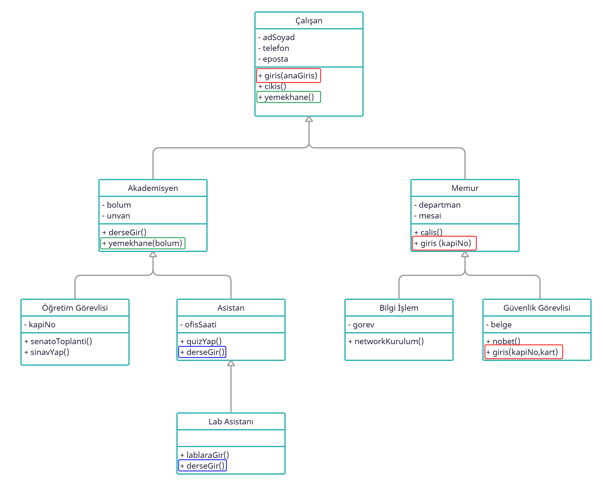

# Çok Biçimlilik (Polymorphism)

Polymorphism (çok biçimlilik) NYP'de programlama dilinin farklı tip verileri ve sınıfları farklı şekilde işleme yeteneğini belirten özelliğidir. Daha belirgin
olmak gerekirse, metotları ve türetilmiş sınıfları yeniden tanımlama yeteneğidir

Polimorfizm, alt sınıfların ata sınıflardaki metotları geçersiz kılması (method overriding) sayesinde çok biçimli olarak davranmasına denir. Bu sayede alt sınıf
ata sınıfından gelen davranışı kendine göre şekillendirebilir.

Metotlarda Geçersiz Kılma ise bir alt sınıfın içine doğrudan ya da dolaylı ata sınıflarından gelen bir (ya da daha fazla) yöntemin aynısının (aynı yöntem adı ve
aynı parametre listesi) kodlanmasına verilen addır.

Polimorfizm sayesinde uygulamaların genişletilebilirliğini sağlarız ve bir ata sınıfın sunduğu yöntemleri geçersiz kılan alt sınıflar yardımı ile ata sınıfa
göre kodlanmış tek bir kod kesimine farklı davranışlar yüklemek olanaklı olmaktadır. Öyleyse, elimizde esnek bir altyapı var demektir. Bu esneklik altyapıya
yeni türlerin eklenmesi, kalıtım ve geçersiz kılma ilişkileri çerçevesinde oldukça kolaydır.

## Polimorfizm Örneği

