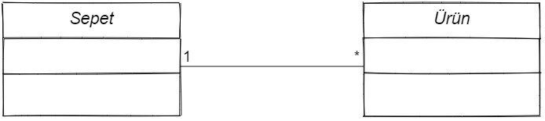

# UML ve Sınıf Diyagramları

## Modelleme Nedir ?

Gerçek hayattaki problemleri bilgisayarın sanal ortamında çözebilmek için, herşeyden önce problemin uygun şekilde bilgisayar ortamına aktarılması gerekmektedir.
Bu işlem “soyutlama (abstraction)” ya da “modelleme (modeling)” olarak anılır.

Modelleme, insanın problem çözmek üzere eskiden beri kullandığı bir yöntemdir. Büyükçe bir problemin tamamını zihinde canlandırıp çözmeye çalışmak yerine,
oluşturulacak model ya da modeller üzerinde hedef sistemin görünüşü, davranışı ya da bazı durumlarda verdiği tepkiler gözlemlenebilir

## UML (Unified Modeling Language) Nedir ?

UML’ in Türkçe deki karşılığı “Birleşik Modelleme Dili” olsa da aslında bir programlama dili değil yazılım mühendisliğinde nesne tabanlı modellemede kullanılan
standart olmuş görsel modelleme dilidir. Bir yazılımın hayata geçirilmesinde farklı görev tanımlamaları bulunmaktadır (Tasarımcılar, programcılar, analistler,
testçiler, kalite sorumluları, kullanıcılar) gibi. Bir yazılım için her kişinin farklı bakış açısı vardır. Müşteri açısından projeye baktığımızda müşteriyi
işlerin sıralandırılması, sisteme artıları ve eksileri , işler arasındaki ilişkiler ilgilendirirken bir fonsiyonun detayları ilgilendirmemektedir. Analist
açısından baktığımızda nesne özellikleri, fonksiyonlar ve alacakları parametreler yeterli iken tasarımcı açısından parametrelerin veri tipleri, fonsiyonun
performansı, yaşam süresi gibi bilgiler de önemli olmaktadır.

Bu nedenle UML bu ekip için gerekli farklı diyagramlar içermektedir. Yazılım geliştirme işinde yer alacak farklı ekiplerin farklı bakış açılarına uygun farklı
UML diyagramları bulunmaktadır.

## Peki Neden UML ?

- Hataların kolaylıkla fark edilip en düşük seviyeye indirgenmesi.(Risk, zaman, maliyet)
- Kodlama kolaylığı sağlar.
- Kullanılan tekrar kod sayısı ayırt edilebilir bu sayede verim sağlanır.
- Mantıksal hataların minimum seviyeye düşürülmesini sağlar.
- Geliştirme maliyetinin düşmesini sağlar.
- Resmin tamamının görülmesini sağlar.
- UML diagramları ile yazılım tamamını görebileceğimiz için verimli bellek kullanımı sağlanabilir.
- Karmaşık sistemlerde değişiklik yapmayı kolaylaştırır.
- UML ile dokümanlandırılmış kodları düzenlemek daha az zaman alacaktır
- UML diyagramlarını kullanan yazılımcılar aynı dili konuşacaklarından kolay iletişim sağlanır.

## UML Diyagram Türleri

# Sınıf Diyagramları (Class Diagram)

Nesne yönelimli programlamada her bir nesnenin konseptini belirten yapılara sınıf (class) adı verilmektedir. Sınıflar çok farklı yapılarda ve işlevlerde
olabilirler. Bununla birlikte, genellikle programlamada bütün iş tek bir sınıfın üzerine yüklenmez. Kuracağınız sistem ile ilgili önce temel sınıflar belirlenip
daha sonra bunlar arasındaki bağlantıların açıklanması gerekir. Bunu bir yazılım geliştirme sürecinin tasarım aşamasında yaparız. Burada sınıfların modellemesi
için UML kullanırız ve Sınıf Diyagramları adı veririz.

Programlamada sınıfların niteliklerini  "değişkenler" , davranışlarını da "metotlar" tanımlar.

## Sınıf Tanımlama

Şekilde görüldüğü üzere bir dikdörtgen 3 parçaya bölünerek, ilk parçasına "Sınıf Adını", ikinci parçaya "Sınıfın Değişkenleri" , son parçayada "Sınıf Metotları"
yazılır.

### Nitelikler (Değişkenler)

Sınıfa ait niteliklerin sözdizimi (syntax):

`<Görünürlük> <İsim>: <Tür> <Multiplicity> = <Varsayılan Değer>`

- **Görünürlük (Visibility)**: Niteliğin dışarıdan erişim ilkesinin ne olduğunu belirtir. Eğer bir sınıfın niteliği public ise buraya “+“, private ise buraya
  “–“, protected ise buraya “#” işareti konulur.
- **İsim (Name)**: Niteliğe ait isimlendirme yapılır.
- **Tür (Type)**: Bir niteliğin veri tipini belirtir.
- **Varsayılan Değer (Default Value)**: Niteliğin, ilk değerini belirtir.

### Davranışlar (Metotlar)

Sınıfa ait davranışlara ait sözdizimi (syntax):

`<Görünürlük> <İsim>(<Parametreler>): <Geri Dönüş Tipi>`

- **Görünürlük (Visibility)**: Bu davranışın dışarıdan erişim ilkesinin ne olduğunu belirtir. Alabileceği değerler niteliklerde olduğu gibidir.
- **İsim (Name)**: Metoda ait isimlendirme yapılır.
- **Parametre Listesi (Parameter List)**: Programlamada metodun aldığı parametreler tür bilgileri ile birlikte buraya yazılır.
- **Geri Dönüş Türü (Return Type)**: Metodun geri dönüş tipini belirtir.

## Sınıflar Arası İlişkiler

Yazılımlar çoğu zaman tek sınıftan oluşmazlar. Küçük programlar bile çoğu zaman birden fazla sınıfa ihtiyaç duymaktadır. Bir yazılımda sınıf sayısı arttıkça
programın tasarlanmasıda karmaşıklaşır. Bu yüzden UML diyagramlar kullanılarak, bu karmaşıklığı daha olayın en başında minimuma indirip maliyeti azaltmaktır.
Sınıflar birbirleriyle ilişki içerisinde olan yapılardır. Bu ilişkileri UML diyagramlarında da göstermek gerekir. Elbete ilişkinin türüne göre gösterim de
değişiklik gösterecektir.

- Bağlantı İlişkisi (Association)
- Genelleme/Kalıtım İlişkisi (Generalization/Inheritance)
- Bağımlılık İlişkisi (Dependency) (Aggregation, Composition)
- Gerçekleştirim İlişkisi (Realization)

### Bağıntı İlişkisi (Association Class)

Sınıflar arasındaki ilişkiler çizgi ile gösterilir ve çizginin üstüne ilişki şekli yazılır. Sınıflar arası ilişkiler bire bir, bire çok, bire n gibi olabilir.
Örneğin aşağıdaki gösterimde e-ticaret sisteminde müşteri ve ürün ilişkisini görmektesiniz.

Yukarıda ki diyagrama göre müşteri ve ürün arasında Satın Alma ilişkisi vardır ve bunun için de Sipariş oluşturması gerekir. Yukarıda ki diyagram da bire bir
ilişkisi vardır.

Sınıf diyagramlarında sınıflar arasında bire n ilişki kurulabilir. Bir sınıf, n tane başka bir sınıf ile ilişkiliyse buna bire-çok (1-n) ilişki denir.

Bu örnekte ise bir sepette n tane ürün olabileceği gösterilmiştir. İki sınıf arasında yanlızca tek bir bağıntı çizilmesi gibi bir kısıt yoktur. En temel bağıntı
ilişki tipleri aşağıdaki gibi listelenebilir;

- Bire-bir (1-1)
- Bire-çok (1-\*)
- Çoka bir (\* - 1)
- Bire-sıfır (1-0)
- Bire-Beş yada Bire-sekiz (1-5 veya 1-8)

Diğer bir ilişki türü ise bir sınıfın kendisiyle kurduğu ilişkidir.Bu tür ilişkiler genellikle bir sınıfın sistemde birden fazla rolü varsa ortaya çıkar.Bu tür
ilişkilere "reflexive associations" denir

### Sınıflar Arasında Türetme (Inheritance) ve Genelleme (Generalization) İlişkisi

Nesne yönelimli programlamanın en önemli parçası türetme (inheritance)'dir. Türetme yoluyla bir sınıf başka bir sınıfın var olan özelliklerini alarak, o sınıf
türünden başka bir nesneymiş gibi kullanılabilir. Bir sınıfın işlevleri türetme yoluyla genişletilecekse, türetmenin yapılacağı sınıfa taban sınıf (super class)
, türetilmiş olan sınıfa da türemiş sınıf (sub class) denir. Şekilsel olarak türemiş sınıftan taban sınıfa bir ok olarak belirtilir.

Bu örnekte "Şekiller" sınıfına ait tüm özellikler altında üretilmiş olan, diğer sınıflara aktarılmıştır.

### Bağımlılık İlişkisi (Dependency) ve Birleştirme (Aggregation, Composition)

Birden fazla parçadan oluşan sınıflar arasındaki ilişkiye "Aggregation" denir. Aggregation ilişkisini 'bütün parça' yukarıda olacak şekilde ve bütün parça'nın
ucuna içi boş elmas yerleştirecek şekilde gösteririz. İçi boş elmas ile gösterilen ilişkilerde herbir parça ayrı bir sınıftır ve tek başlarına anlam ifade
ederler.

Örneğin Araba sınıfını 1 Motor, 5 Koltuk ve 4 Lastik sınıflarının oluşturduğunu düşünürsek aralarındaki ilişki aşağıdaki gibi gösterilir.

Asıl sınıf üretildiğinde parçaları da üretilecek ise bu ilişkiye **Composite** denir. Eğer Araba sınıfı oluşturulduğunda Motor, Koltuk ve Lastik sınıfları da
oluşturulacak ise içi dolu dörtgen dolu olarak gösterilir.

### Gerçekleştirim (Realization) İlişkisi
Gerçekleştirim ilişkisi en çok kullanıcı arayüzlerinin (user interface) modellenmesinde kullanılır. Arayüz yalnızca method
adlarını ve bunların parametrelerini içermektedir. Program yazarken, yanlızca arayüzlerin kullanılması ve arayüzü gerçekleştiren sınıfın diğer sınıflardan ayrı
tutulması, yazılımın geliştirilmesi ve bakımında önemli kolaylık sağlar.

### Kaynaklar

[http://univera-ng.blogspot.com/2009/10/uml-ve-modelleme-bolum-1.html](http://univera-ng.blogspot.com/2009/10/uml-ve-modelleme-bolum-1.html)