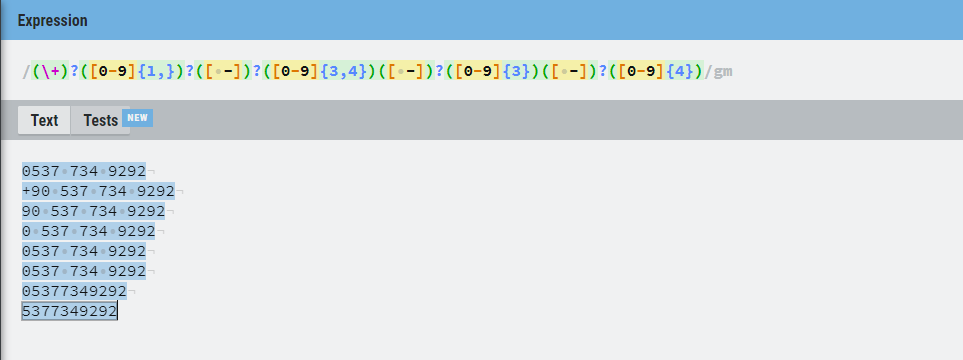
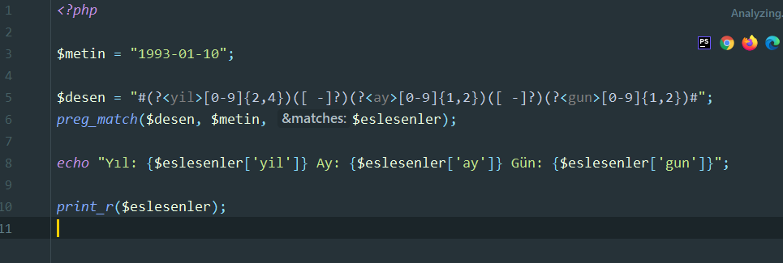
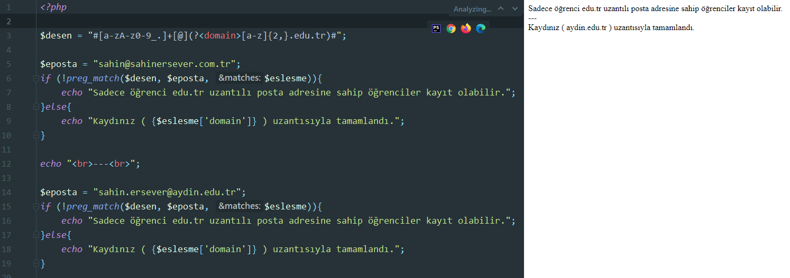

### regEx (Regular Expression) Düzenli İfadeler

- "." : Herhangi bir tek karakter ile eşleştirilebilir. Örnek olarak "d.neme" ifadesi "deneme", "daneme", "doneme" gibi katarlarla eşlenir.

- "$" : Eşlendigi ifadenin sonunu belirtir. Örnek olarak "deneme$" ifadesi "bu örnek bir deneme" gibi ifadelere eşlenir. Görüleceği üzere "deneme" ifadesinden sonra katar sonlanmıştır.

- "^" : "$" ifadesine ters olarak eşlendigi ifadenin baslangıcını belirtir. Örnek olarak "^nerede" ifadesi "nerede bu insanlar" gibi ifadelere eşlenir.

- "\*" : Bir ifadenin bütün tekrarlanmalarına eşlenir. Örnek olarak ".\*" ifadesi bütün karakterlere eşlenir.

- "[ ]" : Köseli parantezler içine girilen bütün karakterlerle eşlenir. Örnek olarak "d[ea]neme" ifadesi "deneme" veya "daneme" ile eşlenir. Baska hiçbir ifade ile eşlenmez.

- "[c1-c2]" : Tire işareti ile bir aralık belirlenir ve bu aralığa göre eşleme yapilir. Ayrıca bu aralık için birleşik ifadeler de yazılabilir. Örnek olarak "[0-9]" ifadesi bütün rakamlar ile eşlenir. Birleşik ifadeye örnek olarak "[A-Za-z]" ifadesi de bütün harflerle büyük küçük ayrımı yapmadan eşlenir.

- "[^c1-c2]” : Belirtilen aralık harici bütün karakterlere eşlenir. Örnek olarak "[^123a-z]" ifadesi 1, 2, 3 sayıları ve bütün küçük harfler dışında bütün ifadelere eşlenir.

- "<>" : Bu ifade 3 değişik şekilde kullanılabilir. "<" ifadesi bir kelimenin başına, ">" ifadesi bir kelimenin sonuna, "<>" ifadesi ise direkt olarak bir kelimeye eşlenir.

- "( )" : İfadeyi gruplandırmaya yarar. Ayrica gruplandırılmış ifadelerine denk gelen kalıpları saklar ve en fazla 9 kalıp saklayabilir.

- "|" : Veya anlamındadır. İki ifadeye de ayrı ayrı eşlenebilir. Örnek olarak "(kim|ne)" ifadesi, "suradaki kim" ve "elindeki ne" ifadelerine eşlenir.

- "+" : Kendinden önce gelen ifadenin veya karakterin bir veya daha fazla kullanımına eşlenir. Örnek olarak "9+" ifadesi 9 ile, 99 ile, 999 ile,... eşlenir.

- "?" : Kendinden önce gelen karakterin 0 veya 1 tekrarina eşlenir.

- "{ }" : Belirlenilmiş sayıda tekrar anlamındadır. Örnek olarak "A[0-9]{3}" ifadesi A harfi ile başlayıp yanında 3 tane rakam olan ifadeye eşlenir. Yani A123 veya A289 gibi.

- "{i,j}" : Belirlenmiş sayıda tekrar anlamındadır tek farkı "i" ile "j" aralığındaki bütün tekrarlara eşlenir. Örnek olarak "[0-9]{4,6}" ifadesi bütün 4, 5 veya 6 elemanlı sayı dizilerine eşlenir.

- \d : Tüm sayılarla eşleşir

- \D : Tüm sayı olmayan karaterlerle eşleşir.

- \s : Tüm boşluklarla eşleşir.

- \S : Tüm boşluk olmayan karekterlerle eşleşir.

- \w : Boşluk olmayan karekterlerin hepsiyle eşleşir.

- \W : Sadece boşluklarla teker teker eşleşir.

- ?<isim> : isimlendirilmiş eşleştirme döndürür.

##### preg_match($desen,$ifade,$eslesen);

 

