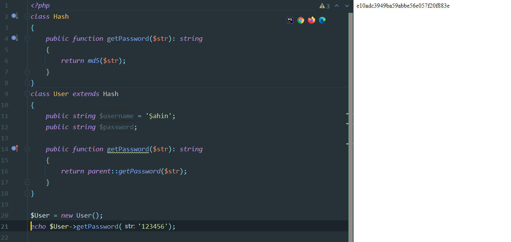

### Kalıtım
Bir sınıfın özellik ve methodlarını başka bir sınıfa aktarmamıza olanak sağlar.

##### parent:: kullanımı

- Sınıfımızda ve türetilen sınıfta aynı isimlerde özellik ve methodlara parent:: ile erişebiliriz.
