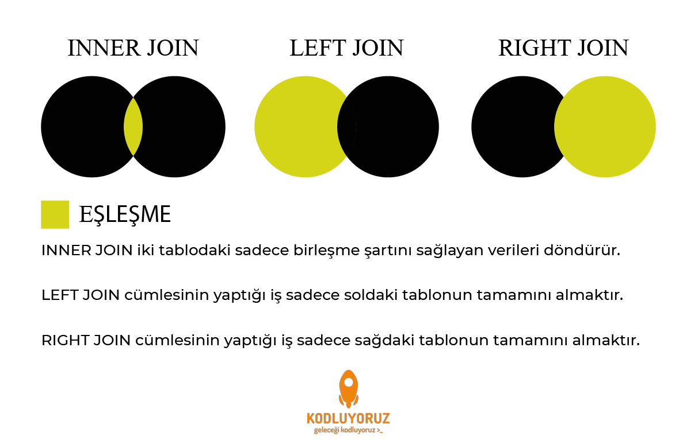

### PDO JOIN

##### INNER JOIN

```
$sql = "SELECT page_category, ptc.page_title FROM page 
        INNER JOIN page_to_content ptc on page.page_id = ptc.page_id
        WHERE page_type = 'service'";


$query = $db->query($sql);

if ( $query->rowCount() ){
    print_r($query->fetchAll(PDO::FETCH_ASSOC));
}
```
##### LEFT JOIN

```
$sql = "SELECT page_category, ptc.page_title FROM page 
        LEFT JOIN page_to_content ptc on page.page_id = ptc.page_id
        WHERE page_type = 'service'";


$query = $db->query($sql);

if ( $query->rowCount() ){
    print_r($query->fetchAll(PDO::FETCH_ASSOC));
}
```
##### RIGHT JOIN

```
$sql = "SELECT page_category, ptc.page_title FROM page 
        RIGHT JOIN page_to_content ptc on page.page_id = ptc.page_id
        WHERE page_type = 'service'";


$query = $db->query($sql);

if ( $query->rowCount() ){
    print_r($query->fetchAll(PDO::FETCH_ASSOC));
}
```