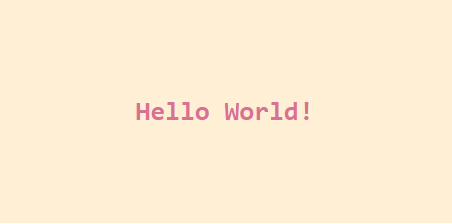
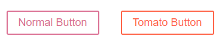
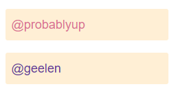

# Styled Components

### Temel Kullanım

Styled components React uygulamalarında hızlıca stillendirme işlemleri yapabileceğiniz bir kütüphanedir.
Projenize dahil etmek için aşağıdaki komut satırını terminale yazıp çalıştırmalısınız:

`npm install --save styled-components`

Styled components stillendirme yapabilmeniz için react bileşeni oluşturur ve bu bileşeni stillendirmek istediğiniz bileşene sararak stil işlemini yapabilirsiniz:

```javascript
// Title adında bir bileşen oluşturup bir <h1> etiketi stillendirelim
const Title = styled.h1`
  font-size: 1.5em;
  text-align: center;
  color: palevioletred;
`;

// Wrapper adında bir bileşen oluşturarak bir section etiketi stillendirelim
const Wrapper = styled.section`
  padding: 4em;
  background: papayawhip;
`;

// Oluşturduğumuz bu bileşenleri React dosyasında herhangi bir bileşen gibi kullanabiliriz.
render(
  <Wrapper>
    <Title>Hello World!</Title>
  </Wrapper>
);
```



### Var Olan Bir Stillendirmeyi Değiştirme

Bir stillendirilmiş bileşen oluşturup, sonrasında bunu tek seferliğine değiştirme imkanımız olabilir. Bu durumda butonun tüm özelliklerini alıp belli özelliklerini değiştirmek isteyebiliriz. Styled-components kütüphanesi ile yeniden kullanılabilir bileşenler yapmak oldukça kolay.

Tanımlanmış bir butonu alıp tek kullanım için değiştirmemiz gerektiğinde `styled()` methodunu kullanmak yeterlidir.

```javascript
// Stillendirip kullanacağımız bir buton oluşturalım.
const Button = styled.button`
  color: palevioletred;
  font-size: 1em;
  margin: 1em;
  padding: 0.25em 1em;
  border: 2px solid palevioletred;
  border-radius: 3px;
`;

// Yukarıda stillendirdiğimiz buton bileşenini styled() metodu yardımıyla aşağıdaki gibi değiştirelim
const TomatoButton = styled(Button)`
  color: tomato;
  border-color: tomato;
`;

render(
  <div>
    <Button>Normal Button</Button>
    <TomatoButton>Tomato Button</TomatoButton>
  </div>
);
```



### Styled-Components ile Props Kullanımı

Stillendirilmiş bileşenler bir React bileşeni olduğu için prop içerisinde veri göndermek mümkündür. Bu özelliği kullanarak bileşenlerinizi daha da özelleştirebilirsiniz.

````javascript
// Bir input etiketi oluşturalım ve bu etiketi aşağıdaki gibi stillendirelim.
// Gördüğünüz gibi, input içindeki renk props olarak gelmektedir.
// Eğer herhangi bir değer gelmiyorsa default olarak palevioletred seçilmiştir.
const Input = styled.input`
  padding: 0.5em;
  margin: 0.5em;
  color: ${props => props.inputColor || "palevioletred"};
  background: papayawhip;
  border: none;
  border-radius: 3px;
`;

// Render a styled text input with the standard input color, and one with a custom input color
render(
  <div>
    <Input defaultValue="@probablyup" type="text" />
    <Input defaultValue="@geelen" type="text" inputColor="rebeccapurple" />
  </div>
);```
````


