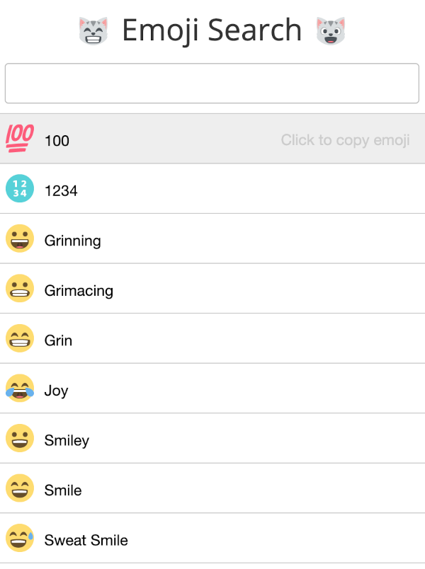

# Ödev 5

React'in kendi dokümanlarında paylaşılan [örnek projerde](https://tr.reactjs.org/community/examples.html) bulunan ve halihazırda çalışan bir uygulamanın test kodunu yazmanız gerekiyor.

Uygulamanın kaynak kodlarına erişmek için [tıklayın](https://github.com/ahfarmer/emoji-search).

Uygulama üzerinde bazı emojiler listeleniyor. Ve yukarıda bulunan input aracılığı ile listelenen emojiler filtrelenebiliyor.

## Gereksinimler
- [ ] Başlık kısmının başarılı bir şekilde render edildiğini kontrol edecek olan test kodunu yazın.
- [ ] Uygulama ilk açıldığında emoji listesinin başarılı bir şekilde render edildiğini kontrol edecek olan test kodunu yazın.
- [ ] Bir filtreleme işlemi yapıldığında, emoji listesinin bu filtreye uygun şekilde yeniden render edildiğini kontrol edecek olan test kodunu yazın.
- [ ] Liste üzerinden herhangi emojiye tıklandığında, ilgili emojinin kopyalandığını kontrol edecek olan test kodunu yazın.

Kolaylıklar :)
