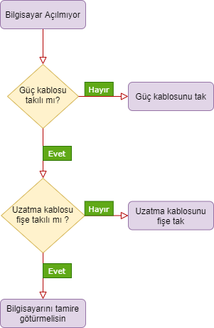

# Algoritma Nedir #

- Algoritma, Cebrin atası ve kurucusu olarak bilinen Harezmi tarafından 9.yüzyılda cebir alanındaki araştırmaları neticesinde ortaya çıkmıştır. Avrupalılar, Harezmi ismini telafuz edemediklerinden dolayı algorizm (Arap sayıları kullanarak aritmek problemler çözme kuralları) olarak kullandılar. Algorizm daha sonra "algoritma" adını aldı.

- Algoritma nedir sorusunun cevabı, bir problemin çözümü için gerekli olan adımların bütününe verilen isimdir. Gelin algoritma örneklerini günlük hayatımızdan çıkarmaya çalışalım. Bir kahve hazırlarkende algoritma kullanırız, ayakkabımızı giyerkende kullanırız. Kahve örneğimizi inceleyelim. Öncelikle bir kahve bardağı bulmamız gerekiyor. Bundan sonraki adım ise kahveyi makineye koyup çalıştırmamız. Daha sonrasında kahve bardağını ilgili yere koyup tuşa basmamız gerekiyor. Bu olay örgüsü aslında bir algoritma. Adım adım sürdürmemiz gerekiyor. Öğrendiklerimizi pekiştirmek için haydi gelin resimli örneğimizi inceleyelim. 
       
    
       
    Gördüğünüz üzere ana problemimiz bilgisayarın çalışmaması. İlk adım güç kablosunun takılı olup olmadığını kontrol etmek. Bu adımın cevabı Hayır ise yapmamız gereken güç kablosunu takmaktır, cevap Evet ve hala bilgisayarımız çalışmıyor ise bir sonraki adımı uygulamamız gerekiyor. İkinci adım, uzatma kablosunun durumunu inceledikten sonra eğer bilgisayarımız hala çalışmıyor ise tamire götürmemiz gerektiği sonucunu veriyor.
---
    Özetle, Algoritma belirli bir durumdan başlayıp belirli bir sonuçta biten, bir probleme çözüm getiren adımlardır. 

# Sorular
- Aşağıdakilerden hangisi bir algoritma tanımı değildir ?
    - Bir problemin çözümü için tasarladığımız adımlar bütünüdür.
    - Bir sorunu çözmek veya belirlenmiş bir amaca ulaşmak için takip edilen işlem basamaklarıdır.
    - Açıkça belirtilmiş bir başlangıcı ve sonu olan işlemler kümesidir.
    - Bilgisayar bilimlerinde ya da matematikte kullanılan, verilen bir listenin elemanlarını belirli bir sıraya sokan kurallardır.

- Algoritma terimini ilk olarak 9.yy'da kim ortaya çıkarmıştır ?
    - Mevlânâ Celâleddîn-i Rûmî
    - Hacı Bektaş-ı Veli
    - Hârizmî

- Aşağıdaki örneklerden hangisi bir algoritmayı ifade etmez ?
    - Kahve hazırlamak
    - Günlük rutin
    - Oturmak
    - Yemek hazırlamak
    
# Kaynaklar

## Türkçe

- [WİKİ - Algoritma](https://tr.wikipedia.org/wiki/Algoritma)

- [Khan Academy](https://tr.khanacademy.org/computing/computer-science/algorithms/intro-to-algorithms/v/what-are-algorithms)

## İngilizce

- [Investopedia](https://www.investopedia.com/terms/a/algorithm.asp)

- [BBC](https://www.bbc.co.uk/bitesize/topics/z3tbwmn/articles/z3whpv4)