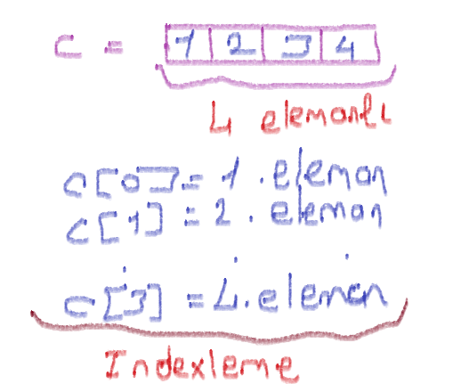
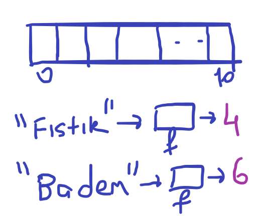
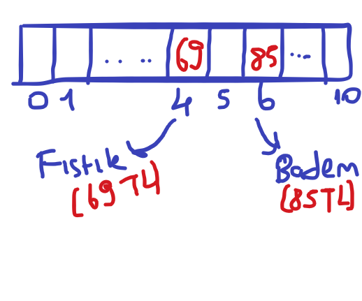

# Hash Function/ Hash Table

## İndexleme

- Arraylerde 0 bazlı bir indexleme vardır. Bazı programlamlama dillerin 1 bazlı indexlemeler olsa da genel olarak 0 bazlı indexleme kullanılır.

    

## Hash Function/ Hash Table

- Hash Table, key value prensibine dayanın bir array kümesidir. Key olarak çağırdığınız elemanın değerini(value) yansıtır.

- Hash Table yerine dizileri kullanabilirdik. Fakat her ürünü ve fiyatını tek tek aramak istemediğimiz için hash table kullanıyoruz. Peki bu süreç nasıl işliyor? Hemen bir örnek yapalım. Örneğimiz bir kuruyemiş dükkanından gelicek.

    
    - Bu kısımda ilk olarak bulunan ürün sayımız kadar değeri olan bir Array oluşturduk
    - Daha sonra hash fonksiyonundan ürünleri geçirerek index değerlerine ulaştık
    
    
    - Şifrelendiği için artık her badem keyi gönderildiğinde 85TL, fıstık keyi gönderildiğinde ise 69 sonucu verecektir.

- Özetle, elimizde var olan verileri bir fonksiyondan geçirip indexliyoruz. Bu fonksiyona hash function, bu fonksiyon ile birleştiğimiz dizi yapısına ise Hash Table diyoruz.

# Sorular

- Aşağıdakilerden hangisi hash table için yanlış bir bilgidir.
    - Hash table key value prensibine dayanır
    - Hash fonksiyonu ile oluşan arrayin ismine hash table denir.
    - Hash table'da indexleme çok sık kullanılır.
    - Hash table bir şeyi aramak için kullanılmaz.

- Indexleme her zaman 0 dan başlar.
    - Doğru
    - Yanlış

# Kaynaklar

## Türkçe

- [hash-table-nedir](https://www.youtube.com/watch?v=_TCkO3DnVs4)

## İngilizce

- [hash-table-full-definition](https://www.hackerearth.com/practice/data-structures/hash-tables/basics-of-hash-tables/tutorial/)