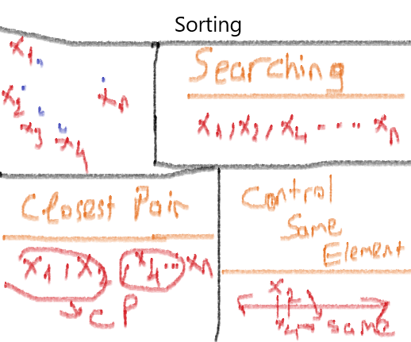

# Sorting

- Sorting, kendinden sıralama algoritmaları olarak bahsetmektedir. Sorting, bir eleman dizisini, belirli sıralama kurallarına göre sıralama yapar.

    
    - Searching yöntemini kullanarak elemanlarımızı sıraladık. Bunun sebebi, eleman ararken işimizin kolaylaşmasını istiyoruz.
    - Closest Pair yöntemini kullanarak birbirine yakın sayıları gruplandırdık ki arama yaparken zamanımızı efektif bir şekilde kullanalım.
    - Aynı eleman kontrolü : birbiriyle aynı olan sayıları örüntü içerisinde kaç tane aynı eleman varsa sayısını öğrenebilirim. 
    - Mode bulma : eleman dizisini search ettikten sonra elemanların yan yana olanları sayarsam daha hızlı mode bulabilirim .
